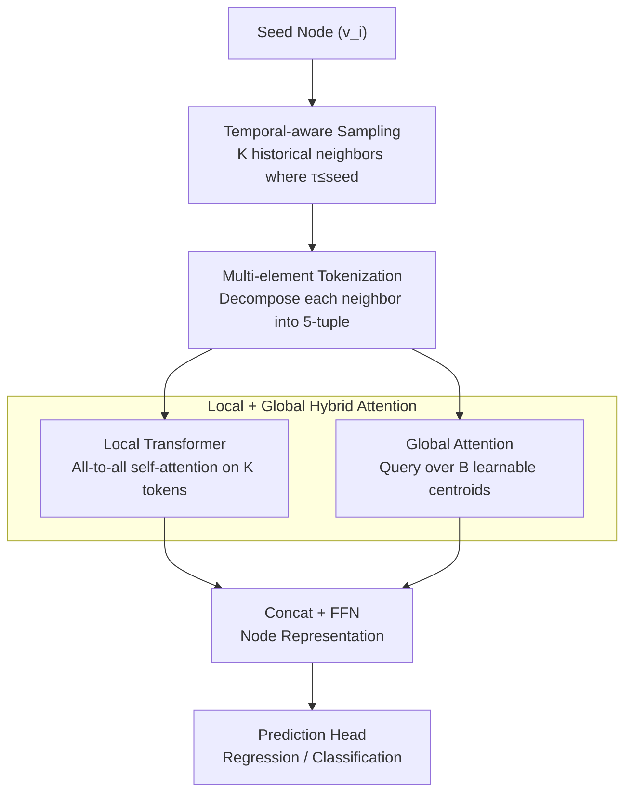

# Relational Graph Transformer

**Conference**: ICLR 2026  
**arXiv**: [2505.10960](https://arxiv.org/abs/2505.10960)  
**Code**: [GitHub](https://github.com/snap-stanford/relgt)  
**Area**: Graph Learning  
**Keywords**: Graph Transformer, Relational Deep Learning, Multi-element Tokenization, Heterogeneous Temporal Graphs, Positional Encoding

## TL;DR

RelGT is proposed as the first Graph Transformer specifically designed for relational databases. By utilizing multi-element tokenization (a 5-tuple of features/type/hop/time/local structure) and a hybrid local-global attention mechanism, it consistently outperforms GNN baselines across 21 tasks in the RelBench benchmark, achieving gains of up to 18%.

## Background & Motivation

Enterprise data (financial transactions, e-commerce records, healthcare, etc.) is primarily stored in relational databases. Relational Deep Learning (RDL) transforms multi-table data into a Heterogeneous Temporal Graph (Relational Entity Graph, REG), which is then processed by GNNs. However, GNNs face inherent limitations:

**Insufficient structural expressiveness**: Message passing fails to capture complex structural patterns, such as transactions that are both 2-hop away but only indirectly connected via a shared customer.

**Limited long-range dependencies**: In a 2-layer GNN, product nodes can never interact directly (requiring a path of Transaction → Customer → Transaction → Product, totaling 4 hops).

**Existing Graph Transformers are unsuitable for REGs**:
   - Traditional Positional Encodings (Laplacian PE, node2vec) do not generalize to large-scale heterogeneous graphs.
   - They lack the ability to model temporal dynamics and schema constraints.
   - Existing tokenization schemes lose critical structural information.

## Method

### Overall Architecture

RelGT addresses the limitations of GNNs on REGs, where structural patterns are obscured and long-range dependencies are unreachable. The core idea is to treat graph nodes as Transformer tokens. Since standard "feature + position" pairs are insufficient for the heterogeneous table structures and temporal dynamics of REGs, RelGT designs a five-element token for each node and aggregates them using "local + global" dual-path attention.

The inference process for a prediction follows these steps: starting from a seed node, temporal-aware sampling retrieves $K$ historical neighbors (sampling only nodes with timestamps no later than the seed to prevent data leakage). Each neighbor is decomposed into a five-element token and encoded. These tokens first enter a Local Transformer for all-to-all self-attention. Simultaneously, the seed node performs attention over a set of learnable global centroids. The representations from both paths are concatenated and fed into a prediction head. Multi-element Tokenization (§3.1) and the Hybrid Transformer Network (§3.2) are the two key designs.

### Key Designs

**1. Multi-element Tokenization: Decoupling Heterogeneous and Temporal Information**

To address the limitation where message passing compresses table structures, types, and temporal differences into a single vector, RelGT represents each sampled node $v_j$ as a five-element tuple $(x_{v_j}, \phi(v_j), p(v_i, v_j), \tau(v_j) - \tau(v_i), \text{GNN-PE}_{v_j})$. Each component is encoded independently: node features $x_{v_j}$ are processed by multi-modal encoders to obtain $h_{\text{feat}} \in \mathbb{R}^d$; node type $\phi(v_j)$ projects table-level one-hot vectors into $h_{\text{type}} \in \mathbb{R}^d$; relative hop distance $p(v_i, v_j)$ encodes the shortest path distance to the seed into $h_{\text{hop}} \in \mathbb{R}^d$; relative time $\tau(v_j) - \tau(v_i)$ is a linear transformation of the timestamp difference $h_{\text{time}} \in \mathbb{R}^d$; and subgraph GNN PE uses a lightweight GNN on the sampled subgraph with random initial features to produce $h_{\text{pe}} \in \mathbb{R}^d$. Finally, a learnable mixing matrix $O \in \mathbb{R}^{5d \times d}$ compresses the concatenated vector:

$$h_{\text{token}}(v_j) = O \cdot [h_{\text{feat}} \| h_{\text{type}} \| h_{\text{hop}} \| h_{\text{time}} \| h_{\text{pe}}]$$

The subgraph GNN PE is particularly innovative: initializing with random node features breaks symmetry and enhances expressiveness (Sato et al., 2021). To maintain equivariance in expectation, $Z_{\text{random}}$ is resampled at each training step. This strategy ensures structural encoding is completed within the sampled subgraph, avoiding expensive global PE precomputation—the primary bottleneck for Laplacian PE on large heterogeneous graphs.

**2. Local + Global Hybrid Attention: Balancing Local Neighbors and Database-level Patterns**

To overcome the 4-hop reachability issue in GNNs, RelGT performs all-to-all attention between sampled neighbor tokens. The local module executes $L$ layers of Transformer self-attention on the $K$ neighbor tokens of the seed node, allowing any two neighbors to interact directly. These are pooled into a single representation:

$$h_{\text{local}}(v_i) = \text{Pool}(\text{FFN}(\text{Attention}(v_i, \{v_j\}_{j=1}^K))_L)$$

To capture global patterns across the database (e.g., aggregate behaviors of specific customer segments), the global module allows the seed node to attend to $B$ learnable centroid tokens. These centroids are dynamically updated during training via EMA K-Means, acting as "anchors" representing typical patterns across the entire database:

$$h_{\text{global}}(v_i) = \text{Attention}(v_i, \{c_b\}_{b=1}^B)$$

The final representation concatenates local and global contexts before a final FFN:

$$h_{\text{output}}(v_i) = \text{FFN}([h_{\text{local}}(v_i) \| h_{\text{global}}(v_i)])$$

### Loss & Training

- **Task-specific Loss**: Based on the downstream task (MAE for regression, AUC for classification, etc.).
- **End-to-end Training**: Replaces the GNN component within the RDL pipeline (Robinson et al., 2024).
- **Model Scale**: 10-20M parameters, learning rate 1e-4.
- **Sampling Parameters**: $K=300$ local neighbors, $B=4096$ global centroids.
- **Layers**: $L \in \{1, 4, 8\}$ for $<1M$ training nodes; fixed $L=4$ for $>1M$ nodes.
- **Batch size**: 256 for $<1M$ nodes, 1024 for $>1M$ nodes.
- **Dropout**: $\{0.3, 0.4, 0.5\}$.
- Temporal-aware sampling ensures $\tau(v_j) \leq \tau(v_i)$ to prevent data leakage.

## Key Experimental Results

### Main Results

**Benchmark**: RelBench (7 datasets, 21 tasks), spanning e-commerce, clinical, social, and sports, with training sizes from 1.3K to 5.4M.

**Regression Tasks (MAE↓)**:

| Dataset | Task | RDL (GNN) | HGT | HGT+PE | **RelGT** | Gain |
|--------|------|-----------|-----|--------|-----------|----------|
| rel-avito | ad-ctr | 0.041 | 0.046 | 0.048 | **0.035** | **15.85%** |
| rel-trial | site-success | 0.400 | 0.443 | 0.440 | **0.326** | **18.43%** |
| rel-amazon | item-ltv | 50.05 | 55.87 | 55.85 | **48.92** | 2.26% |
| rel-hm | item-sales | 0.056 | 0.064 | 0.064 | **0.054** | 4.29% |

**Classification Tasks (AUC↑)**:

| Dataset | Task | RDL (GNN) | HGT | HGT+PE | **RelGT** | Gain |
|--------|------|-----------|-----|--------|-----------|----------|
| rel-f1 | driver-top3 | 0.755 | 0.708 | 0.763 | **0.835** | **10.56%** |
| rel-avito | user-clicks | 0.659 | 0.638 | 0.646 | **0.683** | 3.64% |
| rel-stack | user-engagement | 0.902 | 0.885 | 0.882 | **0.905** | 0.35% |

**Overall Statistics** (±1% threshold): Significant improvement in 10 tasks, parity in 9, and slight decrease in 2.

### Ablation Study

| Component Removed | ad-ctr | user-clicks | site-success | Trend |
|----------|--------|-------------|--------------|----------|
| w/o Global Module | -6.00% | +7.85% | -19.08% | Task-dependent |
| w/o GNN PE | -1.14% | **-15.15%** | — | **Consistent drop** |
| w/o Node Type | -7.14% | +5.01% | — | Mixed |
| w/o Hop Encoding | -3.43% | +5.77% | — | Mixed |
| w/o Relative Time | -9.14% | +8.37% | — | Mixed |

### Key Findings

1. **Subgraph GNN PE is the only critical component across all tasks**: Performance consistently drops without it, as it is the only explicit encoding for local structures (parent-child relations, cycles, etc.).
2. **The Global Module is highly task-dependent**: Removing it dropped performance by 19% for site-success (requiring global context) but improved user-clicks by 7.9% (where local information suffices).
3. **HGT+PE is inferior to RelGT**: Even with Laplacian PE, HGT is outperformed, suggesting multi-element decomposition is superior to a single PE scheme.
4. **No expensive precomputation**: All encodings are performed on the sampled subgraphs, saving orders of magnitude in computational cost compared to full-graph Laplacian calculations.

## Highlights & Insights

- **Multi-element Tokenization Paradigm**: Extends the "token + position" concept from NLP to a 5-element representation, decoupling encoding across dimensions and outperforming schemes that compress all information into one PE.
- **Random Feature GNN PE**: Elegantly combines random initialization for expressiveness with step-wise resampling for equivariance.
- **Engineering-friendly**: Directly replaces GNN components in the RDL pipeline while maintaining existing infrastructure.
- **Global Centroid Mechanism**: Dynamic centroid updates via EMA K-Means eliminate the need for additional preprocessing steps.

## Limitations & Future Work

1. Recommendation tasks were not covered (9 of 30 RelBench tasks were excluded) as they require specialized pair-wise learning.
2. Temporal encoding relies on simple linear transformations; more advanced temporal encodings (e.g., periodic functions, learnable kernels) could be integrated.
3. Fixed sampling of $K=300$ may be suboptimal for extremely large or small local structures.
4. The global centroid module introduces noise in some tasks; an adaptive switching mechanism could be considered.
5. Extensive hyperparameter searches were not conducted, suggesting potential for further performance gains.

## Related Work & Insights

- **vs GraphGPS**: GPS is designed for homogeneous static graphs and cannot handle heterogeneous/temporal data; RelGT is purpose-built for REGs.
- **vs HGT**: HGT handles heterogeneity but lacks effective PE and temporal modeling; RelGT provides comprehensive coverage via its 5-element representation.
- **vs RelGNN / ContextGNN**: These methods enhance GNNs but lack the flexibility of the all-to-all attention found in Transformers.
- **Insight**: The multi-element tokenization concept can be generalized to other multi-dimensional heterogeneous graph scenarios (e.g., knowledge graphs, molecular networks, code dependency graphs).

## Rating

- Novelty: ★★★★☆ — Multi-element tokenization and random GNN PE are significant contributions.
- Technical Depth: ★★★★☆ — Meticulous design with theoretically grounded components.
- Experimental Thoroughness: ★★★★★ — 21 tasks, multiple baselines, and complete ablation studies.
- Writing Quality: ★★★★☆ — Clear structure and excellent illustrations.

<!-- RELATED:START -->

## Related Papers

- [\[ICLR 2026\] Relatron: Automating Relational Machine Learning over Relational Databases](relatron_automating_relational_machine_learning_over_relational_databases.md)
- [\[ICLR 2026\] PRISM: Partial-label Relational Inference with Spatial and Spectral Cues](prism_partial-label_relational_inference_with_spatial_and_spectral_cues.md)
- [\[ICML 2026\] What Makes a Desired Graph for Relational Deep Learning?](../../ICML2026/graph_learning/what_makes_a_desired_graph_for_relational_deep_learning.md)
- [\[NeurIPS 2025\] Wavy Transformer](../../NeurIPS2025/graph_learning/wavy_transformer.md)
- [\[AAAI 2026\] NTSFormer: A Self-Teaching Graph Transformer for Multimodal Isolated Cold-Start Node Classification](../../AAAI2026/graph_learning/ntsformer_a_self-teaching_graph_transformer_for_multimodal_isolated_cold-start_n.md)

<!-- RELATED:END -->
