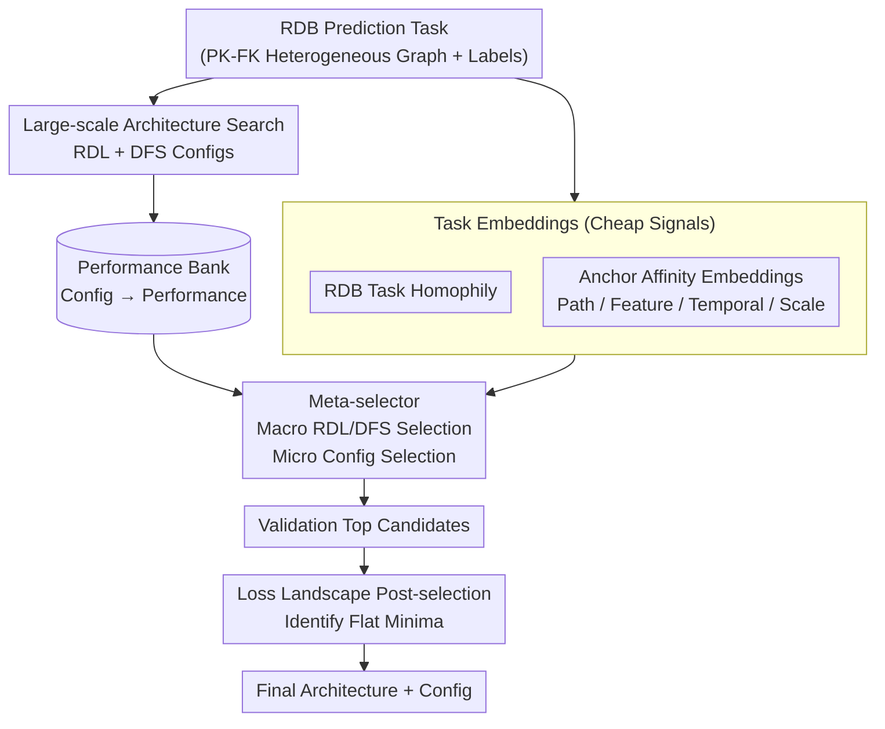

# Relatron: Automating Relational Machine Learning over Relational Databases

**Conference**: ICLR 2026  
**arXiv**: [2602.22552](https://arxiv.org/abs/2602.22552)  
**Code**: [https://github.com/amazon-science/Automating-Relational-Machine-Learning](https://github.com/amazon-science/Automating-Relational-Machine-Learning)  
**Area**: Graph Learning / AutoML  
**Keywords**: Relational Databases, Graph Neural Networks, Deep Feature Synthesis, Architecture Selection, Homophily

## TL;DR
Ours systematically compares the performance of Relational Deep Learning (RDL/GNN) and Deep Feature Synthesis (DFS) on relational database (RDB) prediction tasks. Finding that both have distinct advantages and are highly task-dependent, the authors propose Relatron—a meta-selector based on task embeddings that achieves automatic architecture selection through RDB task homophily and affinity embeddings, yielding gains up to 18.5% in joint architecture-hyperparameter search.

## Background & Motivation

**Background**: There are two main paradigms for predictive modeling on RDBs: DFS (programmatic combination of aggregation primitives to generate feature tables, followed by tabular learners) and RDL (end-to-end GNN training on heterogeneous entity-relationship graphs). Both outperform relation-agnostic baselines.

**Limitations of Prior Work**: It is unknown when either paradigm is superior. Practitioners lack principled guidance for choosing DFS vs. RDL. Validation performance is often an unreliable proxy for selection—increased search budget can paradoxically lead to worse test performance ("tuning-induced drop" effect).

**Key Challenge**: (a) No single architecture dominates across all tasks; (b) a significant gap exists between configurations selected via validation sets and test-optimal configurations, especially when temporal splits cause distribution shifts.

**Goal**: Given an RDB task, automatically select between RDL or DFS and determine the specific architectural configuration.

**Key Insight**: By constructing a "performance bank" through large-scale architecture search and analyzing factors driving the RDL-DFS performance gap, RDB task homophily and training scale are identified as key predictors.

**Core Idea**: High homophily $\rightarrow$ linear aggregation in DFS is sufficient; Low homophily $\rightarrow$ non-linear aggregation in RDL offers an advantage. A meta-classifier is trained using task embeddings (homophily + affinity + scale) to implement automatic macro and micro-architecture selection.

## Method

### Overall Architecture

Relatron formulates the selection of "RDL vs. DFS and which configuration" as a meta-classification problem driven by task embeddings. It first performs a large-scale architecture search across RDL and DFS pipelines, storing the performance of each configuration per task in a "performance bank." For each RDB task, a set of cheaply obtainable task embedding features is calculated: RDB task homophily and anchor affinity embeddings (including path, feature, temporal, and scale signals). A meta-selector is then trained using these embeddings to perform macro-level selection (RDL/DFS) and micro-level configuration selection. Finally, among a small number of top candidates by validation performance, a Loss Landscape geometric indicator is used to select the checkpoint most robust to distribution shifts.

### Key Designs

**1. RDB Task Homophily: Using a scalar to characterize "label consistency along relations" to predict RDL or DFS dominance.**

The critical observation is that DFS uses linear aggregation primitives, which are effective only when adjacent entity labels tend to be consistent. In contrast, RDL's GNNs can learn non-linear aggregations, allowing them to flip contribution signs when label signals are contradictory. To measure this "consistency," homophily $m$ is defined on an augmented heterogeneous entity-relationship graph over meta-path $m$ as the average similarity of adjacent prediction targets: $H(\mathcal{G};m) = \frac{1}{|\mathcal{E}_m|}\sum \mathcal{K}(\hat{y}_u, \hat{y}_v)$. Dot product is used for classification and Pearson correlation for regression. Adjusted homophily is introduced to correct for class imbalance. This metric captures the key trend: the Spearman correlation between adjusted homophily and the RDL-DFS performance gap is $\rho = -0.43$ ($p < 0.05$). Lower homophily indicates a larger relative advantage for RDL, justifying macro-selection based on homophily.

**2. Anchor Affinity Embeddings: Supplementing homophily with path, feature, temporal, and scale signals for a comprehensive meta-selector.**

As homophily alone does not determine specific configurations, "anchor affinity" embeddings are added, prioritized for near-zero training cost. Path affinity uses single forward passes of randomly initialized GraphSAGE/NBFNet with a fitted linear head to judge path model preference. Feature affinity uses TabPFN to provide validation performance without training, reflecting tabular feature quality. Temporal affinity counts label changes over time to characterize distribution drift under temporal splits. Finally, $\log(N_{train})$ represents training scale. By concatenating these with homophily, the meta-selector performs both macro and micro selection at a cost far lower than traditional task embeddings based on iterative training.

**3. Loss Landscape Post-selection: Identifying robustness to distribution shifts among top candidates via minima flatness.**

Since temporal splits introduce validation-test distribution shifts, the highest validation performer may not be the best on test sets. Ours posits that the validation-test gap is reflected in the loss surface geometry, where flatter minima are more robust to shifts. Three surface indicators are introduced for post-selection among top validation candidates: first-order $P_1$ (local worst-case finite difference slope), second-order $P_2$ (maximum Hessian eigenvalue), and energy barrier $P_{bar}$ (maximum loss bulge along random rays). All three favor flatter, wider minima. This step does not modify training; it treats generalization robustness as an additional selection criterion to identify checkpoints likely to maintain performance on the test set.

### Loss & Training

The meta-classifier is trained and evaluated using Leave-One-Out (LOO) on the performance bank, taking the aforementioned homophily, affinity statistics, and temporal features as input. A major selling point is efficiency: since affinity embeddings rely on zero-training or single forward passes, the meta-selection computation time is approximately 1/10th of methods based on the Fisher Information Matrix (e.g., Autotransfer).

## Key Experimental Results

### Main Results

| Method | LOO Accuracy (val selection) | LOO Accuracy (test selection) | Avg. Compute Time |
|------|---------------------|---------------------|-------------|
| Model-free (ours) | 87.5% | 79.2% | 0.48 min |
| Training-free model | 66.7% | 66.7% | 5 min |
| Autotransfer (anchor) | 66.7% | 66.7% | 50 min |
| Simple heuristic | 70.8% | 75.0% | 0 min |

In joint HPO, Relatron improves over strong baselines by up to 18.5% with 10× lower computational cost.

### Ablation Study

| Config | Kendall $\tau$ (w/o g) | Kendall $\tau$ (w/ g) | Description |
|------|----------------|----------------|------|
| Model-free | 0.066 | 0.163 | Best task similarity |
| Training-free | -0.038 | -0.030 | Negative correlation |
| Autotransfer | -0.049 | -0.011 | Expensive & negative correlation |

### Key Findings
- **RDL is not always superior to DFS**: Performance is highly task-dependent; both have clear domains of dominance.
- **Macro-selection addresses most issues**: Correctly choosing RDL/DFS significantly reduces the validation-test gap.
- **Homophily is the strongest predictor**: Adjusted homophily correlates with the RDL-DFS gap at Spearman $\rho = -0.43$.
- **Tuning-induced drop**: Increased search budgets can degrade performance—Relatron's macro-selection effectively mitigates this.
- **Validation is unreliable**: Under temporal splitting, configurations selected by validation often differ significantly from test-optimal ones.

## Highlights & Insights
- **DFS is undervalued**: DFS can beat complex GNNs on suitable tasks; the key is matching task attributes.
- **Theoretical interpretation of RDL advantage**: In low-homophily settings, linear aggregation confuses positive/negative signals, while RDL can learn relational weights to flip contributions.
- **Loss landscape post-selection** serves as a practical generalization metric transferable to other AutoML scenarios.

## Limitations & Future Work
- Overall task embedding correlation remains low (max Kendall $\tau = 0.163$), limiting transfer HPO effectiveness.
- Foundation models (e.g., KumoRFM) were not included.
- Performance bank size is limited (< 20 tasks); meta-learning requires larger scales.
- Loss landscape metrics are primarily applicable for intra-family comparisons.

## Related Work & Insights
- **vs. KumoRFM**: Relational foundation models perform strongly but details are proprietary. Relatron focuses on efficient "train from scratch" scenarios.
- **vs. Autotransfer**: Task embeddings based on the Fisher Information Matrix are computationally expensive and perform poorly on RDBs.
- **vs. Griffin**: Cross-table attention often loses to GNNs.

## Rating
- Novelty: ⭐⭐⭐⭐ The definition of RDB task homophily is novel, though the framework follows standard meta-learning.
- Experimental Thoroughness: ⭐⭐⭐⭐⭐ Comprehensive evaluation across 17 tasks, large-scale search, performance bank, and multi-level ablations.
- Writing Quality: ⭐⭐⭐⭐ Clear structure with deep theoretical analysis.
- Value: ⭐⭐⭐⭐⭐ Addresses critical practical pain points in RDB ML; the performance bank provides long-term research value.

<!-- RELATED:START -->

## Related Papers

- [\[ICLR 2026\] Relational Graph Transformer](relational_graph_transformer.md)
- [\[ICLR 2026\] PRISM: Partial-label Relational Inference with Spatial and Spectral Cues](prism_partial-label_relational_inference_with_spatial_and_spectral_cues.md)
- [\[ICML 2026\] What Makes a Desired Graph for Relational Deep Learning?](../../ICML2026/graph_learning/what_makes_a_desired_graph_for_relational_deep_learning.md)
- [\[ICLR 2026\] Towards Quantifying Long-Range Interactions in Graph Machine Learning: A Large Graph Dataset and a Measurement](towards_quantifying_long-range_interactions_in_graph_machine_learning_a_large_gr.md)
- [\[ICLR 2026\] TGM: A Modular and Efficient Library for Machine Learning on Temporal Graphs](tgm_a_modular_and_efficient_library_for_machine_learning_on_temporal_graphs.md)

<!-- RELATED:END -->
