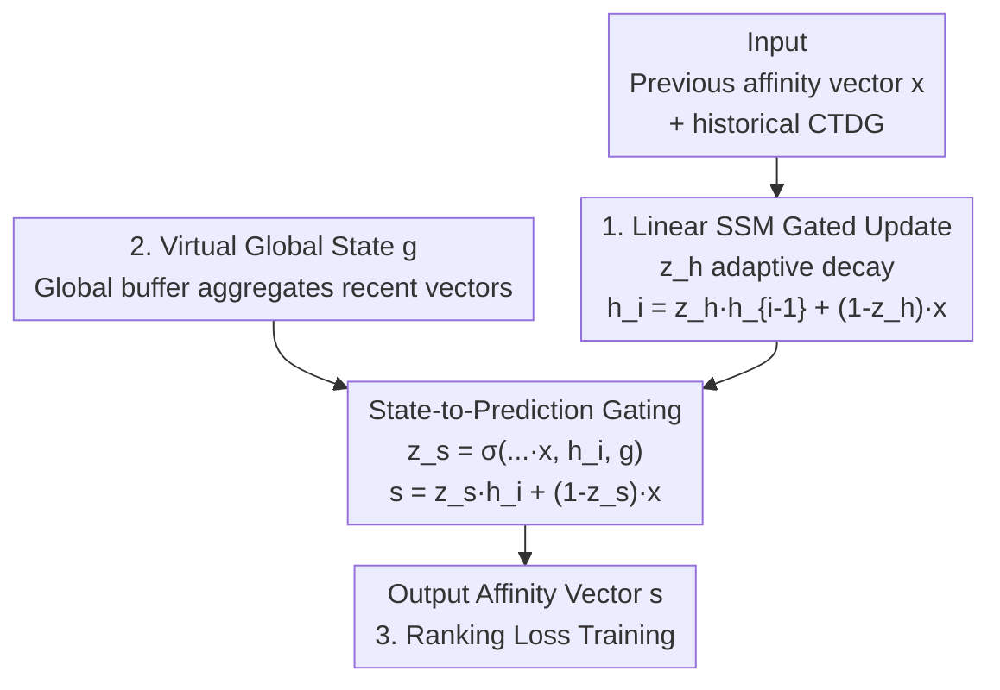

# Revisiting Node Affinity Prediction in Temporal Graphs

**Conference**: ICLR 2026  
**OpenReview**: [https://openreview.net/forum?id=6UvkemEgK3](https://openreview.net/forum?id=6UvkemEgK3)  
**Code**: https://github.com/orfeld415/NAVIS  
**Area**: Temporal Graph Learning  
**Keywords**: Temporal Graph Neural Networks, Node Affinity Prediction, State Space Models, Ranking Loss, Global Virtual State

## TL;DR
This paper identifies that existing Temporal Graph Neural Networks (TGNNs) surprisingly underperform against simple heuristics like Moving Average in "node affinity prediction." The root cause is their inability to express moving averages and their use of cross-entropy loss, which is ill-suited for ranking. Consequently, the authors propose NAVIS—a learnable linear State Space Model (SSM) that generalizes heuristics as special cases. Combined with a ranking loss, NAVIS outperforms both heuristics and all existing TGNNs on the Temporal Graph Benchmark (TGB).

## Background & Motivation
**Background**: In temporal graphs (transaction networks, recommender systems, social platforms, financial transfers), a core task is "future node affinity prediction"—given a query node $u$ and a future timestamp $t^+$, the goal is to predict its affinity strength toward all other nodes $v$. This essentially requires producing a complete ranking of candidate neighbors (measured by NDCG@10). This differs from "future link prediction" (predicting if a specific edge will exist), as it is more challenging and closer to real-world applications. Recently, SOTA models for link prediction (TGN, TGAT, DyGFormer, GraphMixer, etc.) have been directly applied to affinity prediction.

**Limitations of Prior Work**: Embarrassingly, these sophisticated TGNNs are consistently outperformed by one-line heuristics such as Persistent Forecast (PF, using the previous affinity vector as the prediction) and Moving Average (MA). This suggests that the inductive biases of TGNNs are fundamentally misaligned with the affinity prediction task.

**Key Challenge**: The authors decompose the reasons for the heuristics' superiority into several concurrent root causes: (i) **Insufficient Expressivity**—Existing TGNNs, due to non-linear updates and reliance on neighborhood sampling, cannot represent a simple moving average (lacking the required linear memory); (ii) **Loss Mismatch**—The cross-entropy loss commonly used in link prediction treats the output as a categorical distribution, ignoring the ordinal/ranking nature of affinity tasks; (iii) **Loss of Global Temporal Dynamics**—Affinity often depends on network-wide trends (e.g., a specific item suddenly going viral) which local sampling cannot capture; (iv) **Information Loss**—Memory-based models (TGN/DyRep) miss short-term updates within the same batch due to batch processing, while memoryless models (DyGFormer/GraphMixer) lose long-term events due to fixed-size buffer truncation.

**Key Insight**: The authors' key observation is that PF and Moving Average are not random tricks but rather **special cases of linear State Space Models (SSMs)**. SSMs naturally provide memory and long-range temporal dependencies. Thus, by embedding the structure of an SSM into a learnable TGNN, one can retain the robustness of heuristics while expanding their expressivity.

**Core Idea**: Generalize heuristics using a learnable linear SSM (maintaining per-node states plus a virtual global state) and replace cross-entropy with a ranking loss, aligning both the model's inductive bias and the training objective with the actual task of "ranking."

## Method

### Overall Architecture
The input to NAVIS (Node Affinity prediction with Virtual State) is the historical interactions (or historical affinity vectors $x$) in a continuous-time dynamic graph $G_t$, and the output is the affinity vector $s \in \mathbb{R}^{|V|}$ of a query node toward all nodes. Its backbone is a **linear State Space Model**: it maintains a state $h \in \mathbb{R}^d$ for each node ($d=|V|$, the dimension of the affinity space) and a **virtual global state** $g \in \mathbb{R}^d$ shared across all nodes. Both evolve alongside the dynamic graph.

The pipeline consists of two gated update steps: first, a gate $z_h$ is computed using the current input $x$ (the previous affinity vector) and the prior node state $h_{i-1}$ to update the node state $h_i$; then, a second gate $z_s$ is computed using $x$, $h_i$, and the global state $g$ to linearly combine the state into the prediction $s$. Crucially, the output is always a linear combination of inputs (similar to EMA), but the decay coefficients are **dynamically computed during inference based on current events**—hence a "learnable heuristic."

### Key Designs

**1. Learnable Linear SSM: Generalizing Static Decay Heuristics with Dynamic Gating**

To address the contradiction where TGNNs cannot express moving averages while heuristics are trapped by hand-crafted fixed memory kernels, NAVIS upgrades the EMA recurrence $h_i=\alpha h_{i-1}+(1-\alpha)x$ to a version with learnable, event-adaptive coefficients. The two-step updates are:

$$z_h = \sigma(W_{xh}x + W_{hh}h_{i-1} + b_h), \quad h_i = z_h \odot h_{i-1} + (1-z_h)\odot x$$
$$z_s = \sigma(W_{xs}x + W_{hs}h_i + W_{gs}g + b_s), \quad s = z_s \odot h_i + (1-z_s)\odot x$$

Where $\sigma$ is the sigmoid function, constraining gates $z_h, z_s \in [0, 1]$, conceptually aligning them with $\alpha$ in EMA. This is effective because the authors theoretically prove that **heuristics are a strict subset of linear SSMs** (Theorem 1: PF, SMA, and EMA correspond to specific $(A, B, C, D)$ values; furthermore, a $2 \times 2$ diagonal SSM allows each dimension of the vector to decay at different rates, which a single-decay EMA cannot achieve). Crucially, Theorem 2 proves that standard RNN/LSTM/GRU units **cannot even represent the most basic PF ($h_i = x_i$)** because their outputs are restricted to bounded intervals by tanh/sigmoid—directly explaining why TGNNs based on these cells are destined to lose to heuristics and justifying NAVIS’s shift to linear SSMs. Additionally, NAVIS does not depend on neighbor hidden states, making it compatible with t-Batch mechanisms for efficient processing without missing updates.

**2. Virtual Global State: Compensating for Local Sampling's Blind Spots**

To address the point that "affinity is often driven by network-wide trends invisible to local sampling," NAVIS maintains a virtual global vector $g$. It uses a **global buffer** to cache the most recent affinity vectors and then performs an aggregation (in practice, a lightweight selection of the most recent vectors is both efficient and effective) to obtain $g$. The goal of $g$ is to sense global trends (e.g., a new song or show becoming a hit) before being queried about a specific node. In the second gating step, $g$ is injected via $W_{gs}$ to influence $z_s$ and thus the prediction—enabling NAVIS to improve accuracy when global trends shift node affinities, filling a gap left by existing TGNNs that fail to utilize complete global states.

**3. Ranking Loss + Margin Regularization: Aligning the Objective with "Ranking" rather than "Magnitude"**

Addressing the loss mismatch of cross-entropy, the authors provide Theorem 3, which demonstrates through a counter-example that cross-entropy is flawed: there exist infinitely many sets of $(y, s_1, s_2)$ where $s_1$ has a perfectly correct ranking and $s_2$ does not, yet $\ell_{CE}(s_1, y) > \ell_{CE}(s_2, y)$. In other words, cross-entropy penalizes good predictions that have the right order but mismatched magnitudes. Consequently, NAVIS adopts **Lambda Loss**:

$$\ell_{Lambda}(s,y)=\sum_{y_i>y_j}\log_2\!\left(\frac{1}{1+e^{-\sigma(s_{\pi_i}-s_{\pi_j})}}\right)|\,\delta_{ij}|A_{\pi_i}-A_{\pi_j}|$$

This loss focuses learning on swaps that most affect the final rank by approximating the gradients of non-differentiable ranking metrics like NDCG. To prevent the model from "cheating" by shrinking all affinity scores to minimize the loss, the authors add a **pairwise margin regularization** $\ell_{Reg}(s, y) = \sum_{y_i>y_j} \max(0, -(s_{\pi_i} - s_{\pi_j}) + \Delta)$, forcing a minimum margin $\Delta$ between pairs and eliminating the undesirable properties revealed in Theorem 3.

### Loss & Training
The final loss is the sum of Lambda Loss and pairwise margin regularization. Training follows standard protocols: 70%/15%/15% chronological split, 50 epochs, batch size 200, averaging NDCG@10 over three runs. For million-scale graphs where NAVIS parameter counts would grow $O(N)$ with the number of nodes, the authors introduce **sparse affinity prediction**—each node only maintains entries corresponding to candidate target nodes (e.g., streaming services care about user-to-movie affinity, not user-to-user), reducing parameters to only ~5,000 on tgbn-token (>60,000 nodes).

## Key Experimental Results

### Main Results (TGB, NDCG@10, using full CTDG)

| Dataset | Moving Avg | Best TGNN (TGNv2) | NAVIS | Gain |
|---------|------------|-------------------|-------|------|
| tgbn-trade (Test) | 0.777 | 0.735 | **0.863** | +12.8% vs TGNv2 |
| tgbn-genre (Test) | 0.497 | 0.469 | **0.520** | — |
| tgbn-reddit (Test) | 0.480 | 0.507 | **0.552** | — |
| tgbn-token (Test) | 0.414 | 0.294 | **0.444** | — |

Most TGNNs (JODIE/TGAT/DyGFormer usually score 0.31–0.39 on Test) indeed fail to beat Moving Average, confirming the theoretical analysis. NAVIS consistently achieves the top performance across all four datasets. Even in a heuristic-friendly setting using only historical ground-truth affinity vectors (Table 2), NAVIS slightly outperforms PF and Moving Avg (e.g., 0.863 vs 0.855/0.823 on tgbn-trade).

### Generalization to Link Prediction Datasets (NDCG@10, using full graph messages)

| Dataset | Moving Avg | TGNv2 | NAVIS |
|---------|------------|-------|-------|
| Wikipedia (Test) | 0.555 | 0.433 | **0.573** |
| Flights (Test) | 0.028 | 0.299 | **0.499** |
| USLegis (Test) | 0.154 | 0.253 | **0.347** |
| UNVote (Test) | 0.918 | 0.813 | **0.952** |

After adapting four temporal link prediction datasets for affinity tasks, NAVIS shows gains of +13.9% to +20% over the next best TGNN. Other TGNNs remain behind naive heuristics, further confirming that existing TGNN design choices are ill-suited for affinity prediction.

### Ablation Study

| Configuration | Description |
|---------------|-------------|
| Full NAVIS | Complete model |
| w/o Linear State Update (replaced with GRU) | Validates the necessity of linear SSM |
| w/o Global Virtual Vector $g$ | Removes global trend capture |
| w/o Ranking Loss (replaced with CE) | Validates Lambda Loss + Margin Reg |

By isolating the three core components (linear state update vs. GRU, global vector $g$, and ranking loss vs. cross-entropy), the authors conclude that each component contributes substantially to the final performance (full quantitative results in Appendix F).

### Key Findings
- **Linearity is Key, Not Complexity**: Replacing the linear state update with a GRU results in a performance drop, echoing Theorem 2—since GRU cannot even represent PF, non-linear memory units act as a performance bottleneck here.
- **Task-Loss Alignment Outweighs Architecture**: Switching from cross-entropy to ranking loss provides a significant boost, showing that aligning inductive bias and training objectives with "ranking" is core to NAVIS's success.
- **Global States Excel in Trend-Driven Scenarios**: In synthetic experiments with latent global regime-switching, heuristics like PF/SMA/EMA (which only look at per-node history) fail to recover the shared latent space, whereas NAVIS with its virtual global state achieves the lowest error.

## Highlights & Insights
- **Theoretical Formalization of a Paradox**: Turning the "heuristic beats deep model" anomaly into theory—Theorem 1 (heursitics = linear SSM subset) and Theorem 2 (RNNs cannot represent PF)—provides a diagnosis and a remedy far more persuasive than simple empirical engineering.
- **Counter-Intuitive "Linear is Right"**: While the field trends toward more non-linear and deeper models, this paper argues that affinity prediction specifically requires linear memory. Gating should only be used to adapt decay coefficients, not to introduce non-linearity—a transferable design philosophy: match the inductive bias to the task requirements before adding non-linearity.
- **Concise Loss Counter-Example**: Using three 2D vectors ($y, s_1, s_2$), the authors clearly illustrate why cross-entropy favors bad rankings over good ones, providing a classic pedagogical example for why CE should be avoided in ranking tasks.
- **Sparsification enables O(N) Deployment**: By only keeping entries for candidate targets, the model can scale to 60,000 nodes with only 5,000 parameters, offering a practical engineering path for graph-based recommenders.

## Limitations & Future Work
- **Oversimplified Global State**: Currently, $g$ relies on "recency selection + buffer aggregation." The authors admit that more advanced aggregation (e.g., attention) and smarter buffer eviction strategies (e.g., non-deterministic eviction) could further improve performance.
- **Linear Expressivity Ceiling**: NAVIS calculates affinity as a linear combination of input and state. Thus, it cannot represent certain non-linear functions. The authors envision a third non-linear component with coefficients summing to 1, but how to optimally fuse linear and non-linear components remains future work.
- **Weak Multi-hop Dependency Modeling**: The authors explicitly state they have not fully solved the issue of complex multi-hop dependency modeling, which remains an inherited limitation.
- The main text only provides qualitative ablation conclusions; specific performance drops for removed components must be found in Appendix F.

## Related Work & Insights
- **vs. Standard TGNNs (TGN/TGAT/DyGFormer/GraphMixer)**: These rely on local neighborhood sampling and non-linear message passing, which are great for link prediction but cannot express moving averages and ignore global states. NAVIS uses linear SSMs and global virtual states designed for ranking-based affinity prediction, leading to its superior performance.
- **vs. Heuristics (PF/SMA/EMA)**: Heuristics use fixed, hand-crafted memory kernels. NAVIS proves they are special cases of linear SSMs and generalizes them with dynamic gating to retain robustness while increasing expressivity.
- **vs. WL-test Perspective on Expressivity**: While most research uses Weisfeiler-Lehman tests to measure the ability to distinguish non-isomorphic graphs, this paper shifts to **functional expressivity**—whether a model can represent specific mathematical operators like moving average—offering a new perspective on TGNN expressivity.
- **vs. Temporal Link Prediction (TLP) on Weighted Dynamic Graphs**: TLP aims to reconstruct the entire future weighted adjacency matrix (measured by RMSE/MAE) in discrete time. Affinity prediction is continuous-time and ranks candidates for a query node (measured by NDCG/MRR). Their goals and settings differ, making direct method transfers difficult.

## Rating
- Novelty: ⭐⭐⭐⭐⭐ Formulating "heuristics = linear SSM special cases" into theory and deriving an architecture is a fresh and self-consistent perspective.
- Experimental Thoroughness: ⭐⭐⭐⭐ Extensive coverage across TGB and adapted link prediction datasets, though final ablation numbers are relegated to the appendix.
- Writing Quality: ⭐⭐⭐⭐⭐ Exceptionally clear logic from phenomenon to theory to method to results. Counter-examples and theorems are punchy and effective.
- Value: ⭐⭐⭐⭐⭐ Provides a generalizable diagnosis and solution for the common "deep models lose to baseline" problem.

<!-- RELATED:START -->

## Related Papers

- [\[ICLR 2026\] UrbanGraph: Physics-Informed Spatio-Temporal Dynamic Heterogeneous Graphs for Urban Microclimate Prediction](urbangraph_physics-informed_spatio-temporal_dynamic_heterogeneous_graphs_for_urb.md)
- [\[ICLR 2026\] Inductive Reasoning for Temporal Knowledge Graphs with Emerging Entities](inductive_reasoning_for_temporal_knowledge_graphs_with_emerging_entities.md)
- [\[ICLR 2026\] TGM: A Modular and Efficient Library for Machine Learning on Temporal Graphs](tgm_a_modular_and_efficient_library_for_machine_learning_on_temporal_graphs.md)
- [\[ICLR 2026\] Beyond Entity Correlations: Disentangling Event Causal Puzzles in Temporal Knowledge Graphs](beyond_entity_correlations_disentangling_event_causal_puzzles_in_temporal_knowle.md)
- [\[ICLR 2026\] Training-Free Counterfactual Explanation for Temporal Graph Model Inference](training-free_counterfactual_explanation_for_temporal_graph_model_inference.md)

<!-- RELATED:END -->
