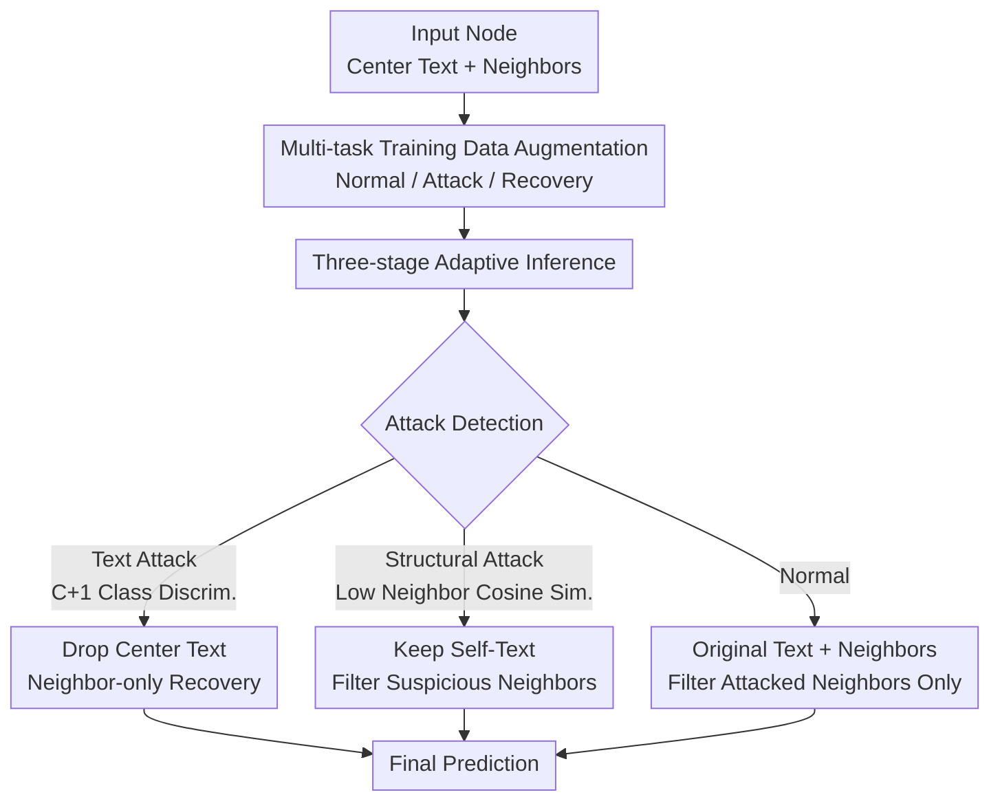

# Robustness in Text-Attributed Graph Learning: Insights, Trade-offs, and New Defenses

**Conference**: ICLR 2026  
**OpenReview**: [https://openreview.net/forum?id=CEJl0gN2gj](https://openreview.net/forum?id=CEJl0gN2gj)  
**Code**: https://github.com/Leirunlin/TGRB (Available)  
**Area**: Graph Learning / Adversarial Robustness / GraphLLM  
**Keywords**: Text-Attributed Graph, Adversarial Robustness, GraphLLM, Text-Structure Trade-off, Attack Detection

## TL;DR
This paper provides the first horizontal comparison of classic GNNs, Robust GNNs (RGNNs), and GraphLLMs within a unified adversarial robustness evaluation framework for Text-Attributed Graphs (TAGs). It reveals a "text-structure trade-off"—where models can defend against either text or structural attacks but rarely both—and proposes SFT-auto, a defense framework that leverages LLM reasoning to integrate "attack detection + recovery + prediction" into a single model, achieving balanced and superior robustness across both attack types.

## Background & Motivation
**Background**: Text-Attributed Graphs (TAGs), where nodes possess both graph structural edges and natural language text, are fundamental data structures in social networks, citation networks, and e-commerce graphs. There are two main paradigms for node classification on TAGs: GNNs (which use text encoders to convert text into node features for message passing with the adjacency matrix) and emerging GraphLLMs (which feed raw node text directly into LLMs for classification via prompt instructions). Both paradigms have derived various robustness-enhancing methods (RGNNs, robust training, similarity filtering, etc.).

**Limitations of Prior Work**: In high-risk scenarios like social media or finance, attackers can simultaneously manipulate graph structures (injecting fake relationships) and node text (forging misleading profiles) to cause classification failures. However, existing robustness research is **fragmented**: early GNN/RGNN evaluations used shallow embeddings like BoW or TF-IDF, ignoring rich semantics; recent studies on GraphLLM robustness cover narrow attack settings and lack fair comparisons with the GNN family. Consequently, the field lacks a unified conclusion across architectures and attack types.

**Key Challenge**: Through large-scale evaluation, the authors identified a recurring fundamental contradiction—the **text-structure robustness trade-off**: a model is either proficient at defending against structural attacks or text attacks, but **almost no model can simultaneously defend against both**. Methods like GNNGuard and SFT-neighbor, which excel at structural defense, collapse under text attacks, while vanilla GCN/GAT models robust to text attacks fail under structural perturbations. Simply plugging existing RGNN designs into LLM architectures does not eliminate this trade-off.

**Goal**: ① Establish a unified robustness evaluation framework for fair horizontal comparison across GNN, RGNN, and GraphLLM paradigms; ② Develop a defense method capable of simultaneously resisting both text and structural attacks within a single model.

**Key Insight**: The authors noted that LLMs possess inherent multimodal reasoning capabilities—they can not only classify but also "understand" if text is anomalous. Since GNNs lack linguistic understanding and LLMs lack inherent structural robustness, why not let the LLM first **determine whether a node is under text or structural attack**, and then adaptively decide whether to trust the text or the neighbors?

**Core Idea**: Use the LLM to chain "attack type detection, adaptive recovery, and final prediction" into a single pipeline. If a text attack is detected, discard the central text and rely on neighbors; if a structural attack is detected, retain the self-text and filter suspicious neighbors, thereby breaking the text-structure trade-off within one model.

## Method

### Overall Architecture
The paper presents two parallel contributions. The **first half is an evaluation framework**: placing the three paradigms (classic GNN, RGNN, GraphLLM) under the same threat model, covering 10 datasets across 4 domains, applying text attacks, structural attacks, and hybrid attacks (Text-GIA), while strictly distinguishing between poisoning (transductive) and evasion (inductive) scenarios. The **second half is the SFT-auto defense method**: a unified pipeline designed to address the trade-off exposed by the evaluation.

The figure below describes the **SFT-auto inference pipeline**:

### Key Designs

**1. Unified Robustness Evaluation Framework: Aligning fragmented evaluations**

To address the issue of incomparable results across studies, the authors built a benchmark with significantly broader coverage: 10 datasets across 4 domains (Academic, Web, Social, E-commerce). Baselines include classic GNNs, over ten RGNNs (GNNGuard, RUNG, ProGNN, etc.), and GraphLLMs (GraphGPT, LLaGA, SFT-neighbor). Attacks cover structural (GMA), text, and text injection (Text-GIA).

The framework relies on three fairness principles: **using sufficiently strong attacks** (avoiding weak word-level attacks that make rankings dominated by clean accuracy); **ensuring comparable clean performance** (excluding methods like GPT zero-shot if their baseline accuracy is too low); and **aligning attack types with learning paradigms** (poisoning with transductive, evasion with inductive). Evaluation uses average rank across datasets (absolute accuracy rank + relative drop rank) to avoid bias from dataset scales and clean accuracy differences.

**2. SFT-auto Training: Teaching LLMs to identify and recover from attacks**

Strategies like noise injection or similarity filtering ported from RGNNs only defend against one type of attack. SFT-auto employs **principled data augmentation** during training, splitting samples into three categories: **Normal samples** (original node-neighbor pairs) to maintain standard classification; **Attack samples** (replacing node text with content from other classes and labeling it as "text attacked") to teach identification; and **Recovery samples** (removing center text entirely) to force the model to predict based solely on neighbor information.

To maintain balanced detection across datasets with different class distributions, the attack injection ratio is adaptive: $r = \min(1/|C|, 0.15)$, where $|C|$ is the number of classes. Consequently, the LLM learns a $(|C|+1)$-class detection task and a $|C|$-class recovery task, distinguished by specific prompts.

**3. SFT-auto Inference: Three-stage adaptive pipeline**

The inference stage organizes learned capabilities into a pipeline. **Stage 1 (Attack Detection)**: The LLM identifies text-attacked nodes via the $(|C|+1)$-dimensional space; structural attacks are detected using embedding similarity—if a node's cosine similarity with **more than half of its neighbors** is below $0.5$, it is flagged. **Stage 2 (Adaptive Recovery)**: Text-attacked nodes **bypass their polluted center text** and rely on neighbors; structurally-attacked nodes keep their text but filter low-similarity or text-attacked neighbors; normal nodes follow standard classification. **Stage 3** provides the final prediction.

The novelty lies in using LLM semantic comprehension to decide "whom to trust"—relying on structure when text is unreliable and vice versa. An "AutoGCN" control experiment showed $6.2\text{--}17.4\times$ lower text anomaly detection rates than SFT-auto, proving that LLM linguistic capability is the bottleneck for this pipeline.

### Loss & Training
SFT-auto is essentially Supervised Fine-Tuning (SFT). The objective is to make Mistral-7B simultaneously perform $(|C|+1)$-class attack detection and $|C|$-class recovery across three types of augmented samples (Normal / Attack / Recovery), using different prompt templates to distinguish tasks, with an attack injection ratio $r=\min(1/|C|,0.15)$.

## Key Experimental Results

### Main Results
Evaluation uses average rank across datasets (Performance Rank + Drop Rank, lower is better). Key observations:

| Scenario / Attack | Top Methods | Key Observation |
|--------|------|------|
| Structural Attack · inductive/evasion | SFT-neighbor, GraphGPT, GNNGuard | GraphLLMs outperform most RGNNs even without defense; GNNGuard with good encoders approaches SOTA. |
| Structural Attack · transductive/poisoning | EvenNet, APPNP, GPRGNN (Spectral) | Spectral methods are most stable under poisoning due to high-order diffusion; GraphLLMs begin to struggle. |
| Text Attack · inductive/evasion | Vanilla GCN, GAT | Structural defenders (GNNGuard/RUNG) are exceptionally fragile to text attacks. |
| Text Attack · poisoning | GNN / RGNN generally stable | GNNs remain stable via neighbor aggregation even with 80% text corruption; GraphLLMs drop significantly. |

Quantitative evidence of the trade-off (CiteSeer text poisoning): SFT-neighbor accuracy drops by **25%**, while most GNNs drop only **5%–10%**, confirming GraphLLMs' heavy reliance on high-quality training text. SFT-auto **uniquely occupies the balanced bottom-left region** in Figure 4 (Structural Drop Rank vs. Text Drop Rank).

### Ablation Study

| Configuration | Behavior | Description |
|------|---------|------|
| `-noise` | Only improves structural robustness | Based on NoisyGCN, single-type defense. |
| `-noisetxt` | Only improves text robustness | Single-type defense. |
| `-noisefull` | Fails on both types | Simple mixed noise cannot break the trade-off. |
| `-simf` | Defends structure, not text | Behaves similarly to GNNGuard. |
| `-simp` | Minimal improvement | Changing prompts alone is insufficient. |
| **SFT-auto** | Robust to both types | Detection-recovery pipeline breaks the trade-off. |
| AutoGCN (LLM replaced by GCN) | Significant text detection degradation | Detection rate $6.2\text{--}17.4\times$ lower than SFT-auto. |

### Key Findings
- **The text-structure trade-off is architectural**: Structure-oriented architectures (LLaGA, vanilla GNN) resist text attacks but fail structure attacks; text-oriented models (SFT-neighbor, GraphGPT) and structural RGNNs exhibit the inverse.
- **Simple methods "revive" on TAGs**: Early RGNNs like GNNGuard achieve top-tier robustness when paired with modern text encoders, suggesting previous evaluations with shallow embeddings severely underestimated them.
- **GraphLLMs are particularly vulnerable to poisoning**: GraphLLMs drop significantly more than GNNs when training data is polluted due to their high reliance on high-quality text, whereas GNNs can fall back on neighbor aggregation.
- **Detection capability relies on linguistic literacy**: The AutoGCN experiment proves that SFT-auto's effectiveness stems from LLM multimodal reasoning rather than the pipeline itself.

## Highlights & Insights
- **The "Detection-then-Recovery" paradigm is a transferable defense**: It shifts defense from passive resistance to active threat source identification and adaptive dependency switching.
- **Unified evaluation dispels the illusion of new-method superiority**: The "aha" moment is seeing GNNGuard outperform newer methods under a fair benchmark, reminding the community that evaluation protocols dictate conclusions.
- **The text-structure trade-off is a quantifiable research coordinate**: The scatter plot of "Structural Drop Rank vs. Text Drop Rank" clearly defines a valuable research goal: the "balanced robustness" zone.

## Limitations & Future Work
- The main text uses high perturbation ratios (structure 0.2–0.3, text evasion 40%, poisoning 80%) for better differentiation; behavior under mild perturbations might differ.
- SFT-auto's structural detection relies on a hard threshold (cosine similarity < 0.5 with over half of neighbors), which may be vulnerable to adaptive attacks.
- Future work could explore hybrid architectures where LLMs handle semantic detection while GNNs provide structural robustness more efficiently.

## Related Work & Insights
- **Vs traditional RGNNs**: Previous work ignored raw text; this paper proves they can be revived with modern encoders but still suffer the trade-off.
- **Vs LLM-as-purifier methods**: Prior works often used LLMs as structure refiners tightly coupled with GNNs; SFT-auto uses a single unified model for detection and prediction.
- **Vs existing benchmarks**: This study is the most comprehensive to date across 10 datasets, 4 domains, and 3 paradigms, enabling the discovery of the text-structure trade-off.

## Rating
- Novelty: ⭐⭐⭐⭐ 
- Experimental Thoroughness: ⭐⭐⭐⭐⭐ 
- Writing Quality: ⭐⭐⭐⭐ 
- Value: ⭐⭐⭐⭐⭐ 

<!-- RELATED:START -->

## Related Papers

- [\[ICLR 2026\] GDGB: A Benchmark for Generative Dynamic Text-Attributed Graph Learning](gdgb_a_benchmark_for_generative_dynamic_text-attributed_graph_learning.md)
- [\[ICLR 2026\] On the Trade-off Between Expressivity and Privacy in Graph Representation Learning](on_the_trade-off_between_expressivity_and_privacy_in_graph_representation_learni.md)
- [\[AAAI 2026\] GCL-OT: Graph Contrastive Learning with Optimal Transport for Heterophilic Text-Attributed Graphs](../../AAAI2026/graph_learning/gcl-ot_graph_contrastive_learning_with_optimal_transport_for_heterophilic_text-a.md)
- [\[ICLR 2026\] Global-Recent Semantic Reasoning on Dynamic Text-Attributed Graphs with Large Language Models](global-recent_semantic_reasoning_on_dynamic_text-attributed_graphs_with_large_la.md)
- [\[ICML 2026\] ERAlign: Energy-based Representation Alignment of GNNs and LLMs on Text-attributed Graphs](../../ICML2026/graph_learning/eralign_energy-based_representation_alignment_of_gnns_and_llms_on_text-attribute.md)

<!-- RELATED:END -->
