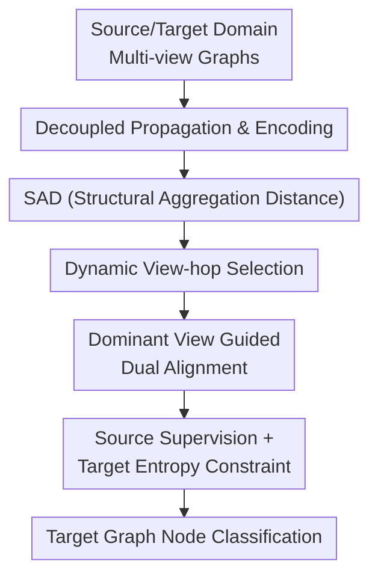

# SAGA: Structural Aggregation Guided Alignment with Dynamic View and Neighborhood Order Selection for Multiview Graph Domain Adaptation

**Conference**: ICLR2026  
**OpenReview**: [https://openreview.net/forum?id=hC9Ny8iMLi](https://openreview.net/forum?id=hC9Ny8iMLi)  
**Code**: https://github.com/f1shungry/SAGA  
**Area**: Graph Learning / Multi-view Graph Domain Adaptation  
**Keywords**: Multi-view Graph Learning, Graph Domain Adaptation, Structural Alignment, Dynamic Neighborhood Selection, Node Classification  

## TL;DR
SAGA addresses unsupervised graph domain adaptation on multi-relational graphs by proposing Structural Aggregation Distance to dynamically select the most transferable combination of views and neighborhood orders during training. This combination guides cross-view and cross-domain alignment, significantly outperforming existing GDA methods on ACM and MAG multi-view graph node classification tasks.

## Background & Motivation
**Background**: Graph Domain Adaptation (GDA) typically assumes a labeled source graph and an unlabeled target graph, with the goal of performing node classification on the target graph. Existing GDA methods are mostly designed for single-view graph structures, focusing on aligning representations or reducing cross-graph distribution discrepancies through adversarial training, MMD, spectral regularization, or structural reconstruction.

**Limitations of Prior Work**: Real-world graph data are often not single-view but rather multi-view graphs where multiple relations, meta-paths, or edge types coexist. For example, in ACM, the same set of papers can be connected via PAP (paper-author-paper) or PSP (paper-subject-paper) relations; in MAG, both PAP and PP (paper-paper) citation relations exist. Simply averaging these relations or selecting a single view neglects the complementary roles of different relations in transfer learning.

**Key Challenge**: Domain shift in multi-view graphs is not a fixed discrepancy between "source and target" but is jointly determined by the view dimension and the neighborhood order (hops). The first-order neighborhood of a specific view might be very similar across domains, while the third-order neighborhood of the same view might diverge significantly; another view might exhibit the opposite phenomenon. Alignment signals based on fixed views or fixed hops can easily pull the model toward incorrect structures.

**Goal**: The authors aim to solve Multi-view Graph Domain Adaptation (MGDA), where both source and target domains are multi-view graphs, labels are only available in the source domain, and the task is target node classification. Specific sub-problems include: how to measure structural shift across different views and neighborhood orders; how to find the optimal view-hop pair for alignment during training; and how to utilize this dominant structural signal to handle both cross-view and cross-domain shifts.

**Key Insight**: A key observation is that the structural signal that best explains the difference in transfer performance between the source and target domains varies during training. Empirical analysis comparing trajectories of dynamic SAD, fixed-view SAD, and fixed-hop SAD shows that only dynamic SAD exhibits a stable decline, synchronizing with the reduction in the classification loss gap between domains.

**Core Idea**: Use a Structural Aggregation Distance (SAD) that considers both views and neighborhood orders as a dynamic structural metric during training. In each epoch, the dominant view-hop pair corresponding to the minimum SAD is re-selected to guide the alignment of multi-view graph representations.

## Method
The mechanism of SAGA involves first generating graph structural representations for each view and hop, using SAD to select the most reliable structural anchor, and finally performing intra-domain cross-view alignment and source-target cross-domain alignment centered around this anchor. Instead of crudely merging views, it acknowledges that the transferability of different relations and neighborhood orders varies and explicitly incorporates this variation into the training loop.

### Overall Architecture
The input consists of source multi-view graphs $G_S=\{A_{S,1},\cdots,A_{S,V_S},X_S,Y_S\}$ and target multi-view graphs $G_T=\{A_{T,1},\cdots,A_{T,V_T},X_T\}$. SAGA first performs structural propagation with teleport for each view to obtain aggregated features at different hops. A shared MLP encoder/decoder is then used to obtain view-specific embeddings. Subsequently, the SAD of all candidate view-hop pairs is calculated to select the dominant combination with the minimum SAD. Finally, this dominant combination guides intra-view alignment, cross-domain alignment, source-domain supervised classification, and target-domain entropy minimization.

The primary contributions lie in the middle four components: Decoupled propagation and encoding allow multi-view high-order structures to enter training at low cost; SAD quantifies which view and neighborhood order are closer; Dynamic view-hop selection re-evaluates the dominant structure each epoch; and Dominant view guided dual alignment transforms structural selection into optimizable representation learning objectives.

### Key Designs
**1. Decoupled Propagation and Encoding: Cache structural aggregation, then learn representations with shared MLP**

Traditional GNNs perform graph convolutions repeatedly during training, which is computationally expensive in multi-view, multi-hop, and cross-domain settings. SAGA decouples graph propagation from representation dimensionality reduction. For each view $v$, starting from raw features $X$, it uses an APPNP-like recurrence for structural aggregation:

$$
X_{v,0}=X,\quad X_{v,k+1}=(1-\alpha)\hat A_vX_{v,k}+\alpha X.
$$

Here, $\hat A_v$ is the normalized adjacency matrix with self-loops, and $\alpha$ is the teleport probability. This formula preserves original node features via the teleport term to avoid over-smoothing in high-order propagation, while generating structural aggregation features from hop $1$ to $K$ for each view. Subsequently, the aggregated $X_v$ enters a shared encoder $f_\Theta(\cdot)$ to yield $Z_v=f_\Theta(X_v)$, and a shared decoder $g_\Theta(\cdot)$ reconstructs $\hat X_v$. The reconstruction loss $L_R$ ensures the encoder retains structural information rather than just serving classification.

**2. SAD (Structural Aggregation Distance): Aligning view discrepancy and neighborhood orders on a single scale**

The main challenge in multi-view graphs is that "structural discrepancy" lacks a single scale. SAGA provides an intuitive version of SAD based on mean aggregated features: taking the centers of aggregated features for source and target domains under a specific view and hop, and comparing the distance between these centers. This indicates that SAD focuses on the distribution discrepancy after structural propagation rather than just raw attributes or first-order edges.

During training, the authors measure SAD using matrix discrepancies in the embedding space:

$$
SAD_v^k=\left\|Z_{v_S}^{T,k_S}(Z_{v_S}^{T,k_S})^\top-Z_{v_T}^{S,k_T}(Z_{v_T}^{S,k_T})^\top\right\|_F^2.
$$

The core meaning is clear: it compares the pairwise similarity structure of source and target domains under a specific view-hop pair. Using $ZZ^\top$ instead of just means implies that SAD cares whether the relational structure between nodes is similar. The Frobenius norm compresses this relational matrix discrepancy into a rankable scalar.

**3. Dynamic View-hop Selection: Updating dominant structural signals during training**

SAGA does not pre-suppose that PAP is superior to PSP, nor that $K=1$ is most stable. Instead, it enumerates candidate views and hops during training and selects the combination with the minimum SAD:

$$
v^*,k^*=\arg\min_{v,K} SAD_v^k.
$$

This is referred to as the dominant view-hop pair. Its significance is not that "this view is always best," but that "in the current representation space, this view and neighborhood order best serve as the transfer anchor from source to target." Visualization of dynamic selection in the appendix shows that early training switches between candidates, but as SAD decreases, the selection stabilizes to semantically reasonable same-view mappings, such as PAP $\rightarrow$ PAP on ACM or PP $\rightarrow$ PP on MAG.

To prevent over-reliance on a single "hard" choice, SAGA assigns a soft weight to each candidate SAD:

$$
\omega_{v,k}=\frac{\exp(-\lambda SAD_v^k)}{\sum_j\sum_i\exp(-\lambda SAD_i^j)}.
$$

Smaller SAD leads to higher weight, with temperature $\lambda$ controlling the sharpness. This allows the model to highlight the dominant pair without losing complementary information from other views and hops.

**4. Dominant View Guided Dual Alignment: Reducing cross-view and cross-domain shifts simultaneously**

After selecting the dominant view-hop pair, SAGA performs two levels of alignment. The first is intra-alignment: within each domain, it forces representations of other views to align with the dominant view space. It uses the $ZZ^\top$ form to compare similarity structures, pulling multi-view representations into a unified dominant-guided embedding space. This addresses cross-view shift: different relations in the same domain might have different semantics; direct averaging dilutes useful structures, whereas aligning them around the currently most transferable view is more robust.

The second is cross-alignment: it projects the source dominant view-hop representation and the target dominant view-hop representation into a shared latent space, using a contrastive objective based on cosine similarity for bidirectional alignment. This is denoted as $L_{CA}=\ell(Z_{v_S^*}^{S,k_S^*},Z_{v_T^*}^{T,k_T^*})+\ell(Z_{v_T^*}^{T,k_T^*},Z_{v_S^*}^{S,k_S^*})$. This step targets domain shift: since SAD has identified the closest and most transferable structural combination, the model prioritizes this combination to bridge the domains rather than averaging across all views.

### Loss & Training
The total objective of SAGA consists of reconstruction, alignment, source classification, and target entropy constraints:

$$
L=L_R+\alpha L_{IA}+(1-\alpha)L_{CA}+\beta L_S+\delta L_T.
$$

$L_R$ is the multi-view aggregation feature reconstruction loss; $L_{IA}$ is the dominant-guided intra-alignment; $L_{CA}$ is the cross-domain alignment between the source and target dominant pairs; $L_S$ is the cross-entropy classification loss for labeled source nodes; and $L_T$ is the entropy loss for target predictions to encourage certainty.

SAD is recalculated every epoch, but these pairwise distances do not participate in backpropagation. This avoids including all distance calculations in the gradient path. While there is an $O(VN^2d)$ forward overhead, in practice, training time and memory remain close to strong baselines like HGDA and PA.

## Key Experimental Results

### Main Results
The experiments are conducted on multi-relational citation networks for cross-graph node classification. ACM1/ACM2 use PAP and PSP views; MAG is partitioned by country (CN, US, DE, FR, JP, RU) with PAP and PP views.

| Dataset / Transfer Direction | Metric | SAGA | Strongest Baseline | Gain |
|--------|------|------|----------|------|
| MAG CN$\rightarrow$US | ACC | 0.553 | 0.425 (UDAGCN/SpecReg) | +0.128 |
| MAG CN$\rightarrow$US | macro-F1 | 0.341 | 0.247 (SpecReg) | +0.094 |
| MAG JP$\rightarrow$CN | ACC | 0.512 | 0.451 (UDAGCN) | +0.061 |
| MAG CN$\rightarrow$JP | ACC | 0.557 | 0.436 (ACDNE) | +0.121 |
| MAG DE$\rightarrow$FR | macro-F1 | 0.426 | 0.291 (GraphATA) | +0.135 |
| MAG FR$\rightarrow$DE | ACC | 0.515 | 0.421 (HGDA) | +0.094 |
| ACM1$\rightarrow$ACM2 | ACC | 0.523 | 0.511 (HGDA) | +0.012 |
| ACM1$\rightarrow$ACM2 | F1 | 0.351 | 0.333 (PA) | +0.018 |

SAGA's advantage is particularly pronounced on MAG, especially in directions like CN$\rightarrow$US and DE$\rightarrow$FR. While the improvement on ACM is smaller, it consistently achieves the best performance across both directions.

| Method | ACM1$\rightarrow$ACM2 ACC | ACM1$\rightarrow$ACM2 F1 | ACM2$\rightarrow$ACM1 ACC | ACM2$\rightarrow$ACM1 F1 |
|------|---------|---------|---------|---------|
| GCN | 0.367 | 0.253 | 0.359 | 0.236 |
| UDAGCN | 0.452 | 0.283 | 0.409 | 0.347 |
| SpecReg | 0.493 | 0.308 | 0.431 | 0.381 |
| PA | 0.506 | 0.333 | 0.452 | 0.377 |
| HGDA | 0.511 | 0.311 | 0.441 | 0.414 |
| SAGA | 0.523 | 0.351 | 0.454 | 0.444 |

Non-adaptive GCN/GAT perform poorly, while adaptive methods improve results. However, most existing methods rely on single-view or static structure assumptions, failing to address the joint "view + hop" shift in MGDA.

### Ablation Study
Two types of ablations were performed: restricting view combinations and removing specific dynamic modules.

| Configuration | ACM1$\rightarrow$ACM2 ACC / F1 | Notes |
|------|---------|------|
| SAGA$_{PSP\rightarrow PAP}$ | 0.366 / 0.314 | Fixed cross-view combination; significantly lower performance |
| SAGA$_{PAP\rightarrow PAP}$ | 0.379 / 0.319 | Only using PAP; misses complementary PSP information |
| SAGA | 0.523 / 0.351 | Full dynamic multi-view alignment |

Trends indicate that removing Dominant View Alignment (using DANN instead of $L_{IA}+L_{CA}$) results in the largest performance drop. Fixed hops are inferior to dynamic hops, and simple view averaging instead of dominant selection also degrades performance.

### Key Findings
- **SAD Synchronization**: SAD trajectories synchronize with the reduction of source-target loss gaps during training.
- **Joint Multi-view Utility**: PAP/PSP and PAP/PP carry complementary semantics; fixing any single view or static combination is suboptimal.
- **Interpretability**: Dynamic selection eventually converges to explainable structures (e.g., same-view mappings like PAP$\rightarrow$PAP).
- **Manageable Overhead**: In CN$\rightarrow$US, SAGA's training time is 1.109x and memory is 1.098x that of baselines, showing the additional SAD calculation does not cause exponential cost increases.

## Highlights & Insights
- SAGA re-frames the MGDA challenge from "how to fuse views" to "which view and neighborhood order currently serve as the best transfer anchor." This is more granular than simple averaging as it recognizes that transferability evolves during training.
- SAD uses $ZZ^\top$ to compare relational structures rather than just node means or first-order adjacency. This aligns better with structural consistency: whether relative relationships between nodes are preserved across domains.
- The decoupled propagation and MLP encoding design is practical. It allows high-order multi-view features to be pre-aggregated, leaving computational budget for dynamic selection.

## Limitations & Future Work
- **Scalability**: SAD's pairwise similarity calculation has an $O(VN^2d)$ complexity. While manageable for current datasets as it's outside the gradient path, larger graphs might require sampling or low-rank approximations.
- **Dataset Variety**: Validation is primarily on citation networks. Performance on multi-view social networks, knowledge graphs, and dynamic graphs remains to be verified.
- **Selection Criteria**: Current selection is based on minimum SAD (structural similarity), but "most similar" may not always mean "most discriminative." Future work could incorporate category discriminability.
- **Target Shift**: Entropy minimization can amplify false confidence under heavy label shift; future versions might require label prior correction.

## Related Work & Insights
- **vs UDAGCN**: UDAGCN uses graph convolution knowledge for GDA via adversarial training. SAGA differs by being multi-view oriented and dynamically selecting structural anchors.
- **vs GRADE-N**: GRADE-N uses subtree discrepancy for single-graph shift. SAGA incorporates multi-view and multi-hop dimensions into the measurement.
- **vs HGDA**: HGDA aligns heterogeneous and attribute signals but remains closer to single-view GDA. SAGA specifically models the relationship view discrepancy.
- **Insight**: For multi-view graph tasks, one should not default to equal weights or a fixed prior view. A more robust approach treats "view quality" as a dynamic variable during training.

## Rating
- **Novelty**: ⭐⭐⭐⭐ The MGDA setting and dynamic view-hop SAD selection are clearly innovative.
- **Experimental Thoroughness**: ⭐⭐⭐⭐ Comprehensive experiments, though concentrated on citation datasets.
- **Writing Quality**: ⭐⭐⭐ Clear motivation and analysis, despite minor notation inconsistencies.
- **Value**: ⭐⭐⭐⭐ Highly relevant for multi-relational graph transfer, serving as a baseline for future heterogeneous or multi-modal graph alignment.

<!-- RELATED:START -->

## Related Papers

- [\[ICLR 2026\] Entropy-Guided Dynamic Tokens for Graph-LLM Alignment in Molecular Understanding](entropy-guided_dynamic_tokens_for_graph-llm_alignment_in_molecular_understanding.md)
- [\[ICLR 2026\] Dual-Branch Representations with Dynamic Gated Fusion and Triple-Granularity Alignment for Deep Multi-View Clustering](dual-branch_representations_with_dynamic_gated_fusion_and_triple-granularity_ali.md)
- [\[ICLR 2026\] <SOG$_k$>: One LLM Token for Explicit Graph Structural Understanding](sog_k_one_llm_token_for_explicit_graph_structural_understanding.md)
- [\[ICLR 2026\] Multi-Scale Diffusion-Guided Graph Learning with Power-Smoothing Random Walk Contrast for Multi-View Clustering](multi-scale_diffusion-guided_graph_learning_with_power-smoothing_random_walk_con.md)
- [\[ICLR 2026\] Multi-Domain Riemannian Graph Gluing for Building Graph Foundation Models](multi-domain_riemannian_graph_gluing_for_building_graph_foundation_models.md)

<!-- RELATED:END -->
