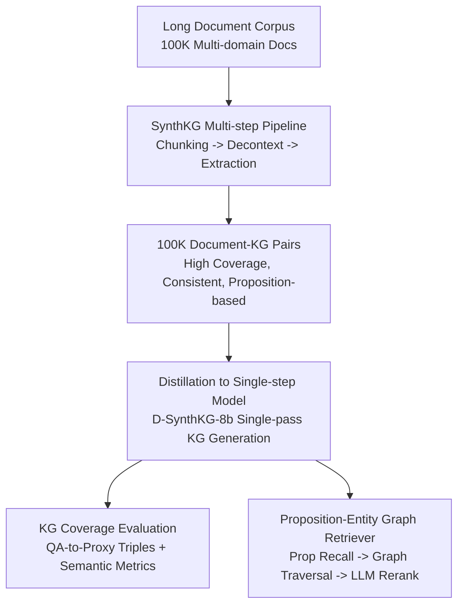

# Scaling Knowledge Graph Construction through Synthetic Data Generation and Distillation

**Conference**: ICLR 2026  
**OpenReview**: [https://openreview.net/forum?id=VaBkEapGl5](https://openreview.net/forum?id=VaBkEapGl5)  
**Code**: Not yet public (authors promise to open-source the 100K document-KG dataset and core code)  
**Area**: Knowledge Graph Construction / Data Synthesis / Distillation / Retrieval-Augmented Generation  
**Keywords**: Document-level Knowledge Graphs, Synthetic Data, Distillation, ontology-free, Graph RAG

## TL;DR
Addressing the dilemma of "large models being expensive and small models being poor" in document-level Knowledge Graph (KG) construction, this paper proposes a multi-step synthetic pipeline, SynthKG (chunking → decontextualization → entity/proposition/triple extraction), to generate 100,000 high-quality document-KG training pairs. This multi-step process is distilled into an 8B small model, Distill-SynthKG, enabling single-step inference to produce KGs comparable to models eight times its size, while outperforming GraphRAG and HippoRAG in retrieval and multi-hop QA tasks.

## Background & Motivation
**Background**: Knowledge Graph-enhanced RAG (GraphRAG, HippoRAG, GraphReader, etc.) has demonstrated effectiveness in corpus-level summarization, multi-hop reasoning, and long-context planning. These methods typically utilize large models like GPT-4o with simple zero-shot or few-shot prompts to extract KGs from entire documents in a single step.

**Limitations of Prior Work**: This "single-step large model extraction" is unsustainable for large-scale corpora due to the extreme costs of commercial API calls. Furthermore, feeding entire long documents to an LLM at once often leads to information loss. If small models are used to reduce costs, the resulting KGs are sparse, inconsistent, and incomplete. Additionally, document-level, ontology-free KG construction lacks both training data and evaluation benchmarks, making it difficult to determine whether RAG failures stem from the reasoning component or low-quality KGs.

**Key Challenge**: The authors identify that the poor performance of small models in KG extraction is **not due to a lack of model capability, but a lack of high-quality document-level KG training data**. Unlike other structured extraction tasks that have supervised datasets, ontology-free KG construction has almost no large-scale training corpora, forcing reliance on expensive zero-shot inference.

**Goal**: The research focuses on three sub-problems: (1) how to scale the generation of high-quality document-KG training pairs without human annotation; (2) how to enable small models to learn the capabilities of a multi-step large model pipeline; and (3) how to measure KG quality in the absence of evaluation benchmarks.

**Key Insight**: The paradigm of KG construction is shifted from treating each document as an isolated zero-shot problem to a "learnable pattern recognition problem." By decomposing the construction process into reproducible and consistent stages, these patterns can be learned by a small model as training signals.

**Core Idea**: By utilizing "large models running a multi-step pipeline to synthesize data + distilling the multi-step process into single-step small model generation" instead of "single-step brute-force extraction," the paradigm of scaling KG construction shifts from "scaling model size" to "generating training data."

## Method

### Overall Architecture
The framework consists of three components: **SynthKG** (a multi-step data synthesis engine) → **Distill-SynthKG** (a distilled single-step small model) → downstream evaluation and retrieval. SynthKG uses Llama-3.1-70B to process long documents through a multi-step pipeline: non-overlapping chunking at sentence boundaries, per-chunk decontextualization (disambiguating and completing entity references), dual-prompting for entity and proposition/relation quadruplet extraction, and aggregation into a proposition-centric document-level KG. This pipeline generated 100,000 document-KG pairs across multiple domains, which were used to fine-tune a Meta-Llama-3-8B model (D-SynthKG-8b) to produce a complete KG in a single forward pass. Additionally, multi-hop QA datasets were repurposed as proxy ground truths for KG evaluation, and a progressive graph retriever was designed based on the proposition-entity bipartite graph structure.

### Key Designs

**1. SynthKG Multi-step Pipeline: Decomposing "Extraction" into Reproducible Stages**

This design eliminates the issues of information loss in long-text processing and the inconsistency of zero-shot outputs. Documents are split into 256-token semantic chunks at sentence boundaries. The second step, **decontextualization**, requires the LLM to rewrite entity references based on context (e.g., resolving "John D." to "John Doe"). This ensures cross-chunk entity consistency and makes each chunk a self-contained unit. Statistics show the average inter-chunk distance for the same entity is $0.9$, suggesting that looking at the immediate preceding chunk is sufficient. Consistency is maintained by filtering samples with a ROUGE-1 F1 threshold of $0.70$.

Extraction is split: entities are extracted first, followed by **propositions and relation quadruplets** (source, predicate, target, proposition). Here, the proposition serves as a "Chain-of-Thought" (CoT) to clarify context before triple extraction and as a fine-grained, self-contained unit for indexing and retrieval.

**2. SynthKG Distillation: Internalizing Multi-step Logic into an 8B Model**

While effective, the multi-step pipeline is inefficient (requiring ~12 LLM calls for a 1000-word document). The authors' insight is that once KG construction is systematized, it can be treated as a pattern recognition task. D-SynthKG-8b was fine-tuned on 30,000 document-KG pairs (learning rate $5\text{e-}5$, batch size 32, 1 epoch). The model learns to process long documents without losing information and implicitly encodes the entity consistency patterns demonstrated by the teacher pipeline.

**3. KG Coverage Evaluation: Multi-hop QA as Proxy Ground Truth**

Due to the lack of benchmarks for ontology-free KGs, the authors repurposed multi-hop QA datasets. Since multi-hop questions imply interconnected facts, GPT-4o is used to convert question-answer pairs into proxy ground truth triples. Metrics include **semantic score** (cosine similarity), **triple coverage** (binary threshold), and **F1**. The evaluation prioritizes recall, as missing information (low recall) is more detrimental to RAG than irrelevant facts (low precision).

**4. Proposition-Entity Graph Retriever: Propositions as First-class Units**

This retriever leverages the **proposition-entity bipartite graph**. Unlike methods retrieving sparse triples, it treats propositions as the primary retrieval unit because they are context-rich and self-contained. Given a query, $M$ propositions are recalled via embedding similarity. A subgraph is then constructed, and traversal is performed to retain propositions within an $N$-hop neighborhood of query entities. This graph constraint filters out "semantically similar but logically disconnected" information (e.g., distinguishing "Washington" the state from "Washington" the president).

## Key Experimental Results

### Main Results
Evaluation was conducted on three multi-hop reasoning benchmarks: MuSiQue, 2WikiMultiHopQA, and HotpotQA.

KG Coverage (Table 1, Selection of Triple Coverage %):

| KG Source | Size | MuSiQue | 2Wiki | HotpotQA |
|---------|------|---------|-------|----------|
| Llama-3-8b (Zero-shot) | 8B | 32.09 | 43.39 | 41.79 |
| SynthKG-8b (Multi-step) | 8B | 38.84 | 44.56 | 47.72 |
| Llama-3-70b (Zero-shot) | 70B | 40.34 | 54.10 | 47.20 |
| SynthKG-70b (Multi-step) | 70B | 47.18 | 63.30 | 54.54 |
| **D-SynthKG-8b (Ours)** | 8B | **46.90** | 58.27 | **55.26** |

D-SynthKG-8b significantly outperforms the zero-shot Llama-3 blocks and is comparable to the 70B multi-step pipeline while requiring only a single forward pass.

Multi-hop QA (Table 3, Avg EM/F1 under Graph+LLM framework):

| KG Source | Framework | Avg EM | Avg F1 |
|---------|----------|---------|---------|
| Dense + LLM (No KG) | — | 0.394 | 0.536 |
| GPT-4o + HippoRAG | — | 0.403 | 0.546 |
| Llama-3-8b | Graph+LLM | 0.281 | 0.402 |
| Llama-3-70b | Graph+LLM | 0.413 | 0.548 |
| **D-SynthKG-8b (Ours)** | Graph+LLM | **0.433** | **0.569** |

Ours achieves a $+15.2\%$ absolute EM gain over the Llama-3-8b baseline and outperforms systems built on GPT-4o KGs (GraphRAG/HippoRAG).

### Ablation Study

| Analysis | Key Finding |
|----------|-------------|
| Multi-step vs Single-step | Single-step triple density drops by 60% as length increases; SynthKG remains stable. |
| Optimal Retrieval Unit | Propositions outperform triples (Hits@10 $+0.89$); adding graph structure adds $+2.50$. |
| RAG Enhancement Mode | Including propositions and 2-hop paths provides the highest accuracy gains. |

### Key Findings
- Distillation provides a qualitative leap in capability: Hits@2 gains of $+28.27$ points exceed typical marginal fine-tuning improvements.
- The 8B distilled model matches or exceeds the 70B multi-step pipeline, proving that high-quality training data can bridge the gap in model scale.
- Decontextualization is the cornerstone of quality, ensuring entity consistency for reliable graph traversal.

## Highlights & Insights
- **Triple-utility Propositions**: They serve as a middle-layer CoT, a self-contained retrieval unit, and an interpretable object for LLM reranking.
- **Paradigm Shift**: The work shifts from scaling model size to generating high-quality training data, front-loading the cost of multi-step inference into a one-time training phase.
- **Graph Neighborhood Filtering**: Using $N$-hop constraints effectively resolves the common RAG issue of "semantic similarity without logical connectivity."

## Limitations & Future Work
- The framework is dependent on teacher models (Llama-3.1-70B and GPT-4o), with proxy ground truth accuracy at ~86%.
- The focus on recall over precision may not suit applications requiring high-precision fact-checking.
- Evaluation is limited to English multi-hop QA; cross-lingual and domain-specific generalization (e.g., medical or legal KGs) requires further study.

## Related Work & Insights
- **vs GraphRAG / HippoRAG**: While prior works focus on maximizing KG utility, ours is the first to optimize construction efficiency by training a specialized small model.
- **vs Direct Prompting**: Ours maintains constant triple density regardless of document length, whereas direct prompting degrades quickly.
- **vs Sparse Retrieval**: By using propositions as first-class units, the system captures context that isolated triples lack, leading to superior retrieval and reranking.

## Rating
- Novelty: ⭐⭐⭐⭐
- Experimental Thoroughness: ⭐⭐⭐⭐
- Writing Quality: ⭐⭐⭐⭐
- Value: ⭐⭐⭐⭐

<!-- RELATED:START -->

## Related Papers

- [\[ICLR 2026\] GraphUniverse: Synthetic Graph Generation for Evaluating Inductive Generalization](graphuniverse_synthetic_graph_generation_for_evaluating_inductive_generalization.md)
- [\[ICLR 2026\] ReLaSH: Reconstructing Joint Latent Spaces for Efficient Generation of Synthetic Hypergraphs with Hyperlink Attributes](relash_reconstructing_joint_latent_spaces_for_efficient_generation_of_synthetic_.md)
- [\[AAAI 2026\] Self-Correction Distillation for Structured Data Question Answering](../../AAAI2026/graph_learning/self-correction_distillation_for_structured_data_question_answering.md)
- [\[ICLR 2026\] WATS: Wavelet-Aware Temperature Scaling for Reliable Graph Neural Networks](wats_wavelet-aware_temperature_scaling_for_reliable_graph_neural_networks.md)
- [\[ICLR 2026\] Learning Posterior Predictive Distributions for Node Classification from Synthetic Graph Priors](learning_posterior_predictive_distributions_for_node_classification_from_synthet.md)

<!-- RELATED:END -->
