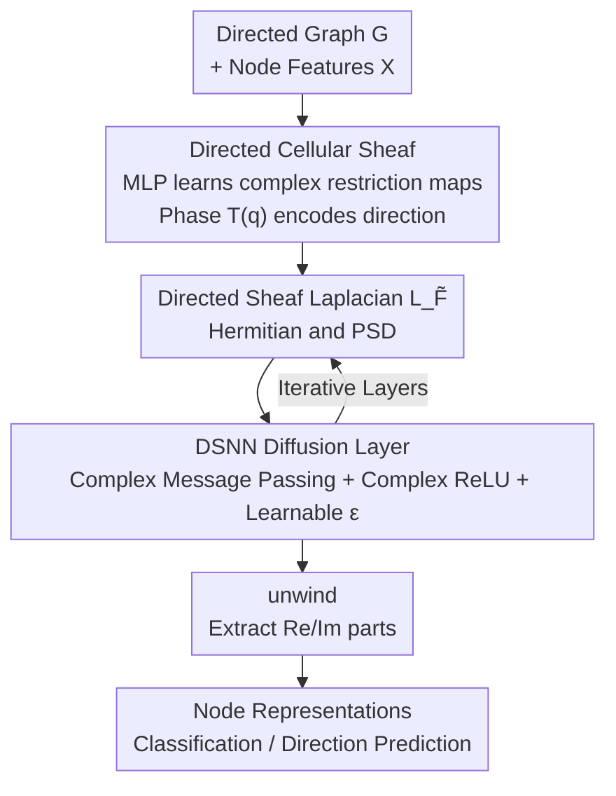

# Sheaves Reloaded: A Directional Awakening

**Conference**: ICLR 2026  
**OpenReview**: [https://openreview.net/forum?id=iDiiETH7Qv](https://openreview.net/forum?id=iDiiETH7Qv)  
**Code**: https://github.com/hakanaktas0/DSNN  
**Area**: Graph Learning / Sheaf Neural Networks / Directed Graphs  
**Keywords**: Cellular Sheaves, Directed Graphs, Sheaf Laplacian, Magnetic Laplacian, Spectral Graph Neural Networks

## TL;DR
This paper proposes **Directed Cellular Sheaves**, which encode edge directions into phases using complex-valued, direction-aware restriction maps. This construction forms a Hermitian **Directed Sheaf Laplacian $L_{\tilde F}$**, leading to DSNN—the first Sheaf Neural Network to embed directional inductive biases into its architecture. It achieves SOTA results on 10 out of 12 node classification benchmarks.

## Background & Motivation

**Background**: Sheaf Neural Networks (SNNs) are algebraic topological generalizations of Graph Neural Networks (GNNs). They assign a vector space (called a stalk) to each node and edge, utilizing linear **restriction maps** $F_{u\trianglelefteq e}: F(u)\to F(e)$ to link adjacent node-edge pairs. From these restriction maps, the **Sheaf Laplacian** $L_F=\delta^\top\delta$ is derived. Compared to standard GNNs, SNNs learn in higher-dimensional feature spaces, naturally mitigating oversmoothing and performing better on heterophilic graphs (where neighbors have different labels). This has become a principled research direction recently (e.g., NSD).

**Limitations of Prior Work**: Currently, all SNNs can only process **undirected graphs**—the Sheaf Laplacian is constructed to be independent of edge orientation (flipping the sign of an edge does not change $L_F$). However, many real-world graphs are naturally directed: social networks, biological regulatory networks, and causal/flow networks, where the direction itself carries critical information. In the GNN domain, it has been proven that "explicitly modeling direction can significantly improve performance" (e.g., DirGNN, MagNet), yet the SNN camp entirely lacks this capability.

**Key Challenge**: For a Sheaf Laplacian to serve spectral convolutions, it must be a Positive Semi-Definite (PSD) operator to guarantee real, non-negative eigenvalues and provide well-defined graph Fourier bases and spectral filters. However, **purely real anti-symmetric matrices** (the most direct way to "encode direction") produce purely imaginary eigenvalues, causing spectral filters to diverge. In other words, "preserving PSD" and "encoding direction" are inherently in conflict within the real number domain.

**Goal**: To explicitly inject edge direction into SNN restriction maps and Laplacians while maintaining the PSD/Hermitian spectral properties of the Sheaf Laplacian.

**Key Insight**: Borrowing from the concept of **Magnetic Laplacians** in electromagnetism—using a **complex Hermitian** operator where the **magnitude** carries undirected geometry and the **phase** carries edge direction, with a parameter $q$ to regulate the intensity of the directional component. Hermitian matrices are uniquely capable of encoding asymmetric relations while guaranteeing a real, non-negative spectrum.

**Core Idea**: Embed direction into the **imaginary part** of the restriction maps—multiply the restriction map of the tail node by a phase factor $T^{(q)}_{uv}=\exp(i\,2\pi q\,(A-A^\top)_{uv})$. The resulting Directed Sheaf Laplacian unifies the classical Sheaf Laplacian with the Magnetic Laplacian and Signed Magnetic Laplacian.

## Method

### Overall Architecture

The input to DSNN is a **directed graph** and its node features, and the output is node representations (used for node classification or edge direction prediction). The pipeline consists of four steps: first, an MLP learns **complex-valued restriction maps** end-to-end for each edge, injecting edge direction into the tail node's map via the phase factor $T^{(q)}$ to form a **Directed Cellular Sheaf**. Next, a Hermitian and PSD **Directed Sheaf Laplacian $L_{\tilde F}$** is obtained by composing the coboundary operator $\tilde\delta$ with its conjugate transpose. This is then substituted into a discretized **Directed Neural Sheaf Diffusion** for several layers of complex-domain message passing (equipped with a complex version of ReLU and learnable scaling $\epsilon$). Finally, an **unwind** operation splits the complex representations into real and imaginary parts, concatenating them to project back into the real domain for output.

The core of the method is: **all "real-valued restriction maps / real symmetric Laplacians / real diffusion" in standard SNNs are upgraded to complex versions**, with the phase factor $T^{(q)}$ serving as the vehicle for this upgrade.

### Key Designs

**1. Directed Cellular Sheaf: Hiding direction in the restriction map phase**

Addressing the fundamental limitation that "SNNs can only process undirected graphs," this paper redefines stalks and restriction maps. Standard cellular sheaf stalks are real vector spaces, and restriction maps are real matrices, which are invisible to edge orientation. This paper changes stalks to **complex vector spaces** $\tilde F(u),\tilde F(e)\in\mathbb{C}^d$ and introduces a parameterized Hermitian phase matrix:
$$T^{(q)} := \exp\!\big(i\,2\pi q\,(A-A^\top)\big),\quad q\in\mathbb{R}.$$
For the two endpoints of an edge $e$, the restriction map of the head node $\tilde F_{u\trianglelefteq e}\in\mathbb{R}^{d\times d}$ remains real-valued, while the **tail node's** restriction map is multiplied by the phase: $\tilde F_{v\trianglelefteq e}=\tilde F^0_{v\trianglelefteq e}\,T^{(q)}_{uv}\in\mathbb{C}^{d\times d}$. Intuitively, direction is recorded by "which end bears the phase and whether the phase sign is positive or negative." For example, when $q=\tfrac14$ and $e=(u,v)$ is a directed edge, $A_{uv}=1, A_{vu}=0$, so $T^{(q)}_{uv}=\cos(-\tfrac{\pi}{2})+i\sin(-\tfrac{\pi}{2})=-i$. The tail node map becomes $-\tilde F^0_{v\trianglelefteq e}\,i$, where the sign of the imaginary part indicates edge orientation. If $e$ is undirected, $A_{uv}=A_{vu}=1$ and $T^{(q)}_{uv}=1$, and the map collapses to purely real, consistent with classical cellular sheaves. This is how it "expresses direction while remaining backward compatible with the undirected case."

**2. Directed Sheaf Laplacian $L_{\tilde F}$: Using Hermitian structure to house topology and direction**

With direction-aware restriction maps, the paper defines the **Directed Coboundary Operator** $\tilde\delta(x)_e:=\tilde F_{u\trianglelefteq e}x_u-\tilde F_{v\trianglelefteq e}x_v$. Composing this with its conjugate transpose yields the **Directed Sheaf Laplacian** $L_{\tilde F}:=\tilde\delta^*\tilde\delta$ ($*$ denotes conjugate transpose). When expanded, the action of $L_{\tilde F}(x)_u$ on a 0-cochain $x$ naturally splits into the sum of **inflow, outflow, and undirected** terms, treating in-edges, out-edges, and undirected edges distinctly—a clear manifestation of directional bias. The core value of this operator lies in its spectral properties: this paper proves that $L_{\tilde F}$ and its normalized version $L_{\tilde F}^N$ are **Hermitian and Positive Semi-Definite** (eigenvalues are real and non-negative, and the operator is diagonalizable), with $L_{\tilde F}^N\preceq 2I$. This aligns perfectly with classical Laplacians for undirected graphs, allowing the use of Kipf-Welling's first-order Chebyshev approximation to define well-defined spectral convolutions. More impressively, it provides **unification**: when the graph is undirected, $L_{\tilde F}$ reverts to the classical Sheaf Laplacian $L_F$ for any $q$; for trivial sheaves ($d=1$, restriction maps equal to 1), it reverts to the Magnetic Laplacian $L^{(q)}$, and further to the Signed Magnetic Laplacian $L_\sigma$ when $q=\tfrac14$. The paper also provides a complex-valued "node-edge incidence matrix" decomposition $L^{(q)}=\hat B\hat B^*$, offering a simpler proof of the PSD property of Magnetic/Signed Magnetic Laplacians than the original literature.

**3. DSNN Diffusion Layer: Neural Sheaf Diffusion in the complex domain**

Having the operator is not enough; it must be transformed into a trainable network. The paper generalizes Bodnar's Neural Sheaf Diffusion to the complex domain. The continuous process is $\dot X(t)=-\sigma\big(L_{\tilde F}^N(t)(I_n\otimes W_1(t))X(t)W_2(t)\big)$. After discretization, the DSNN convolutional update rule is:
$$X^{(t+1)}=\mathrm{diag}(1+\varepsilon)X^{(t)}-\sigma\big(L_{\tilde F(t)}^N(I_n\otimes W_1^{(t)})X^{(t)}W_2^{(t)}\big),$$
where $W_1\in\mathbb{R}^{d\times d}$ and $W_2\in\mathbb{R}^{f\times f}$ are per-layer weights, and a learnable parameter $\epsilon\in[-1,1]^d$ adjusts the relative amplitude of each stalk component. Since the process occurs entirely in the complex domain, the activation function $\sigma$ uses a **complex-extension ReLU** (preserving values if the real part is $\ge0$, otherwise set to zero). The final layer uses **unwind** to split and concatenate the complex output $\mathrm{unwind}(X)=(\Re(X)\,\|\,\Im(X))\in\mathbb{R}^{n\times 2c}$ back into the real domain. Computationally, complex operations introduce a constant factor overhead of roughly 4x and **do not change asymptotic complexity**—on undirected graphs, DSNN complexity is identical to NSD.

**4. End-to-End Learnable Restriction Maps: Let data choose the sheaf structure**

The same graph can be assigned many sheaf structures; they are only meaningful if chosen correctly. Instead of manual specification, this paper makes restriction maps a function of input features: for each edge $e=(u,v)$, $F_{u\trianglelefteq e}=\Phi(x_u\,\|\,x_v)$, where $\Phi$ is an MLP whose output is reshaped into a $d\times d$ matrix. Thus, restriction maps are learned end-to-end with node features. Combined with Diag / O(d) / General block structure constraints, three variants—Diag-DSNN, O(d)-DSNN, and Gen-DSNN—are derived, allowing the model to adaptively select the most suitable sheaf for different graphs.

### Loss & Training

Both node classification and edge direction prediction are trained using standard supervised cross-entropy. $q$ is searched as a hyperparameter (preliminary experiments also tried setting $q$ as a learnable parameter); stalk dimensions are set to $d\in\{2,5\}$. Evaluation follows the 10-split protocol of Bodnar et al. For direction prediction, 15%/5% test/val splits are used with 10-fold cross-validation while maintaining graph connectivity.

## Key Experimental Results

### Main Results

On 12 real-world benchmarks for node classification (covering heterophily to homophily), DSNN achieves the best performance on **10/12** datasets. The following table highlights representative datasets (Accuracy %, ROC AUC for Questions):

| Dataset | Homophily | Best DSNN Variant | NSD (Undirected SNN) | Strongest Directed GNN | 
|--------|--------|----------------|------------------|----------------|
| Roman-Empire | 0.05 | 92.08 (O(d)/Gen) | 83.80 | 91.23 (DirGNN) |
| Texas | 0.11 | 88.65 (Diag) | 85.95 | 79.46 (MagNet) |
| Telegram | 0.32 | 94.81 (Gen) | 92.11 | 92.81 (DirGNN) |
| Questions | 0.84 | 79.55 (Gen) | 77.36 | 76.95 (SigMaNet) |

Compared to the undirected SNN baseline NSD, Gain is particularly significant on Questions, Texas, Telegram, and Roman-Empire. Compared to direction-aware GNNs (DirGNN/MagNet/SigMaNet), DSNN is stronger on 10/12 datasets. It ranks second only on Squirrel and Cora by narrow margins (0.22, 0.79).

Synthetic data (DSBM directed stochastic block model, $C=5$ classes, minimal features using only in/out degrees) highlights the role of direction:

| Model | $\alpha_{ij}=0.05$ | $0.08$ | $0.10$ |
|------|------|------|------|
| Diag-DSNN | 98.34 | 97.22 | **99.14** |
| O(d)-DSNN | 97.28 | 98.42 | 98.80 |
| NSD (All variants) | ~20 | ~20 | ~20 |
| MagNet | 78.64 | 87.52 | 91.58 |
| SigMaNet | 87.44 | 96.14 | 98.60 |

DSNN variants are near-perfect (96–99%), whereas undirected NSD stays at ~20% (equivalent to random guessing for 5 classes)—directly proving that NSD is entirely "direction-blind."

### Ablation Study

| Configuration | Phenomenon | Description |
|------|------|------|
| DSNN ($q>0$) | Achieves gains shown above | Restriction maps contain directional phase |
| DSNN with $q=0$ | Performance drops | Drops edge direction, degenerates to undirected sheaf |
| NSD (Undirected SNN) | ~20% on synthetic | Completely fails to utilize directional community structure |

### Key Findings
- **Gains stem from "Direction," not "Capacity"**: Setting $q=0$ (discarding direction within the sheaf) causes performance to drop to undirected levels. Gain only returns when $q>0$, ruling out the explanation that the model is simply "better because it is more complex."
- **Importance of direction correlates with advantage**: In settings like DSBM where community structure is tied to directional bias and node features are scarce, DSNN outperforms rivals by dozens of percentage points, showing that directional encoding is extremely valuable when features are sparse.
- **Leading in direction prediction tasks**: In binary classification for $(u,v)$ vs $(v,u)$, DSNN is best on 6/10 datasets and a close second on others (0.01 gap on Cora, 0.18 on Film).
- **Manageable costs**: Complex operations create a ~4x constant factor overhead but do not change asymptotic complexity. On small graphs, training takes 8–10s vs NSD's 6.5–7.8s; on the largest graph (Questions), it takes 107s vs 47.5s.

## Highlights & Insights
- **"Magnitude for geometry, phase for direction" is the core ingenuity**: Using a complex Hermitian operator decouples undirected geometry and direction into magnitude and phase channels. This preserves the real, non-negative spectrum required for spectral convolution while embedding directional information, bypassing the "purely imaginary eigenvalues" bottleneck of real anti-symmetric matrices.
- **One operator unifies three lineages**: $X_{\tilde F}$ reverts to classical Sheaf Laplacians, Magnetic Laplacians, and Signed Magnetic Laplacians in different special cases. This unifies the previously independent tracks of SNNs and direction-aware spectral GNNs into a single elegant theoretical framework.
- **Valuable by-products**: The complex node-edge incidence matrix decomposition $L^{(q)}=\hat B\hat B^*$ provides a shorter proof of the PSD property for Magnetic/Signed Magnetic Laplacians, which is independently useful for spectral graph theory.
- **Transferable logic**: The strategy of "writing asymmetry into phase and using Hermitian operators as a safety net" can be borrowed for any spectral method needing to encode asymmetric relations while maintaining PSD, such as directed generalizations of hypergraphs or temporal graphs.

## Limitations & Future Work
- $q$ is primarily searched as a hyperparameter. While there are preliminary attempts to make $q$ learnable, it is not yet the default configuration, and optimal $q$ selection still depends on tuning.
- Complex computation introduces a ~4x constant overhead and extra memory usage (107s / higher VRAM on Questions). Scalability on extremely large-scale graphs has not been fully verified (some baselines already OOM).
- The framework is limited to 0-cells and 1-cells (nodes and edges) of cellular complexes and has not been extended to higher-order directed structures including 2-cells (faces). The directional phase is also restricted to a single $T^{(q)}$ form.
- Evaluation focuses on node classification and direction prediction; more complex directed graph tasks (e.g., flow/causal inference) remain to be tested.

## Related Work & Insights
- **vs NSD (Bodnar 2022)**: NSD is the representative undirected SNN using real symmetric Sheaf Laplacians for neural diffusion. Ours proves that NSD is a special case of DSNN on undirected graphs; the entire added value of DSNN comes from the directional phase, as seen in the ~20% vs ~99% synthetic comparison.
- **vs MagNet / SigMaNet (Magnetic/Signed Magnetic Laplacians)**: These use complex Hermitian Laplacians to inject direction into **standard GNNs**, but their stalk dimension is fixed at 1, lacking the high-dimensional representation of sheaves. DSNN shows they are special cases of trivial directed cellular sheaves and stacks the high-dimensional/heterophilic advantages of sheaves on top of them, outperforming them on 10/12 datasets.
- **vs DirGNN (Rossi 2024)**: DirGNN is a spatial domain method aggregating in- and out-neighbors with different weights. Ours is a spectral domain method where direction is unified into the convolution via the Laplacian's phase, proving more stable on heterophilic sets (where DirGNN shows high variance/instability on synthetic data).

## Rating
- Novelty: ⭐⭐⭐⭐⭐ First to embed directional inductive bias into Sheaf NNs, unifying Sheaf Laplacians with Magnetic/Signed Magnetic Laplacians.
- Experimental Thoroughness: ⭐⭐⭐⭐ 12 real + synthetic + direction prediction tasks with many baselines and clean $q=0$ ablations; however, lacks ultra-large scale scalability verification.
- Writing Quality: ⭐⭐⭐⭐ Theoretically rigorous with clear motivation; notation-heavy, posing a high barrier for readers unfamiliar with sheaves.
- Value: ⭐⭐⭐⭐⭐ Fills the gap for SNNs on directed graphs with an elegant theoretical framework and reusable spectral tools (PSD proofs, complex incidence decomposition).

<!-- RELATED:START -->

## Related Papers

- [\[ICML 2026\] Polynomial Neural Sheaf Diffusion: A Spectral Filtering Approach on Cellular Sheaves](../../ICML2026/graph_learning/polynomial_neural_sheaf_diffusion_a_spectral_filtering_approach_on_cellular_shea.md)
- [\[NeurIPS 2025\] Nonlinear Laplacians: Tunable Principal Component Analysis under Directional Prior Information](../../NeurIPS2025/graph_learning/nonlinear_laplacians_tunable_principal_component_analysis_under_directional_prio.md)
- [\[ICLR 2026\] Cooperative Sheaf Neural Networks](cooperative_sheaf_neural_networks.md)
- [\[ICLR 2026\] Efficient Learning on Large Graphs using a Densifying Regularity Lemma](efficient_learning_on_large_graphs_using_a_densifying_regularity_lemma.md)
- [\[ICLR 2026\] Exchangeability of GNN Representations with Applications to Graph Retrieval](exchangeability_of_gnn_representations_with_applications_to_graph_retrieval.md)

<!-- RELATED:END -->
