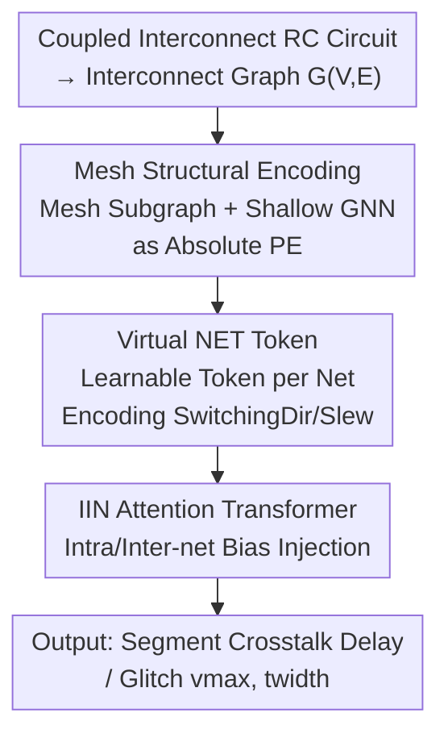

# Si-GT: Fast Interconnect Signal Integrity Analysis for Integrated Circuit Design via Graph Transformers

**Conference**: ICLR 2026  
**OpenReview**: [https://openreview.net/forum?id=orO5727bSh](https://openreview.net/forum?id=orO5727bSh)  
**Code**: https://github.com/xlab-ub/Si-GT  
**Area**: Graph Learning / Graph Transformer / EDA  
**Keywords**: Signal Integrity, Crosstalk, Interconnect Modeling, Graph Transformer, EDA

## TL;DR
Si-GT models chip interconnects as coupled RC circuit graphs. It utilizes a graph Transformer customized for crosstalk effects (mesh structural encoding + virtual NET tokens + intra/inter-net attention bias) to directly predict crosstalk delay and glitches. The accuracy surpasses existing GNNs and graph Transformers, with an inference time of only 4ms, which is two orders of magnitude faster than SPICE simulation.

## Background & Motivation
**Background**: In integrated circuit (IC) design, capacitive coupling between interconnects induces crosstalk, leading to delay variations and transient glitches on the victim net. These phenomena directly threaten the timing and functional correctness of the chip. Engineers currently rely on circuit simulators like SPICE for Signal Integrity (SI) analysis; however, while accurate, the computational cost rises sharply with design scale, making iterative SPICE runs nearly unbearable in VLSI flows.

**Limitations of Prior Work**: Most recent machine learning proxy models for SI focus solely on "timing prediction," attempting to fit black-box timing formulas from sign-off timers. A critical flaw in these methods is the lack of explicit crosstalk modeling—neither in the datasets nor the models. They ignore aggressor–victim switching interactions and signal pattern-related analysis, essentially bypassing the most challenging physical phenomenon of crosstalk.

**Key Challenge**: The difficulty of applying graph learning to SI lies in the dual dependencies of crosstalk effects: long-range dependency (signal propagation from the driver to distant loads) and adjacent-net dependency (energy transfer between coupled nets). Traditional message-passing GNNs fail to capture long-range dependencies due to over-smoothing or over-squashing, whereas vanilla graph Transformers do not incorporate circuit-specific coupling structures and signal switching patterns into their inductive biases.

**Goal**: Design a graph learning model capable of capturing long-range signal propagation, explicitly modeling adjacent-net coupling, and perceiving signal switching directions/slew rates to directly predict crosstalk delay $\hat{D}^s_i$, glitch peak voltage $v^s_{max}$, and noise width $t^s_{width}$.

**Key Insight**: While self-attention in graph Transformers is naturally suited for long-range dependencies, the key is to inject circuit physics (mesh coupling structures, net-level switching characteristics, intra/inter-net connections) into the Transformer as inductive biases rather than letting the model infer them from scratch.

**Core Idea**: A three-pronged approach—mesh structural encoding, virtual NET tokens, and Intra/Inter-net (IIN) attention bias—is used to integrate local coupling structures, net-level signal characteristics, and coupling relationships into the graph Transformer. This allows the model to understand the physical essence of crosstalk while retaining long-range modeling capabilities.

## Method

### Overall Architecture
Si-GT addresses the problem of predicting crosstalk delay or glitches on each segment given a set of coupled interconnects (two aggressors + one victim) represented as equivalent RC circuits. The physical layout is first converted into a graph: each net $net_i$ is divided into $L$ segments, where each segment endpoint is a node (carrying wire capacitance $C_w$). Edges are categorized as "intra-net" (edge features $[R_w, 0]$) or "inter-net" (connected via coupling capacitance, edge features $[0, \hat{C}]$).

The pipeline involves: inputting the interconnect graph → extracting mesh subgraphs around each node to be encoded as absolute positional encodings via a shallow GNN → injecting a learnable virtual NET token for each net (carrying net-level attributes like switching direction and slew) → feeding the data into a 6-layer Transformer encoder with IIN attention bias → outputting delay/glitch predictions for each segment.

### Key Designs

**1. Mesh Structural Encoding: Local Coupling as Absolute Positional Encoding**

Standard graph Transformers lack information about the coupling structure surrounding a node. The authors define "coupling mesh units"—for a node $v^s_i$ at the end of segment $s$ on $net_i$, if it couples with $net_j$, the subgraph $\{v^{s-1}_i, v^s_i, v^{s-1}_j, v^s_j\}$ constitutes a mesh unit. A node coupled with multiple nets has multiple mesh units. These units form a subgraph $mesh(v^s_i)$, which is aggregated by a shallow $GNN_l$ ($l=2$). The resulting embedding is added to the projected node features:

$$h^{(0)}(v^s_i) = GNN_l(mesh(v^s_i)) + en(x(v^s_i)) \in \mathbb{R}^d$$

This provides a prior on the local coupling structure and naturally isolates uncoupled nets since mesh subgraphs are only constructed where actual coupling exists.

**2. Virtual NET Token: Aggregating Global Signal Characteristics**

Electromagnetic interference between adjacent segments accumulates as signals propagate from source to sink, causing net-level global interactions difficult to express via node-level features alone. A learnable virtual `<NET>` token $h^{(0)}_{<NET>} \in \mathbb{R}^d$ is introduced for each net, interacting with all nodes in its net via self-attention to encode net-level attributes (switching direction, slew).

To prevent leakage between net tokens, an attention mask $M_{NET}$ is added to the softmax logits:

$$M_{NET}(i,j) := \begin{cases} -\infty, & i\ \text{represents}\ net_i\ \text{and}\ j \notin V^i_S \\ 0, & \text{otherwise} \end{cases}$$

This ensures each NET token only aggregates information from its own net while remaining visible to others, maintaining the purity of net-level representations.

**3. IIN (Intra/Inter-Net) Attention: Injecting Circuit Topology into Attention Bias**

Both intra-net connections (signal distortion and noise accumulation during propagation) and inter-net connections (coupling energy transfer channels) are vital. Two structural bias functions are used to encode these explicitly. Intra-net encoding $\phi_{Intra}(v^u_i, v^v_i)$ accumulates wire resistance along the path: $\frac{1}{d_{uv}\cdot R^i_w}$ when $\{v^u_i,\dots,v^v_i\}\subseteq V^i_S$, and 0 otherwise. Inter-net encoding $\phi_{Inter}(v^u_i, v^u_j)$ uses the coupling capacitance $\hat{C}^{ij}_{u+1}$ if $net_i$ and $net_j$ couple at segment $(u+1)$.

These biases, along with shortest path distance encoding $\tilde{\Phi}_d$ and edge feature encoding $\tilde{\Phi}_{sp}$, are merged into the attention logits:

$$\text{Attn-IIN}(X) = \text{softmax}\left(\frac{QK^\top}{\sqrt{d_K}} + \tilde{\Phi}_{IIN} + \tilde{\Phi}_d + \tilde{\Phi}_{sp}\right)V$$

This forces the Transformer to account for circuit topology priors (who is physically connected and who is coupled) rather than relying solely on data fitting.

### Loss & Training
Delay and glitch tasks are trained as independent regression models using SPICE simulations as the ground truth. Si-GT uses $l=2$ GNN layers for mesh encoding, a 6-layer Transformer encoder (4 heads, embedding dim 64, FFN 128), and is trained for 60 epochs using AdamW with polynomial decay and linear warmup.

## Key Experimental Results

### Main Results
The authors constructed the first IC interconnect SI dataset using a "two aggressors + one victim" topology, scanning parameters such as net length (10–100 µm), spacing, coupling capacitance, and switching patterns. 200,200 delay samples and 187,309 glitch samples were generated using Synopsys HSPICE.

| Task | Metric | Best GNN (DeepGCN) | Best GT baseline | Si-GT |
|------|------|------|------|------|
| Delay·AV Segment | $\hat{D}_{vic}$ | 85.49 | 88.23 (Graphomer) | 88.32 |
| Delay·AV Sink | $\hat{D}_{vic}$ | 50.17 | 87.36 (GraphGPS) | 87.39 |
| Delay·AV Sink | $\hat{D}_{agg}$ | 35.11 | 71.02 (Graphomer) | 71.82 |
| Glitch·V Sink | $t_{width}$ | 83.99 | 98.29 (GraphGPS) | 98.53 |
| Glitch·V Sink | $v_{max}$ | 82.56 | 97.94 (GraphGPS) | 98.63 |

Traditional GNNs perform poorly on sink-level delay prediction (approx. 50% for victim sink and 35% for aggressor sink), while graph Transformers dominate. Si-GT achieves the highest accuracy across nearly all experiments, particularly in difficult delay tasks. Chronologically, Si-GT's inference takes 4.0ms, while SPICE takes over 100ms even for short interconnects.

### Ablation Study
Evaluation of NET tokens, MPE (mesh structural encoding), and IIN:

| Configuration | Delay Seg $\hat{D}_{vic}$ | Delay Sink $\hat{D}_{agg}$ | Glitch Seg $v_{max}$ | Glitch Sink $v_{max}$ |
|------|------|------|------|------|
| Baseline | 88.23 | 71.02 | 89.49 | 94.17 |
| +NET | 88.28 | 71.04 | 97.70 | 97.57 |
| +NET+MPE | 88.25 | 71.93 | 97.85 | 97.90 |
| Full | 88.32 | 71.82 | 97.78 | 98.63 |

### Key Findings
- The virtual NET token is the most significant single design element, improving glitch segment $v_{max}$ from 89.49 to 97.70.
- MPE is particularly effective for aggressor delay prediction, helping the model differentiate between different aggressors based on local mesh structures.
- All models show lower generalization on "short interconnects" due to lower coupling diversity and data sparsity in that range.
- Training on segment data yields better sink-level victim delay prediction than training directly on sink data.

## Highlights & Insights
- Circuit physics is injected via three abstraction levels: node-level (mesh encoding), net-level (NET token), and attention-level (IIN bias). This "layered inductive bias injection" is a valuable strategy for structural regression tasks.
- The use of the $M_{NET}$ attention mask provides "soft isolation," allowing net-level aggregation to remain pure while still broadcasting information.
- The paper introduces the first large-scale dataset specifically for IC interconnect SI with explicit crosstalk modeling (387k samples), transforming a long-standing SPICE-bound EDA problem into a learnable one.

## Limitations & Future Work
- The dataset is limited to a "two aggressors + one victim" topology; generalization to complex layouts with many aggressors remains unverified.
- Poor generalization on short interconnects was noted but no active resampling or data augmentation solutions were proposed.
- While accurate, the aggressor sink delay prediction (~71%) still lags behind engineering sign-off requirements.
- The parameters are based on the Intel 14nm FinFET process, and transferability to other process nodes has not been explored.

## Related Work & Insights
- **vs. Traditional ML for SI**: Unlike previous works that fit timing formulas without modeling crosstalk, Si-GT explicitly encodes switching patterns and coupling structures.
- **vs. Graphomer/GraphGPS**: Graphomer fuses structural info into attention but lacks coupling-specific biases, leading to confusion between multiple aggressors. Si-GT's IIN bias explicitly distinguishes intra/inter-net connections.
- **vs. Traditional GNNs**: GNNs fail to capture long-range dependencies in long interconnects due to over-smoothing; Si-GT maintains robustness via self-attention.

## Rating
- Novelty: ⭐⭐⭐⭐ Three-layer inductive bias + first crosstalk dataset.
- Experimental Thoroughness: ⭐⭐⭐⭐ Extensive baselines and visualizations, though the topology is simplified.
- Writing Quality: ⭐⭐⭐⭐ Clear mapping between physical motivation and methodology.
- Value: ⭐⭐⭐⭐ Provides a scalable proxy model for EDA crosstalk analysis.

<!-- RELATED:START -->

## Related Papers

- [\[ICLR 2026\] Graph Tokenization for Bridging Graphs and Transformers](graph_tokenization_for_bridging_graphs_and_transformers.md)
- [\[ACL 2025\] Fast-and-Frugal Text-Graph Transformers are Effective Link Predictors](../../ACL2025/graph_learning/fast-and-frugal_text-graph_transformers_are_effective_link_predictors.md)
- [\[ICLR 2026\] Graph Signal Processing Meets Mamba2: Adaptive Filter Bank via Delta Modulation](graph_signal_processing_meets_mamba2_adaptive_filter_bank_via_delta_modulation.md)
- [\[ICLR 2026\] Topology Matters in RTL Circuit Representation Learning](topology_matters_in_rtl_circuit_representation_learning.md)
- [\[NeurIPS 2025\] FALCON: An ML Framework for Fully Automated Layout-Constrained Analog Circuit Design](../../NeurIPS2025/graph_learning/falcon_an_ml_framework_for_fully_automated_layout-constrained_analog_circuit_des.md)

<!-- RELATED:END -->
