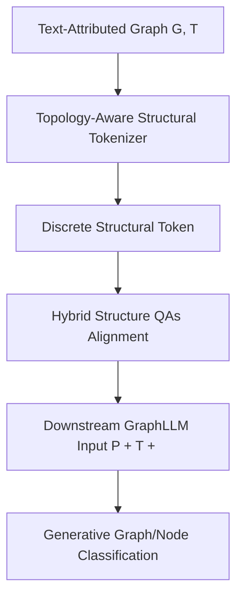

# <SOG$_k$>: One LLM Token for Explicit Graph Structural Understanding

**Conference**: ICLR2026  
**OpenReview**: [https://openreview.net/forum?id=eXidGkRUFt](https://openreview.net/forum?id=eXidGkRUFt)  
**Code**: https://github.com/Jingyao-Wu/SOG  
**Area**: Graph Learning / GraphLLM  
**Keywords**: structural token, graph structure understanding, GraphLLM, discrete topology encoding, structural hallucination  

## TL;DR
This paper compresses the topology of an entire graph or target node into a single discrete structural token `<SOG$_k$>` that coexists with the native vocabulary of the LLM. By aligning this token with text tokens through structural QA, the method significantly enhances the graph structural understanding of LLMs in molecular graph and node classification tasks with minimal token overhead.

## Background & Motivation
**Background**: When LLMs process text-attributed graphs, a common paradigm is to treat the LLM as a predictor. Task instructions and node/graph text attributes are input, and the model directly generates categories or answers. The problem is that graphs are not naturally sequential, so topological relationships must be converted into a format acceptable by the LLM. Existing GraphLLM methods generally fall into two categories: Graph-to-Text, which rewrites edges and adjacency lists into natural language, and Graph-to-Embedding, which uses GNNs or projectors to compress graphs into continuous embeddings as soft prompts.

**Limitations of Prior Work**: The advantage of Graph-to-Text is its alignment with the language space, but it comes at a high token cost. For even moderately large graphs, edge lists and neighborhood descriptions can overwhelm the context window. Furthermore, sensitivity to the narrative order of nodes and edges leads to varying judgments, termed "structural hallucination." Graph-to-Embedding is token-efficient but projects graph representations near LLM token embeddings. These continuous vectors are not discrete tokens in the vocabulary, often leading to a spatial misalignment with native language tokens; the model may "see a vector" without knowing which topological pattern it represents.

**Key Challenge**: Graph structural inputs must simultaneously satisfy three requirements: complete topological expression, minimal token consumption, and alignment with the LLM's existing token space. Textualized graph structures usually sacrifice efficiency and stability, while soft prompts often sacrifice alignment.

**Goal**: The authors aim to construct a set of special structural tokens $\{<SOG_1>, ..., <SOG_K>\}$ such that each graph is mapped to one `<SOG$_k$>` based on its topology. This token needs to be selective enough to distinguish topological prototypes and reside in the same trainable space as text tokens to collaborate with semantic information like SMILES or task prompts.

**Key Insight**: Instead of long text or purely continuous soft prompts, this paper adopts an approach inspired by discrete codebooks/vector quantization. It first learns structural prototypes through a topology-aware tokenizer and then selects a discrete index for the graph's global structure. Subsequently, structural QAs teach the LLM the similarity and textual descriptions corresponding to these structural tokens.

**Core Idea**: Replace lengthy topological text or continuous graph embeddings with a single selectable discrete structural token `<SOG$_k$>`. By embedding graph structures into the native LLM token space, the method fundamentally alleviates token redundancy and cross-modal misalignment.

## Method

### Overall Architecture
The method consists of a three-stage Graph-to-Token pipeline. The first stage extracts pure topology from text-attributed graphs, adds relative position attributes via hierarchical traversal, and maps the structure to a structural token using a GNN and a discrete codebook. The second stage constructs task-agnostic Hybrid Structure QAs to teach the LLM the relationships, similarities, and textual mappings of structural tokens. The third stage inputs task prompts, text attributes, and the `<SOG$_k$>` into the LLM for generative classification.

The core innovation is that the compressed representation remains a discrete token. The LLM vocabulary is expanded to $V' = V \cup \{<SOG_1>, ..., <SOG_K>\}$. For a given graph, the input consists of the task prompt $P$, text attributes $T$, and the structural token `<SOG$_k$>`. The output is generated as $O = M(\{P, T, <SOG_k>\}\mid G; V', \Theta)$. Thus, structural information is an explicit symbol that the LLM can attend to, compare, and generate.

### Key Designs
**1. Topology-Aware Structural Tokenizer: Selecting Highly Selective Discrete Tokens**

To address the lack of stable semantics in node numbering, the method selects an anchor node (e.g., based on degree) and assigns structural attributes based on hop distance and importance ranking relative to the anchor (e.g., "first-hop neighbor #1"). This transforms arbitrary numbering into spatial coordinates, reducing structural hallucinations caused by permutation variance.

A text encoder $f_T(\cdot)$ converts these attributes into initial node features $X_s$, and a virtual global node is added. A GNN $f_G(\cdot)$ produces structural hidden representations $H_s=f_G(X_s)$, where the global node represents the entire graph. A structural codebook $C=\{c_1,...,c_K\}$ is introduced, and the nearest codebook entry is selected: $k = \arg\min_j \|h_s^i-c_j\|_2^2$. The graph finally uses the global node's vocabulary index, becoming `<SOG$_k$>`.

**2. Self-supervised Topology Reconstruction: Ensuring Codebook Fidelity**

To prevent discrete tokens from becoming mere classification shortcuts, the tokenizer is constrained by self-supervised topology reconstruction. Selected codebook entries are passed through a light decoder $f_q(\cdot)$ to reconstruct node features $\hat{X}$, and the adjacency matrix is reconstructed via $\hat{A}=\hat{X}\hat{X}^T$. The objective includes reconstruction error, update loss, and commitment loss:

$$
\mathcal{L}=\|A-\hat{A}\|_F^2 + \|sg[H_s]-z_e(H_s)\|_2^2 + \beta\|H_s-sg[z_e(H_s)]\|_2^2.
$$

$sg[\cdot]$ denotes the stop-gradient operation. This ensures the discrete representation retains topology and keeps continuous GNN representations aligned with the discrete codebook.

**3. Hybrid Structure QAs: Aligning `<SOG$_k$>` with the Text Token Space**

To give the LLM structural semantics, three types of task-agnostic QAs are used:
1.  **k-nearest token neighbor matching**: Identify the nearest neighbor tokens in the structural vector space.
2.  **True/false structure similarity judgment**: Determine if two tokens represent similar structures based on cosine similarity thresholds.
3.  **Description-token pair matching**: Generate the corresponding structural token given a textualized topological description.

During training, existing text token embeddings are frozen. Only the new structural token embeddings and LoRA parameters are updated to obtain context-aware structural adaptation.

**4. Downstream Generative Classification**

In the downstream stage, the system prompt defines the task, and the user prompt includes $P$, $T$, and `[Structural Token] <SOG$_k$>`. The training objective remains the auto-regressive loss for generating ground-truth labels: $\mathcal{L}=-\sum_t \log p_\Theta(y_t\mid y_{<t}, P, T, <SOG_k>)$.

### Loss & Training
1.  **Tokenizer Training**: Uses a two-layer GCN with a codebook size of $K=256$. Adam optimizer is used with a warm-up phase for the GCN followed by joint optimization.
2.  **QA Alignment**: LLaMA2-7B-chat and Llama-3.2-3B-Instruct are used as backbones. Only the structural token embeddings are optimized via LoRA ($rank=16$) with AdamW.
3.  **Task-Specific Fine-tuning**: For graph-level classification, the model generates binary labels. Resampling strategies (e.g., 1:1 minority oversampling) are applied for imbalanced datasets like MoleculeNet. For node classification, 2-hop ego-graphs are sampled to generate local structural tokens.

## Key Experimental Results

### Main Results
Graph-level experiments on MoleculeNet (BBBP, Tox21, ClinTox, HIV, BACE) using AUC-ROC:

| Backbone / Method | BBBP | Tox21 | ClinTox | HIV | BACE |
|--------|------|------|---------|-----|------|
| GPT-4 zero-shot | 61.5 | 55.2 | 51.6 | 65.9 | 62.5 |
| Galactica-120B zero-shot | 66.1 | 68.9 | 82.6 | 74.5 | 61.7 |
| LLaMA3-3B LoRA SFT | 60.2 ± 1.2 | 50.8 ± 0.8 | 63.8 ± 2.8 | 51.5 ± 0.7 | 50.5 ± 2.9 |
| LLaMA3-3B `<SOG$_k$>` | 76.9 ± 3.1 | 83.4 ± 3.3 | 85.5 ± 3.7 | 75.7 ± 1.6 | 63.3 ± 4.2 |
| LLaMA2-7B `<SOG$_k$>` | 66.4 ± 2.7 | 72.4 ± 3.1 | 94.3 ± 0.1 | 83.2 ± 1.9 | 98.4 ± 0.8 |

Node-level experiments on Cora and Pubmed (Accuracy/Micro-F1):

| Method | Cora Acc | Cora F1 | Pubmed Acc | Pubmed F1 |
|------|----------|---------|------------|-----------|
| GPT-4o | 68.62 | 68.49 | 77.96 | 71.79 |
| Ours LLaMA3-3B | 91.58 | 78.62 | 97.46 | 85.50 |
| Ours LLaMA2-7B | 88.80 | 71.28 | 96.27 | 89.64 |

### Ablation Study
Ablations confirm that correctly mapped structural tokens are essential compared to removing tokens, using a static token, or using a random token.

| Model | Configuration | BBBP | Tox21 | ClinTox | HIV | BACE |
|------|------|------|------|---------|-----|------|
| LLaMA3-3B | w/o Structural Token | 61.2 | 72.3 | 81.8 | 53.0 | 53.2 |
| LLaMA3-3B | Static Structural Token | 60.7 | 67.8 | 52.5 | 54.6 | 54.3 |
| LLaMA3-3B | Random Structural Token | 57.3 | 62.2 | 52.8 | 55.3 | 55.8 |
| LLaMA3-3B | Ours | 76.9 | 83.4 | 85.5 | 75.7 | 63.3 |

### Key Findings
- **Alignment Gains**: Discrete symbols outperform soft prompts on smaller models (3B), where continuous space misalignment is more detrimental.
- **Interpretability**: Molecules sharing the same Bemis-Murcko scaffold tend to map to the same structural token.
- **Scalability**: The method successfully captures local topological patterns for node classification via ego-graphs.
- **Vocabulary Size**: $K=256$ provides an optimal balance between structural discrimination and generalization.

## Highlights & Insights
- Representing a graph structure as a "word" is a clean solution that avoids context window bloat and modal misalignment.
- The anchor-based relative coordinate system effectively addresses the LLM's sensitivity to node/edge permutations.
- Hybrid Structure QAs serve as a critical bridge, providing the LLM with the necessary semantic context for the new discrete tokens.
- Performance on 3B/7B models suggests that proper structural representation is more effective than simply increasing model parameters.

## Limitations & Future Work
- **Graph Diversity**: Focus is primarily on MoleculeNet; performance on heterogeneous or massive knowledge graphs needs verification.
- **Information Bottleneck**: A single token might not capture all task-relevant details for complex graphs.
- **Engineering Overhead**: Requires training GNNs, constructing QAs, and expanding the LLM vocabulary.
- **Instructional Stability**: Description-token matching can sometimes be unstable; future work may explore curriculum learning.

## Related Work & Insights
- **Compared to Graph-to-Text**: `<SOG$_k$>` is much more token-efficient and stable regarding permutation.
- **Compared to Soft Prompt**: Discrete tokens avoid the misalignment issue where continuous vectors are "foreign" to the LLM's native vocabulary.
- **Inspiration**: The "graph vocabulary" concept could be extended to multi-granularity tokens or compositional structural tokens.

## Rating
- **Novelty**: ⭐⭐⭐⭐⭐ (Explicit discretization of entire graphs into LLM tokens is highly distinctive.)
- **Experimental Thoroughness**: ⭐⭐⭐⭐☆ (Strong results on standard benchmarks, though lacks massive graph verification.)
- **Writing Quality**: ⭐⭐⭐⭐☆ (Clear structure and well-formulated problems.)
- **Value**: ⭐⭐⭐⭐⭐ (Provides a robust path for graph-language integration.)

<!-- RELATED:START -->

- **GraphText**: A previous SOTA using natural language for graph representation.
- **LLaGA**: A representative of Graph-to-Embedding projector-based methods.
- **VQGraph**: Explores discrete quantization within the graph domain.

<!-- RELATED:END -->

## Related Papers

- [\[NeurIPS 2025\] The Underappreciated Power of Vision Models for Graph Structural Understanding](../../NeurIPS2025/graph_learning/the_underappreciated_power_of_vision_models_for_graph_structural_understanding.md)
- [\[ICLR 2026\] Entropy-Guided Dynamic Tokens for Graph-LLM Alignment in Molecular Understanding](entropy-guided_dynamic_tokens_for_graph-llm_alignment_in_molecular_understanding.md)
- [\[ICLR 2026\] Towards Improved Sentence Representations using Token Graphs](towards_improved_sentence_representations_using_token_graphs.md)
- [\[ICLR 2026\] One for Two: A Unified Framework for Imbalanced Graph Classification via Dynamic Balanced Prototype](one_for_two_a_unified_framework_for_imbalanced_graph_classification_via_dynamic_.md)
- [\[ICLR 2026\] SAGA: Structural Aggregation Guided Alignment with Dynamic View and Neighborhood Order Selection for Multiview Graph Domain Adaptation](saga_structural_aggregation_guided_alignment_with_dynamic_view_and_neighborhood_.md)

<!-- RELATED:END -->
