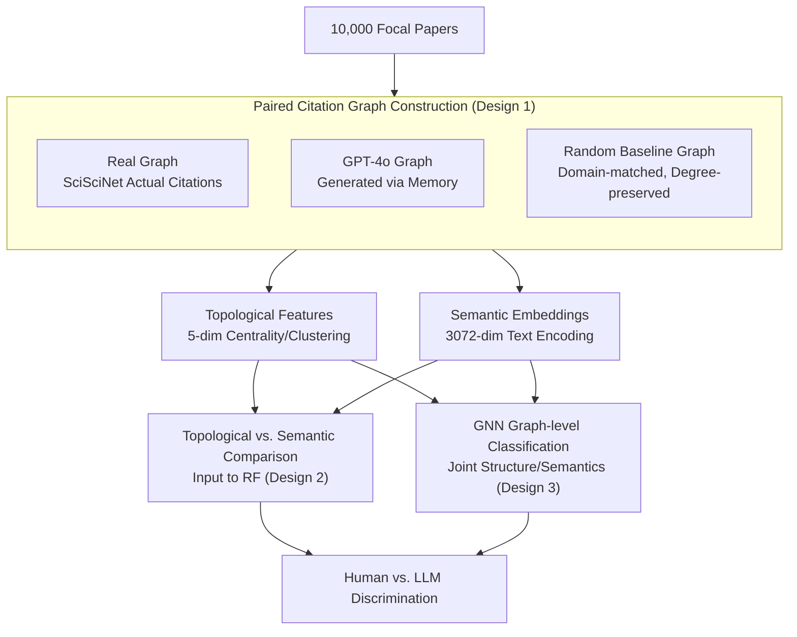

# Structurally Human, Semantically Biased: Detecting LLM-Generated References with Embeddings and GNNs

**Conference**: ICLR 2026  
**arXiv**: [2601.20704](https://arxiv.org/abs/2601.20704)  
**Code**: None  
**Area**: AI Safety / Graph Learning  
**Keywords**: LLM Citation Detection, Citation Graphs, Graph Neural Networks, Semantic Embeddings, Academic Integrity

## TL;DR
By constructing paired citation graphs for 10,000 papers (Human vs. GPT-4o Generated vs. Random Baseline), it is found that LLM-generated references are nearly indistinguishable from human ones in terms of graph topology (RF achieves only 60% accuracy). However, they can be effectively detected using semantic embeddings (RF 83%, GNN 93%), indicating that LLMs precisely mimic citation topology while leaving detectable semantic fingerprints.

## Background & Motivation

**Background**: LLMs are increasingly utilized to synthesize scientific knowledge, draft literature reviews, and suggest references. Prior research indicates that LLM-generated references resemble human ones on coarse-grained metrics (title length, team size, citation count) but exhibit systematic biases (intensified Matthew Effect, preference for recent papers, reduced self-citations).

**Limitations of Prior Work**: It remains unclear whether LLM-generated reference lists can be reliably distinguished from human ones. Auditing individual citations (e.g., LLM-Check) is insufficient to capture patterns at the list level.

**Key Challenge**: Do LLMs truly understand citation structures, or do they merely perform surface-level mimicry? If the topological structures are identical, where do the differences lie?

**Goal**: Systematically evaluate the differences between LLM-generated and human citation graphs across structural and semantic dimensions and develop detection methodologies.

**Key Insight**: A progressive modeling strategy—moving from interpretable graph structural features to semantic embeddings and then to GNNs—to deconstruct the contributions of topology vs. semantics.

**Core Idea**: LLM references are "structurally human but semantically biased"—detection should target content signals rather than the graph structure.

## Method

### Overall Architecture

The methodology follows a layer-by-layer controlled experiment: first, three directly comparable citation graphs are constructed for the same set of focal papers (Human/Real, GPT-4o Generated, and Domain-matched Random Baseline). Pure topological features and pure semantic embeddings are extracted from each graph and fed into classifiers separately to determine which signal supports "Human vs. LLM" discrimination. Detectors evolve from interpretable Random Forests to GNNs capable of jointly utilizing structure and semantics, thereby isolating topological and semantic contributions.

### Key Designs

**1. Paired Citation Graph Construction: Ensuring Comparability Across Sources**

The most significant confounding factor in determining whether LLM citations are "human-like" is that differences in topic and field naturally lead to variations in citation structure. To address this, 10,000 focal papers are sampled from SciSciNet. For each, three citation graphs sharing the same ego node are built: edges in the "Real Graph" come from actual SciSciNet citations; the "GPT-4o Graph" is generated solely from metadata (title, abstract, authors) based on the model's internal memory without retrieval; and the "Random Baseline Graph" is generated by uniformly reshuffling citations within the same field while preserving the degree distribution. Because these graphs share focal nodes and scale, any discriminative power is purely attributable to "Human vs. Generated" differences rather than topical distribution.

**2. Topological vs. Semantic Comparison: Locating the Discriminative Signal**

To determine if LLMs understand citation structure or merely mimic it, two types of signals are strictly isolated and fed into classifiers. The topological path uses five graph structural metrics—degree centrality, closeness centrality, eigenvector centrality, clustering coefficient, and edge count. The semantic path uses OpenAI `text-embedding-3-large` to encode the text of each node into a 3072-dimensional embedding, aggregated into a graph-level representation. The disparity in accuracy between these two paths quantifies the information carried by topology vs. content. In experiments, the topological path achieves only 0.608 (near random), while the semantic path reaches 0.835, supporting the "structurally human, semantically biased" conclusion. To exclude the possibility that the 3072-dimensional capacity alone drives this, the authors replaced real embeddings with random ones, which dropped accuracy to $\approx 0.50$.

**3. GNN Graph-level Classification: Pushing the Upper Bound**

Random Forests use aggregated graph-level features and lose relational information between nodes. This study employs GCN, GAT, GIN, and GraphSAGE for graph-level binary classification. Node features can be 5-dimensional structural attributes or 3072-dimensional semantic embeddings. After message passing and graph-level readout, the model outputs "Human vs. Generated." When using semantic embeddings, GNNs push accuracy from the RF's 0.835 to 0.93, validating that the graph structure amplifies semantic signals. In contrast, GNNs using only structural features remain at $\approx 0.55$.

### Loss & Training

GNNs are trained using the Adam optimizer with a 70/15/15 train/val/test split, ensuring class balance to avoid bias. Robustness is verified via two-layered cross-validation: the generator side uses both GPT-4o and Claude Sonnet 4.5 (models trained on GPT and tested on Claude maintained $\approx 0.72$ accuracy); the embedding side uses both SPECTER and OpenAI models to confirm that the semantic fingerprint is not encoder-dependent.

## Key Experimental Results

### Main Results

| Method | Human vs. GPT | Human vs. Random | GPT vs. Random |
|------|----------|-------------|--------------|
| RF (Structural Features) | 0.608 | 0.896 | 0.928 |
| RF (Semantic Embeddings) | **0.835** | 0.908 | 0.953 |
| GNN (Structural Features) | $\approx 0.55$ | $\approx 0.90$ | $\approx 0.93$ |
| GNN (Semantic Embeddings) | **0.93** | $\approx 0.95$ | $\approx 0.97$ |

### Ablation Study

| Configuration | Human vs. GPT Accuracy | Note |
|------|----------------|------|
| GNN + Embedding | 93% | Best |
| RF + Embedding | 83.5% | Large semantic contribution |
| RF + Structure | 60.8% | Near random |
| GNN + Structure | $\approx 55% $ | Structure insufficient |
| Random Embedding Replacement | $\approx 50% $ | Confirms non-dimensionality effect |
| Cross-generator (GPT Train $\rightarrow$ Claude Test) | $\approx 72% $ | Generalizes to other LLMs |

### Key Findings
- **Topology is nearly indistinguishable**: GPT citation graphs overlap significantly with real ones in centrality and clustering coefficients; RF achieves only 60% accuracy.
- **Semantic fingerprints are detectable**: Embedding features increase accuracy from 60% to 83% (RF) and 93% (GNN).
- **Random baselines are easy to distinguish**: Human vs. Random $> 89\%$, GPT vs. Random $93\%+$, indicating GPT generates structurally plausible citations.
- **Cross-LLM Generalization**: Classifiers trained on GPT-4o maintain 72% accuracy on Claude.
- **Dimensionality effect ruled out**: Replacing embeddings with random vectors drops accuracy to 50%, confirming discriminative power comes from semantic structure.

## Highlights & Insights
- The **"Structurally human, semantically biased"** finding provides direct guidance for auditing and debiasing strategies, suggesting a focus on content signals rather than graph topology.
- The **domain-matched random baseline** design is rigorous, controlling for topic distribution via intra-field reshuffling.
- The **progressive analysis** (Structure $\rightarrow$ Embedding $\rightarrow$ GNN) clearly demonstrates the contribution of each layer.

## Limitations & Future Work
- Only parameterized generation (without RAG) was tested; real-world applications may use retrieval-augmented generation.
- Specific dimensions of semantic bias (e.g., recency bias, prestige bias) were not analyzed in depth.
- Which specific dimensions of the 3072-D embedding drive the discrimination?
- This study focuses on binary classification and does not explore multi-class scenarios (e.g., partially LLM-generated references).

## Related Work & Insights
- **vs. LLM-Check**: While LLM-Check audits the existence of single citations, this work evaluates graph-level patterns of entire reference lists.
- **vs. Algaba et al.**: Previous work identified coarse-level consistencies; this work achieves high-accuracy automated detection through GNNs and embeddings.

## Rating
- Novelty: ⭐⭐⭐⭐ The combination of citation graphs and GNNs is novel, though the analysis framework is straightforward.
- Experimental Thoroughness: ⭐⭐⭐⭐⭐ 10,000 graphs, dual LLMs, dual embedding models, multiple baselines, and random embedding controls make it very comprehensive.
- Writing Quality: ⭐⭐⭐⭐ Excellent visualization and clear step-by-step analysis.
- Value: ⭐⭐⭐⭐ Significant implications for academic integrity and AI-assisted writing.

<!-- RELATED:START -->

## Related Papers

- [\[ICLR 2026\] Bridging ML and Algorithms: Comparison of Hyperbolic Embeddings](bridging_ml_and_algorithms_comparison_of_hyperbolic_embeddings.md)
- [\[ICML 2025\] LLM Enhancers for GNNs: An Analysis from the Perspective of Causal Mechanism Identification](../../ICML2025/graph_learning/llm_enhancers_for_gnns_an_analysis_from_the_perspective_of_causal_mechanism_iden.md)
- [\[ACL 2026\] Graph-Based Alternatives to LLMs for Human Simulation](../../ACL2026/graph_learning/graph-based_alternatives_to_llms_for_human_simulation.md)
- [\[ICLR 2026\] Glance for Context: Learning When to Leverage LLMs for Node-Aware GNN-LLM Fusion](glance_for_context_learning_when_to_leverage_llms_for_node-aware_gnn-llm_fusion.md)
- [\[ICLR 2026\] On the Expressive Power of GNNs for Boolean Satisfiability](on_the_expressive_power_of_gnns_for_boolean_satisfiability.md)

<!-- RELATED:END -->
