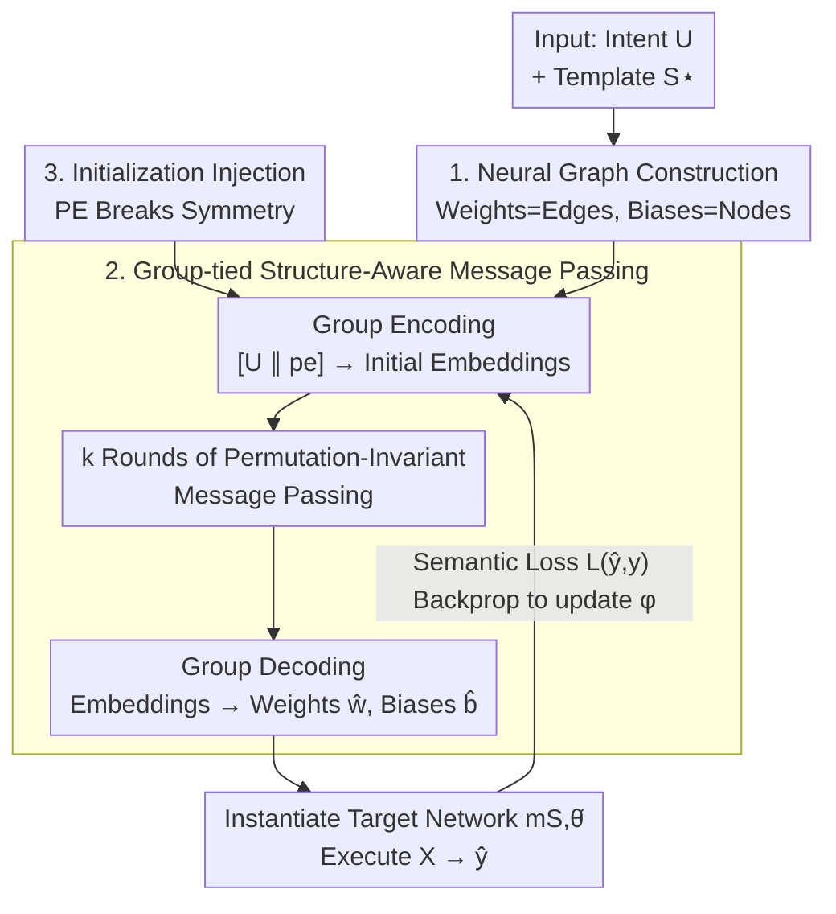

# Structure-Aware Graph Hypernetworks for Neural Program Synthesis

**Conference**: ICLR 2026  
**OpenReview**: [https://openreview.net/forum?id=x7zOzUwtR7](https://openreview.net/forum?id=x7zOzUwtR7)  
**Code**: Yes (App. F promises open-source code and datasets)  
**Area**: Graph Learning / Hypernetworks / Neural Program Synthesis / Meta-Learning  
**Keywords**: Neural Program Synthesis, Hypernetworks, Neural Graphs, Permutation Symmetry, OOD Generalization

## TL;DR
This paper recasts "program synthesis" as continuous optimization within the weight space of a fixed network architecture and proposes Meta-GNN, a structure-aware graph hypernetwork. By representing the target network as a "neural graph" (weights as edges, biases as nodes) and tying encoding/message/decoding parameters within permutation equivalence groups, it collapses redundant supervision caused by neuron permutations. This enables direct one-shot generation of entire weight sets from user intent and significantly improves OOD generalization to unseen intents.

## Background & Motivation

**Background**: Traditional program synthesis models the task as a combinatorial search in symbolic space (AST, DSL) to find programs satisfying user intent through constraint solving. Representative systems like SKETCH, SyGuS, and CEGIS provide strong correctness guarantees but are hindered by two significant challenges.

**Limitations of Prior Work**: First is **search**—discrete program spaces require expensive enumeration where syntax and semantics are entangled; a minor change can break both, resulting in a piecewise-constant objective surface. Second is **verification**—correctness is a hard True/False judgment that provides no gradient signal regarding how "close" a program is to being correct. These issues make symbolic synthesis difficult to scale beyond small DSLs or short code snippets.

**Key Challenge**: The fundamental bottleneck lies in "discrete symbols + hard verification." As long as search occurs in discrete token space with binary supervision, it lacks both gradients and graded improvement signals.

**Goal**: Ours proposes a **continuous relaxation**—treating a neural network with structure $S$ and weights $\theta$ as an executable program, defining a "Neural Program" (NeuroP) as the pair $(S, \theta)$. By fixing a template architecture $S^\star$, synthesis reduces to "generating weights $\theta$ directly from user intent $U$." Syntax is inherently valid by construction, and semantics are provided by the differentiable forward pass $\mathrm{exec}(S^\star,\theta,X)$. The trade-off is sacrificing exact correctness for gradient optimization and dense learning signals.

**Key Insight**: Within this framework, the most difficult problem is learning a **reliable $U\to\theta$ mapping that extrapolates to intents unseen during training** (true OOD generalization). Traditional HyperNetworks are a natural tool but treat the target network as a black box, outputting a **flat weight list** while ignoring structural and neuron permutation symmetries. Since a single function can have many equivalent weight implementations (e.g., permuting hidden neurons), flat hypernetworks treat these equivalent solutions as distinct targets, resulting in fragmented supervision and degraded OOD generalization.

**Core Idea**: Replace the flat hypernetwork with a **structure-aware graph hypernetwork**. This decodes the target architecture into its computational graph, ties encoder/decoder parameters within permutation equivalence groups, and performs symmetry-aware message passing along the graph structure. This collapses equivalence classes into a single representation, reducing the search space without losing expressivity.

## Method

### Overall Architecture

The mechanism aims to generate a complete set of weights $\hat\theta=M_\phi(U)$ in a single forward pass given a user intent $U$ and a template architecture $S^\star$. The instantiated network $m_{S,\hat\theta}$ then implements the behavior desired by $U$, ideally generalizing to unseen intents (zero-shot at deployment).

The pipeline converts the template $S^\star$ into a **neural graph** $G^\star=(V,E)$ where biases are nodes and weights are edges. The meta-learner $M_\phi$ contains three shared modules: an encoder $f_{\mathrm{enc}}$, a message function $f_{\mathrm{msg}}$, and a decoder $f_{\mathrm{dec}}$, all **shared** within permutation equivalence groups. The encoder maps intent and positional encodings to initial embeddings; $k$ rounds of **permutation-invariant aggregation** message passing follow. Finally, the decoder maps embeddings back to scalars for weights $\hat w_{ij}$ and biases $\hat b_i$. Semantic loss $L(\hat y,y)$ gradients backpropagate through the entire pipeline to update $\phi$.

Three meta-architectures are compared: **Meta-MLP** (structure-agnostic flat weights), **Meta-gMLP** (group-tied encoding with a global mixer), and **Meta-GNN** (group-tied with local message passing).

### Key Designs

**1. Neural Graph Construction: Converting computational structure into a graph**
Prior hypernetworks treat target networks as black boxes, which fragments supervision. This design encodes structure by representing $S^\star$ as a directed multigraph $G^\star=(V,E)$. Node automorphisms $\phi:V\to V$ (respecting node types like input/hidden/output) induce parameter permutations that preserve network functionality. Message passing GNNs on $G^\star$ are provably equivariant to these induced permutations. This representation generalizes beyond MLP/CNN to **full Transformers**, including multi-head attention and residual paths.

**2. Group-tied Structure-Aware Message Passing: Parameters shared within equivalence groups**
This is the Meta-GNN engine. Parameters for encoding, messaging, and decoding are **tied and shared** within permutation equivalence groups $g\in G$ in a DeepSet style, using permutation-invariant aggregation. Initial embeddings are generated as:
$$h^0_V(i)=f\big([\,U\,\|\,p_V(i)\,];\,\phi^{g_V(i)}_{\mathrm{enc}}\big),\qquad h^0_E(i,j)=f\big([\,U\,\|\,p_{E(i,j)}\,];\,\phi^{g_{E(i,j)}}_{\mathrm{enc}}\big).$$
Message passing across $k$ rounds updates embeddings using $\phi_{\mathrm{msg}}$. This ensures that functionally identical weight sets are treated as the same target during learning, reducing search space and utilizing graph topology.

**3. Positional Encoding Injection at Initialization: Balancing equivariance and deployment**
Strict equivariance leads to a deployment dead-end: because hidden units are interchangeable, there is no canonical way to assign generated scalars to specific tensor slots. Borrowing from Transformers, authors inject **positional encodings at initialization only** to break symmetry. These do not enter the internal logic of $f_{\mathrm{enc}}/f_{\mathrm{msg}}/f_{\mathrm{dec}}$, so the learning process remains permutation-invariant while allowing generated weights to inhabit stable slots for execution.

### Key Experimental Results

### Main Results
Evaluated on SUMFIRST-$n$, ADDMOD-$p$ ($y=(a+b)\bmod p$), and 1D-ARC. The metric is the percentage of solved instances (exact match). **OOD Test (unseen intents)** accuracy:

| Task | direct | Meta-MLP | Meta-gMLP | Meta-GNN |
|------|--------|----------|-----------|----------|
| SUMFIRST-$n$ | 0.140 | 0.145 | 0.344 | **0.866** |
| ADDMOD-$p$ | 0.682–0.699 | 0.947 | 0.883 | 0.943 |
| 1D-ARC (mixed) | 0.603 | 0.625 | 0.610 | **0.713** |

While all meta-models approach 100% on IID tests, Meta-GNN significantly leads in OOD generalization for complex structures like SUMFIRST and 1D-ARC.

### Ablation Study
The three meta-architectures demonstrate the impact of structural awareness:

| Configuration | Structural Awareness | OOD Performance | Description |
|------|---------|---------|------|
| Meta-MLP | None (flat weights) | 0.145 (SUMFIRST) | Classic Hypernetwork; ignores structure/symmetry. |
| Meta-gMLP | Group-tied only | 0.344 (SUMFIRST) | Tied encoding; global mixer becomes bottleneck. |
| Meta-GNN | Group-tied + Graph | 0.866 (SUMFIRST) | Local messaging + tying; massive OOD gain. |

### Key Findings
- **Structural Priors are Critical for OOD**: Treating the target as a neural graph and collapsing redundancy through message passing prevents fragmented supervision.
- **Scaling Stability**: Meta-gMLP fails as target size increases due to its global mixer; Meta-GNN remains stable via local message passing.
- **Algorithm Learning**: In ADDMOD-$p$, synthesized weights for unseen primes recover "clock" representations (PCA $R^2 > 0.94$), proving the meta-learner internalizes the algorithm rather than memorizing instances.

## Highlights & Insights
- **Programs as Weight Vectors**: The NeuroP perspective moves program synthesis into a continuous weight space where syntax is guaranteed and semantics are differentiable.
- **Symmetry as a Lever**: Instead of a constraint, permutation symmetry is used to "collapse" the search space, ensuring more consistent learning signals.
- **Practical Equivariance**: The use of positional encoding only at initialization is a clean engineering solution to the "equivariance vs. slot assignment" problem.

## Limitations & Future Work
- **Benchmark Scale**: Tasks are structured but small; scaling to noisy real-world domains is needed.
- **Architecture Depth**: Target architectures are currently shallow (1-layer Transformers/MLPs).
- **Symbolic Comparison**: Lacks direct comparison with symbolic synthesis (which requires different DSL engineering).
- **Intent Format**: Current intents are simple scalars/categories; natural language or few-shot I/O intents are the next step.

## Related Work & Insights
- **vs. HyperNetworks**: Meta-GNN adds structural awareness and symmetry handling to avoid fragmented supervision.
- **vs. Weight Space Equivariant Nets**: Unlike discriminative models (e.g., DWSNets), Meta-GNN is **generative**, mapping intent to weights.
- **vs. MAML**: Requires zero adaptation at test time; weight generation is entirely zero-shot based on intent.
- **vs. Neuro-Symbolic Synthesis**: Abandons discrete code and DSLs entirely by treating the weight vector itself as the program.

## Rating
- Novelty: ⭐⭐⭐⭐⭐ 
- Experimental Thoroughness: ⭐⭐⭐⭐ 
- Writing Quality: ⭐⭐⭐⭐⭐ 
- Value: ⭐⭐⭐⭐ 

<!-- RELATED:START -->

## Related Papers

- [\[ICLR 2026\] WATS: Wavelet-Aware Temperature Scaling for Reliable Graph Neural Networks](wats_wavelet-aware_temperature_scaling_for_reliable_graph_neural_networks.md)
- [\[ICLR 2026\] Confident Block Diagonal Structure-Aware Invariable Graph Completion for Incomplete Multi-view Clustering](confident_block_diagonal_structure-aware_invariable_graph_completion_for_incompl.md)
- [\[CVPR 2025\] NN-Former: Rethinking Graph Structure in Neural Architecture Representation](../../CVPR2025/graph_learning/nn-former_rethinking_graph_structure_in_neural_architecture_representation.md)
- [\[ICLR 2026\] Global and Local Topology-Aware Graph Generation via Dual Conditioning Diffusion](global_and_local_topology-aware_graph_generation_via_dual_conditioning_diffusion.md)
- [\[NeurIPS 2025\] SSTAG: Structure-Aware Self-Supervised Learning Method for Text-Attributed Graphs](../../NeurIPS2025/graph_learning/sstag_structure-aware_self-supervised_learning_method_for_text-attributed_graphs.md)

<!-- RELATED:END -->
