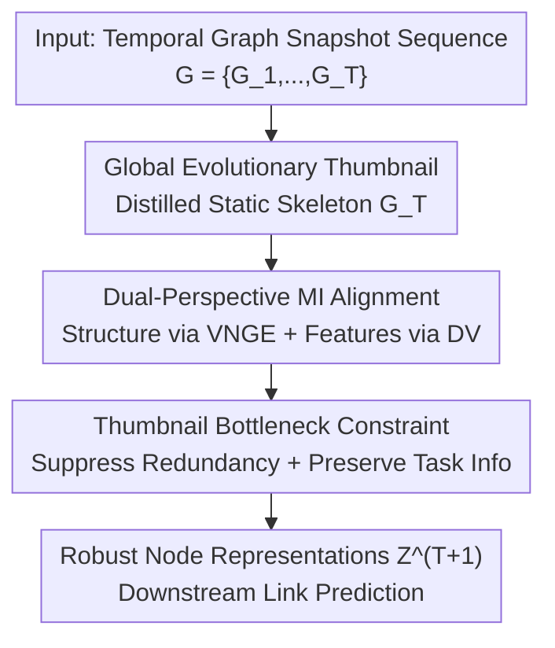

# Temporal Graph Thumbnail: Robust Representation Learning with Global Evolutionary Skeleton

**Conference**: ICLR 2026  
**OpenReview**: [https://openreview.net/forum?id=a4e0zoaiD8](https://openreview.net/forum?id=a4e0zoaiD8)  
**Code**: https://github.com/shiwning/TGT  
**Area**: Graph Representation Learning / Temporal Graphs  
**Keywords**: Temporal graphs, representation robustness, von Neumann graph entropy, information bottleneck, global evolution

## TL;DR
TGT distills an entire temporal graph sequence into a static "thumbnail" (global evolutionary skeleton). It characterizes structural evolution via von Neumann graph entropy and feature evolution via the Donsker-Varadhan mutual information estimator. This thumbnail then serves as an Information Bottleneck (IB) constraint to guide representation learning. On Bitcoin, MathOverflow, and MOOC datasets, it significantly outperforms SOTA in link prediction under both clean and various noisy perturbations, particularly in fast-evolving and heavy-noise scenarios.

## Background & Motivation

**Background**: Temporal graphs are widely used to model systems that evolve over time, such as transportation, recommendation systems, and social networks. Mainstream temporal graph representation learning extends message-passing mechanisms from static graphs to dynamic settings: either by slicing the graph into discrete snapshots for time-series analysis or by modeling changes in node features and topology in a continuous, online manner. In both approaches, node representation contexts are derived by aggregating information from "spatio-temporal neighbors" along the topology.

**Limitations of Prior Work**: Real-world data is often noisy—containing off-topic content, incorrect edge associations, or out-of-order messages due to network latency. Since representations rely entirely on neighbor aggregation, redundant/erroneous node features, spurious/expired edges, and misrecorded timestamps directly contaminate context quality, degrading performance. Existing robust methods follow two paths: (1) **Adaptive neighbor sampling** (e.g., modeling neighbor updates as sequential decision-making via reinforcement learning or modeling noise propagation as Markov chains for edge reconnection); (2) **Historical information assistance** (e.g., mining invariant historical patterns across sequences or capturing temporal correlations using information bottlenecks).

**Key Challenge**: Both paths suffer from a "narrow sampling scope." When neighbors and historical information are simultaneously unreliable, the quality of learned embeddings deteriorates sharply, failing to capture long-range temporal dependencies. The authors attribute the root causes to two points: (a) **Lack of global evolution modeling**—focusing only on local neighbors ignores temporal patterns encoded in continuous dynamics; when local information is insufficient to resist noise, performance collapses. (b) **Lack of effective denoising constraints**—over-denoising distorts critical information, while under-denoising leaves residual noise; this trade-off is difficult to balance without proper constraints.

**Goal**: The problem is decomposed into two sub-problems: (i) How to model a static "thumbnail" from a temporal graph that serves as a "skeleton" carrying global evolutionary features; (ii) How to design effective constraints based on this thumbnail to guide a robust learning process.

**Key Insight**: Analogous to a video cover—a single static image summarizing the content of an entire video. The authors propose that a temporal graph can also yield a static graph (similar to a snapshot) that encapsulates the entire evolution as its "thumbnail." This graph characterizes the global evolutionary skeleton, naturally transcending local sampling ranges and resisting local noise.

**Core Idea**: Use a thumbnail carrying the global evolution skeleton as both a compression of the original graph and an Information Bottleneck constraint. This guides the representation to balance "compressing redundancy/denoising" with "preserving task information."

## Method

### Overall Architecture
The input to TGT is a sequence of discrete-time dynamic graph snapshots $G=\{G_i\}_{i=1}^{T}$. The goal is to produce robust node embeddings $Z^{T+1}\in\mathbb{R}^{n\times k}$ for the next time step for downstream tasks (link prediction, node classification) while remaining stable despite sparse, unreliable, or perturbed features/topology. The pipeline consists of two stages: first, **modeling the thumbnail** $G_T$ to distill the evolution into a static skeleton, then using this thumbnail as an **Information Bottleneck (IB) constraint** to guide representation learning.

The thumbnail maps nodes from each snapshot to thumbnail nodes via a set of assignment matrices $S=\{S_1,\dots,S_T\}$ (where $s^i_{a\alpha}=1$ indicates node $a$ in $G_i$ maps to node $\alpha$ in $G_T$). A weighted conditional likelihood $P(G\mid G_T,S)$ characterizes the "evolution probability of the sequence given the thumbnail," where learnable weights $B^i_a$ quantify the contribution of each snapshot. Thumbnail modeling and the IB constraint each contribute a loss term for joint optimization.

### Key Designs

**1. Global Evolutionary Thumbnail: Distilling Temporal Graphs into a Static Skeleton**

To address the issue of "ignoring global evolution by focusing on local neighbors," TGT explicitly models a static thumbnail $G_T=\{V_{G_T},E_{G_T}\}$ to serve as the evolutionary skeleton of the temporal process. Formally, nodes from each snapshot are mapped to thumbnail nodes via an assignment function $F$ (Eq. 1). The probability of the sequence occurring given the thumbnail and assignments is expressed as a weighted conditional likelihood $P(G\mid G_T,S)$. Since snapshots have temporal dependencies, the joint distribution is modeled as a weighted conditional distribution for each snapshot-thumbnail pair, parameterized by learnable coefficients $B^i_a$ (Eq. 2), where $\mu=\ln\frac{1-P_e}{P_e}$ and $P_e$ is the probability of matching errors. This "cover image" compresses the evolution into a static object that serves as the medium for all subsequent constraints, enabling it to transcend local sampling and resist noise.

**2. Dual-Perspective MI Alignment: VNGE for Structure, DV for Features**

To ensure the thumbnail effectively captures global evolution, TGT aligns it with the original sequence using Mutual Information (MI) from two perspectives. For structural evolution, **von Neumann graph entropy (VNGE)** is used because it consistently tracks topological changes and encodes structural features. Structural entropy of the thumbnail $H_{VN}$ is calculated via an approximation (Eq. 4, based on in-degree $d^{in}$ and out-degree $d^{out}$), leadind to structural MI:

$$I_s(G_T;G)=H_{VN}(G_T)-\sum_{G_i\in G}B_i\,H_{VN}(G_T\mid G_i),$$

where $B_i$ are learnable weights. For feature evolution, the **Donsker-Varadhan (DV) representation** is used to estimate node feature MI: $I_{DV}(G_T;G)=\sup_{f\in\mathcal{F}}\{\mathbb{E}_P[f(V_G)]-\log\mathbb{E}_Q[e^{f(V_G)}]\}$ (Eq. 6), where $f$ is a learnable neural network. The negative sum of these terms forms the evolution loss $L_{evolution}=-(I_s(G_T;G)+I_{DV}(G_T;G))$ (Eq. 11), maximizing MI for both structure and features.

**3. Thumbnail Bottleneck Constraint: Skeleton-based IB for Controlled Denoising**

To solve the "over- vs. under-denoising" dilemma, TGT treats the thumbnail as an Information Bottleneck: $G_{T}^{IB}=\arg\min_{G_T}\{-I(Y;G_T)+\beta I(G;G_T)\}$ (Eq. 8). **Minimality** is achieved by minimizing the upper bound of $I(G;G_T)$ to suppress redundancy, while **sufficiency** is achieved by maximizing the lower bound of $I(Y;G_T)$ to preserve essential task-related features. Inspired by GIB, the authors approximate the upper bound of $I(G;G_T)$ as a **Thumbnail Bottleneck (TB)** constraint for features ($TB_{G_TX}$) and structure ($TB_{G_TA}$). The feature term approximates the variational distribution $Q(Z^{(l)}_{G_TX})$ as a Gaussian mixture $\sum_k\pi_k\Phi(\mu_{q,k},\sigma^2_{q,k})$ (Eq. 12), while the structural term treats $Q(Z^{(l)}_{G_TA})$ as a Bernoulli distribution measured by KL divergence (Eq. 13). The sufficiency term reduces to cross-entropy $-L_{CE}(w_{out}\cdot Z_{G_TX},Y)$ (Eq. 14).

### Loss & Training
The bottleneck loss is $L_B=-I(Y;G_T)+\beta\big[\sum_{t\in S_A}TB^{(t)}_{G_TA}+\sum_{t\in S_X}TB^{(t)}_{G_TX}\big]$ (Eq. 15), where $S_A, S_X$ are index sets satisfying local dependency assumptions (k-hop, $\Delta t$ window). The total objective is:

$$L=L_B+\lambda\cdot L_{evolution},$$

where $\lambda$ is a Lagrange multiplier (Eq. 16). The backbone utilizes **GAT**: $F$ in Eq. 6 and $P_e$ in Eq. 2 are GAT encoders. Snapshot weights $B^t_a$ are derived from node embeddings via a feed-forward layer and softmax.

## Key Experimental Results

### Main Results
In inductive link prediction under clean settings, TGT leads across three datasets in AUC/AP:

| Dataset | Metric | TGT | Runner-up Baseline | Gain |
|--------|------|------|----------------|------|
| Bitcoin | AUC | **91.41** | 74.47 (JODIE) | +16.94 |
| Bitcoin | AP | **91.01** | 75.50 (JODIE) | +15.51 |
| MathOverflow | AUC | **82.38** | 80.29 (DGIB) | +2.09 |
| MathOverflow | AP | **81.17** | 79.99 (DGIB) | +1.18 |
| MOOC | AUC | **95.42** | 93.06 (DGIB) | +2.36 |
| MOOC | AP | **94.56** | 93.29 (GIB+LSTM) | +1.27 |

Baselines include dynamic GNNs (EvolveGCN, JODIE, DyREP, TGN) and robust/bottleneck methods (DIDA, GIB+LSTM, DGIB). TGT's global evolution modeling is most prominent on Bitcoin (sparse features), improving AUC by nearly 17 points. On MOOC, which has extreme evolution frequency (~13.7k updates/day), TGT maintains a clear lead.

### Robustness Results
Adversarial perturbations injected into training data (AUC, selected from Bitcoin):

| Perturbation Type | Intensity | TGT | Strongest Baseline | Note |
|----------|------|-----|----------------|------|
| Feature (Gaussian) | 50% | **80.62** | 64.20 (DIDA) | Controlled by Eq. 12 |
| Structure (Nettack) | 20% | **80.95** | 65.69 (DIDA) | Controlled by Eq. 13 |
| Temporal (Shuffled) | n=5 | **85.64** | 64.29 (DIDA) | Controlled by Eq. 5 (VNGE) |

TGT's lead over baselines increases under perturbation, confirming that the thumbnail constraint is most effective as noise intensifies.

### Ablation Study

| Configuration | Approach | Effect |
|------|------|------|
| Full (TGT) | Complete model | 91.41 (Bitcoin AUC) |
| W/O VNGE | Replace VNGE with normalized node degree | Significant drop in accuracy and robustness |
| W/O T | Zero out $I_s(G_T;G)$ (Remove structural thumbnail) | Massive degradation in performance |

### Key Findings
- **The thumbnail is the core of denoising**: Removing it (W/O T) leads to heavy performance loss, validating the role of the global skeleton.
- **VNGE is irreplaceable by node degree**: W/O VNGE results in a significant drop, proving that von Neumann graph entropy encodes richer topological evolution than simple degrees.
- **Gains scale with noise**: The more intense the noise or faster the evolution (e.g., MOOC), the more TGT outperforms baselines, supporting the motivation that global modeling compensates when local information fails.

## Highlights & Insights
- **Formalizing the "Video Cover" Analogy**: Distilling a temporal sequence into a static thumbnail via assignment matrices and conditional likelihoods makes an intuitive concept computationally rigorous.
- **Decoupled Structure and Feature Modeling**: Assigning structural evolution to VNGE and feature evolution to DV allows for targeted optimization; VNGE's online computation tracks topological shifts coherently.
- **Thumbnail as a Bottleneck, Not Just Input**: unlike methods that treat extra structures as auxiliary side information, TGT places the thumbnail in the "bottleneck position" of the IB framework. This suppresses redundancy while preserving task info, a paradigm applicable to any scenario needing global priors to constrain local representations.

## Limitations & Future Work
- **Focus on Discrete-Time Dynamic Graphs**: The method is designed for snapshot sequences. Adapting it to continuous-time event streams (e.g., TGN-style updates) is not straightforward.
- **Narrow Task Coverage**: Experiments focus on link prediction. While node classification is mentioned, empirical evidence is limited, requiring further validation of generalizability.
- **Computational and Tuning Overhead**: VNGE computation, DV estimators, and Gaussian mixture/Bernoulli distributions in the TB constraint introduce additional parameters and hyperparameters ($\beta, \lambda, \Delta t$). Scalability analysis is currently limited.

## Related Work & Insights
- **vs. Neighbor Sampling Adaptation**: These methods adjust weights within local scopes but struggle with dense noise or long-range dependencies. TGT's global skeleton transcends local limits.
- **vs. DIDA**: DIDA uses invariant historical patterns for distribution shifts; TGT's use of VNGE to constrain evolutionary trajectories is generally superior on the tested datasets.
- **vs. GIB / DGIB**: While these apply IB to snapshots or historical constraints, TGT uses the thumbnail as the "intermediate variable" for the IB, effectively injecting a global evolutionary prior.

## Rating
- Novelty: ⭐⭐⭐⭐⭐ Formalizing the "thumbnail" as a global skeleton within an IB framework is highly innovative.
- Experimental Thoroughness: ⭐⭐⭐⭐ Complete across 3 datasets and 3 perturbation types, though lacks continuous-time settings.
- Writing Quality: ⭐⭐⭐⭐ Clear logic from motivation to theory; though formula-dense, the explanations are sufficient.
- Value: ⭐⭐⭐⭐ High practical value for heavy-noise or fast-evolving scenarios; the "global prior as local constraint" paradigm is transferable.

<!-- RELATED:START -->

## Related Papers

- [\[ICLR 2026\] EvA: Evolutionary Attacks on Graphs](eva_evolutionary_attacks_on_graphs.md)
- [\[ICLR 2026\] Topology Matters in RTL Circuit Representation Learning](topology_matters_in_rtl_circuit_representation_learning.md)
- [\[ICLR 2026\] On the Trade-off Between Expressivity and Privacy in Graph Representation Learning](on_the_trade-off_between_expressivity_and_privacy_in_graph_representation_learni.md)
- [\[ICLR 2026\] TGM: A Modular and Efficient Library for Machine Learning on Temporal Graphs](tgm_a_modular_and_efficient_library_for_machine_learning_on_temporal_graphs.md)
- [\[ACL 2025\] Disentangled Multi-span Evolutionary Network against Temporal Knowledge Graph Reasoning](../../ACL2025/graph_learning/disentangled_multi-span_evolutionary_network_against_temporal_knowledge_graph_re.md)

<!-- RELATED:END -->
