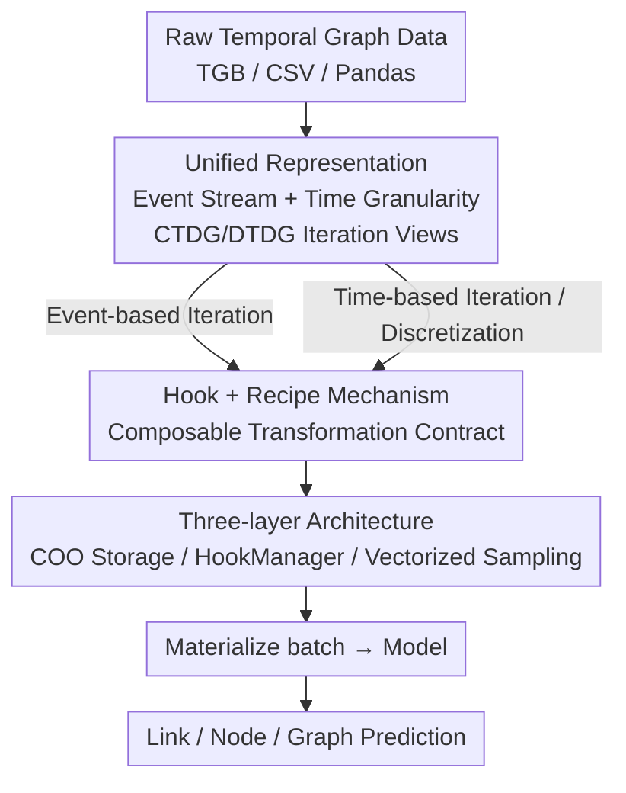

# TGM: A Modular and Efficient Library for Machine Learning on Temporal Graphs

**Conference**: ICLR 2026  
**OpenReview**: [https://openreview.net/forum?id=kFgsebdKje](https://openreview.net/forum?id=kFgsebdKje)  
**Code**: https://github.com/tgm-team/tgm  
**Area**: Graph Machine Learning / Temporal Graphs / Research Framework  
**Keywords**: Temporal Graph Learning, CTDG, DTDG, Hook Mechanism, Graph Discretization

## TL;DR
TGM is the first temporal graph learning research framework to unify Continuous-Time Dynamic Graphs (CTDG) and Discrete-Time Dynamic Graphs (DTDG) under the same data abstraction. By using "event streams + time granularity iteration" to unify both paradigms and a composable Hook mechanism to standardize data transformations, it achieves an average end-to-end training speedup of 7.8× over the widely used library DyGLib, with graph discretization being 175× faster on average.

## Background & Motivation
**Background**: Static graph machine learning already possesses mature infrastructure like PyG and DGL, allowing researchers to focus on model design without reinventing the wheel. However, the rapidly growing field of temporal graphs (networks evolving over time, such as transaction, social, and communication networks) lacks an equivalent library—despite the fact that temporal graph learning requires treating "time" as a first-class citizen.

**Limitations of Prior Work**: Existing temporal graph libraries (DyGLib, TGL, DistTGL, TGLite, PyG Temporal, etc.) are generally "specialized and narrow": most implement only a single algorithm family (e.g., only supporting message-passing-based continuous-time models) and fail to support emerging Transformer-like temporal graph models. Almost none provide time conversion operations, which are crucial for analyzing the temporal resolution of graphs. Furthermore, they generally lack the engineering capabilities required for reproducible research—such as profiling tools, unit testing, and modular abstractions.

**Key Challenge**: The temporal graph field lacks a "standard architecture" like the Transformer in NLP. There exists a fundamental paradigm split—**CTDG (Continuous-Time) treats the graph as a stream of timestamped events, while DTDG (Discrete-Time) treats it as a sequence of static snapshots. These two require completely different data pipelines.** Consequently, the two research paths cannot be directly compared, ideas cannot be easily transferred, and even core operations like "temporal neighbor sampling" and "negative edge construction" are implemented inconsistently across libraries, making fair benchmarking and rapid prototyping difficult.

**Goal**: To build a modular, efficient, research-oriented temporal graph learning library that supports both CTDG and DTDG, provides native support for time granularity conversion, and covers tasks at the link, node, and graph levels.

**Key Insight**: The authors observe that CTDG and DTDG are not two different data types, but rather **two different ways of iterating over the same underlying event stream**. By representing the temporal graph unified as a "time-ordered sequence of events" and using the abstraction of "time granularity" to distinguish between "event-based iteration" and "time-based iteration," both paradigms can be integrated into the same framework.

**Core Idea**: Unify CTDG/DTDG through "event streams + time granularity iteration views," standardize all temporal graph data transformations using a composable contract of "Hooks + Recipes," and maximize efficiency through a three-layer software architecture and full vectorization.

## Method

### Overall Architecture
TGM is not a single model but a research framework for temporal graph learning. Its core is a unified abstraction that hosts both continuous-time and discrete-time paradigms. The workflow is decomposed into three layers: the **Data Layer** stores raw events using immutable, time-sorted COO formats and slices temporal subgraphs via lightweight "Graph Views" for vectorized discretization; the **Execution Layer** utilizes a `HookManager` to transparently apply user-registered Hooks (or preset Recipes) to each batch during data loading, handling transformations such as temporal neighbor sampling, negative edge generation, and device transfer; the **ML Layer** materializes the transformed batches into tensors on the device to feed into models for link, node, or graph-level predictions.

The pivot across these layers is the "Temporal Graph Representation": graphs are defined as time-ordered event sequences (including edge and node events). CTDG and DTDG are merely iteration modes—iterating by a fixed number of events defines CTDG, while iterating by a fixed time granularity defines DTDG. They are bridged by a "discretization" operator.

### Key Designs

**1. Unified Temporal Graph Representation: Treating CTDG and DTDG as Two Iteration Views of the Same Event Stream**

This directly resolves the fundamental conflict of needing two data pipelines. TGM defines a temporal graph as a time-ordered sequence of events $G=\{e_0,\dots,e_T\}$. Each event is either an **edge event** $(t,s,d,x_{edge})$ (an interaction between nodes $s,d$ at time $t$ with edge features) or a **node event** $(t,s,x_{node})$ (node $s$ arriving with new features at time $t$). Node events are a TGM "first," naturally capturing node-level activities like social media posting. Crucially, every temporal graph has a native time granularity $\tau$ (the coarsest unit that distinguishes all timestamps). CTDG and DTDG are iteration modes rather than data types: **CTDG uses an event-order granularity $\tau_{event}$, where each batch contains a fixed number of events** (independent of real time); **DTDG iterates using a granularity $\hat\tau$ coarser than the native one, where each batch corresponds to an equal-length time interval $G|_{[t_i,t_{i+1}]}$ with $|t_{i+1}-t_i|=\hat\tau$**, effectively a snapshot. They are linked by a discretization operator:

$$\psi_r:(G,\tau)\mapsto(\hat G,\hat\tau)$$

It partitions events into equivalence classes based on $\hat\tau$ and applies a reduction operator $r$ (e.g., merging duplicate edges within the interval) to produce a coarse-grained graph $\hat G$ with representative events. This unified representation allows DTDG models (GCN, GCLSTM, etc.) to run directly on tasks that were originally CTDG and allows "snapshot granularity" to be studied as a tunable hyperparameter.

**2. Hooks and Recipes: Standardizing and Automating Data Transformations via require/produce Contracts**

In temporal graph workflows, operations like neighbor sampling, negative edge construction, and evaluation are often implemented inconsistently, which is a major reason fair benchmarking is difficult. TGM abstracts each data transformation into a **Hook** $\phi_{R,P}$, which declares a contract: it requires a set of attributes $R$ on the input batch and produces a new set of attributes $P$, expanding the batch attributes from $A$ to $A\cup P$ (e.g., a "Sampling Hook" requires $\{negatives\}$ and produces $\{neighbors\}$). Multiple Hooks form a **Recipe**, where dependencies are induced by attribute supply and demand:

$$\phi_i\to\phi_j\iff P_i\cap R_j\neq\varnothing$$

As long as the dependency graph is acyclic and every Hook's requirements are met by preceding Hooks ($\forall j,\ R_j\subset\bigcup_{i<j}P_i$), it is a valid Recipe that can be executed in a unique order via topological sorting. This allows complex workflows (like TGAT link prediction or Density of States (DOS) analysis) to be declared with minimal boilerplate, and Hooks can be reused across tasks.

**3. Three-layer Architecture + Full Vectorization: Implementing Unified Abstractions for Extensibility and Efficiency**

The data layer uses **immutable, time-sorted COO storage** with cached indices, enabling binary search on timestamps—critical for "retrieving the most recent neighbors." Above this are lightweight, thread-safe **Graph Views** that only record time boundaries and encode read access using time granularity abstractions, allowing both CTDG and DTDG loading to occur with zero-copying. The **HookManager** in the execution layer manages shared states and resolves Hook dependencies. Hooks process batches chronologically to maintain sequentiality, while event-level operations within a batch (sampling, transfer, negative generation) are **executed in parallel**, a primary source of efficiency. The ML layer materializes batches into tensors on the device and decouples learnable components (memory, attention, link decoder) from graph management. Another key to efficiency is the **fully vectorized recency sampler**—implemented using PyTorch-native circular buffers for cache-friendly access. During evaluation, TGM samples only once per batch (batch-level deduplication), whereas DyGLib repeats sampling for every prediction, making TGM up to 246× faster than DyGLib on TGN/tgbl-wiki.

## Key Experimental Results

### Main Results
Efficiency is the core selling point. In link property prediction, TGM consistently ranks among the top two fastest, significantly outperforming DyGLib and TGL, and trailing only slightly behind the highly specialized TGLite (training seconds per epoch, lower is better):

| Model / tgbl-wiki | TGM | DyGLib | TGLite | TGL |
|------|------|--------|--------|-----|
| TGAT | 6.97 | 41.24 | **4.85** | 10.00 |
| TGN | 10.59 | 63.37 | **6.80** | 23.32 |
| DyGFormer | **17.00** | 75.10 | ✕ | ✕ |
| TPNet | 12.28 | ✕ | ✕ | ✕ |
| GCN (DTDG) | 2.50 | ✕ | ✕ | ✕ |

TGM achieves a 4.4× speedup over DyGLib for DyGFormer and is the only library to support DTDG models (GCN/GCLSTM) and the SOTA TPNet. On node property prediction, it achieves up to a 10× speedup over DyGLib (TGN/tgbn-trade).

The performance of graph discretization is even more striking (latency to discretize into hourly snapshots, in seconds, lower is better):

| Dataset | UTG | TGM | Gain |
|--------|-----|-----|------|
| tgbl-wiki | 1.94 | 0.04 | 49.6× |
| tgbl-subreddit | 8.83 | 0.21 | 41.6× |
| tgbl-lastfm | 19.94 | 0.05 | **433×** |

### Ablation Study
The unified framework of TGM unlocks questions previously difficult to research. Snapshot time granularity has a massive impact on DTDG model link prediction (MRR, higher is better):

| Time Granularity / tgbl-wiki | GCN | T-GCN | GCLSTM |
|------|------|-------|--------|
| Hourly | 0.510 | 0.509 | **0.395** |
| Daily | **0.702** | **0.540** | 0.372 |
| Weekly | 0.393 | 0.330 | 0.322 |

Correctness tests (tgbl-wiki link prediction / tgbn-trade node prediction) show that all models reproduced by TGM fall within the expected range reported by TGB and reveal complementary phenomena: **CTDG models (TPNet/DyGFormer) excel at link prediction, while DTDG models (GCLSTM/GCN) excel at node prediction.**

### Key Findings
- **The 433× discretization speedup comes from full vectorization**: Replacing the cache-unfriendly Python dictionaries in UTG with PyTorch-native vectorized implementations is a victory of engineering rather than algorithm.
- **Granularity is a hyperparameter**: GCN's MRR improves by 30% when switching from weekly to daily snapshots on tgbl-wiki. TGM makes switching granularity as simple as changing one line of code, enabling the systematic study of "snapshot resolution."
- **Batch configuration is an overlooked hyperparameter**: The validation batch size and time units of CTDG models (e.g., TGAT) significantly affect reported MRR—larger batches and coarser time units cause significant performance degradation, suggesting that past evaluation setups might have been unfair.

## Highlights & Insights
- The most significant "aha" moment: TGM points out that CTDG and DTDG, long treated as different data types, are just **two iteration views of the same event stream**. This single-sentence level of abstract refactoring resolves the paradigm split—a classic case of "change the representation, the problem disappears."
- The Hook's require/produce contract + topological sorting essentially writes the data pipeline as **composable functions with type signatures**, where dependency correctness is guaranteed by the framework. This logic can be migrated to any ML pipeline involving multi-step transformations and error-prone state management.
- By elevating "time granularity" and "batch configuration" from hidden implementation details to tunable hyperparameters, TGM directly catalyzes three new research questions (graph property prediction, granularity sensitivity, and batch sensitivity), demonstrating that good infrastructure can unlock new research.

## Limitations & Future Work
- The authors acknowledge that hyperparameter searches were not performed; correctness tests used fixed hyperparameters, so absolute performance figures should not be over-interpreted.
- Efficiency advantages partially depend on the setting where data resides in CPU host memory and is moved to the GPU on demand. The paper also mentions that batch size significantly affects model performance (discussed in the appendix), indicating that "fair comparison" remains an open question.
- As a research-oriented library, TGM emphasizes flexibility and reproducibility, but large-scale distributed / multi-GPU training (the strength of TGL and DistTGL) is not its primary focus. Its scalability in ultra-large graph scenarios remains to be verified.

## Related Work & Insights
- **vs DyGLib**: DyGLib is currently the most popular CTDG research library but lacks modularity, has weak DTDG support, and repeatedly samples neighbors for every prediction during evaluation. TGM uses unified representation + batch-level deduplication + vectorized sampling to be 7.8× faster on average while covering both CTDG/DTDG.
- **vs TGLite**: TGLite is highly optimized for continuous-time message passing models and is slightly faster than TGM on TGAT/TGN, but it only supports a single algorithm family. TGM sacrifices a small amount of speed for broad coverage of Transformer-based, DTDG-based, and TPNet models.
- **vs UTG**: UTG was the first to conceptually demonstrate graph discretization for comparing CTDG/DTDG but is slow, has few datasets, and is not designed for reuse. TGM turns discretization into a fully vectorized operation (up to 433× speedup) and implements this unified logic into a robust, reusable framework.

## Rating
- Novelty: ⭐⭐⭐⭐⭐ The first temporal graph library to unify CTDG/DTDG; the event stream + iteration view refactoring is a genuine conceptual innovation.
- Experimental Thoroughness: ⭐⭐⭐⭐ Efficiency, correctness, and extensibility experiments are all covered across multiple datasets, though absolute performance is limited by fixed hyperparameters.
- Writing Quality: ⭐⭐⭐⭐⭐ Motivation—abstraction—system—experiment logic is clear, with strong formal definitions.
- Value: ⭐⭐⭐⭐⭐ As infrastructure, it lowers the barrier to entry for temporal graph research and unlocks several new research questions.

<!-- RELATED:START -->

## Related Papers

- [\[ICLR 2026\] Efficient Learning on Large Graphs using a Densifying Regularity Lemma](efficient_learning_on_large_graphs_using_a_densifying_regularity_lemma.md)
- [\[ICLR 2026\] Relatron: Automating Relational Machine Learning over Relational Databases](relatron_automating_relational_machine_learning_over_relational_databases.md)
- [\[ICLR 2026\] Revisiting Node Affinity Prediction in Temporal Graphs](revisting_node_affinity_prediction_in_temporal_graphs.md)
- [\[ICLR 2026\] Inductive Reasoning for Temporal Knowledge Graphs with Emerging Entities](inductive_reasoning_for_temporal_knowledge_graphs_with_emerging_entities.md)
- [\[ICLR 2026\] Towards Quantifying Long-Range Interactions in Graph Machine Learning: A Large Graph Dataset and a Measurement](towards_quantifying_long-range_interactions_in_graph_machine_learning_a_large_gr.md)

<!-- RELATED:END -->
