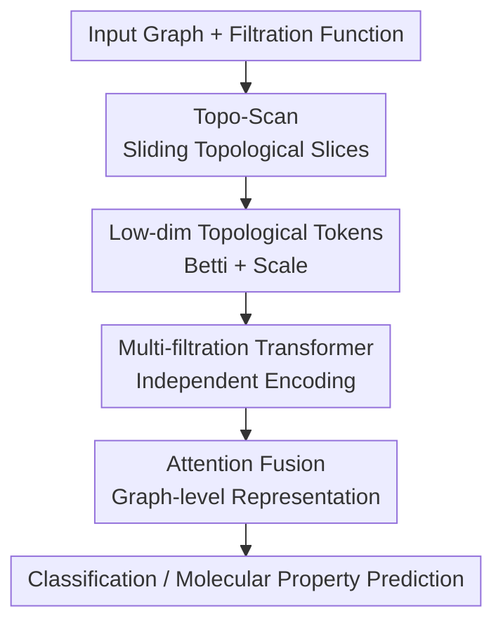

# TopoFormer: Topology Meets Attention for Graph Learning

**Conference**: ICLR2026  
**OpenReview**: [https://openreview.net/forum?id=xanpQt9YZh](https://openreview.net/forum?id=xanpQt9YZh)  
**Code**: https://github.com/joshem163/TOPOFORMER  
**Area**: Graph Learning / Topological Graph Representation Learning  
**Keywords**: Graph Learning, Topological Data Analysis, Topo-Scan, Transformer, Molecular Property Prediction

## TL;DR
TopoFormer segments a graph into a sequence of local topological slices based on node or edge filtration functions. It constructs a short token sequence using Betti numbers and scale statistics from each slice, which is then processed by a Transformer to learn graph-level representations. This approach achieves performance comparable to or exceeding strong baselines in graph classification and molecular property prediction at a lower computational cost.

## Background & Motivation
**Background**: The most common paradigms in graph learning remain GNNs or graph Transformers, which perform message passing, attention, or structural positional encoding at the node level before obtaining graph-level representations via pooling. Another paradigm stems from Topological Data Analysis (TDA), particularly Persistent Homology (PH), which tracks the appearing and vanishing of topological structures (e.g., connected components, cycles) across scales, naturally describing the multi-scale structure of graphs.

**Limitations of Prior Work**: While PH is attractive for graphs, the standard pipeline is heavy: it requires constructing filtrations, computing persistence diagrams, and vectorizing them into features like persistence images, landscapes, or Betti curves. Two problems arise. First, the global reduction for persistence diagrams is computationally expensive, especially when the clique complex is dense, being slowed down by higher-order simplices. Second, diagram vectorization is an additional design choice where different methods significantly affect downstream performance, and models cannot directly leverage the "sequential structure" inherent in the filtration process.

**Key Challenge**: Conventional sublevel filtration on graphs is prone to "early saturation." If high-value or critical nodes enter the subgraph early, most structures are already incorporated under subsequent thresholds, causing late-appearing local cycles or connectivity changes to be drowned out. In other words, while PH aims to capture multi-scale structures, standard cumulative filtration makes the graph increasingly larger, resulting in less information in later tokens. Transformers are excellent at handling sequences, but PH outputs are often compressed into unordered global vectors.

**Goal**: The authors aim to retain the stability and multi-scale inductive bias of topological structures while bypassing the expensive computation and manual vectorization of full persistence diagrams. The objective is to transform graphs directly into short, ordered, and attention-friendly topological token sequences.

**Key Insight**: TopoFormer observes that since graphs already possess edge relationships and clique complex structures, a strictly nested PH process is not strictly necessary to extract useful topological signals. Instead of accumulating the entire graph as thresholds increase, a sliding window can be used to slice the filtration axis, allowing each slice to focus only on the induced subgraph structure within a local range.

**Core Idea**: Topo-Scan is used to segment the graph into ordered topological slices along a filtration function. The $\beta_0$, $\beta_1$, node count, and edge count of each slice are used as tokens, and a Transformer performs graph-level modeling on this topological token sequence.

## Method

### Overall Architecture
The input to TopoFormer is a graph $G=(V,E)$ and one or more node/edge filtration functions (e.g., degree centrality, Ollivier-Ricci curvature, Heat Kernel Signature, or atomic weight in molecules). Topo-Scan first places a set of windows along the filtration axis, where each window induces a local subgraph. These subgraphs are lifted into clique complexes to compute simple topological invariants. These slices are arranged chronologically into a topological sequence, which is then encoded and fused by a Transformer to output graph classification or molecular property predictions.

A single filtration function generates a sequence with a length approximately equal to the number of windows. In the experiments, 20 thresholds and a window width of $m=2$ are commonly used, resulting in 19 slices per filtration. Each slice token is four-dimensional $(\beta_0, \beta_1, |V_i|, |E_i|)$, forming a lightweight topological sequence. Multiple filtration functions correspond to multiple sequences, which are fed into independent Transformers and fused into the final graph representation using learnable weights or attention.

### Key Designs
**1. Topo-Scan: Replacing Cumulative PH with Sliding Slices to Avoid Signal Saturation**

Standard PH sublevel filtration typically uses $\{v\mid f(v)\le \alpha_i\}$ for a threshold $\alpha_i$, making the subgraphs cumulative. Topo-Scan changes this to interval windows: given thresholds $\alpha_0<\alpha_1<\cdots<\alpha_N$ and a window thickness $m$, the $i$-th window selects $V_i=\{v_r\in V\mid \alpha_i\le f(v_r)\le \alpha_{i+m}\}$ and the induced edges $E_i=\{e_{rs}\in E\mid v_r,v_s\in V_i\}$, resulting in a slice graph $G_i=(V_i,E_i)$ and its clique complex $\widehat{G_i}$.

This subtle change significantly alters the information flow. While the left end of a PH window is fixed at the minimum threshold (making it "consume" the whole graph over time), the ends of a Topo-Scan window move together. This ensures only local structures within a specific filtration range are observed, preventing late-appearing node clusters or cycles from being obscured. Toy examples in the paper show that while standard PH yields $\beta_1$ sequences that are nearly all zeros, Topo-Scan captures cycle structures in intermediate slices, demonstrating its ability to reorganize graph topology from an interlevel perspective.

**2. Low-dimensional Topological Tokens: Preserving Sequential Structure over Global Vectors**

Each Topo-Scan slice outputs only four metrics: $\beta_0(\widehat{G_i})$ for the number of connected components, $\beta_1(\widehat{G_i})$ for the number of cycles/holes, and $|V_i|$ and $|E_i|$ for scale and normalization signals. The sequence generated by a filtration function is denoted as $\Gamma(G)=\{(\beta_0^i,\beta_1^i,|V_i|,|E_i|)\}_{i=1}^{T}$.

The authors deliberately avoided complex persistence images or landscapes because the value of Topo-Scan lies in the sequential structure of "how topology changes along the filtration axis." Aggregating all slices into a global vector would prevent the Transformer from distinguishing the context of early, middle, and late structures. While the four-dimensional tokens are simple, placing connectivity, cycles, and scale on the same timeline aligns perfectly with the ordered token interface that attention mechanisms excel at.

**3. Multi-filtration Transformer: Complementary Perspectives from Different Orderings**

Filtering the same graph with different functions reveals different topological hierarchies. Degree centrality emphasizes local connectivity strength, Ollivier-Ricci curvature highlights edge or local geometry, and HKS provides a spectral/diffusion perspective; in molecular tasks, atomic weights provide chemical property sorting. TopoFormer does not simply concatenate these filtrations into a large feature but encodes each sequence through an independent Transformer.

Specifically, the input sequence $x\in\mathbb{R}^{B\times T\times D}$ is mapped to a hidden dimension via an embedding layer, combined with positional encoding $P$, and processed by multi-layer Transformer encoders to obtain a representation $z$. When two topological sequences $X_1, X_2$ and an additional feature $X_3$ (like molecular fingerprints) are present, the model uses two Transformers $T_1, T_2$ and an MLP $M$ to obtain $z_1, z_2, z_3$, respectively, fused via learnable weights: $z_{combined}=\alpha z_1+\beta z_2+(1-\alpha-\beta)z_3$. This allows the model to automatically adjust the contributions of "topological filtrations" and "domain features."

**4. Stable and Parallelizable Computation: Replacing Global Persistent Reduction with Independent Slice Betti Calculations**

Topo-Scan slices are independent and thus parallelizable. For each slice, $\beta_0$ is obtained via union-find on the 1-skeleton, and $\beta_1$ is computed via sparse edge-triangle operators and triangle enumeration, avoiding global boundary matrix reduction of the full persistence diagram. The complexity is $O(L\sum_t(|V_t|+|E_t|+T_t))$ for $L$ filtrations and $k$ slices, where $T_t$ is the number of triangles in the $t$-th slice.

Theoretically, the authors interpret the slice tokens as interlevel Betti numbers of an upper-star filtration. If two node functions $f, g$ experience small perturbations on the same clique complex, the corresponding Topo-Scan sequences satisfy discrete $\ell_1$ stability: $\|\widehat{\beta}_k(G,f)-\widehat{\beta}_k(G,g)\|_1\le C d_B(M_k^f,M_k^g)\le C\|f-g\|_\infty$. This indicates that small changes in filtration signals do not cause drastic jumps in the topological token sequence, providing stability guarantees similar to PH.

### Mechanism
Consider a social graph where each node has a degree centrality. Topo-Scan divides the degree range into 20 thresholds and generates 19 intervals using a window of $m=2$. The first window might only contain local connections between low-degree nodes, resulting in many disjoint components (high $\beta_0$, low $\beta_1$). Intermediate windows incorporate clusters of nodes with medium connectivity; if these nodes form closed loops or community boundaries, $\beta_1$ increases. Later windows focus only on the core structure around high-degree nodes without accumulating the low-degree nodes.

The Transformer reads "how connectivity and cycles evolve when moving along the degree hierarchy" rather than "who node 17 is connected to." If the same graph is filtered by HKS, another sequence provides a structural hierarchy from a spectral diffusion perspective. These sequences are encoded independently and fused, allowing the classification head to determine the social network category or molecular property.

### Loss & Training
For graph classification, the Transformer classifier is trained on topological signature sequences generated by Topo-Scan using 10-fold cross-validation. Key settings include the Adam optimizer, learning rate 0.001, dropout 0.5, weight decay $10^{-4}$, batch normalization, and a Transformer hidden dimension of 32. In experiments, graph classification uses Ollivier-Ricci curvature and HKS filtrations; molecular property prediction and OGBG-MOLHIV use atomic weight and Ollivier-Ricci curvature.

The molecular property prediction version, denoted as TOPOFORMER*, includes an Extended-Connectivity Fingerprints (ECFP) branch alongside the topological branches. ECFP is encoded by a two-layer MLP with the output dimension aligned to the TopoFormer branch, followed by fusion via attention or learnable weighting. Molecular tasks utilize scaffold split AUC and report results from three runs across multiple MoleculeNet datasets.

## Key Experimental Results

### Main Results
The main graph classification table covers 8 common benchmarks. TopoFormer achieves an average deviation from the best value (AvD) of 0.5 and an average rank (AvR) of 1.5. It achieves the best or near-best accuracy on BZR, MUTAG, PROTEINS, IMDB-M, REDDIT-B, and REDDIT-5K, overall outperforming various GNNs, topological methods, and graph kernel methods.

| Dataset | Metric | TopoFormer (Ours) | Strong Baseline / Prev. SOTA | Gain/Gap |
|---------|--------|-------------------|-----------------------------|----------|
| BZR | Accuracy | 92.36±4.11 | DASP 89.40±3.10 | +2.96 |
| MUTAG | Accuracy | 94.68±4.30 | PGOT 92.63±2.58 | +2.05 |
| PROTEINS| Accuracy | 77.64±3.64 | TopoGCL 77.30±0.89 | +0.34 |
| IMDB-M | Accuracy | 55.40±4.78 | TopoGCL 52.81±0.31 | +2.59 |
| REDDIT-B| Accuracy | 91.50±1.89 | EMP 91.03±0.22 | +0.47 |
| REDDIT-5K| Accuracy| 57.99±1.94 | DASP 57.60±1.60 | +0.39 |
| Average | AvD / AvR | 0.5 / 1.5 | DASP 1.6 / 2.8 | More stable ranking |

In molecular property prediction, TOPOFORMER* combined with ECFP achieves the best ROC AUC on ToxCast, ClinTox, and BACE, and belongs to the second tier on Tox21, with an overall AvD=2.5 and AvR=2.8. It does not win on all datasets (e.g., KANO is higher on BBBP), but the complementarity between topological branches and molecular fingerprints is evident.

| Dataset | Metric | TopoFormer* (Ours) | Best in Table / Strong Baseline | Conclusion |
|---------|--------|-------------------|---------------------------------|------------|
| ToxCast | ROC AUC | 75.3±0.5 | KANO 73.2±1.6 | Best |
| ClinTox | ROC AUC | 96.5±0.6 | MV-Mol 95.6±1.6 | Best |
| BACE | ROC AUC | 95.9±0.3 | KANO 93.1±2.1 | Best |
| Tox21 | ROC AUC | 82.7±0.5 | KANO 83.7±1.3 | Near Best |
| HIV | ROC AUC | 81.2±0.8 | KANO 85.1±2.2 | Competitive gap |
| OGBG-MOLHIV| ROC AUC | 78.19±0.19| Graphormer 80.51±0.53 | ~2.3 points lower |

### Ablation Study
The ablation studies primarily address whether Topo-Scan is more useful than standard PH tokens, the sensitivity of window width, and whether multi-filtration outperforms single filtration. Results generally support the design choices but show that multi-filtration gains vary across datasets.

| Configuration | Representative Result | Description |
|---------------|-----------------------|-------------|
| PH-MLP + degree | MUTAG 84.06±4.65, IMDB-B 65.70±4.03 | Standard PH Betti vectors + MLP; underutilizes sequential info |
| PH-TR + degree | MUTAG 86.11±5.23, IMDB-B 75.00±2.11 | Transformer over sequences is significantly stronger than MLP |
| TopoFormer + degree | MUTAG 92.54±5.12, BZR 91.10±5.14 | Topo-Scan usually provides further gains under the same filtration |
| Width $m=2$ | IMDB-B 79.10±3.78, REDDIT-B 91.40±1.24 (O.Ricci) | $m=2$ is a robust choice in most settings |
| HKS only | MUTAG 95.32±5.58, COX2 83.95±2.99 | Single filtration is already quite strong |
| HKS + O.Ricci | BZR 92.36±4.11, IMDB-M 55.40±4.78 | Multi-filtration provides complementary gains; used for final model |

### Key Findings
- The gains of Topo-Scan are not merely from "using a Transformer." While PH-TR outperforms PH-MLP, TopoFormer continues to improve on most datasets under the same degree/O.Ricci/HKS filtrations, suggesting that sliding interlevel slices preserve more useful structure than cumulative sublevel sequences.
- For molecular tasks, TOPOFORMER*'s performance stems from the complementarity of topological and chemical fingerprints. Neither TopoFormer nor FP-MLP alone is the strongest, but their fusion outperforms PH+ECFP+TR across multiple datasets in random splits.
- Runtime advantages are particularly evident on dense graphs. On IMDB-B, Topo-Scan takes 9.67s compared to 135.48s for standard PH; on IMDB-M, the gap is 17.81s vs. 234.30s (approx. 13-14x speedup). The gap narrows on sparser REDDIT graphs but remains stable.
- The width parameter is not "the larger the better." $m=2$ performs best or near-best in most cases, indicating that thinner slices better preserve local topological changes; excessively thick windows revert toward "over-aggregation."

## Highlights & Insights
- The most clever aspect of this paper is that it does not push topological methods toward more complex diagrams/vectorizations, but rather reorganizes the "scale-varying structures" of PH into token sequences that a Transformer can directly ingest. It addresses the interface problem between topology and attention.
- Topo-Scan is natural for graph tasks: unlike point clouds that require distance expansion to generate complexity, nodes/edges already have sortable attributes. Extracting an "induced subgraph at a certain level" via window slicing is closer to learnable representations than the pursuit of a full persistence diagram.
- Low-dimensional tokens are a restrained yet effective choice. Although $\beta_0, \beta_1, |V|, |E|$ are not flashy, they allow the model to process connectivity, cycles, and slice scale simultaneously. For many graph-level tasks, this coarse-grained structure may be more robust than high-cost fine-grained barcodes.
- This approach is transferable to dynamic graphs, heterogeneous graphs, and knowledge graphs. The key is not fixed usage of degree or HKS, but defining meaningful filtration functions for specific domains—such as timestamps, relation confidence, node activity, or atomic properties in drug structures—and using Topo-Scan to generate task-related topological sequences.
- It also suggests a realistic direction for graph foundation models: rather than tokenizing all nodes of an ultra-large graph, constructing stable graph-level topological tokens as transferable structural summaries can complement other node/edge token representations.

## Limitations & Future Work
- Expressive power is still limited by low-dimensional Betti tokens. While $\beta_0$ and $\beta_1$ describe connected components and cycles, they lose many fine-grained attributes such as specific node labels, edge types, semantic cycle locations, and higher-order local motifs.
- Filtration functions currently rely on manual selection (degree, Ollivier-Ricci, HKS, atomic weight). If the filtration function does not match the task, the hierarchy observed by Topo-Scan will be biased; while multi-filtration mitigates this, systematic learning of filtration functions has not yet been achieved.
- The method is primarily oriented toward graph-level tasks. For node classification, link prediction, or dynamic graph prediction requiring local outputs, it is unclear how to link slice-level topological tokens back to specific nodes or edges.
- Strong results in molecular tasks depend on ECFP fusion, indicating that pure topological sequences cannot yet fully replace mature chemical descriptors. Future work could investigate which molecular properties rely more on topological cycles/connectivity versus chemical functional groups.
- Theoretical stability is established under conditions like fixed clique complexes and shared threshold grids. In real training, selecting thresholds based on dataset quantiles or approximating curvatures/triangles on large graphs requires more detailed analysis of stability and error propagation.

## Related Work & Insights
- **vs Persistent Homology pipeline**: Traditional PH computes and then vectorizes persistence diagrams—theoretically elegant but heavy in both computation and vectorization choices. TopoFormer retains topological stability and multi-scale perspectives but uses interlevel slice sequences, sacrificing full barcode info for parallelizable, attention-ready representations.
- **vs PersLay / DMP / EMP / MP-HSM etc.**: These methods usually design topological features around persistence diagrams, mapper, or multi-parameter persistence. TopoFormer differs by not treating topology as a static external feature but turning the topological evolution process itself into a sequential input.
- **vs Graphormer / GPS etc.**: Graphormer directly injects shortest paths, centrality, or structural bias into node tokens. TopoFormer compresses the entire graph into topological tokens before performing graph-level attention. The former is fine-grained, while the latter is lightweight and focused on global structural summaries.
- **vs GNN + pooling**: Traditional GNNs learn node embeddings then aggregate them using DiffPool, SAGPool, or Top-K. TopoFormer bypasses node embedding updates and constructs representations directly from topological slices of the graph, which is concise for graph-level classification but harder for node-level explanations.
- **vs Molecular Fingerprints**: ECFP and similar fingerprints encode chemical local substructures, while Topo-Scan encodes graph topological hierarchies. TOPOFORMER* experiments show they are complementary: fingerprints provide chemical semantics, while topological sequences provide structural organization.

## Rating
- Novelty: ⭐⭐⭐⭐☆ The idea of organizing interlevel topological slices as Transformer tokens is clear and distinctive, though the core tokens remain basic.
- Experimental Thoroughness: ⭐⭐⭐⭐☆ Covers graph classification, MPP, OGBG-MOLHIV, PH comparisons, and ablations on width/filtration; however, node/edge-level tasks and large-scale pre-training are not yet verified.
- Writing Quality: ⭐⭐⭐⭐☆ Motivation, methods, and complexity explanations are complete, and stability proofs are provided in the appendix; there are many tables, requiring the reader to filter for key points.
- Value: ⭐⭐⭐⭐☆ Highly insightful for those looking to integrate TDA signals into deep graph learning, especially regarding the "topological serialization" interface, which has significant room for expansion.

<!-- RELATED:START -->

## Related Papers

- [\[ICLR 2026\] Topology Matters in RTL Circuit Representation Learning](topology_matters_in_rtl_circuit_representation_learning.md)
- [\[ICLR 2026\] Global and Local Topology-Aware Graph Generation via Dual Conditioning Diffusion](global_and_local_topology-aware_graph_generation_via_dual_conditioning_diffusion.md)
- [\[AAAI 2026\] Kernelized Edge Attention: Addressing Semantic Attention Blurring in Temporal Graph Neural Networks](../../AAAI2026/graph_learning/kernelized_edge_attention_addressing_semantic_attention_blurring_in_temporal_gra.md)
- [\[ICLR 2026\] Graph Signal Processing Meets Mamba2: Adaptive Filter Bank via Delta Modulation](graph_signal_processing_meets_mamba2_adaptive_filter_bank_via_delta_modulation.md)
- [\[AAAI 2026\] Spiking Heterogeneous Graph Attention Networks](../../AAAI2026/graph_learning/spiking_heterogeneous_graph_attention_networks.md)

<!-- RELATED:END -->
