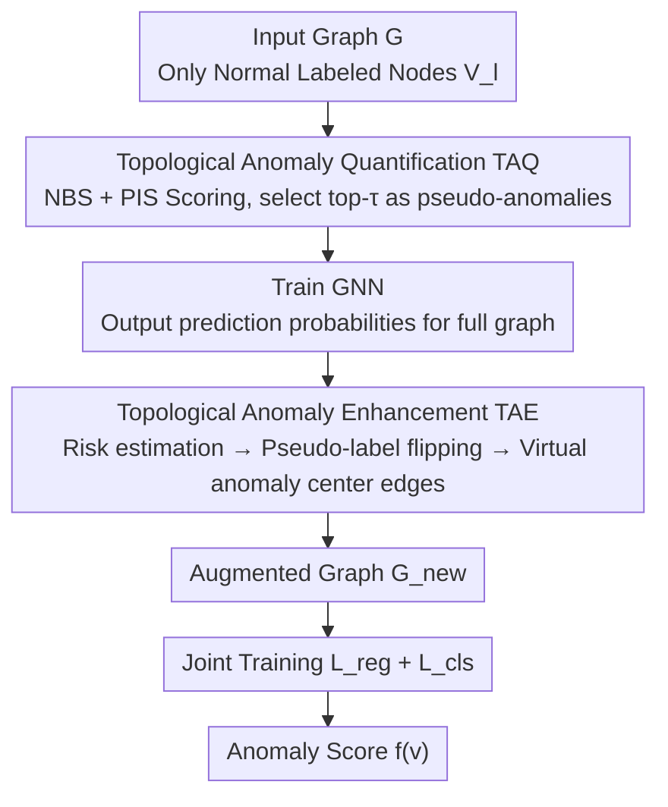

# Topological Anomaly Quantification for Semi-Supervised Graph Anomaly Detection

**Conference**: ICLR 2026  
**OpenReview**: [https://openreview.net/forum?id=ZURYrJgigi](https://openreview.net/forum?id=ZURYrJgigi)  
**Code**: https://github.com/TingGuo301/TAQ-GAD  
**Area**: Graph Anomaly Detection / Semi-Supervised Learning / Graph Neural Networks  
**Keywords**: Graph Anomaly Detection, Semi-Supervised, Pseudo-Anomaly Generation, Topological Quantification, Graph Augmentation

## TL;DR
Aiming at semi-supervised graph anomaly detection with "only normal node labels," TAQ-GAD quantifies the "anomaly degree" of each labeled normal node using two pure topological indicators (Boundary Score NBS + Isolation Score PIS). It filters high-quality pseudo-anomaly nodes and utilizes a Topological Anomaly Enhancement (TAE) module to generate virtual anomaly centers and reconnect graph structures. The model is jointly trained on the augmented graph, consistently outperforming SOTAs like GGAD across 6 datasets.

## Background & Motivation

**Background**: Graph Anomaly Detection (GAD) aims to identify nodes deviating from normal patterns, widely used in financial fraud and intrusion detection. Unsupervised methods rely solely on graph structure, making it difficult to align with "semantic anomalies." Semi-supervised methods with labels are more reliable, but labeling both normal and abnormal nodes is unrealistic—real anomalies are rare and labeling is expensive. Therefore, the "labeled normal nodes only" setting is most practical: treating accessible normal nodes as reliable anchors and transforming the task from "finding global outliers" to "finding nodes deviating from the normal profile."

**Limitations of Prior Work**: Under label scarcity, generative methods are mainstream, synthesizing pseudo-anomalies to supplement negative training samples. These fall into two categories: feature interpolation (linear/nonlinear interpolation between normal node features) and noise perturbation (adding random noise to features or structures). However, the former generates samples that are too smooth to capture the boundary morphology of real anomalies; the latter injects random, unguided perturbations, leading to low representativeness and reliability of pseudo-anomalies.

**Key Challenge**: The fundamental issue is that these methods **lack a quantification mechanism** to evaluate "how abnormal a node actually is." Without quantification, they rely on random perturbations by luck, and the synthesized pseudo-anomalies fail to simulate the complex and meaningful anomaly patterns found in real scenarios.

**Goal**: Given only normal labels, first provide a computable topological metric for the anomaly degree of nodes. Based on this, **select the group truly close to anomalies** from the labeled normal nodes as pseudo-anomalies, then strengthen their topological contexts to help the model learn more separable decision boundaries.

**Key Insight**: The authors observe that abnormal nodes possess two stable topological characteristics: ① Their connection density with normal nodes is significantly sparser than connections between normal nodes (located at the "boundary"); ② They are more isolated in terms of intra-class internal structure ("few and scattered"). Both points can be calculated purely from the graph structure without requiring anomaly labels.

**Core Idea**: Use topological quantification instead of random perturbations to generate pseudo-anomalies. Design two indicators, NBS (Boundary Score) and NIS/PIS (Isolation Score), to score nodes. High-scoring nodes are selected as pseudo-anomalies, followed by topological augmentation to reconnect the graph structure.

## Method

### Overall Architecture
The input to TAQ-GAD is an attributed graph $G=(V,A,X)$, where only a small subset of nodes $V_l$ is labeled as normal, and the rest are unlabeled. The output is an anomaly scoring function where normal nodes score lower than abnormal ones. The pipeline consists of three steps: first, the **Topological Anomaly Quantification (TAQ)** module calculates a comprehensive anomaly score for each labeled normal node and selects the top-$\tau$ proportion as pseudo-anomalies; second, a GNN is trained to output prediction probabilities for all nodes; third, the **Topological Anomaly Enhancement (TAE)** module estimates node risk based on prediction confidence, flips pseudo-labels of high-risk nodes, generates virtual anomaly centers, and establishes topological edges with other nodes to obtain an augmented graph $G_{new}$; finally, joint training with a regularization term and classification loss is performed on the augmented graph.

### Key Designs

**1. Topological Anomaly Quantification TAQ: Screening Pseudo-Anomalies with Two Label-Free Topological Indicators**

This step directly addresses the pain point where "pseudo-anomalies are not quantified and rely on random perturbations." The authors decompose "how abnormal a node is" into two computable topological dimensions. The **Boundary Score NBS** measures how close a node is to the boundary of the normal region, inversely defined by the proportion of labeled normal neighbors in its $K$-hop neighborhood:

$$\mathrm{NBS}(v_i) = 1 - \frac{|N(v_i) \cap V_l|}{|N(v_i)|}$$

A higher NBS indicates fewer connections to the labeled normal class, signifying the node likely falls near the decision boundary. The **Isolation Score NIS** measures the structural isolation of a node within the same class, defined as the average shortest path to neighbors of the same class $\mathrm{NIS}(v_i)=\frac{1}{|N_s(v_i)|}\sum_{v_j\in N_s(v_i)}\mathrm{path}(v_i,v_j)$, where larger values indicate higher isolation. Since NIS requires labels, the authors use a pure local structure **Proxy Isolation Score PIS** instead:

$$\mathrm{PIS}(v_i)=1-\frac{1}{2}\left(\frac{|E(N(v_i))|}{\binom{d_i}{2}+\epsilon}+\frac{\log(d_i+e)}{D+1}\right)$$

Here, $d_i$ is the node degree, $|E(N(v_i))|$ is the number of edges between neighbors, and $D$ is the maximum degree in the graph. The first term captures local clustering density, while the second term penalizes high-degree nodes to highlight structural sparsity. High PIS means "neighbors are few and not connected to each other," corresponding to the "few and scattered" structure of anomalies. The final score is $\mathrm{Score}(v_i)=\lambda_1 \mathrm{NBS}(v_i)+\lambda_2 \mathrm{PIS}(v_i)$. Labeled nodes are ranked, and the top-$\tau$ proportion are treated as pseudo-anomalies. The authors provide two theorems: under homophily and labeling bias, the NBS of abnormal nodes is systematically higher than normal nodes; when PIS is extremely high, the posterior probability of a node being an anomaly increases significantly. Unlike old methods, pseudo-anomalies are no longer synthetic points from random perturbations but are "picked" from real labeled normal nodes that are topologically most similar to anomalies, possessing naturally stronger representativeness.

**2. Topological Anomaly Enhancement TAE: Risk Estimation, Label Flipping, and Virtual Anomaly Centers**

Having pseudo-anomalies is insufficient as their topological context remains sparse. TAE strengthens the connectivity of abnormal nodes in two stages. **Stage 1: Risk Estimation and Pseudo-Label Correction**: For node prediction distribution $P_{v_i}=[p^{(0)}_{v_i},p^{(1)}_{v_i}]$, uncertainty $u(v_i)=1-\max_c p^{(c)}_{v_i}$ is calculated, then transformed into a risk score $r(v_i)=\max(0, u(v_i)-\bar u_{\hat y_i})\times w_{\hat y_i}$ relative to the class average. $w_{\hat y_i}$ is the weight based on inverse class frequency, giving higher importance to the minority (anomaly) class—this offsets selection bias caused by differences in class uncertainty. A **label flipping strategy** is applied to high-risk nodes ($r(v_i)>0$): the neighborhood class posterior $p^{post(c)}_{v_i}=\frac{|\{v_j\in N(v_i):\hat y_j=c\}|}{|N(v_i)|}$ is computed. If neighbors strongly support the opposite class ($p^{post(1-\hat y_i)}_{v_i}>p^{post(\hat y_i)}_{v_i}$), the pseudo-label is flipped based on the topological consistency principle. **Stage 2: Virtual Anomaly Centers**: Centroids are calculated for each class. The connection probability between node $v_i$ and centroid $v^{virtual}_c$ is $P(v_i,v^{virtual}_c)=r(v_i)\cdot p^{post(c)}_{v_i}\cdot(1-\mathbb{I}[\hat y_i=c])$. Virtual edges are generated via probability sampling to construct $G_{new}$. This step enhances the connectivity between abnormal nodes and anomaly centers, providing richer and more separable informational contexts.

**3. Joint Training Objective with Regularization and Classification**

The final optimization on the augmented graph is $L_{total}=\alpha\cdot L_{reg}+\beta\cdot L_{cls}$. The classification loss $L_{cls}=\mathrm{BCE}(f(X_{new}),Y_{new})$ is the primary objective, using both ground truth normal labels and TAE-corrected pseudo-labels. The regularization term $L_{reg}=\|Z\|_F^2$ applies a Frobenius norm penalty to node embeddings to prevent overfitting caused by excessive embedding magnitudes. Ablation shows $L_{reg}$ is crucial; removing it leads to significant performance drops across all datasets, indicating that constraining embedding magnitudes is vital for stability during noisy pseudo-label training.

### Loss & Training
$L_{total}=\alpha L_{reg}+\beta L_{cls}$, where $\alpha,\beta$ balance the contributions. Implementation uses PyTorch + PyG, embedding dimension 300, Adam optimizer, and neighborhood hop $K=2$. The results are sensitive to the pseudo-anomaly ratio $\tau$ (mostly optimal at $\tau=0.05$), while $(\alpha,\beta)$ and $\lambda_2$ are relatively robust.

## Key Experimental Results

### Main Results
6 real-world datasets (Amazon, T-Finance, Reddit, Elliptic, Photo, DGraph) were evaluated using AUROC / AUPRC in a semi-supervised setting with a labeling rate $\rho=15\%$. The table below shows main AUROC results (selection, compared with generative SOTA GGAD):

| Dataset | Metric | TAQ-GAD | GGAD | CHRN |
|--------|------|---------|------|------|
| Amazon | AUROC | **0.9474** | 0.9443 | 0.9346 |
| T-Finance | AUROC | **0.8675** | 0.8228 | 0.7581 |
| Reddit | AUROC | **0.6682** | 0.6354 | 0.5731 |
| Elliptic | AUROC | **0.7453** | 0.7290 | 0.7315 |
| Photo | AUROC | **0.7107** | 0.6476 | 0.6223 |
| Elliptic | AUPRC | **0.3573** | 0.2425 | 0.2101 |
| Photo | AUPRC | **0.2073** | 0.1420 | 0.1420 |

On DGraph with extremely low anomaly rates, TAQ-GAD consistently outperforms GGAD across all labeling rates (0.05%–0.5%); e.g., at 0.5%, AUROC 0.6623 vs 0.5940, AUPRC 0.0162 vs 0.0083. Even when the labeling rate drops to $\rho=10\%$, TAQ-GAD maintains a stable lead on Amazon (0.9365 vs 0.8796) and T-Finance (0.8501 vs 0.7252).

### Ablation Study

| Configuration | Amazon AUROC | Elliptic AUROC | Photo AUROC | Description |
|------|------|------|------|------|
| Baseline (GCN) | 0.7262 | 0.3228 | 0.4198 | Vanilla GCN |
| +NBS | 0.8579 | 0.5022 | 0.7305 | Boundary Score only |
| +PIS | 0.9033 | 0.6422 | 0.6114 | Isolation Score only |
| +NBS+PIS | 0.9261 | 0.7159 | 0.7878 | Complementary indicators |
| +NBS+PIS+TAE | **0.9571** | **0.7534** | **0.8632** | Full Model |
| $L_{cls}$ only | 0.9386 | 0.7315 | 0.8209 | No regularization |
| $L_{cls}+L_{reg}$ | **0.9571** | **0.7534** | **0.8632** | Full Loss |

Comparison with naive pseudo-label strategies (Randomly selected or Low-degree nodes as pseudo-anomalies) shows both are significantly inferior to TAQ-GAD (e.g., Reddit AUROC: Random 0.5443, Low-degree 0.5579, TAQ-GAD 0.6682).

### Key Findings
- Adding NBS and PIS individually improves performance, and their combination (+NBS+PIS) is consistently superior, confirming the complementarity of "boundary" and "isolation" topological dimensions. Adding TAE provides further gains, achieving the highest scores across all datasets.
- The regularization term $L_{reg}$ is essential: its removal leads to performance drops, proving that constraining embedding magnitudes is critical to prevent overfitting in noisy pseudo-label training.
- $\tau$ is sensitive while other hyperparameters are robust: Amazon/Elliptic/T-Finance are optimal at $\tau=0.05$ (larger values introduce noise), but Reddit requires $\tau=0.5$. $(\alpha,\beta)$ and $\lambda_2$ are nearly insensitive, suggesting the method does not rely on fine-tuning loss weights.
- Naive Random/Low-degree selection is far inferior to topological quantification, validating that "selecting high-quality pseudo-anomalies" is more important than "quantity."

## Highlights & Insights
- **Transforming "Pseudo-anomaly Quality" into "Computable Topological Quantification"**: No longer relying on random luck, NBS+PIS scores every labeled normal node to pick those most similar to anomalies. This logic is clear and transferable to other graph tasks lacking negative samples.
- **Clever Use of PIS as a Label-Free Proxy for NIS**: NIS requires class labels, whereas PIS approximates the "few and scattered" structure using only local degree and neighbor edge counts. This bypasses label absence and facilitates scaling on large graphs.
- **TAE Integrates "Label Correction" and "Context Construction"**: Risk estimation and neighbor consensus flip labels for error correction, while virtual anomaly centers compensate for sparse connectivity. This "correct then enhance" combination provides more separable structural contexts and serves as a reference for general semi-supervised graph learning.

## Limitations & Future Work
- The pseudo-anomaly ratio $\tau$ is highly sensitive to the dataset (optimal at 0.05 for some, 0.5 for Reddit). An adaptive selection mechanism for $\tau$ is missing, requiring re-tuning for new datasets.
- The quantification is based on homophily and labeling bias assumptions (Theorems 1/2). In strongly heterophilic graphs or scenarios where normal labels are biased, the discriminative power of NBS/PIS might decrease; this has not been fully verified.
- PIS uses only first-order/local structures and might fail against camouflaged attacks that are "locally dense but globally abnormal." Introducing higher-order or spectral domain structural signals could strengthen the model.

## Related Work & Insights
- **vs GGAD**: Both are generative GAD with "labeled normal only." GGAD relies on asymmetric local affinity + egocentric closeness priors to constrain outlier representations. Ours does not generate new feature points but uses NBS/PIS for quantification/selection and TAE for topological reconnection, resulting in more representative pseudo-anomalies and stable leads over GGAD.
- **vs Feature Interpolation (gADAM / AuGAN / GraphENS)**: These synthesize anomalies in embedding/feature space, resulting in over-smoothed samples that fail to capture boundary shapes. Ours starts from topology, directly selecting boundary and isolated nodes.
- **vs Noise Perturbation (DAGAD)**: The latter uses representation permutation + random noise, which is unguided. Ours utilizes computable topological scores for guided selection, supported by theoretical analysis.

## Rating
- Novelty: ⭐⭐⭐⭐ Transforms pseudo-anomaly quality into quantifiable topological metrics + label-free proxy PIS; novel perspective with theoretical support.
- Experimental Thoroughness: ⭐⭐⭐⭐ Complete evaluation on 6 datasets, multiple labeling rates, ablation, and sensitivity studies, though lacking verification on hyper-large or heterophilic graphs.
- Writing Quality: ⭐⭐⭐⭐ Clear metric definitions, well-placed theorems and illustrations; TAE symbols are slightly dense.
- Value: ⭐⭐⭐⭐ Practical method under realistic constraints (normal only labels), open-sourced, and easily transferable to finance/security scenarios lacking anomaly labels.

<!-- RELATED:START -->

## Related Papers

- [\[ICLR 2026\] DR-GGAD: Dual Residual Centering for Mitigating Anomaly Non‑Discriminativity in Generalist Graph Anomaly Detection](dr-ggad_dual_residual_centering_for_mitigating_anomaly_nondiscriminativity_in_ge.md)
- [\[ICML 2026\] ProMoS: Generalist Graph Anomaly Detection via Prototype-Based Distillation](../../ICML2026/graph_learning/generalist_graph_anomaly_detection_via_prototype-based_distillation.md)
- [\[ICLR 2026\] Dynamic Multi-sample Mixup with Gradient Exploration for Open-set Graph Anomaly Detection](dynamic_multi-sample_mixup_with_gradient_exploration_for_open-set_graph_anomaly_.md)
- [\[ICLR 2026\] Forest-Based Graph Learning for Semi-Supervised Node Classification](forest-based_graph_learning_for_semi-supervised_node_classification.md)
- [\[ICML 2026\] Rethinking Feature Alignment in Generalist Graph Anomaly Detection: A Relational Fingerprint-based Approach](../../ICML2026/graph_learning/rethinking_feature_alignment_in_generalist_graph_anomaly_detection_a_relational_.md)

<!-- RELATED:END -->
