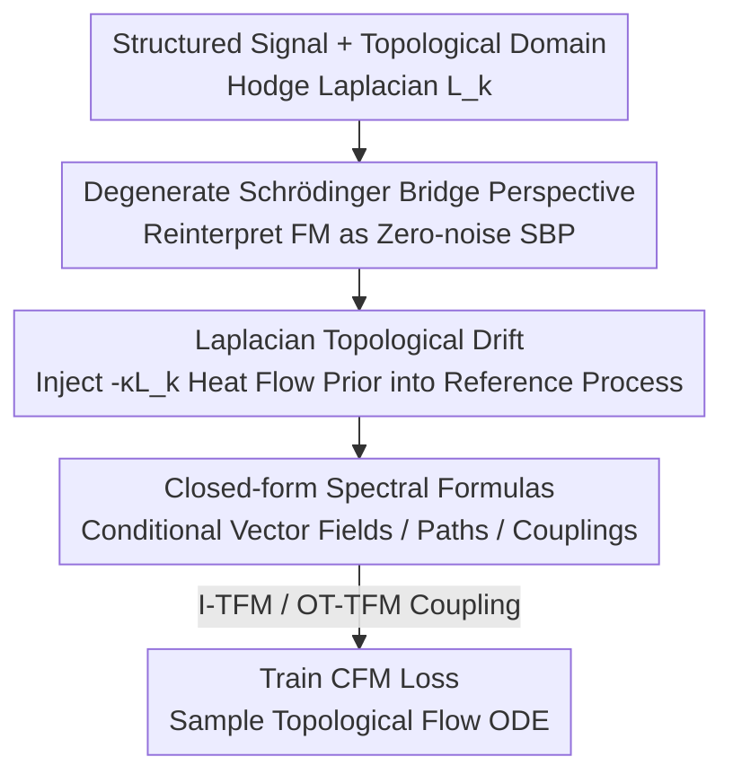

# Topological Flow Matching

**Conference**: ICLR 2026  
**OpenReview**: [https://openreview.net/forum?id=5CM3ax45Ma](https://openreview.net/forum?id=5CM3ax45Ma)  
**Code**: https://github.com/KacperWyrwal/topological-flow-matching  
**Area**: Graph Learning / Generative Models / Flow Matching  
**Keywords**: Flow Matching, Schrödinger Bridge, Hodge Laplacian, Topological Signals, Simplicial Complexes

## TL;DR
By reinterpreting flow matching as a "degenerate Schrödinger bridge in the zero-noise limit" and augmenting its reference process with a heat diffusion drift derived from the Hodge Laplacian, the authors propose Topological Flow Matching (TFM). TFM is a topology-aware generative framework that retains simulation-free training objectives and deterministic sampling paths, serving as a plug-and-play replacement for standard flow matching. It significantly outperforms flow matching and topological Schrödinger bridges on structured signals such as brain fMRI, ocean currents, earthquakes, and traffic.

## Background & Motivation
**Background**: Flow Matching (FM) is currently one of the most powerful generative frameworks. It learns a time-dependent vector field $u_t$ to transport a simple distribution $\mu_0$ (e.g., $\mathcal N(0,I)$) to a data distribution $\mu_1$ along the flow ODE $\dot X_t = u_t(X_t)$. Its appeal stems from **simulation-free**, scalable training objectives and **deterministic** sampling paths, having achieved SOTA performance in images, video, audio, and scientific computing.

**Limitations of Prior Work**: The most valuable data in science and engineering are often not independent points but **signals defined on structured domains**—fMRI on brain region graphs, ocean current velocities on meshes, or traffic flow on road networks. The topological structure of these domains carries critical information, yet standard FM treats signals as points in Euclidean space, entirely ignoring the domain's topology and geometry.

**Key Challenge**: Geometric/topological deep learning has demonstrated that "respecting the underlying structure yields significant gains." While FM has been generalized to Riemannian manifolds and discrete spaces for **generating points**, there has been no successful application of this approach to **modeling signals** on structured domains (e.g., fMRI signals on brain graph nodes). Meanwhile, existing Topological Schrödinger Bridge Matching (TSBM, Yang 2025) can inject topology but requires expensive stochastic simulations and produces random sampling paths, losing FM's two primary advantages.

**Goal**: To find a **principled** way to inject topological information into FM while simultaneously preserving the "simulation-free + deterministic path" properties, enabling it to directly replace standard FM.

**Key Insight**: The authors observe a precise connection between FM and the Schrödinger Bridge Problem (SBP)—OT-CFM is exactly the solution to a degenerate SBP with "zero drift and noise $\sigma\to0$." Since the reference process in SBP acts as a "prior," replacing the "drift-less Brownian motion" prior with a "diffusion with topological drift" biases the solution to respect the domain's topology.

**Core Idea**: By augmenting the reference process with a **Laplacian-derived drift** (heat drift $-\kappa L_k X_t$) and following the derivation from SBP to OT-CFM, the authors obtain TFM—a topology-aware framework that retains all the benefits of closed-form, simulation-free, and deterministic operations.

## Method

### Overall Architecture
TFM aims to generate signals on structured domains like graphs or simplicial complexes while preserving FM's simulation-free training and deterministic sampling. The framework is constructed in three steps: first, **reinterpret** standard flow matching as a degenerate Schrödinger bridge (providing a principled interface for topological injection); second, **inject a Laplacian heat drift** into the reference process as a topological prior; and finally, re-derive the "drifted" SBP to obtain **closed-form spectral formulas**, where training minimizes a CFM loss and sampling integrates a topological flow ODE.

The domain structure is encoded by the **Hodge Laplacian** $L_k := B_k^\top B_k + B_{k+1}B_{k+1}^\top$ (where $B_k$ is the boundary matrix; for $k=0$, it reduces to the graph Laplacian $L_0=B_1B_1^\top$). Non-zero eigenvalues of $L_k$ correspond to wavelike (high-frequency) signals, while **zero eigenvalues** correspond to topological features (connected components, cycles, holes, or cohomology classes). This spectral decomposition is the pivot for all subsequent designs.

### Key Designs

**1. Degenerate Schrödinger Bridge Perspective: Reinterpreting FM as Zero-noise SBP**

To inject topology "principledly," an interface for topological information must be found—the authors translate FM into the language of SBP. Given a reference law $P$ (prior) and observations $\mu_0, \mu_1$, SBP seeks the most likely posterior evolution $\min D_{KL}(Q\|P)$. The authors prove that taking **zero drift** $b=0$, constant noise $\sigma\in\mathbb R^+$, and letting $\sigma\to0$, the three core components of SBP degenerate into CFM components: the conditional vector field becomes the straight-line field $u^{x_0,x_1}_t(x)=x_1-x_0$, the conditional path becomes $\delta_{(1-t)x_0+tx_1}$, and the entropic-regularized OT coupling becomes an exact OT coupling. Per Proposition 1, the marginal vector field learned by OT-CFM is exactly the drift of this degenerate SBP solution.

The value of this perspective lies in the reference law $P$: **changing the prior changes the bias**. Since the prior for standard FM is "unstructured Brownian motion," it learns energy-minimizing transport in Euclidean space; by replacing the prior with "topology-respecting diffusion," the resulting solution automatically respects the topology.

**2. Laplacian Topological Drift: Injecting Topology as a Prior via Heat Equation Reference Processes**

With the interface established, a topological drift $b_t(X_t)=H_t(L_k)X_t+\alpha_t$ is added, making the reference process $\mathrm dX_t = (H_t(L_k)X_t+\alpha_t)\,\mathrm dt + \sigma\,\mathrm dW_t$. Using $H_t(L_k)=-\kappa L_k$ ($\kappa>0$), the zero-noise limit of the reference process is the **heat equation on graphs/simplicial complexes** $\dot X_t=-\kappa L_k X_t$.

Why is this a "topological prior"? In spectral coordinates $Y:=U_k^\top X$ of $L_k=U_k D_k U_k^\top$, the heat equation diagonalizes to $\dot Y^i_t=-\kappa\lambda_i Y^i_t$, with solution $Y^i_t=\exp(-\kappa\lambda_i t)Y^i_0$. Consequently, **non-zero eigenvalue** components (high-frequency, wavelike) decay exponentially—equivalent to denoising/smoothing—while **zero eigenvalue** components (topological features like cohomology classes) remain unchanged. In short, this drift is a **topology-aware smoothing bias** that suppresses irrelevant high-frequency oscillations while preserving alignment with the domain structure.

**3. Closed-form Spectral Formulas: Keeping TFM Simulation-free, Deterministic, and Plug-and-play**

The degenerate SBP provides a **unique** and principled $u^{x_0,x_1}_t$. Following the OT-CFM derivation for the "drifted" SBP, the authors obtain closed-form, scalar spectral formulas for the conditional vector field (Prop 2), conditional path (Prop 3), and coupling transport cost (Prop 4) when $H_t(L_k)=-\kappa L_k$. For instance, the conditional path in spectral coordinates is:

$$ (m^{y_0,y_1}_t)^i = \frac{\sinh(\kappa\lambda_i(1-t))}{\sinh(\kappa\lambda_i)}y^i_0 + \frac{\sinh(\kappa\lambda_i t)}{\sinh(\kappa\lambda_i)}y^i_1\quad(\lambda_i\neq0,\ \kappa\neq0), $$

which returns to the CFM straight line $ty^i_1+(1-t)y^i_0$ when $\lambda_i=0$ or $\kappa=0$. Since the conditional bridge $(X_t\mid X_0,X_1)$ **concentrates deterministically on the mean** in the zero-noise limit, the TFM training objective remains a standard CFM squared loss $\mathbb E\,\|u^{X_0,X_1}_t(X)-u^\theta_t(X)\|^2$—requiring no stochastic simulation. Variants include **I-TFM** (independent coupling) and **OT-TFM** (matching the degenerate topological SBP).

### Loss & Training
Training involves minimizing the conditional CFM loss $\mathbb E_{t\sim U[0,1),\,(X_0,X_1)\sim\pi,\,X\sim P^{X_0,X_1}_t}\big[\|u^{X_0,X_1}_t(X)-u^\theta_t(X)\|^2\big]$. Sampling is performed by integrating the topological flow ODE $\dot X_t=-\kappa L_k X_t + u^\theta_t(X_t)$. In experiments, $\kappa=2.0$ was generally used, while image generation used $\kappa=0.01$ due to sparse grid topology.

## Key Experimental Results

### Main Results
Generative tasks (simple $\mu_0$ / data $\mu_1$) and matching tasks ($\mu_0, \mu_1$ both data) were conducted on real-world datasets of graphs and 2-simplicial complexes. The metric is **1-Wasserstein distance (lower is better)**, comparing against standard CFM and the best TSBM variants.

| Method | Earthquakes | Traffic flows | Brain fMRI | Single-cell | Ocean currents |
|------|------|------|------|------|------|
| I-CFM | 8.37 | 1.72 | 11.71 | 0.022 | 1.95 |
| OT-CFM | 8.25 | 1.59 | 11.30 | 0.019 | 2.00 |
| I-TFM | **4.93** | **1.27** | 6.33 | **0.018** | **1.87** |
| OT-TFM | 5.53 | **1.27** | **5.86** | 0.019 | 1.91 |
| TSBM (best) | 7.69 | 9.92 | 7.51 | 0.140 | 6.89 |

TFM outperforms CFM in all tasks, with the largest gains on the most topologically complex domains (e.g., Brain fMRI 11.30→5.86; Earthquakes 8.25→4.93). It also consistently outperforms the simulation-heavy TSBM, proving that simulation-free frameworks can leverage topological benefits.

### Ablation Study
Images were treated as signals on a $32\times32\times3$ grid to test if topological smoothing helps image generation on CIFAR-10 (FID, lower is better):

| Configuration | Mean FID | Median FID | Std Dev | Description |
|------|---------|---------|------|------|
| I-CFM | 3.7005 | 3.7061 | 0.0462 | Euclidean Baseline |
| OT-CFM | 3.8238 | 3.8308 | 0.0615 | Euclidean Baseline |
| I-TFM | **3.6972** | **3.6795** | 0.0821 | Slightly better than I-CFM |
| OT-TFM | **3.8107** | **3.8046** | 0.0771 | Slightly better than OT-CFM |

### Key Findings
- **Gains depend on topological complexity**: TFM showed minimal improvement on CIFAR-10 but massive gains on Earthquakes and Brain fMRI, confirming that TFM's benefits arise from "capturing complex domain topological features."
- **Unexpected I-TFM > OT-TFM**: In Earthquake experiments, I-TFM (4.93) outperformed the theoretically more "correct" OT-TFM (5.53), suggesting that optimal coupling benefits may vary across structures.
- **Visualizing topological drift**: MNIST conditional path visualizations show that TFM trajectories are significantly smoother than CFM, aligning with the spectral analysis of suppressing high frequencies.

## Highlights & Insights
- **"Reference Process = Inductive Bias" as a leverage point**: reinterpreting FM as degenerate SBP allows for principled prior injection by simply swapping the drift—an interface that could potentially support Matérn drifts or learned $\kappa$.
- **Spectral coordinates simplify everything**: Matrix-level bridge and coupling formulas reduce to scalar 1-D formulas in the $L_k$ eigenbasis, providing both computational efficiency and a clear explanation of why zero eigenvalues preserve topological features.
- **"Drop-in replacement" as a selling point**: The symmetry between TFM and CFM formulas means existing FM pipelines can be upgraded to topology-aware versions with near-zero migration cost.

## Limitations & Future Work
- **Author Acknowledgments**: Only natural drifts based on the heat equation were explored. Future work could test Matérn drifts or adaptive $\kappa$. Time-dependent Laplacians could support matching across different spaces.
- **Personal Insights**: While fixed $\kappa$ performs well, tuning per experiment yields better results, suggesting a need for self-adaptive $\kappa$ selection. The inconsistency between I-TFM and OT-TFM indicates that optimal coupling gains are not always stable. Improvements on regular grids (images) are negligible, defining a clear boundary for where the method is most valuable.

## Related Work & Insights
- **vs Standard Flow Matching (CFM / OT-CFM)**: Both use simulation-free, deterministic ODEs, but CFM treats signals as Euclidean points. TFM injects topology via Laplacian heat drift, with mirrored formulas for plug-and-play replacement.
- **vs Topological Schrödinger Bridge Matching (TSBM, Yang 2025)**: Both inject topology via Laplacian drift, but TSBM relies on stochastic SBP (costly simulation, random paths). TFM uses the zero-noise limit to achieve closed-form, deterministic objectives.
- **vs Geometric/Discrete FM**: Those methods generalize FM to **generate points** on manifolds; TFM is orthogonal, solving for **modeling signals** on fixed structured domains.

## Rating
- Novelty: ⭐⭐⭐⭐⭐ Reinterpreting FM as degenerate SBP to infuse Laplacian drift is a clean, well-derived perspective.
- Experimental Thoroughness: ⭐⭐⭐⭐ Covers various domains with fair comparisons, though more systematic study of $\kappa$ sensitivity would be beneficial.
- Writing Quality: ⭐⭐⭐⭐⭐ The narrative progression from SBP to CFM to TFM is clear, tightly linking intuition with spectral formulas.
- Value: ⭐⭐⭐⭐⭐ Provides a principled, low-cost solution for topology-aware signal generation, highly relevant for scientific computing.

<!-- RELATED:START -->

## Related Papers

- [\[ICLR 2026\] Bures-Wasserstein Flow Matching for Graph Generation](bures-wasserstein_flow_matching_for_graph_generation.md)
- [\[ICLR 2026\] Topological Anomaly Quantification for Semi-Supervised Graph Anomaly Detection](topological_anomaly_quantification_for_semi-supervised_graph_anomaly_detection.md)
- [\[ICLR 2026\] Differentiable Lifting for Topological Neural Networks](differentiable_lifting_for_topological_neural_networks.md)
- [\[ICLR 2026\] FlowSymm: Physics–Aware, Symmetry–Preserving Graph Attention for Network Flow Completion](flowsymm_physicsaware_symmetrypreserving_graph_attention_for_network_flow_comple.md)
- [\[ICML 2026\] Graph-GRPO: Training Graph Flow Models with Reinforcement Learning](../../ICML2026/graph_learning/graph-grpo_training_graph_flow_models_with_reinforcement_learning.md)

<!-- RELATED:END -->
## Related Papers

- [\[ICLR 2026\] Bures-Wasserstein Flow Matching for Graph Generation](bures-wasserstein_flow_matching_for_graph_generation.md)
- [\[ICLR 2026\] Topological Anomaly Quantification for Semi-Supervised Graph Anomaly Detection](topological_anomaly_quantification_for_semi-supervised_graph_anomaly_detection.md)
- [\[ICLR 2026\] Differentiable Lifting for Topological Neural Networks](differentiable_lifting_for_topological_neural_networks.md)
- [\[ICLR 2026\] FlowSymm: Physics–Aware, Symmetry–Preserving Graph Attention for Network Flow Completion](flowsymm_physicsaware_symmetrypreserving_graph_attention_for_network_flow_comple.md)
- [\[ICML 2026\] Graph-GRPO: Training Graph Flow Models with Reinforcement Learning](../../ICML2026/graph_learning/graph-grpo_training_graph_flow_models_with_reinforcement_learning.md)

<!-- RELATED:END -->
