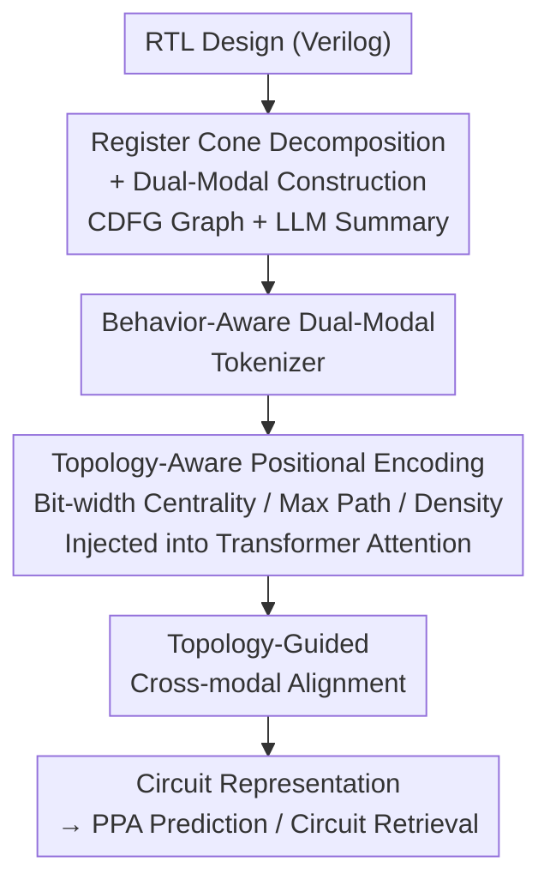

# Topology Matters in RTL Circuit Representation Learning

**Conference**: ICLR 2026  
**OpenReview**: [https://openreview.net/forum?id=bn6bD7TowO](https://openreview.net/forum?id=bn6bD7TowO)  
**Code**: https://github.com/BUPT-GAMMA/TopoRTL.git  
**Area**: Graph Representation Learning / EDA Chip Design  
**Keywords**: RTL Representation Learning, Circuit Topology, Multi-modal Alignment, Positional Encoding, PPA Prediction

## TL;DR
Addressing the issue where existing RTL representation learning treats Verilog as ordinary code and ignores hardware topology, TopoRTL decomposes circuits into register cones and constructs a "Graph + Text Summary" dual-modality. By injecting three topology-aware positional encodings into the attention mechanism and employing topology-guided cross-modal alignment, it surpasses 7B-parameter Large Language Models in PPA prediction and circuit retrieval tasks with only 29M parameters.

## Background & Motivation
**Background**: Mapping circuits in chip design to low-dimensional vector spaces via representation learning is a fundamental capability for EDA "Shift-Left" (moving performance prediction and issue detection to earlier stages). This serves downstream tasks such as PPA (Power, Performance, and Area) prediction, circuit retrieval, and circuit generation. RTL (Register-Transfer Level, described by Verilog in industry) is the most critical abstraction layer in digital circuits. Consequently, many works treat RTL as software code—CodeV uses GPT-3.5 to generate natural language descriptions for Verilog to fine-tune LLMs, and DeepRTL/DeepRTL2 fine-tune CodeT5+ on "Verilog $\leftrightarrow$ Description" data. These are essentially text-based methods learning syntax and semantics.

**Limitations of Prior Work**: RTL is not ordinary programming language; it is inherently a structured data flow graph where behavioral intent is inseparable from topological structure. Figure 1 of the paper provides counter-intuitive examples: Circuits A and B have nearly identical topologies but implement different functions (subtraction vs. addition); Circuits B and C are both four-input adders with identical functions, but B uses a chain structure while C uses a tree structure. The chain structure is more power-efficient, while the tree structure offers better timing. Identical functions with different topologies lead to distinct physical performance. Pure text methods cannot perceive these topological differences, resulting in incomplete representations and limited downstream task performance.

**Key Challenge**: Text-based methods (LLMs) excel at behavioral semantics but are naturally deficient in handling graph-structured data and capturing topology. Traditional topological methods (manual feature engineering to convert Verilog to graphs) lack semantic generalization. Recent multi-modal attempts like CircuitFusion rely on expensive logic synthesis (generating gate-level netlists) to implicitly infer topology, which is inefficient and contradicts the "Shift-Left" objective. None of these three categories capture both behavior and topology at the native RTL level.

**Goal**: Model both behavioral functions and topological structures directly from RTL without relying on synthesis, making the representation sensitive to topology.

**Key Insight**: The authors decompose RTL signal propagation into two stages: the computation stage (signals passing through combinational logic networks, where interconnect density affects power and path depth affects timing) and the storage stage (results latched by registers on clock edges, where bit-width determines data precision and reflects operation complexity). This "dual-stage" perspective reveals that topology is not just the wiring of combinational logic but a deliberate expression of the behavioral function itself. Thus, topology can be explicitly encoded using structural features aligned with storage/computation dimensions.

**Core Idea**: Decompose circuits into register cones to build dual-modality graph and text representations. Use three topology-aware positional encodings ("Bit-width Centrality + Longest Path + Graph Density") to modify Transformer attention, and apply topology-constrained cross-modal alignment to ensure representations understand both behavior and topology.

## Method

### Overall Architecture
The input to TopoRTL is an RTL design (Verilog), and the output is a set of circuit vector representations that retain behavioral semantics while being sensitive to topological differences. These can be used directly for PPA prediction and circuit retrieval. The pipeline starts with data preprocessing (decomposing the design into register cones and constructing graph and text summary modalities for each), followed by three core components: dual-modal tokenizers to generate initial embeddings, topology-aware positional encodings + Transformer to inject structural information into attention, and finally, topology-guided cross-modal alignment to pull both modalities into a consistent semantic space.

### Key Designs

**1. Register Cone Decomposition + Graph-Text Dual-Modal Construction: Splitting circuits into alignable semantic units**

Feeding the entire Verilog code to a model results in lost topology and coarse granularity. TopoRTL borrows "sub-design partitioning" concepts by using register-driven backward traversal to decompose the design into register cones. For a design with $\{R_i\}_{i=1}^{N}$ registers, a signal dependency dictionary is built, and for each register $R_i$, a backward traversal is performed through combinational logic to its inputs or connected registers. Yosys is then used to reconstruct the identified signals into a syntactically correct, verifiable sub-circuit $V^{R_i}$. For each sub-circuit, two modalities are created: the graph modality converts $V^{R_i}$ into a Control-Data Flow Graph (CDFG) $G^{R_i}$, where nodes represent combinational logic and registers and edges represent signal connectivity; the text modality uses GPT-OSS-120B to generate a behavioral summary $S^{R_i}$ describing the high-level functional intent. This transforms one design into $N$ register cones with complementary representations.

**2. Three Topology-Aware Positional Encodings + Topology-Aware Attention: Hardware structure as inductive bias for Transformers**

Vanilla Transformers handle linear sequences well but fail to perceive the hierarchical topology of RTL—signal paths and connection densities are crucial but ignored. TopoRTL designs three encodings following the "Storage/Computation Dual-Stage" view. **Bit-width Centrality Encoding** corresponds to the storage stage: register bit-width directly determines data precision (a 32-bit arithmetic unit requires a large bit-width, while a 1-bit control signal is narrow). $bit(R_i)$ is extracted from Verilog declarations (e.g., `reg [31:0] data;`), and lookup table embeddings $a^{bit}_G, a^{bit}_S$ are added to node features: $h^{R_i}_G = x^{R_i} + a^{bit(R_i)}_G$. **Longest Path Encoding** and **Density Encoding** correspond to the computation stage. For each register cone, the set of path lengths $L^{R_i}$ from other registers to $R_i$ is measured (using pseudo-logic gate counts). To resist outliers, the mean of Top-K longest paths $l^{R_i} = \text{MEAN}(\text{Top-K}(L^{R_i}))$ is used to construct a relationship matrix $\Delta L_{ij} = |l^{R_i} - l^{R_j}|$. Graph density $\rho^{R_i} = \frac{E^{R_i}}{N^{R_i}(N^{R_i}-1)}$ quantifies local interconnect tightness, creating a difference matrix $\Delta \rho_{ij}$. These difference matrices are injected as biases into the attention scores:

$$A_{Gij} = \frac{(h^{R_i}_G W^Q_G)(h^{R_j}_G W^K_G)^T}{\sqrt{d}} + \alpha_G \cdot f_G(\Delta L_{ij}) + \beta_G \cdot g_G(\Delta \rho_{ij})$$

where $f_G, g_G$ are learnable MLP mappings and $\alpha_G, \beta_G$ are learnable scaling coefficients. This allows attention weights to adjust dynamically based on timing features (path depth differences) and structural complexity.

**3. Topology-Guided Cross-Modal Alignment: Ensuring semantic consistency via topological constraints**

To ensure the "topology from graphs" and "behavior from text" are aligned without destroying topological structure, TopoRTL constructs two complementary fusions $Y = (H_G, \hat{H}_S)$ and $Z = (\hat{H}_G, H_S)$. These fusions use cross-node averaging to obtain global representations $y, z$. Alignment uses a quadruplet/contrastive loss with a margin that pulls positive pairs $(y,z)$ closer while ensuring their distance is smaller than those of topologically dissimilar negative samples $(y_{neg}, z_{neg})$:

$$L_{fuse} = [\|y - z\|_2^2 - \|y - z_{neg}\|_2^2 + \beta]_+ + [\|z - y\|_2^2 - \|z - y_{neg}\|_2^2 + \beta]_+$$

This loss also serves as the pre-training objective, ensuring semantic alignment while maintaining topological consistency.

### Loss & Training
The dual-modal tokenizers are pre-trained through behavior-equivalent contrastive learning and masked modeling. The main framework's pre-training objective is $L_{fuse}$. The architecture is lightweight with only 29.13M parameters.

## Key Experimental Results

The dataset includes 115 RTL designs (from OpenCores, VexRiscv, ITC'99, DeepCircuitX), resulting in 7,576 sub-circuits after register cone extraction. Tasks include PPA prediction (regression: PCC / R² / MAPE / RRSE) and natural language code retrieval (classification: AUC with $L \in \{5,8,10,15\}$ negative samples). Baselines include graph-only (GCN-MLP/GCN-GNN), text-only (Qwen3-Embedding 0.6B/4B/8B, CodeV 6.7B–7B), and multi-modal (CircuitFusion) models.

### Main Results (PPA Prediction, excerpt for Area / Power / WNS)

| Metric | TopoRTL (29M) | CircuitFusion (150M) | CodeV-QC (7B) | Qwen3-E-8B |
|------|------|------|------|------|
| Area PCC↑ | **0.863** | 0.647 | 0.818 | 0.720 |
| Area MAPE↓ | **7.952** | 13.242 | 10.830 | 12.079 |
| Power PCC↑ | **0.884** | 0.657 | 0.805 | 0.766 |
| Power MAPE↓ | **25.033** | 43.073 | 37.314 | 37.826 |
| WNS PCC↑ | **0.862** | 0.817 | 0.762 | 0.849 |
| WNS RRSE↓ | **0.580** | 0.808 | 1.400 | 0.674 |

TopoRTL significantly outperforms 7B text models with far fewer parameters (Area PCC ↑5.5%, Power PCC ↑6.9%, Area MAPE ↓26.2%, Power MAPE ↓31.5%) and sets new benchmarks for WNS. In retrieval tasks, TopoRTL maintains a stable AUC of ~0.8, showing superior robustness.

### Ablation Study

| Configuration | Observation |
|------|------|
| Full TopoRTL | Optimal overall performance. |
| w/o bit-width | Significant performance drop; bit-width encoding most effectively captures complexity. |
| w/o max-path | Unstable results across metrics. |
| w/o graph-density | Unstable results across metrics. |
| w/o cross-modal loss | Slight timing improvement but significant drop in topology/behavior tasks. |

### Key Findings
- Bit-width centrality encoding provides the most stable contribution; longest path and graph density encodings require mutual cooperation.
- Topology-guided alignment prioritizes "topological fidelity," ensuring consistency between topology and semantics at the slight cost of timing accuracy (e.g., Slack).
- t-SNE visualizations show TopoRTL's representations form smooth gradients for Area/Power and distinct clusters for Slack, whereas CircuitFusion results are fragmented and tangled.

## Highlights & Insights
- Translating hardware domain knowledge (storage vs. computation) into positional encoding biases for attention is a prime example of "Domain Inductive Bias > Brute Force Parameters" (29M beating 7B).
- Accessing topology without logic synthesis adheres to the "Shift-Left" principle, avoiding high-cost gate-level netlist dependency.
- The technique of using topological difference matrices as attention biases is transferable to other structured graph-sequence tasks involving quantifiable structural distances.

## Limitations & Future Work
- The current register cone decomposition assumes synchronous circuits, which may destroy clock domain relationships; future work should include clock-aware decomposition.
- The dataset size (115 designs) is limited; expansion to more diverse RTL data is necessary for cross-architecture validation.
- Outliers in Slack representation suggest an abstraction gap between RTL and gate-level implementation remains.

## Related Work & Insights
- **vs. CircuitFusion**: CircuitFusion relies on gate-level netlists for implicit topology inference; TopoRTL explicitly extracts topology from RTL, making it lighter, faster, and more accurate in PPA prediction.
- **vs. SNS v2**: SNS v2 focuses on functional equivalence but lacks topological awareness, failing to distinguish circuits with same function but different structures; TopoRTL explicitly encodes these differences.
- **vs. CodeV / DeepRTL**: These treat RTL as software code and miss graph structures; TopoRTL demonstrates that topological information is indispensable for RTL representation.

## Rating
- Novelty: ⭐⭐⭐⭐⭐ "Topology is behavior" observation + three hardware-inspired positional encodings is a novel and self-consistent approach.
- Experimental Thoroughness: ⭐⭐⭐⭐ Five PPA metrics + retrieval + t-SNE + ablation, though the dataset is relatively small.
- Writing Quality: ⭐⭐⭐⭐ Clear motivation for the dual-stage view; convincing counter-examples.
- Value: ⭐⭐⭐⭐⭐ Lightweight alternative to large models; significant practical implications for EDA representation learning.

<!-- RELATED:START -->

## Related Papers

- [\[CVPR 2026\] R2G: A Multi-View Circuit Graph Benchmark Suite from RTL to GDSII](../../CVPR2026/graph_learning/r2g_multi_view_circuit_graph_benchmark_suite_from_rtl_to_gdsii.md)
- [\[ICLR 2026\] TopoFormer: Topology Meets Attention for Graph Learning](topoformer_topology_meets_attention_for_graph_learning.md)
- [\[ICLR 2026\] On the Trade-off Between Expressivity and Privacy in Graph Representation Learning](on_the_trade-off_between_expressivity_and_privacy_in_graph_representation_learni.md)
- [\[ICLR 2026\] Temporal Graph Thumbnail: Robust Representation Learning with Global Evolutionary Skeleton](temporal_graph_thumbnail_robust_representation_learning_with_global_evolutionary.md)
- [\[ICLR 2026\] Global and Local Topology-Aware Graph Generation via Dual Conditioning Diffusion](global_and_local_topology-aware_graph_generation_via_dual_conditioning_diffusion.md)

<!-- RELATED:END -->
