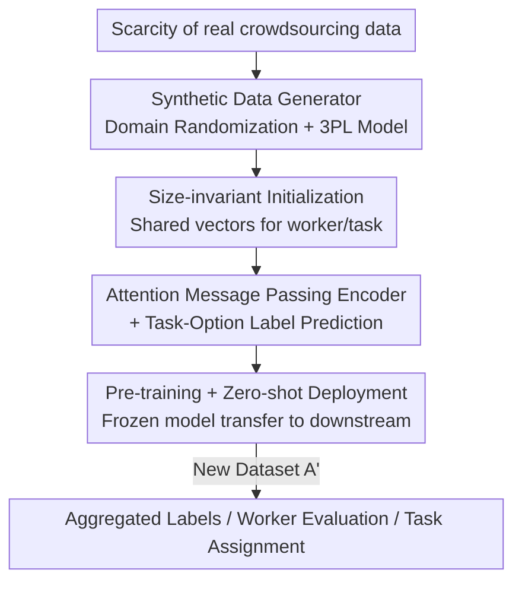

# Towards a Foundation Model for Crowdsourced Label Aggregation

**Conference**: ICLR 2026  
**OpenReview**: [https://openreview.net/forum?id=FF9QVQduAu](https://openreview.net/forum?id=FF9QVQduAu)  
**Code**: https://github.com/liiuhaao/CrowdFM (Available)  
**Area**: Graph Learning / Crowdsourced Label Aggregation / Foundation Models  
**Keywords**: Label aggregation, crowdsourcing, bipartite graph neural networks, synthetic data pre-training, zero-shot generalization

## TL;DR
CrowdFM upgrades the task of "inferring ground truth from noisy crowdsourced labels" from "estimating parameters per individual dataset" to "a single pre-trained bipartite graph neural network that handles everything zero-shot." By pre-training an attention-based GNN that explicitly models workers, tasks, and options on domain-randomized synthetic crowdsourced data, it matches or even surpasses dataset-specific customized methods across 22 real-world datasets without any retraining, with an inference time of only 0.53 seconds per dataset.

## Background & Motivation

**Background**: Crowdsourcing leverages massive non-expert annotations to achieve scale, but varying worker proficiency leads to contradictory labels. Consequently, "label aggregation" is required to infer the ground truth from noisy annotations. This field has long been dominated by two mutually exclusive paradigms: Majority Voting (MV), which is simple, scalable, training-free, and directly applicable to any dataset but assumes equal worker quality (insufficient precision in heterogeneous scenarios); and high-precision methods ranging from probabilistic graphical models (Dawid-Skene, GLAD, EBCC) to deep learning (LAA, TiReMGE, GOVERN), each requiring the estimation of dataset-specific parameters like worker ability and task difficulty from scratch for every new deployment.

**Limitations of Prior Work**: High-precision methods are all locked into a "dataset-specific" paradigm—parameters are not shared across datasets, and every new deployment necessitates retraining. This is not only unscalable and fragile but also prevents knowledge transfer. In other words, they sacrifice the practical properties of MV (training-free, universal) for precision.

**Key Challenge**: There is a structural trade-off between precision and universality. Is it possible to have a model that possesses the accuracy of high-precision methods while maintaining the scalability and training-free nature of MV? Existing cross-dataset attempts like HyperLM pioneered this direction, but its graph structure lacks explicit worker-task modeling, and its training on uniformly distributed synthetic data causes a mismatch with real crowdsourcing patterns, leading to poor performance in real-world scenarios.

**Goal**: To build a truly transferable foundation model for crowdsourcing aggregation, addressing two major hurdles: (1) Universal Crowdsourcing Representation: Since the number of workers, tasks, and options varies wildly and annotation patterns differ, the model must be able to encode any configuration into meaningful representations reflecting heterogeneity; (2) Realistic Synthetic Data: A foundation model requires massive pre-training data, yet public crowdsourcing data is scarce. Synthetic data must faithfully reflect real crowdsourcing patterns to support transfer.

**Core Idea**: Utilize a bipartite graph neural network that explicitly models three types of nodes (worker/task/option) as the aggregation function. Pre-train it on domain-randomized synthetic data to learn universal principles of "collective intelligence," enabling zero-shot generalization to any new dataset without retraining.

## Method

### Overall Architecture

CrowdFM transforms aggregation from "performing maximum likelihood estimation $\Theta^{(s)*}=\arg\max \log p(A^{(s)}\mid\Theta^{(s)})$ on a single dataset $D^{(s)}$" to "learning a parameter-shared aggregation function $F_\Theta: A \mapsto \hat{Y}$ that minimizes the expected loss $\Theta^*=\arg\min_\Theta \mathbb{E}_{D\sim p_D}[\ell(F_\Theta(A),Y)]$ over a dataset distribution $p_D$." Once pre-trained, $F_{\Theta^*}$ is frozen, and for any new annotation set $A'$, zero-shot inference is performed as $\hat{Y}'=F_{\Theta^*}(A')$, eliminating parameter estimation—a fundamental departure from the dataset-specific paradigm.

The pipeline consists of three main components: first, a **synthetic data generator** with domain randomization creates massive diverse crowdsourcing datasets (solving data scarcity); second, a **size-invariant initialization + attention-based message passing bipartite graph encoder** encodes workers/tasks/options into representations to predict labels (solving universal representation); finally, the model is **pre-trained and frozen for zero-shot deployment** on real data, with learned representations transferred to downstream tasks like worker evaluation and task assignment.

### Key Designs

**1. Domain-Randomized Synthetic Data Generator: Creating realistic pre-training data via the 3PL response model**

Foundation models require large-scale pre-training. Since public real-world datasets are rare and uniform generation (used in HyperLM) fails to match real patterns, CrowdFM randomizes every key aspect of crowdsourced data to expose the model to diverse scenarios: **Global structure randomization**—independently sampling the number of tasks $N$, workers $M$, options $K$, and expected annotations per task $A$ for each synthetic dataset to cover various scales and densities; **Behavioral heterogeneity**—worker ability $\theta_i\sim\mathcal{N}(\mu_\theta,\sigma_\theta^2)$, task difficulty $\beta_j\sim\mathcal{N}(\mu_\beta,\sigma_\beta^2)$, discrimination $\alpha_j$, and guessing rate $c_j$ are randomly sampled, with hyperparameters for these distributions also randomized per dataset to produce heterogeneous profiles; **Task assignment mechanism**—worker capacity $L_i$ follows a heavy-tailed distribution to reproduce long-tail participation, while the number of workers per task $n_j$ follows a Poisson distribution.

Crucially, the **3-parameter logistic (3PL) model from Item Response Theory** is used for label generation, capturing worker skills and task attributes while allowing for random errors: the probability of worker $w_i$ correctly labeling task $t_j$ is:

$$p_{ij} = c_j + (1-c_j)\cdot\sigma\big(D\alpha_j(\theta_i-\beta_j)\big),$$

where $\sigma$ is the logistic function and $D$ is a scaling constant. The observed label $a_{ij}$ takes the ground truth $y_j$ with probability $p_{ij}$, and otherwise picks one of the remaining $K-1$ options randomly. This generator forces the model to learn universal aggregation laws rather than overfitting to fixed settings. Removing it (w/o SG) in ablations significantly drops accuracy, validating the dependence of sim-to-real transfer on diverse synthetic data.

**2. Size-Invariant Initialization: Enabling fixed parameters for any dataset size**

Traditional methods often rely on one-hot identity features or annotation statistics for initialization, which binds the model to a fixed number of workers/tasks. CrowdFM does the opposite: all worker nodes share a single learnable vector $x_w\in\mathbb{R}^d$, all task nodes share $x_t\in\mathbb{R}^d$, and option nodes are independently initialized from a fixed-dimensional Gaussian distribution based on their category:

$$z^{(0)}_{w_i}=x_w,\quad z^{(0)}_{t_j}=x_t,\quad z^{(0)}_{o_k}\sim\mathcal{N}(0,I_d).$$

The philosophy is that before observing any annotations, all workers (and tasks) are indistinguishable; their differences should only emerge after incorporating relational evidence. Option random initialization ensures distinguishability among candidate labels regardless of the number of options. This step is the foundation of cross-dataset generalization—parameter dimensions depend only on the hidden dimension $d$, decoupling them from $N$, $M$, and $K$.

**3. Attention Message Passing Encoder + Task-Option Prediction Head: Emerging differences from relational evidence**

Starting from identical initializations, the encoder relies on $L$ layers of attention-based aggregation to differentiate worker/task nodes along observed annotations. For each annotation $(w_i,t_j,a_{ij})$, a triplet representation $h^{(l)}_{ij}=[z^{(l)}_{w_i},z^{(l)}_{t_j},z_{a_{ij}}]\in\mathbb{R}^{3d}$ is constructed and projected into query/key/value via type-specific linear layers. Scaled dot-product attention is then normalized over all annotations flowing into a central node:

$$\alpha^{(l)}_{ij}=\mathrm{softmax}\!\left(\frac{\langle q_{ij},k_{ij}\rangle}{\sqrt{d}}\right),\quad z^{(l+1)}=\mathrm{LayerNorm}\Big(z^{(l)}+\sum_{(i,j)\in\mathcal{N}}\alpha^{(l)}_{ij}v_{ij}\Big).$$

Attention allows the model to adaptively assign weights to different annotations based on their patterns (rather than simple averaging), which is the core of modeling heterogeneity—replacing attention with mean aggregation (w/o AT) results in the largest accuracy drop in ablations. Post-encoding, the task embedding $z_{t_j}$ and each option embedding $z_{o_k}$ are concatenated into a shared MLP to produce logits $\hat{l}_{jk}=g([z_{t_j},z_{o_k}])$; after a softmax, the prediction is $\hat{y}_j=\arg\max_k \hat{p}_{jk}$. This "task-option pair" design enables handling arbitrary numbers of options and captures task-option interactions.

**4. Synthetic Pre-training + Zero-shot Deployment + Downstream Transfer: One model for multiple applications**

The model optimizes the average cross-entropy across $S$ synthetic datasets: $\mathcal{L}=-\frac1S\sum_s\big(\sum_j\sum_k \mathbf{1}[y^{(s)}_j=k]\log\hat{p}^{(s)}_{jk}\big)$. During training, different configurations are dynamically sampled to maximize scenario diversity. Once pre-trained, parameters $F^*$ are fixed, and for any new set, $\hat{Y}=F^*(A')$ is computed directly. Furthermore, by freezing the encoder and training lightweight heads, the model can perform: **worker/task evaluation** (using regression heads $\hat{a}_i=g_a(z_{w_i})$, $\hat{d}_j=g_d(z_{t_j})$ with MSE to fit synthetic ground truths $\theta_i, \beta_j$); and **task assignment** (using a compatibility head $\hat{c}_{ij}=g_c(z_{w_i},z_{t_j})$ with BCE to predict if a worker will label a task correctly, guiding budget-constrained intelligent dispatching). These heads are trained once and used directly across datasets, embodying the foundation model paradigm.

### Loss & Training
Pre-training uses cross-dataset average cross-entropy (Eq. 11) for the encoder and prediction head; downstream worker/task evaluation heads use MSE (Eq. 13), and the task assignment compatibility head uses BCE (Eq. 14). Training data consists of dynamically generated synthetic crowdsourcing datasets re-sampled at each step.

## Key Experimental Results

### Main Results

Across 22 real-world crowdsourcing datasets, a single fixed CrowdFM model outperforms MV on 21 out of 22 datasets, achieving the highest #Win among all methods. It exceeds MV by an average of +1.64 percentage points and is highly efficient.

| Method | #Win↑ | Avg. Acc.↑ | Runtime (s)↓ | vs CrowdFM p-value |
|------|-------|-----------|-----------|------|
| MV | - | 81.78 | 0.04 | 0.00003 |
| BWA | 17 | 83.31 | 0.10 | 0.60871 |
| EBCC | 17 | 84.08 | 2.95 | 0.90089 |
| DS | 16 | 83.02 | 5.24 | 0.31889 |
| GOVERN (Best Deep Method) | 13 | 82.61 | 95.43 | 0.28992 |
| HyperLM (Cross-dataset rival) | 12 | 80.81 | 0.88 | 0.01793 |
| **CrowdFM** | **21** | **83.41** | **0.53** | - |

CrowdFM achieves an average accuracy of 83.41%, with no statistically significant difference ($p=0.90089$) compared to the strongest method, EBCC (84.08%). However, EBCC takes 2.95s per dataset while CrowdFM takes only 0.53s. Compared to deep methods like LAA (223s), TiReMGE (26.8s), and GOVERN (91.46s), it is faster by orders of magnitude. Dataset-specific gains include +12.93% and +9.43% over MV on Web and MS, and +3.70% on Bird. The only minor loss was on Senti (-0.08%), which deviates significantly from the synthetic training distribution.

### Ablation Study

| Configuration | Key Impact | Description |
|------|---------|------|
| Full model | Optimal | Complete CrowdFM |
| w/o AT (Attention to mean) | Largest drop | Attention is critical for modeling annotation heterogeneity |
| w/o SG (Synthetic to uniform) | Significant drop | Diverse synthetic data is vital for sim-to-real transfer |
| GNN Layers $L$ ↑ | Steady gain | Longer-range message passing helps capture patterns |
| Embedding dim $d$ (2/4/Higher) | Dim 2 insufficient; 4 sufficient; higher better | Dimension reflects capacity for modeling worker behavior |

### Key Findings
- Removing attention (w/o AT) leads to the largest performance drop, showing that treating annotations adaptively rather than averaging them is the core mechanism for heterogeneous aggregation.
- Removing domain randomization (w/o SG) also causes a significant drop, proving that synthetic data diversity determines real-world transferability.
- In worker/task evaluation, CrowdFM's predictions correlate strongly (Pearson/Spearman) with synthetic ground truths. When transferred to real Web data, they correlate with proxy metrics like individual worker accuracy, indicating that embeddings naturally capture worker behavior and task difficulty even without explicit supervision.
- In task assignment, using the compatibility predictor outperforms random assignment. Notably, as rounds progress, MV accuracy declines (high-quality pairs are used up, leaving noise), whereas CrowdFM remains stable, demonstrating robustness to noise.

## Highlights & Insights
- **The Paradigm Shift is the real value**: Changing "per-dataset estimation" to "one pre-training, zero-shot for all" creates a GPT-style foundation model for label aggregation, retaining the training-free universality of MV while achieving the precision of expert methods.
- **Size-invariant initialization is the true foundation of generalization**: Starting all workers/tasks as indistinguishable forces the model to rely on relational evidence to "grow" differences. This removes dataset-specific priors and uncouples parameters from $N, M, K$—an idea transferable to any graph task involving entities without inherent features (e.g., cold-start recommendation).
- **Clever use of 3PL/IRT as a generator**: Item Response Theory is a mature psychometric model for "ability vs. difficulty." Using it to generate labels provides a theoretical grounding and injects realistic heterogeneity beyond uniform random generation.
- **One encoder, three uses**: Freezing the encoder while using lightweight heads for aggregation, worker evaluation, and task assignment proves that a single pre-trained network can carry transferable knowledge in this niche but practical domain.

## Limitations & Future Work
- The evaluation only covers **categorical** crowdsourcing (measured by accuracy); its effectiveness on regression, ranking, or structured annotation tasks remains unverified.
- Strong dependence on the "realism" of the synthetic generator: if real scenarios deviate from the 3PL assumption (e.g., malicious adversarial labels, collusion, worker correlations), the transfer might fail, as hinted by the slight underperformance on Senti.
- There is no explicit mechanism for worker correlations (which EBCC models); the model relies purely on attention to absorb this implicitly, and it may struggle with highly correlated workers.
- Although ablations show "bigger is better," the paper does not provide a scaling law analysis for收益-cost curves at very large scales.

## Related Work & Insights
- **vs Dataset-specific methods (DS / EBCC / BWA / GLAD / GOVERN)**: These methods estimate parameters per dataset; they are accurate but require retraining and are non-transferable. CrowdFM matches their performance zero-shot while being 1–2 orders of magnitude faster.
- **vs HyperLM**: Both aim for cross-dataset capability, but HyperLM is designed for programmatic weak supervision, uses uniform synthetic data, creates nodes per binary label (unscalable), and lacks worker/task representations for downstream tasks. CrowdFM explicitly models components, uses domain randomization, and wins in both accuracy (83.41 vs 80.81) and efficiency (0.53 vs 0.88s).
- **vs MV**: MV is training-free and universal but assumes homogeneity. CrowdFM maintains universality while explicitly modeling heterogeneity, outperforming MV on 21/22 datasets.

## Rating
- Novelty: ⭐⭐⭐⭐⭐ Completely foundation-models label aggregation; the size-invariant initialization + 3PL generator is a clean, powerful combination.
- Experimental Thoroughness: ⭐⭐⭐⭐ 22 real datasets + significance tests + two downstream applications are solid, though restricted to classification and lacking scaling limits.
- Writing Quality: ⭐⭐⭐⭐⭐ The "precision vs. universality" dichotomy is well-articulated; logic and formulas are well-connected.
- Value: ⭐⭐⭐⭐⭐ Zero retraining, 0.53s per dataset, and transferability to worker assessment and dispatching make it highly practical for engineering.

<!-- RELATED:START -->

## Related Papers

- [\[ICLR 2026\] HGNet: Scalable Foundation Model for Automated Knowledge Graph Generation from Scientific Literature](hgnet_scalable_foundation_model_for_automated_knowledge_graph_generation_from_sc.md)
- [\[ICLR 2026\] FLOCK: A Knowledge Graph Foundation Model via Learning on Random Walks](flock_a_knowledge_graph_foundation_model_via_learning_on_random_walks.md)
- [\[ICLR 2026\] HYPER: A Foundation Model for Inductive Link Prediction with Knowledge Hypergraphs](hyper_a_foundation_model_for_inductive_link_prediction_with_knowledge_hypergraph.md)
- [\[ICML 2026\] Structure-Centric Graph Foundation Model via Geometric Bases](../../ICML2026/graph_learning/structure-centric_graph_foundation_model_via_geometric_bases.md)
- [\[ICLR 2026\] PRISM: Partial-label Relational Inference with Spatial and Spectral Cues](prism_partial-label_relational_inference_with_spatial_and_spectral_cues.md)

<!-- RELATED:END -->
