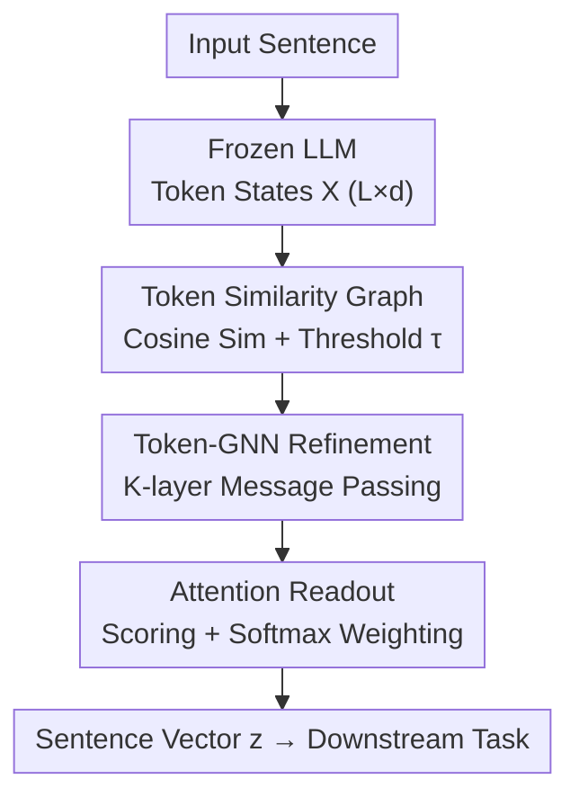

# Towards Improved Sentence Representations using Token Graphs

**Conference**: ICLR 2026  
**arXiv**: [2603.03389](https://arxiv.org/abs/2603.03389)  
**Code**: [https://github.com/ipsitmantri/GLOT](https://github.com/ipsitmantri/GLOT)  
**Area**: NLP / Graph Learning  
**Keywords**: Sentence Representations, Graph Neural Networks, Token Graphs, Pooling, Frozen LLMs

## TL;DR
The authors propose Glot, a lightweight structure-aware pooling module that constructs latent similarity graphs from the token-level hidden states of frozen LLMs. These are refined via GNNs and aggregated into sentence representations, achieving performance competitive with fine-tuning on GLUE/MTEB while requiring 20× fewer parameters and 100× faster training.

## Background & Motivation

**Background**: LLMs generate token-level hidden states, but many downstream tasks require a single-vector sentence representation. The standard practice involves mean/max/[CLS] pooling—treating tokens as an independent set.

**Limitations of Prior Work**: (a) Standard pooling discards the rich relational structure captured by self-attention layers; (b) Mean pooling is overwhelmed by noise when only a few tokens carry task-relevant signals; (c) The causal attention of decoder-only LLMs optimizes for next-token prediction rather than sentence understanding. Full model fine-tuning remains prohibitively expensive.

**Key Challenge**: How to obtain high-quality sentence representations from frozen models without fine-tuning the LLM?

**Goal**: Redefine pooling as "relational learning followed by aggregation"—viewing tokens not as an independent set, but as a graph.

**Key Insight**: The token hidden states of LLMs naturally carry a similarity structure (cosine similarity) that can be used to construct latent graphs. GNNs propagating information over these graphs are more expressive than the DeepSets framework.

**Core Idea**: Glot = Token Similarity Graph Construction + Token-GNN Refinement + Learnable Readout. The LLM backbone is frozen, and only a lightweight GNN head is trained.

## Method

### Overall Architecture

The problem Glot aims to solve is how to obtain high-quality sentence vectors from frozen token-level hidden states without fine-tuning the LLM. The core idea is to transform "sentence pooling" from a single-step aggregation into a two-stage process: "relational learning, then aggregation." First, the frozen LLM outputs a token-level hidden state matrix $\mathbf{X} \in \mathbb{R}^{L \times d}$. Glot uses cosine similarity to construct a token similarity graph, explicitly recovering the token relationships implicit in self-attention. Subsequently, a lightweight GNN performs several rounds of message passing on the graph, refining each token's representation by incorporating neighbor information. Finally, a learnable attention readout scores and weighs the tokens to aggregate them into a single sentence vector $\mathbf{z}$ for downstream tasks. Throughout the process, the LLM backbone remains frozen, and only the GNN head and task classifier are trained.

### Key Designs

**1. Token Similarity Graph Construction: Recovering Graph Structure from Independent Sets**

Standard mean/max pooling assumes tokens are independent, effectively discarding the relationships learned via self-attention. Glot restores these relationships explicitly using the geometry of the hidden states: it calculates the cosine similarity $\mathbf{S}_{ij} = \cos(\mathbf{x}_i, \mathbf{x}_j)$ between any two tokens and connects them only if $\mathbf{S}_{ij} > \tau$, where $\tau$ is a threshold hyperparameter for sparsification. The resulting latent graph retains only semantically relevant connections and filters out noise, providing a meaningful message pathway for the GNN while maintaining computational efficiency on a sparse graph.

**2. Token-GNN Refinement: Enabling Token Interaction for Negation and Modification**

The graph structure alone is insufficient; message passing is required to let token representations absorb information from neighbors. Glot stacks $K$ layers of GNNs. Each layer first aggregates neighbors $\mathbf{a}_i^{(\ell)} = \text{AGGREGATE}_{j \in \mathcal{N}_i}(\mathbf{h}_j^{(\ell)})$, then concatenates the self-representation with the neighborhood representation before applying a linear transformation and non-linearity: $\mathbf{h}_i^{(\ell+1)} = \sigma(\mathbf{W}^{(\ell)} \text{CONCAT}(\mathbf{h}_i^{(\ell)}, \mathbf{a}_i^{(\ell)}))$. This step is the core distinction from pure set-based methods: semantic interactions like the negation of "good" by "not" can only be encoded through token interaction. A DeepSets framework (where $K=0$), including methods like AdaPool, cannot represent such interactions.

**3. Learnable Attention Readout: Adaptively Determining Token Importance**

After refinement, $L$ tokens must be compressed into a single vector. Fixed mean/max methods are prone to noise when signals are sparse. Glot utilizes an attention mechanism: it calculates a score for each token $m_i = \mathbf{v}^\top \tanh(\mathbf{W}_m \mathbf{u}_i + \mathbf{b}_m)$, normalizes them via softmax to obtain weights $\pi = \text{softmax}(\mathbf{m})$, and computes the weighted sum $\mathbf{z} = \sum_i \pi_i \mathbf{u}_i$. This allows the model to adaptively focus on task-relevant tokens. The authors theoretically prove that by degrading various components, Glot can strictly recover mean/max/CLS and even AdaPool, meaning these classical methods are special cases of Glot.

### Loss & Training

Training utilizes task-specific losses—cross-entropy for classification and cosine targets for semantic similarity tasks. The LLM backbone is completely frozen, and only the GNN head and task classifier are updated. The number of trainable parameters is approximately 20× fewer than PEFT methods like LoRA, leading to significantly faster training.

## Key Experimental Results

### Main Results (GLUE + Frozen BERT)

| Method | CoLA (MCC) | SST-2 (Acc) | STS-B (Spea) | MRPC (F1) | QQP (F1) |
|------|-----------|-----------|------------|---------|---------|
| [CLS] | 22.66 | 83.83 | 61.08 | 79.58 | 19.70 |
| Mean | 19.55 | 82.91 | 74.96 | 80.28 | 29.01 |
| AdaPool | 29.20 | 87.72 | 80.01 | 77.99 | 40.15 |
| **Glot** | **47.49** | **90.25** | **83.86** | **82.58** | **62.19** |

### Ablation Study (Signal Dilution Stress Test)

| Method | 0% Noise | 50% Noise | 90% Noise |
|------|---------|---------|---------|
| Mean | ~92% | ~70% | ~52% |
| AdaPool | ~93% | ~78% | ~60% |
| **Glot** | ~95% | ~94% | **97%+** |

### Key Findings
- **Glot improves MCC by +25 over [CLS] on CoLA** (47.49 vs 22.66), demonstrating that relationship modeling is crucial for linguistic understanding.
- **Signal Dilution Stress Test**: When 90% of tokens are random noise, Mean and AdaPool collapse (~50-60%), while Glot maintains 97%+.
- **Decoder-only LLMs Benefit Most**: Significant improvements over Mean pooling were observed on SmolLM2 and TinyLlama.
- **High Parameter Efficiency**: Uses 20× fewer parameters than PEFT methods (LoRA) and trains over 100× faster.
- **Theoretical Guarantees**: Glot strictly generalizes DeepSets, and GNN message passing outperforms pure set functions.

## Highlights & Insights
- **The "Pooling-as-Relational-Learning" Paradigm**: Instead of treating tokens as independent sets, Glot performs relation-based compression by building graphs.
- **Utility of Frozen LLM + Lightweight GNN**: This approach avoids expensive fine-tuning while requiring very few trainable parameters.
- **Diagnostic Value of Stress Tests**: The robustness gap under 90% noise clearly demonstrates the fundamental difference between relational learning and independent aggregation.

## Limitations & Future Work
- Graph construction depends on the cosine similarity threshold $\tau$, which requires tuning.
- GNNs introduce additional memory and computational overhead (though much less than fine-tuning).
- The potential for cross-task transfer of pre-trained GNN heads has not been explored.
- Token graphs for long texts (e.g., document-level) may become excessively large.

## Related Work & Insights
- **vs AdaPool (Brothers, 2025)**: AdaPool learns token weights within a DeepSets framework but cannot model token interactions. Glot provides a structural advantage via GNNs.
- **vs TextGCN**: TextGCN builds word co-occurrence graphs at the corpus level for classification, whereas Glot builds token graphs at the sentence level for representation.
- **vs ColBERT**: ColBERT maintains multi-vector representations, while Glot compresses them into a single vector.

## Rating
- Novelty: ⭐⭐⭐⭐⭐ Redefining pooling as graph relational learning is a novel paradigm shift with theoretical support.
- Experimental Thoroughness: ⭐⭐⭐⭐⭐ Comprehensive coverage includes GLUE, MTEB, IMDB, stress tests, and 6 different backbones.
- Writing Quality: ⭐⭐⭐⭐⭐ Clear motivation and a complete logical flow from theory to practice.
- Value: ⭐⭐⭐⭐⭐ Highly efficient and practical, providing immediate value for downstream applications of frozen LLMs.

<!-- RELATED:START -->

## Related Papers

- [\[ICLR 2026\] CORDS - Continuous Representations of Discrete Structures](cords_-_continuous_representations_of_discrete_structures.md)
- [\[ICLR 2026\] Exchangeability of GNN Representations with Applications to Graph Retrieval](exchangeability_of_gnn_representations_with_applications_to_graph_retrieval.md)
- [\[ICLR 2026\] <SOG$_k$>: One LLM Token for Explicit Graph Structural Understanding](sog_k_one_llm_token_for_explicit_graph_structural_understanding.md)
- [\[ACL 2026\] What Makes AI Research Replicable? Executable Knowledge Graphs as Scientific Knowledge Representations](../../ACL2026/graph_learning/what_makes_ai_research_replicable_executable_knowledge_graphs_as_scientific_know.md)
- [\[ICML 2025\] Banyan: Improved Representation Learning with Explicit Structure](../../ICML2025/graph_learning/banyan_improved_representation_learning_with_explicit_structure.md)

<!-- RELATED:END -->
