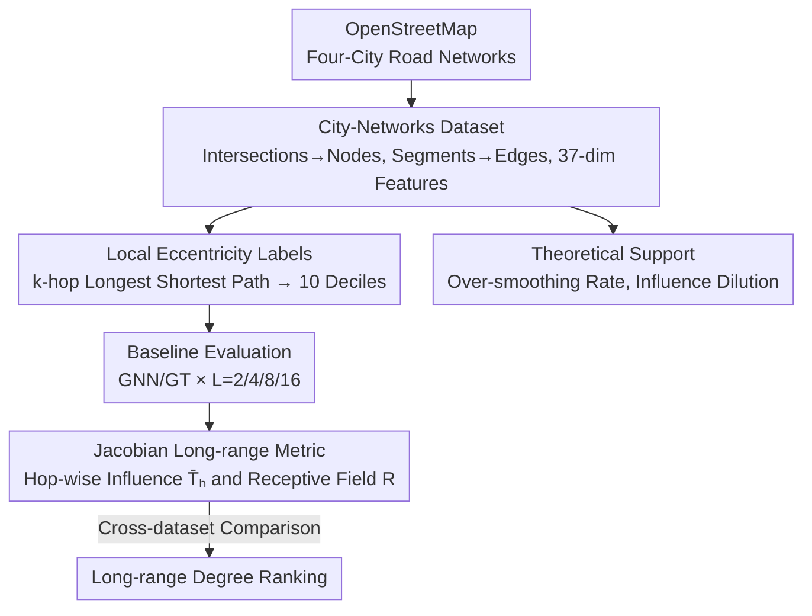

# Towards Quantifying Long-Range Interactions in Graph Machine Learning: A Large Graph Dataset and a Measurement

**Conference**: ICLR 2026  
**OpenReview**: [https://openreview.net/forum?id=fylMiUmg39](https://openreview.net/forum?id=fylMiUmg39)  
**Code**: https://github.com/LeonResearch/City-Networks (Available)  
**Area**: Graph Machine Learning / Graph Neural Networks / Datasets & Benchmarks  
**Keywords**: Long-range dependence, Graph Neural Networks, Graph Transformer, Over-smoothing, Jacobian Influence  

## TL;DR
This paper constructs City-Networks, a million-node scale, large-diameter transductive dataset based on the road networks of four real-world cities. It uses "local eccentricity" to label node classification tasks that naturally require long-range information. Building on this, it proposes a Jacobian-based "hop-wise influence" metric to directly quantify the distance of the neighbor information utilized by any GNN/GT. This replaces the traditional indirect argument of "global attention vs. local aggregation" performance gaps with a measurable, comparable, and theoretically grounded solution.

## Background & Motivation
**Background**: Standard Graph Neural Networks (especially MPNNs) only exchange information between one-hop neighbors per layer. To capture long-range dependencies where "distant nodes determine the label of the current node," many layers must be stacked. The community typically attributes the performance gain of "Graph Transformers (GT) with global attention" over "classical GNNs with local aggregation" to the existence of long-range dependencies.

**Limitations of Prior Work**: This indirect argument is unreliable. On one hand, performance gaps can be easily influenced by hyperparameter tuning (as Tönshoff et al. noted regarding LRGB conclusions), making the judgment of "long-range character" ambiguous. On the other hand, existing long-range benchmarks (LRGB's superpixels/molecular graphs, various synthetic ring graphs) are almost all **inductive small graphs** with only $10$ to $10^2$ nodes. The real challenge lies in applying GTs to transductive tasks on large graphs, where the computational complexity of positional encodings and global attention explodes. The community lacks a "large-scale, real-topology, transductive" long-range benchmark.

**Key Challenge**: Long-range dependence is a fundamental dilemma in graph learning. Increasing GNN layers can transfer distant information but introduces over-smoothing, over-squashing, and vanishing gradients. GTs avoid depth issues via quadratic complexity attention but hit a scalability wall on large graphs. Without suitable datasets and metrics, it is impossible to determine how "far" a model actually "reaches."

**Goal**: The objective is split into three sub-problems: (1) how to generate long-range signals on a graph in a controllable and verifiable way; (2) how to apply these signals to large-scale real networks to test model scalability; (3) how to define a principled metric to quantify and cross-compare the "long-range degree" of different datasets.

**Key Insight**: The authors observed that city road networks have a topology distinctly different from social/citation networks—grid-like, low maximum degree, and extremely large diameters (London diameter reaches 404), with no "small-world effect." This topology is naturally suited for designing labels that "must be computed by traversing many hops."

**Core Idea**: Build large graphs using real city road networks and create long-range tasks with **known ground-truth ranges** using "k-hop local eccentricity" as labels. Then, use the Jacobian of the trained model to calculate the "influence of the h-th hop neighbors on the prediction," transforming long-range dependency from a "guess" into a "measurement."

## Method

### Overall Architecture
The work follows a pipeline of "Data Creation → Benchmarking → Long-range Measurement → Theoretical Support." First, full road networks of four cities (Paris, Shanghai, Los Angeles, London) are extracted from OpenStreetMap, with raw attributes of nodes (intersections) and edges (segments) processed into 37-dimensional node features. Next, labels are generated using "local eccentricity" $\hat\varepsilon_k(v)$ considering only k-hop neighbors, which are converted into 10-class classification tasks based on deciles. This creates a transductive dataset where the **label range is naturally equal to k hops**. Classical GNNs (GCN/SAGE/GAT/GCNII...) and Graph Transformers (GraphGPS/Exphormer/SGFormer) are then evaluated with different layers $L\in\{2,4,8,16\}$ to observe if "increasing depth brings stable improvements." Finally, the hop-wise Jacobian influence $\bar T_h$ and the influence-weighted receptive field size $R$ are calculated to quantify how far the model actually reaches, followed by theoretical analysis from the perspectives of spectral analysis (over-smoothing rate $\leftrightarrow$ algebraic connectivity/diameter) and influence dilution.

### Key Designs

**1. City-Networks: Creating "Large and Long" Transductive Graphs from Real Road Networks**

To fill the gap of lacking large-scale real long-range benchmarks, the authors use the complete road networks of four cities as graphs. Nodes represent intersections, and edges represent road segments. Edge features (length, speed limit, road type, etc.) are averaged over incident edges and concatenated to nodes, resulting in 37-dimensional node features like "average neighborhood speed limit" or "proximity to residential roads." The largest connected component is extracted and treated as undirected, retaining only connectivity. Dataset sizes range from 114k nodes (Paris) to 569k nodes (London), with diameters from 121 to 404—far exceeding common graphs like Cora (diameter 19), ogbn-arxiv (25), or PascalVOC-SP (28). Crucially, the **statistical properties of this topology are entirely different from social/citation networks**: average degrees are only $2.7\!\sim\!3.2$, clustering coefficients are as low as $0.03\!\sim\!0.04$, and there are no hub-node-driven small-world shortcuts. This "grid-like, sparse, large-diameter" structure allows long-range signals to "travel far without shortcuts," also providing a basis for theoretical analysis (large diameters suppressing over-smoothing).

**2. Local Eccentricity Labels: Creating Long-range Tasks with Known, Adjustable, Topology-Feature-Dependent Ranges**

Large graphs alone are insufficient; labels must "naturally require distant information." The authors chose a practically meaningful task—predicting intersection "accessibility," which is directly related to node eccentricity $\varepsilon(v)$ (the maximum distance from $v$ to all other nodes) in network science. However, global eccentricity has two flaws: its long-range degree is uncontrollable (central nodes might be predicted using just coordinates), and calculating exact eccentricity requires all-pairs shortest paths with $O(|V|^3)$ complexity, which is infeasible for million-node graphs. Thus, the authors define **local eccentricity** considering only k-hop neighbors $N_k(v)$:

$$\hat\varepsilon_k(v)=\max_{u\in N_k(v)}\rho_w(v,u),\qquad \rho_w(v,u)=\min_{\pi\in P(v,u)}\sum_{e\in\pi}w(e),$$

where $w(e)$ is the road segment length (weighted only here). The $\hat\varepsilon_k(v)$ values are divided into 10 deciles for classification. This design is elegant for three reasons: calculating $\hat\varepsilon_k$ requires searching up to k hops, making the **ground-truth range = k**, which is controllable; since k and edge weights are unknown to the model, it must combine distant structural information with local spatial features to infer the label, preventing shortcuts; and it bypasses the $O(|V|^3)$ computational wall. The authors set $k=16$ after scanning from 8 to 32, balancing "sufficiently long-range" with "fitting k layers in common GPUs."

**3. Jacobian-based Hop-wise Influence Metric: Directly Measuring "How Far was Used"**

Beyond the task, a metric is needed to quantify the distance actually utilized by the model. The authors use the node-pair influence score $I(v,u)=\sum_i\sum_j \big|\partial H^{(L)}_{vi}/\partial X_{uj}\big|$ (the $\ell_1$ aggregation of the Jacobian of output with respect to input features), which measures the sensitivity of node $v$'s prediction to node $u$'s input. Based on this, they define the **mean total influence** at the $h$-th hop:

$$T_h(v)=I_{\text{sum}}(v,h)=\sum_{u:\rho(v,u)=h} I(v,u),\qquad \bar T_h=\frac1N\sum_v I_{\text{sum}}(v,h),$$

which sums the influence of all neighbors at exactly $h$ hops and averages across the graph. They further define the **average size of the influence-weighted receptive field**:

$$R=\frac1N\sum_{v\in V}\frac{\sum_{h\ge0} h\cdot T_h(v)}{\sum_{h\ge0} T_h(v)},$$

Intuitively, $R$ represents "how far each unit of influence comes from on average." In long-range tasks, distant nodes contribute a higher proportion of influence, leading to a larger $R$. This metric is generic: as long as the model is differentiable, it requires no architecture changes and makes no assumptions about the model class. Unlike parallel work (e.g., Bamberger et al.) that only provides an aggregation range, this paper emphasizes using hop-wise $\bar T_h$ as a **diagnostic tool for dependency decay**, plotting how influence drops over hops.

**4. Theoretical Support: Grounding Dataset Topology and Metric Choice**

The theoretical analysis goes beyond empirical results. For the dataset, from the perspective of over-smoothing in linear GCNs: at infinite layers, graph convolution collapses all node features into scalar multiples of the principal eigenvector of the normalized adjacency operator $\tilde S_{\text{adj}}$, losing all original information. The rate of over-smoothing is controlled by the second largest eigenvalue $\lambda_{N-1}$. The authors prove Theorem 5.2, providing a lower bound:

$$\lambda_{N-1}(\tilde S_{\text{adj}})>\frac{2\sqrt{d_{\max}-1}}{d_{\max}}-\frac{2}{\text{diam}(G)}\Big(1+\frac{2\sqrt{d_{\max}-1}}{d_{\max}}\Big),$$

which decreases with max degree $d_{\max}$ and increases with diameter $\text{diam}(G)$. Thus, **graphs with large diameters and low degrees are more resistant to over-smoothing**, explaining why performance improves with more layers on City-Networks. For the metric, the authors prove that in grid-like graphs, the number of nodes in the $h$-th hop "shell" grows as $|N_h(v)|\sim h^{D-1}$. Therefore, if influence were **averaged**, a single strong influence node would be diluted to zero by irrelevant nodes in the same shell ($I_{\text{mean}}\le I^*/(C_1 h^{D-1})\to0$); using the **sum** $I_{\text{sum}}$ ensures a lower bound $I^*$. This mathematically justifies using sum instead of mean for $T_h$ to avoid geometric dilution of long-range signals.

## Key Experimental Results

### Main Results
Transductive node classification was performed on four cities with a 10%/10%/80% split. Models were evaluated at $L\in\{2,4,8,16\}$, reporting mean±std over 5 seeds. A core observation: **all baselines on City-Networks show stable performance gains as $L$ increases from 2 to 16**, indicating that shallow models cannot match deep ones—the benefits of long-range information outweigh the side effects of depth. In contrast, the same models suffer performance drops on Cora and ogbn-arxiv as $L$ increases (local tasks + depth issues) or remain stagnant on Amazon-Ratings and PascalVOC-SP (relatively short-range).

The table below shows the best accuracy (%) for models at $L=16$. MLP (ignoring topology) performs significantly worse, proving the task requires graph structure:

| Model | Type | Paris | Shanghai | Los Angeles | London |
|------|------|-------|----------|-------------|--------|
| MLP | No-graph | 25.5 | 28.4 | 24.1 | 27.9 |
| GCN | MPNN | 53.2 | 62.1 | 58.3 | 50.1 |
| GraphSAGE | MPNN | 54.6 | 68.3 | 61.4 | 55.4 |
| GAT | MPNN | 51.1 | 68.0 | 59.5 | 52.0 |
| ChebNet | MPNN | 54.1 | 66.5 | 61.4 | 54.7 |
| GraphGPS | GT | 52.1 | 63.0 | 59.8 | OOM |
| Exphormer | GT | 55.1 | 70.2 | 63.8 | 49.5 |
| SGFormer | GT | 52.0 | 64.1 | 60.1 | 48.3 |

Notably, GraphGPS results in OOM (48GB GPU) on the 569k-node London graph, highlighting the scalability issues of GTs. Even when GTs run, they do not show a decisive advantage over classical GNNs, suggesting "long-range character" is not equivalent to "having global attention."

### Metric Validation
Using $L=16$ models, the influence-weighted receptive field size $R$ was calculated. $R$ on City-Networks is systematically higher than on Cora/ogbn-arxiv/Amazon/PascalVOC:

| Model | Paris | Shanghai | London | Cora | ogbn-arxiv | PascalVOC |
|------|-------|----------|--------|------|-----------|-----------|
| GCN | 4.86 | 5.55 | 6.09 | 2.56 | 1.34 | 3.38 |
| GraphSAGE | 4.92 | 5.73 | 5.97 | 2.37 | 1.40 | 2.99 |
| GraphGPS | 8.18 | 7.88 | OOM | 2.65 | OOM | 7.14 |
| Exphormer | 5.71 | 7.06 | 7.90 | 2.84 | 2.80 | 1.42 |

Plotting normalized $\bar T_h/\bar T_0$ curves shows that influence **decays rapidly** at distant hops on Cora/ogbn-arxiv, while decaying much slower on City-Networks. Amazon/PascalVOC fall in between, with influence concentrated in the first few hops. Although $R$ and $\bar T_h$ depend on the specific model, the **ranking across datasets is consistent**: to perform well on City-Networks, models must leverage more distant hops.

### Key Findings
- The flipping between "depth gains" and "depth losses" across datasets is the most direct signal for determining if a task is long-range. The large gap between MLP and graph models confirms the task relies on topology rather than pure features.
- $R$ values consistently rank City-Networks as the most long-range, validating that the Jacobian metric captures "distance used" without requiring architecture changes.
- The metric is model-dependent: influence is calculated from the Jacobian of a trained model, meaning model bias affects the estimation of the ground-truth range—a limitation acknowledged by the authors. 

## Highlights & Insights
- **Direct quantification of "long-range character"**: Transforming the argument from indirect performance gaps (GT vs GNN) to direct measurement via Jacobian hop-wise influence is a significant methodological advancement.
- **Label design with ground-truth range**: Using local eccentricity $\hat\varepsilon_k$ fixes the task range to exactly k hops, providing a standard reference for how far a model "should" look.
- **Dilution proof for sum vs mean**: The mathematical proof regarding shell node growth $\sim h^{D-1}$ explains why mean aggregation dilutes long-range signals to zero, necessitating the use of sum.
- **Theory grounded in real topology**: The spectral proof connecting large diameter/low degree to over-smoothing resistance provides a theoretical explanation for why deep models perform better on these specific datasets.

## Limitations & Future Work
- Model dependence: The metric is derived from the trained model's Jacobian. Biases in the model will propagate to the receptive field estimation; $R$ values from different models cannot be treated as absolute ground-truth comparisons.
- Computational overhead: Jacobian-based methods have high costs on large, dense graphs and face known numerical stability issues; the sparsity of road networks made this study feasible, but it may not generalize to dense graphs.
- Task range is fixed by $k=16$: While adjustable, this study mostly verifies one long-range setting. Systematic studies across different $k$ values are needed.
- Limited task diversity: Currently only includes four cities and a single task (accessibility). Task variety across other real large-graph long-range scenarios remains to be tested.

## Related Work & Insights
- **vs. LRGB (Dwivedi et al.)**: LRGB uses small inductive superpixel/molecular graphs ($10\!\sim\!10^2$ nodes) and infers long-range character through performance gaps. This work uses large-scale real transductive networks ($10^5\!\sim\!10^6$ nodes) and directly quantifies long-range distance via Jacobian, avoiding the ambiguity of hyperparameter sensitivity.
- **vs. Bamberger et al.**: Both define influence range based on shortest paths. This work's $R$ is a special case of their aggregated metric, but this paper adds the $\bar T_h$ hop-wise curve as a diagnostic tool for dependency decay.
- **vs. Heterophily Benchmarks (Amazon-Ratings, etc.)**: Heterophily is not equivalent to long-range. Experiments show these tasks are relatively short-range ($R$ is small), indicating that "long-range" is a dimension independent of homophily/heterophily.

## Rating
- Novelty: ⭐⭐⭐⭐⭐ First large-scale real-topology transductive long-range benchmark + universal Jacobian metric.
- Experimental Thoroughness: ⭐⭐⭐⭐ Covers 4 cities, multiple GNNs/GTs, various depths, and cross-dataset comparisons.
- Writing Quality: ⭐⭐⭐⭐⭐ Logical flow between dataset design, metric definition, and theoretical proofs is excellent.
- Value: ⭐⭐⭐⭐⭐ Provides a reusable large-graph benchmark, plug-and-play metrics, and theoretical tools; integrated into PyTorch Geometric.

<!-- RELATED:START -->

## Related Papers

- [\[ICLR 2026\] LRIM: a Physics-Based Benchmark for Provably Evaluating Long-Range Capabilities in Graph Learning](lrim_a_physics-based_benchmark_for_provably_evaluating_long-range_capabilities_i.md)
- [\[ICLR 2026\] Improving Long-Range Interactions in Graph Neural Simulators via Hamiltonian Dynamics](improving_long-range_interactions_in_graph_neural_simulators_via_hamiltonian_dyn.md)
- [\[ICLR 2026\] Relatron: Automating Relational Machine Learning over Relational Databases](relatron_automating_relational_machine_learning_over_relational_databases.md)
- [\[ICML 2025\] On Measuring Long-Range Interactions in Graph Neural Networks](../../ICML2025/graph_learning/on_measuring_long-range_interactions_in_graph_neural_networks.md)
- [\[ICLR 2026\] TGM: A Modular and Efficient Library for Machine Learning on Temporal Graphs](tgm_a_modular_and_efficient_library_for_machine_learning_on_temporal_graphs.md)

<!-- RELATED:END -->
