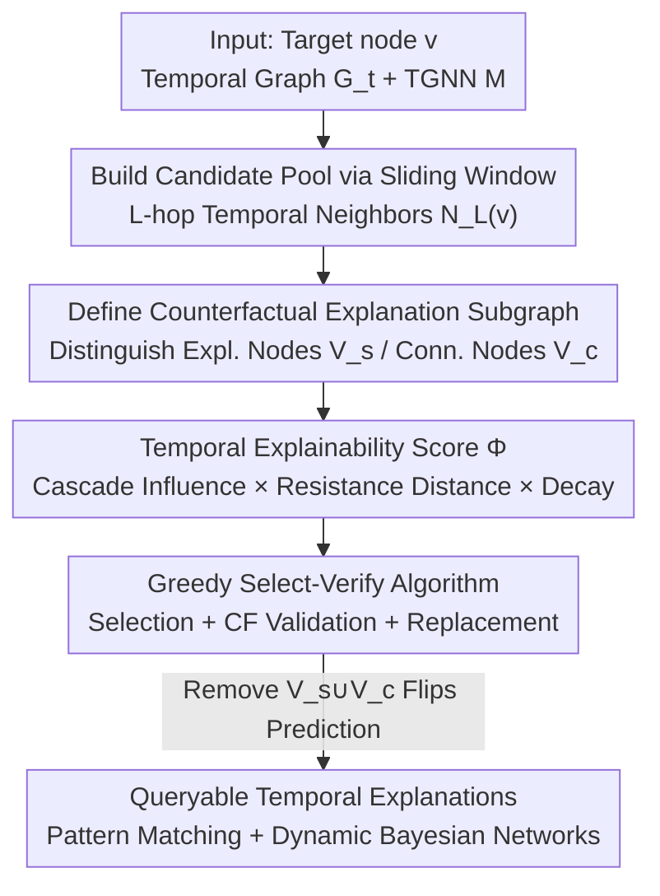

# Training-Free Counterfactual Explanation for Temporal Graph Model Inference

**Conference**: ICLR 2026  
**OpenReview**: [https://openreview.net/forum?id=NqtYz3A8tQ](https://openreview.net/forum?id=NqtYz3A8tQ)  
**Code**: https://github.com/nicej1899/TemGX/  
**Area**: Graph Learning / Temporal Graph Neural Networks / Explainability  
**Keywords**: Temporal Graph Neural Networks, Counterfactual Explanation, Temporal Influence, Submodular Optimization, Queryable Explanations

## TL;DR
TemGX is a training-free, model-agnostic, and queryable explanation framework for Temporal Graph Neural Networks (TGNNs). It formalizes the question "which historical subgraph led to the current prediction" as a sliding-window counterfactual analysis. Using an explainability score that integrates "cascade influence + temporal effective resistance + temporal decay," it identifies nodes that truly impact decisions. The framework efficiently generates explanations via a greedy "Select-Verify" algorithm with a $(1-1/e)$ approximation guarantee, significantly outperforming existing TGNN explainers in fidelity and speed.

## Background & Motivation

**Background**: TGNNs extend GNNs to dynamic graphs by processing a sequence of graph snapshots $G_t=\{G_1,\dots,G_{t-1}\}$. An encoder $f_E$ encodes nodes at each timestep into embeddings $Z_{t-1}$, and a decoder $f_D$ predicts $Z_t$ for the next timestep. These models perform strongly in tasks like traffic forecasting, link prediction, and financial fraud detection.

**Limitations of Prior Work**: TGNN decisions are "black boxes" buried within multi-layer nonlinear transformations and complex temporal mechanisms. In scenarios requiring evidence, such as Anti-Money Laundering (AML) or security audits, an "illicit" label is insufficient; investigators need to know "which historical transactions caused this classification." Existing TGNN explainers either focus only on node features (missing complex temporal dependencies) or sample high-frequency motifs via Information Bottleneck (introducing decision-irrelevant, non-counterfactual structures). Most also require training an auxiliary explanation model and do not support interactive user queries.

**Key Challenge**: A high-quality temporal explanation must satisfy three conflicting requirements: (1) **Counterfactual Verifiability**: removing the identified structure must actually change the TGNN prediction; (2) **Temporal Cohesion**: capturing propagation influences along temporal paths rather than looking at isolated timesteps; (3) **Queryability**: allowing users to retrieve patterns (e.g., "is there a Peel Chain pattern?") like a database. No existing method unifies these.

**Goal**: Given a TGNN output $M(G_t,v)$, identify a set of **counterfactual and cohesive temporal subgraphs** as instance-level explanations, then aggregate these structures into objects suitable for statistical inference and pattern-matching queries.

**Key Insight**: A critical observation is that **not all nodes that can temporally reach the target node $v$ actually influence its decision**. Nodes responsible for the output may originate far in the past or be structurally distant. Therefore, explanations should distinguish between two types of nodes: "Explanation Nodes" $V_s$, which truly change the decision, and "Connection Nodes" $V_c$, which merely bridge $V_s$ to $v$ over time.

**Core Idea**: The explanation task is formulated as a constrained optimization problem: maximize a temporal influence score $\Phi$ in a sliding window under a budget $k$. A training-free greedy Select-Verify algorithm searches the pretrained TGNN directly, performing a counterfactual verification for each selected node to ensure only structures that "flip the prediction when removed" are retained.

## Method

### Overall Architecture

TemGX aims to solve: given a target $v_t$, its TGNN output, and a duration constraint $\delta$, output a set of temporal explanation subgraphs $\eta$ such that "removing explanation nodes from these subgraphs flips the prediction." The pipeline follows: "Build Candidate Pool → Calculate Temporal Influence → Select Nodes via Counterfactual Verification → Assemble Queryable Explanations." It requires no training of separate models and only involves forward inference passes of the pretrained TGNN.

Specifically: for each sliding window of length $\delta$, the $L$-hop temporal neighbors of $v$ are extracted as a candidate pool $C$. A temporal influence score $\Phi$ is calculated for each candidate, coupling three components: deletion influence $\inf$ from an Independent Cascade Model, temporal effective resistance $\mathrm{trd}$ characterizing embedding propagation, and temporal decay $e^{-\lambda(t-t')}$. Nodes are selected greedily by $\Phi$, with a Verify step checking the counterfactual property. After reaching budget $k$, a replacement strategy optimizes the selection. Finally, subgraphs $G_\epsilon$ induced by explanation nodes $V_s$ and connection nodes $V_c$ are exposed via query interfaces for temporal pattern matching or Dynamic Bayesian Network inference.

### Key Designs

**1. Counterfactual Temporal Subgraph: Formalizing Explanation and Node Roles**

To address irrelevant structures, the authors define an explanation verifiably. A temporal edge $e=(u,v,t)$ is a **counterfactual edge** for $M(G_t,v)$ if its removal flips the prediction: $M(G_t\setminus\{e\},v)\neq M(G_t,v)$. A node belongs to the **Explanation Nodes** $V_s$ if it has at least one incident counterfactual edge. An explanation subgraph $G_\epsilon=(V_\epsilon,E_\epsilon)$ within window $\delta$ consists of $V_\epsilon=V_s\cup V_c$, where $V_c$ are **Connection Nodes** that ensure every $v_s\in V_s$ can "$\delta$-reach" $v$ along a temporal path. This decoupling is a core insight: nodes responsible for output may be structurally distant; focusing only on "important neighbors" misses them, while separating counterfactual influence from temporal connectivity preserves both properties. The paper proves that verifying an explanation is PTIME, but generating the optimal one is **NP-hard** (reduction from Maximum Coverage).

**2. Temporal Explainability Metric $\Phi$: Capturing Dynamic Impact**

To select nodes that truly drive decisions, the authors extend the Independent Cascade Model (ICM). The temporal influence of an edge $e$ at time $t$ on $v$ is the absolute difference in output probability: $p_e=\big|\Pr(G_t,v)-\Pr(G_t\setminus\{e\},v)\big|$. The influence of $v_s$ on $v$ is recursively aggregated along all $\delta$-reachable temporal paths:

$$\inf(v_s,v,t)=1-\prod_{\substack{(v',v,t')\in E\\ t-\delta\le t'\le t}}\big(1-p(v',v,t')\cdot \inf(v_s,v',t')\big)$$

To approximate embedding diffusion, they introduce **Temporal Effective Resistance Distance**: $\mathrm{trd}(v_s,v,t')=(Z_{t'}(v_s)-Z_t(v))^T L_{t'}^I (Z_{t'}(v_s)-Z_t(v))$, where $L_{t'}^I$ is the pseudo-inverse of the snapshot Laplacian. The final metric for a node set is:

$$\Phi(V_s,v)=\frac{1}{\delta}\sum_{v_s\in V_s}\sum_{t'=t-\delta+1}^{t-1}\inf(v_s,v,t')\,g(\mathrm{trd}(v_s,v,t'))\,e^{-\lambda(t-t')}$$

The **multiplicative form** is key: resistance distance "modulates" rather than cancels influence, and the decay term $e^{-\lambda(t-t')}$ prioritizes recent interactions. Since terms are bounded, $\Phi \in [0,1]$.

**3. Greedy Select-Verify Algorithm: Training-Free with $(1-1/e)$ Guarantee**

TemGX uses a "Select-Verify" flow: starting with $V_s=\{v\}$, it iteratively picks $v_s^* \in C$ with the highest $\Phi$, updates remaining candidates, and calls `Verify` to check the counterfactual property. If $|V_s|$ reaches budget $k$, a **replacement strategy** swaps nodes if it increases the marginal gain $\Phi(V_s\setminus\{v_s^{*'}\}\cup\{v_s^*\})$. The algorithm is a $(1-1/e)$ approximation by reduction to online monotonic submodular maximization with cardinality constraints. As a "one-pass" algorithm, it processes each node and its temporal neighbors once per window, involving $O(|N_L(v)|\cdot T_I)$ where $T_I$ is the cost of a TGNN inference.

**4. Queryable Temporal Explanations: Matching Patterns and Inference**

Instance-level subgraphs are transformed into queryable assets. TemGX provides a **Temporal Pattern Matching** interface where users define a query $Q_\eta=(V_Q,E_Q,\sigma,\delta')$ (node labels, temporal order $\sigma$, and duration $\delta'$). The system retrieves matches within $\eta$, enabling detection of specific behaviors like "Peel Chain to Spindle" transitions in financial data. Additionally, a **Dynamic Bayesian Network** (DBN) can be learned to aggregate instance structures into a global model for statistical temporal inference.

## Key Experimental Results

### Main Results

Evaluated on 6 real-world temporal graphs: Wiki, UCIM (backbones: TGN, TGAT); METR-LA, PEMS-BAY (STGCN, DCRNN); and Multihost, Elliptic++. Baselines include TempME, TGNNExplainer, CoDy (link prediction), and TGVex (regression).

| Dataset / Backbone | Metric | TemGX | CoDy | TempME | TGNNExplainer |
|------|------|------|------|------|------|
| UCIM / TGN | Fidelity | **0.468** | 0.394 | 0.219 | 0.072 |
| UCIM / TGN | AUFSC | **0.475** | 0.361 | 0.218 | 0.073 |
| UCIM / TGAT | Fidelity | **0.415** | 0.382 | 0.156 | 0.187 |
| Wiki / TGN | Fidelity | **0.262** | 0.219 | 0.128 | 0.098 |
| Wiki / TGAT | AUFSC | **0.340** | 0.184 | 0.155 | 0.117 |

TemGX achieved the highest Fidelity and AUFSC across all datasets. For UCIM+TGN, fidelity was 113% higher than TempME and 6.5× higher than TGNNExplainer. AUFSC was 31% higher than the strong training-free baseline CoDy.

### Efficiency

Table of single-explanation generation time (seconds).

| Dataset / Backbone | TemGX | CoDy | TempME | TGNNExplainer |
|------|------|------|------|------|
| UCIM / TGN | **8.2** | 35.0 | 88.4 | 68.5 |
| Wiki / TGN | **12.5** | 125.0 | 72.8 | 65.2 |
| METR-LA / STGCN | **6.1** | — | — | — (TGVex 6.8) |

TemGX is significantly faster (up to 10× vs CoDy on Wiki) because it is one-pass and training-free, whereas TGNNExplainer/TempME require training navigators or motif scorers.

### Key Findings
- **Counterfactual + Temporal Influence**: Methods ignoring temporal reachability (TGVex) or only focusing on frequent motifs (TempME) fail to capture low-frequency, high-impact dynamic patterns.
- **Superiority over CoDy**: Despite both being training-free, TemGX is more effective and much faster due to the submodular greedy approach compared to MCTS.
- **Dense Graph Advantage**: TGNNExplainer struggles in dense graphs like Wiki; TemGX's node-level influence aggregation handles these efficiently.
- **Queryability in Case Studies**: Identified "Spindle" and "Peel Chain" patterns in Bitcoin graphs and mapped the multi-stage attack paths in security logs.

## Highlights & Insights
- **$V_s$ vs. $V_c$ Split**: This design allows capturing "latent" influences from the past that are structurally distant but temporally connected to the target.
- **Multiplicative Scoring**: Using resistance distance to "modulate" cascade influence avoids the scale issues common in additive scoring functions.
- **Theoretical Grounding**: Reducing NP-hard generation to submodular maximization provides a solid $1-1/e$ approximation guarantee.
- **Practicality**: The training-free and queryable nature makes it highly suitable for production environments requiring continuous auditing.

## Limitations & Future Work
- **Scope**: Currently focused on single-graph sliding window analysis; needs extension to large-scale distributed networks and real-time streams.
- **Ablation Study**: The paper lacks a breakdown of individual contributions from $\inf$, $\mathrm{trd}$, and decay.
- **Verify Bottleneck**: Verification relies on repeated TGNN forward passes, which may be costly for extremely long windows or massive graphs.

## Related Work & Insights
- **vs. TGNNExplainer**: TemGX is training-free and performs better on dense graphs by using node-level aggregation rather than edge-centric MCTS.
- **vs. TempME**: TempME relies on motif frequency; TemGX uses counterfactual properties to capture rare but decisive patterns.
- **vs. CoDy**: TemGX uses greedy submodular maximization with theoretical guarantees, proving faster and more accurate than CoDy's MCTS.

## Rating
- Novelty: ⭐⭐⭐⭐⭐ First to unify counterfactuals, temporal influence, and queryability in a training-free TGNN explainer.
- Experimental Thoroughness: ⭐⭐⭐⭐ Strong metrics and case studies, though individual scoring component ablations are missing.
- Writing Quality: ⭐⭐⭐⭐ Clear formal definitions and proofs, though some hyperparameter details are relegated to appendices.
- Value: ⭐⭐⭐⭐⭐ Highly applicable to high-stakes fields like AML and cybersecurity.

<!-- RELATED:START -->

<!-- RELATED:END -->

## Related Papers

- [\[ICML 2026\] GILT: An LLM-Free, Tuning-Free Graph Foundational Model for In-Context Learning](../../ICML2026/graph_learning/gilt_an_llm-free_tuning-free_graph_foundational_model_for_in-context_learning.md)
- [\[ICLR 2026\] Revisiting Node Affinity Prediction in Temporal Graphs](revisting_node_affinity_prediction_in_temporal_graphs.md)
- [\[CVPR 2025\] Knowledge Bridger: Towards Training-Free Missing Modality Completion](../../CVPR2025/graph_learning/knowledge_bridger_towards_training-free_missing_modality_completion.md)
- [\[ICML 2025\] CoDy: Counterfactual Explainers for Dynamic Graphs](../../ICML2025/graph_learning/cody_counterfactual_explainers_for_dynamic_graphs.md)
- [\[ICLR 2026\] PRISM: Partial-label Relational Inference with Spatial and Spectral Cues](prism_partial-label_relational_inference_with_spatial_and_spectral_cues.md)

<!-- RELATED:END -->
