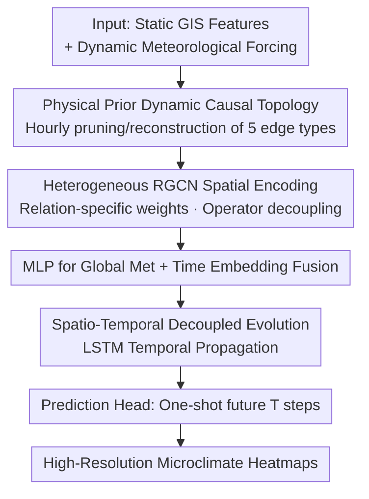

# UrbanGraph: Physics-Informed Spatio-Temporal Dynamic Heterogeneous Graphs for Urban Microclimate Prediction

**Conference**: ICLR 2026  
**OpenReview**: [https://openreview.net/forum?id=ckjNF94cIi](https://openreview.net/forum?id=ckjNF94cIi)  
**Code**: None  
**Area**: Graph Learning / Spatio-Temporal Prediction / Physical Priors  
**Keywords**: Dynamic Heterogeneous Graphs, Physical Prior Inductive Bias, Urban Microclimate, Causal Pruning, RGCN

## TL;DR
UrbanGraph encodes **known physical laws**—such as solar shading, vegetation evapotranspiration, and convective diffusion—directly into the graph topology. By reconstructing a sparse dynamic heterogeneous graph hourly based on physical equations and utilizing an RGCN+LSTM architecture to decouple spatial and temporal features, it achieves SOTA performance on urban microclimate prediction ($R^2=0.8542$). Compared to the implicit dynamic graph baseline LRGCN, it reduces FLOPs by 73.8% and accelerates training by 21%.

## Background & Motivation

**Background**: Predicting the urban microclimate (e.g., Universal Thermal Climate Index UTCI, Mean Radiant Temperature MRT, wind speed) is critical for building energy consumption and public health. Traditional high-fidelity physical numerical simulations like CFD or ENVI-met are accurate but computationally expensive, making large-scale or long-term predictions impractical. Consequently, data-driven methods—including grid-based CNNs and GNNs that model urban entities as graphs—have emerged as alternative directions.

**Limitations of Prior Work**: Grid-based models (CNNs) are constrained by Euclidean assumptions, making it difficult to characterize **non-local and anisotropic** physical dependencies in cities. For example, shadows "skip" intermediate spaces, and wind forms directional flows; approximating these with convolutions requires stacking many layers. While GNNs are naturally suited for spatial dependencies, existing methods suffer from two major flaws: (1) **Lack of physical consistency**, as they use uniform message passing that fails to distinguish fundamentally different physical processes like cooling from vegetation evapotranspiration versus building shading. (2) **Inability to model time-variability**, as most rely on static graph structures whereas real physical processes (e.g., shadow coverage) change in real-time with the sun’s position.

**Key Challenge**: The physical state at any point in a city is jointly determined by various heterogeneous entities (buildings, vegetation, ground) via **time-varying physical processes**. Accurately abstracting these causal relationships of continuous physical fields into discrete graph representations requires capturing critical causal information (which standard graph topologies fail to do) while allowing the network to distinguish between different physical operators and maintaining computational efficiency. There is a inherent tension between interpretability and efficiency.

**Goal**: To design a **structure-based inductive bias** that explicitly encodes multiple independent, time-varying physical processes into the graph structure, paired with a neural architecture capable of decoupling these processes.

**Key Insight**: The authors observe that rather than letting a model **implicitly** learn a latent graph from data (which often captures spurious correlations in noise), it is more effective to translate **physical first principles** into a causal topology that is reconstructed over time. Physical equations serve as the strongest priors; using them as "hard constraints" to prune graph edges aligns the model's receptive field with the true physical domain of influence.

**Core Idea**: Explicitly embed time-varying physical causality (shading, convection, etc.) into the graph topology. Perform "causal pruning" hourly to reconstruct a sparse graph, ensuring the structure itself carries physical knowledge. Utilize heterogeneous message passing to assign dedicated parameters to each physical relationship, achieving "physical operator decoupling."

## Method

### Overall Architecture
UrbanGraph addresses the task of predicting high-resolution microclimate fields over future hours given static GIS features (building/tree heights, surface types) and dynamic meteorological forcing (solar radiation/position, temperature, humidity, wind). It discretizes the city into a grid where each cell is a node $v$. The environment is represented as a sequence of dynamic heterogeneous graphs $\{G_t\}$, where $G_t=(V, E_t, R)$. The node set $V$ and relation set $R$ are static, while the edge set $E_t$ is reconstructed hourly based on current physical conditions.

The pipeline consists of two main components: (1) **Physical Prior Graph Representation**, which connects five types of edges hourly based on physical equations to generate a sparse, physically consistent topology. (2) **UrbanGraph Architecture**, which uses a three-layer RGCN for spatial encoding (one set of weights per relationship to decouple physical operators). It then fuses global meteorological and temporal features into an LSTM for temporal evolution, with a prediction head outputting the next $T_{pred}$ steps.

### Key Designs

**1. Physical Prior-Driven Dynamic Causal Topology: Pruning Time-Varying Laws into Graph Structure**

This is the core contribution addressing the lack of physical consistency and time-variability in GNNs. Instead of learning the graph, the model **explicitly reconstructs** the edge set $E_t$ hourly. Five types of edges are defined, categorized into dynamic and static types. Three types of **dynamic edges** are updated hourly:

- **SHADING edges**: Encode directional radiation blocking. A directed edge is connected from an occluder node $v_i$ (building/tree with height $h_{obj}$) to a ground node $v_j$ if the Euclidean distance $d(v_i,v_j)$ is within the shadow length and the angle falls within the shadow width. The shadow length $L_{shadow,t}=h_{obj}/\tan(\theta_{elev,t})$ and main direction $\varphi_{shadow,t}=(\varphi_{azimuth,t}+180°)\bmod 360°$ are calculated in real-time.
- **VEGETATION EVAPOTRANSPIRATION edges**: Model localized biophysical cooling. Edges connect tree nodes to neighbors within a radius $R_{activity,t}$, scaled by current radiation: $R_{activity,t}=R_{base}\cdot \mathrm{clip}(I_t/1000, 0.5, 1.2)$.
- **CONVECTIVE DIFFUSION edges**: Encode fluid anisotropy. "Proximity" is redefined using a wind-modulated **effective distance** $d_{eff}(v_i,v_j)=d(v_i,v_j)/\alpha_{wind,t}\le R_{local}$, where the modulation factor $\alpha_{wind,t}=1.0+\lambda_{wind}\cdot\cos(\Delta\theta_{wind})\cdot(v_{wind,t}/v_{max})$ stretches the connection distance downwind and compresses it upwind to approximate advection.

Two types of **static edges** provide redundancy: **Semantic Similarity edges** connect nodes to k-nearest neighbors in a normalized feature space to capture non-local functional similarities (e.g., same materials); **Internal Continuity edges** connect internal nodes of continuous objects to their eight-neighbors to model thermal inertia.

**2. Heterogeneous Message Passing as Physical Operator Approximator: Dedicated Parameters for Physical Processes**

To address the inability of uniform message passing to distinguish different physical processes, a three-layer RGCN is used for spatial encoding. The single-layer update is:

$$h_i^{(l+1)}=\sigma\Big(\sum_{r\in R}\sum_{j\in N_i^r}\frac{1}{c_{i,r}}W_r^{(l)}h_j^{(l)}+W_0^{(l)}h_i^{(l)}\Big)$$

The key is that **each relation $r$ (shading/evapotranspiration/convection/semantic/continuity) has an independent learnable weight matrix $W_r$**. This allows the RGCN to structurally **decouple** various physical processes into specialized sub-processes for approximation. This also mitigates oversmoothing common in homogeneous GNNs.

**3. Spatio-Temporally Decoupled Evolutionary Architecture: RGCN for Space, LSTM for Time**

To handle complex graph sequences where both features and topology change, UrbanGraph **decouples spatial interaction from temporal evolution**. At each time step, the RGCN first parses the dynamic topology into a physically consistent spatial representation $h_{v,t}^{RGCN}$. This is concatenated with global environment embeddings $e_t^{env}$ and time embeddings $e_t^{time}$, passed through a fusion MLP, and then fed into an LSTM to model temporal dynamics. The initial hidden state $h_0$ is projected from the first frame's spatial features.

### Main Results
The dataset uses high-resolution urban microclimate data (4m horizontal, 3m vertical grid) generated by ENVI-met. 396 blocks are split 70/20/10, with the **test set comprising completely unseen urban blocks** to test spatial generalization. Baselines include grid-based (CGAN-LSTM, Pix2Pix+PINN), static ST-GNNs (GCN/GINE-LSTM, STGCN, ASTGCN), generative graphs (GAE/GGAN-LSTM), and dynamic graphs (LRGCN, RGCN-GRU/Transformer).

| Model | Category | FLOPs | Avg $R^2$ ↑ | Avg RMSE ↓ | Training (epoch/s) |
|------|------|-------|----------|------------|---------------|
| Pix2Pix+PINN | Grid (Soft Physics Loss) | $1.10\times10^{10}$ | 0.8320 | 1.1485 | 17.5 |
| GAE-LSTM | Generative Graph | $1.05\times10^{10}$ | 0.8494 | 1.0687 | 36.7 |
| LRGCN | Dynamic Graph (Implicit) | $3.49\times10^{10}$ | 0.8422 | 1.0889 | 31.1 |
| **UrbanGraph** | **Ours** | $\mathbf{9.13\times10^{9}}$ | **0.8542** | **1.0535** | **24.5** |

Key finding: Compared to the strongest dynamic graph baseline LRGCN, UrbanGraph achieves higher accuracy while reducing FLOPs by 73.8% and training time by 21%. Outperforming Pix2Pix+PINN suggests that **hard structural constraints for physical consistency are superior to soft loss constraints**.

### Ablation Study

| Configuration | $R^2$ | MSE | Description |
|------|----|----|------|
| Base (Full) | 0.8629 | 1.0976 | Heterogeneous + Dynamic |
| Homo (No Heterogeneity) | 0.8336 | 1.4275 | Single parameters for multi-physics → Causal entanglement |
| Static (No Dynamics) | 0.8057 | 1.6678 | Failure to prune irrelevant edges over time |

### Key Findings
- **Dynamic Mechanism Contribution**: Removing the dynamic graph causes $R^2$ to drop by ~7.1% (0.8629 to 0.8057), which is more significant than the ~3.5% drop from removing heterogeneity.
- **Cross-Domain Generalization**: UrbanGraph was tested on the UWF3D urban wind dataset (governed by Navier-Stokes). It achieved $R^2 > 0.88$ on the u-component, proving the paradigm migrates well from scalar thermal diffusion to vector flow fields.
- **Real-world Validation**: Calibrations on the NUS campus ($r>0.73$) and Singapore city-wide ($r=0.842$) demonstrate that the physical parameterization remains effective in heterogeneous real-world urban morphologies.

## Highlights & Insights
- **Physics Equations as Graph Generators**: Using physical equations as "hard constraints" for dynamic topology ensures consistency without the cost of a PDE solver, while simultaneously sparsifying the graph to save computation.
- **Efficiency via Sparsity**: Causal pruning is not just for physical correctness; it leads to a 73.8% reduction in FLOPs, turning the interpretability-efficiency trade-off into a win-win scenario.
- **Strong Portability**: As long as the physical process is governed by known equations (wind, pollution, traffic flow), this paradigm of "first-principle topology + heterogeneous decoupling" can be applied.

## Limitations & Future Work
- **Dependency on Known Equations**: The method requires physical processes to be explicitly translatable into edge rules; it is less applicable to mechanisms that are poorly understood or hard to discretize.
- **Heuristic Thresholds**: Connection thresholds ($R_{base}$, $\lambda_{wind}$, etc.) are based on empirical physical literature. The sensitivity and city-to-city portability of these hyperparameters require further validation.
- **Simulation Data**: Training data comes from ENVI-met. While validated against real-world observations, the potential for inheriting simulator bias exists.

## Related Work & Insights
- **vs. Pix2Pix+PINN**: PINN uses PDE residuals in the loss function (soft constraint), which is training-intensive. UrbanGraph uses hard structural constraints, resulting in higher accuracy and no PDE solver overhead.
- **vs. LRGCN**: LRGCN implicitly learns graph evolution as a data-driven phenomenon. UrbanGraph explicitly reconstructs topology using physical principles (causal pruning), becoming both more accurate and efficient.
- **vs. Homogeneous GNNs**: Homogeneous graphs mix information from different physical processes. RGCN decouples these by assigning relationship-specific weights.

## Rating
- Novelty: ⭐⭐⭐⭐⭐ Encoding time-varying physical equations as hard structural inductive biases is novel and consistent.
- Experimental Thoroughness: ⭐⭐⭐⭐ Solid across four baseline categories, dual ablations, and cross-domain testing.
- Writing Quality: ⭐⭐⭐⭐ Logic is clear, though some ablation figures in the text show minor discrepancies with the tables.
- Value: ⭐⭐⭐⭐⭐ Achieves SOTA in both accuracy and efficiency, with a transferable paradigm for physics-based spatio-temporal prediction.

<!-- RELATED:START -->

## Related Papers

- [\[ICLR 2026\] Revisiting Node Affinity Prediction in Temporal Graphs](revisting_node_affinity_prediction_in_temporal_graphs.md)
- [\[ICML 2026\] Physics-Informed Coarsening for Multigrid Graph Neural Surrogates](../../ICML2026/graph_learning/physics-informed_coarsening_for_multigrid_graph_neural_surrogates.md)
- [\[ICLR 2026\] Inductive Reasoning for Temporal Knowledge Graphs with Emerging Entities](inductive_reasoning_for_temporal_knowledge_graphs_with_emerging_entities.md)
- [\[ICLR 2026\] TGM: A Modular and Efficient Library for Machine Learning on Temporal Graphs](tgm_a_modular_and_efficient_library_for_machine_learning_on_temporal_graphs.md)
- [\[ICLR 2026\] Beyond Entity Correlations: Disentangling Event Causal Puzzles in Temporal Knowledge Graphs](beyond_entity_correlations_disentangling_event_causal_puzzles_in_temporal_knowle.md)

<!-- RELATED:END -->
