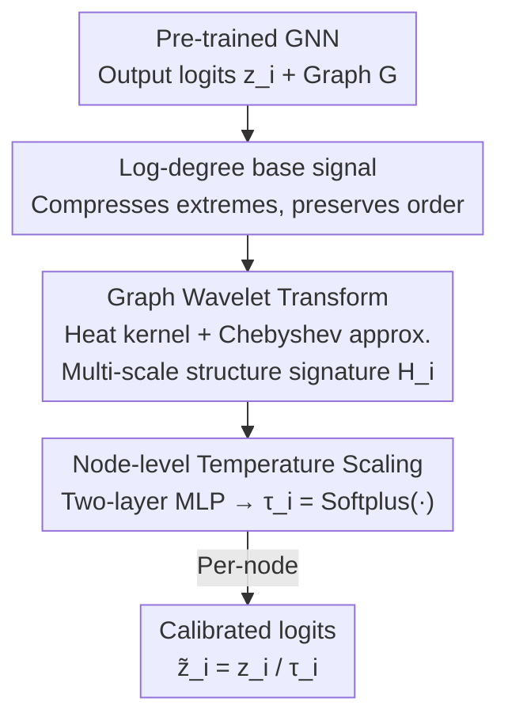

# WATS: Wavelet-Aware Temperature Scaling for Reliable Graph Neural Networks

**Conference**: ICLR 2026  
**OpenReview**: [https://openreview.net/forum?id=ZrrVEMyQeU](https://openreview.net/forum?id=ZrrVEMyQeU)  
**Code**: https://github.com/lxy1134/WATS  
**Area**: Graph Learning / GNN Confidence Calibration  
**Keywords**: Graph Neural Networks, Confidence Calibration, Temperature Scaling, Graph Wavelets, Post-hoc Calibration

## TL;DR
WATS is a post-hoc calibration framework for node classification. It predicts a personalized temperature for each node using heat-kernel graph wavelet features with adjustable scales to scale logits. Without retraining the model or relying on neighbor logits, WATS aligns GNN confidence with true accuracy, reducing ECE by up to 41.2% across 9 datasets.

## Background & Motivation

**Background**: GNNs provide accurate predictions for tasks like node classification, but their output confidence often fails to match real accuracy. Contrary to the "overconfidence" typical of CNNs/Transformers, GNNs exhibit systematic "underconfidence"—predicted confidence is consistently lower than actual accuracy. Proper calibration is essential for deployment in high-risk scenarios like medical diagnosis and financial risk control.

**Limitations of Prior Work**: Existing graph-aware calibration methods (CaGCN, GATS, GETS, SimCalib, etc.) mostly rely on **shallow 1-hop neighborhood statistics** (neighbor prediction confidence, neighbor logits, degree) or opaque hidden embeddings. These signals only cover local information. GATS restricts attention, neighbor temperature aggregation, and confidence averaging to the 1-hop neighborhood; CaGCN/GETS nominally use two GCN layers to reach 2-hops, but each layer remains a 1-hop aggregation at its core. Consequently, they fail to adaptively capture longer-range structural dependencies, leading to unreliable calibration in low-degree and low-homophily regions.

**Key Challenge**: The paper uses a simplified 1-hop confidence estimator $\hat{c}_i \approx \frac{1}{d_i+1}\sum_{j\in\{i\}\cup N(i)} y_j$ to derive the calibration bias $\text{bias}_i \approx \big| y_i - \frac{1}{d_i+1}\sum_{j\in N(i)} y_j \big|$. When $d_i=2$ and neighbor labels are $[0,1]$, the mean is always $1/3$ regardless of the ground truth label—making the 1-hop signal completely uninformative. More critically, the paradox observed by Wang et al. (2022) shows that as GNNs get deeper, accuracy decreases while confidence increases, indicating that miscalibration originates from **structural effects across multiple scales** rather than just local neighbor information.

**Goal**: Construct a calibration method that: (i) flexibly absorbs neighborhood information without relying on additional explicit pre-trained states (like neighbor logits); (ii) maintains high calibration performance across various graph domains while being lightweight and post-hoc; (iii) performs **node-level** temperature scaling where the correction is based on multi-hop structural information.

**Key Insight**: The authors introduce **graph wavelets** because they can capture structural information across multiple scales in a principled manner via scale parameters. Unlike previous work using graph wavelets for reconstructing or smoothing node features, WATS does not reconstruct features but treats **wavelet coefficients as structural signatures** to indicate node uncertainty.

**Core Idea**: Use heat-kernel graph wavelet features instead of 1-hop statistics to learn a unique temperature for each node for post-hoc temperature scaling, aligning confidence with accuracy at a fine-grained, node-level scale.

## Method

### Overall Architecture
WATS addresses "GNN confidence miscalibration in semi-supervised node classification." It acts as a lightweight plugin attached after any pre-trained GNN. The input consists of logits $z_i$ from the trained GNN and the graph structure $G=(V,E)$; the output is the calibrated logits $\tilde z_i = z_i / \tau_i$. The process follows two paths: the structural path extracts a multi-scale structural signature $H_i$ for each node using graph wavelet transforms, and the temperature path uses a two-layer MLP to map this signature to a node-specific temperature $\tau_i$. The entire process keeps GNN parameters frozen, training only the temperature predictor using cross-entropy on the validation set.

The key design is that the temperature $\tau_i$ no longer stems from neighbor confidence or logits ("unstable signals") but originates entirely from **purely structural** wavelet features—reflecting connectivity rather than prediction correctness, making it stable and geometry-aware.

### Key Designs

**1. Log-degree as base signal for wavelet transform: Injecting "connectivity" into signatures**

Wavelet transforms require an initial input signal $X_0$. WATS chooses the **log-degree** of nodes as $X_0$. Specifically: degree encodes a node's connectivity and its potential to aggregate information during message passing, and prior work (GETS) has shown degree correlates with miscalibration. However, raw degree distributions are often heavily right-shifted; taking the log compresses extreme values while preserving relative rank, thereby stabilizing training and improving generalization across low-to-high degree regions. Ablations (Table 2) confirm that log-degree achieves optimal or tied-best ECE on most datasets, significantly outperforming raw degree (e.g., Cora-Full ECE drops from 3.77 to 1.94).

**2. Heat-kernel Graph Wavelet + Chebyshev Polynomial Approximation: Capturing adjustable multi-hop structures**

This is the core of WATS. Traditional Graph Fourier Transforms involve eigendecomposition of the normalized Laplacian $L_{sym}=I-D^{-1/2}AD^{-1/2}$ at a cost of $O(N^3)$, and filters lack vertex-domain locality. WATS uses graph wavelets: it constructs wavelet operators $\Psi_s = U\,\text{diag}(g(s\lambda_1),\dots,g(s\lambda_N))\,U^\top$ with a heat-kernel scale function $g(s\lambda)=e^{-s\lambda}$, where $s>0$ controls diffusion range. To avoid eigendecomposition, $K$-th order Chebyshev polynomials are used for approximation: the Laplacian is rescaled as $\hat L = \frac{2}{\lambda_{max}}L_{sym}-I$, and the recurrence $T_0=X_0,\ T_1=\hat L X_0,\ T_k=2\hat L T_{k-1}-T_{k-2}$ yields:

$$S = \tfrac{1}{2}c_0 T_0 + \sum_{k=1}^{K} c_k T_k$$

where $c_k$ are pre-calculable constants. Finally, a row-wise $\ell_1$ normalization $H_i = S_i / \|S_i\|_1$ produces a $(K+1)$-dimensional wavelet feature for each node. Here $K$ determines the maximum receptive field (number of hops), and $s$ controls diffusion: small $s$ suppresses diffusion to highlight local structure, while large $s$ allows wider diffusion to integrate long-range context. This "adjustable scale" allows WATS to adapt to graphs of different densities and topologies—a feat 1-hop methods cannot achieve.

**3. Node-level Temperature Scaling: Predicting personalized temperatures via signatures**

With the wavelet feature matrix $H\in\mathbb{R}^{N\times(K+1)}$, a **two-layer MLP** captures non-linear relationships to predict node temperatures: $\tau_i = \text{Softplus}(\text{MLP}(H_i))$, where Softplus ensures positive values. The calibrated logits are $\tilde z_i = z_i / \tau_i$. The temperature predictor is trained using cross-entropy loss of the scaled logits on the validation set. Unlike classic TS which uses a global temperature, WATS assigns individual temperatures based on pure structural signals rather than potentially noisy neighbor logits, allowing for refined correction in structurally sparse regions.

### Loss & Training
Post-hoc setting: First, train the GNN (GCN / GAT / GCNII) normally and freeze its parameters. Nodes are split 20% Train / 10% Val+Calib / 70% Test. Wavelet features are pre-computed and reused as static inputs. Only the temperature predictor (two-layer MLP) is trained to minimize cross-entropy on the validation set. ECE is calculated using 10 bins: $\text{ECE}=\sum_{m=1}^{M}\frac{|B_m|}{|N|}\big|\text{Acc}(B_m)-\text{Conf}(B_m)\big|$.

## Key Experimental Results

### Main Results
Covering 9 datasets × 3 backbones, using ECE (↓, mean of 10 runs) as the metric. Representative results:

| Dataset / Backbone | Uncalib | TS | GATS | GETS | WATS |
|--------------------|---------|------|------|------|------|
| Cora / GCN         | 22.44   | 2.25 | 2.98 | 2.96 | **1.82** |
| Cora-Full / GAT    | 37.21   | 2.50 | 2.70 | 2.16 | **1.11** |
| Computers / GCN    | 5.94    | 3.88 | 3.34 | 2.94 | **1.20** |
| Reddit / GAT       | 4.79    | 3.29 | oom  | 1.10 | **0.54** |
| Roman / GCNII      | 21.00   | 3.61 | 4.38 | 4.34 | **2.92** |
| Pubmed / GCN       | 14.33   | 2.55 | 2.30 | 2.34 | **1.12** |

WATS achieves the lowest ECE in most configurations, reducing ECE by up to 41.2% compared to graph-specific baselines and reducing calibration variance by an average of 15.84%. GATS suffers from OOM on large graphs like Reddit due to full neighborhood attention, while WATS remains efficient.

### Ablation Study

| Configuration | Key Findings | Details |
|---------------|--------------|---------|
| Base Signal: log-degree vs degree vs identity | log-degree is optimal for most | Cora-Full ECE: 3.77(degree) → 1.94(log-degree) |
| Structural Features: Wavelets vs Degree/Betweenness/Clustering | Wavelets win decisively | Citeseer: Wavelet 2.11 vs. Combined others 7.12 |
| Hyperparameters $k\in\{2,3,4\}$, $s\in\{0.4..4.0\}$ | Medium values are stable | Robust for homophilous graphs when $s>1.2$. Default $k=3, s=2.0$ |

### Key Findings
- **Wavelet features are irreplaceable**: Traditional structural descriptors like betweenness or clustering coefficients generalize poorly, showing that isolated metrics are insufficient and multi-scale signals are necessary.
- **Low-degree regions benefit most**: Reliability diagrams and degree-binning analysis show that underconfidence is most severe for low-degree nodes. WATS aligns all degree intervals to the diagonal and reduces variance.
- **Hyperparameter robustness**: WATS outperforms prior SOTA over a wide range of $s$ and $k$. Heterophilic graphs are more sensitive to $k$ (small $k$ misses mid-scale structure, large $k$ amplifies noise).
- **Low complexity**: Total time complexity is $O(k|E|+|V|kh)$, which is superior to CaGCN and GATS when feature dimensions are large or multi-head attention is used.

## Highlights & Insights
- **Translating calibration into a structural signal problem**: The "Aha!" moment is that WATS stops asking "how are the neighbors predicting" and instead asks "what does this node look like in the graph." Predicting temperature from pure topology helps bypass noise in neighbor logits.
- **Adjustable scale is an adjustable receptive field**: $s$ and $K$ together control the diffusion range, effectively providing each node with a continuous multi-hop receptive field. This aligns perfectly with the diagnosis that miscalibration comes from multi-scale structural effects.
- **Transferable trick**: Using Chebyshev-approximated heat-kernel wavelet coefficients as lightweight structural signatures can be transferred to any graph task requiring multi-scale descriptors without eigendecomposition overhead (e.g., anomaly detection).

## Limitations & Future Work
- The scope is **limited to node classification**. WATS assumes a correlation between topological signals and model logits; if this correlation is weak or spurious, wavelet-derived temperatures may harm calibration.
- Current limitation: Temperature is determined solely by structure, ignoring uncertainty information carried by node features themselves.
- Future Work: The authors plan to aggregate "structurally similar but spatially distant" nodes to introduce global context and extend graph wavelets to edge prediction and dynamic graphs.

## Related Work & Insights
- **vs GATS**: GATS uses attention for 1-hop aggregation to find node temperature, leading to OOM on large graphs; WATS uses multi-scale signatures that are both multi-hop and lightweight.
- **vs CaGCN / GETS**: These methods use GCNs or MoE based on degree/features/logits, essentially stacking 1-hop aggregations and relying on potentially unstable confidence signals; WATS uses pure structural wavelets.
- **vs Classic TS**: TS uses one global temperature, ignoring structural heterogeneity; WATS is a node-level, structure-aware generalization.

## Rating
- Novelty: ⭐⭐⭐⭐ Introducing graph wavelets as structural signatures for post-hoc calibration is novel and well-motivated.
- Experimental Thoroughness: ⭐⭐⭐⭐ 9 datasets × 3 backbones + comprehensive ablations and complexity analysis.
- Writing Quality: ⭐⭐⭐ Generally clear, though there are minor issues with formula formatting and some symbol definitions.
- Value: ⭐⭐⭐⭐ Lightweight, plug-and-play, and large-graph friendly; highly practical for safety-critical deployments.

<!-- RELATED:START -->

## Related Papers

- [\[ICLR 2026\] Learning from Historical Activations in Graph Neural Networks](learning_from_historical_activations_in_graph_neural_networks.md)
- [\[ICLR 2026\] Are We Measuring Oversmoothing in Graph Neural Networks Correctly?](are_we_measuring_oversmoothing_in_graph_neural_networks_correctly.md)
- [\[ICLR 2026\] Structure-Aware Graph Hypernetworks for Neural Program Synthesis](structure-aware_graph_hypernetworks_for_neural_program_synthesis.md)
- [\[ICLR 2026\] Cooperative Sheaf Neural Networks](cooperative_sheaf_neural_networks.md)
- [\[ICLR 2026\] Scaling Knowledge Graph Construction through Synthetic Data Generation and Distillation](scaling_knowledge_graph_construction_through_synthetic_data_generation_and_disti.md)

<!-- RELATED:END -->
