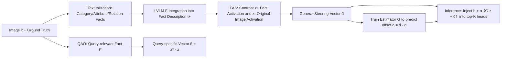

# AFTER: Mitigating Object Hallucinations in LVLMs with Adaptive Fact-guided Activation Editing

**Conference**: ICLR 2026  
**OpenReview**: [https://openreview.net/forum?id=ggycXmhrrG](https://openreview.net/forum?id=ggycXmhrrG)  
**Code**: [https://github.com/wytbwytb/AFTER](https://github.com/wytbwytb/AFTER)  
**Area**: Multimodal / LVLM Hallucination Mitigation  
**Keywords**: Object Hallucination, Activation Editing, Language Bias, Vision-Language Guidance, Inference-time Intervention  

## TL;DR
AFTER textualizes ground-truth image annotations into three categories of facts (category, attribute, and relationship). It constructs positive vision-text editing directions based on the activation difference between these factual descriptions and the original images. A lightweight estimator is then trained to estimate per-query offsets, adaptively pushing LVLM activations toward factual semantics, reducing hallucinations by up to 16.3% on the AMBER benchmark.

## Background & Motivation
**Background**: Large Vision-Language Models (LVLMs) have made significant progress in cross-modal tasks but suffer from object hallucinations—generating responses inconsistent with the actual objects in the image. Research generally attributes this to "language bias": models over-rely on textual priors from pre-training while ignoring external visual input. This leads to three types of errors: category hallucination (misidentifying a backpack as a snowboard), attribute hallucination (miscounting due to priors about gloves appearing in pairs), and relationship hallucination (high-frequency priors like "man wearing helmet" overriding the fact "man holding helmet").

**Limitations of Prior Work**: Methods to mitigate hallucinations follow two paths: training-based (retraining or adding new objectives, which is costly) and inference-time-based (contrastive decoding or multi-round correction, which involves high computation costs). "Inference-time activation editing" has recently emerged, intervening directly in internal activations using designed editing vectors, offering low overhead and good portability. However, representative methods like VTI and ICT construct "untrustworthy" activations by **degrading visual semantics** (injecting noise/blur) and comparing them with original activations to find an editing direction.

**Key Challenge**: These approaches only perform "subtraction" in the visual space and **completely ignore the positive guidance provided by factual textual semantics**. Facts inherent in ground-truth labels are not textualized to construct positive steering directions, making it difficult to explicitly bridge the vision-text gap or counteract language bias. Furthermore, different queries emphasize different objects with specific vision-text associations and offsets, yet existing methods use a **single** average editing vector for all queries, failing to adapt.

**Goal**: To develop an activation editing method that utilizes factual text as positive guidance and adaptively adjusts for each query.

**Core Idea**: **Fact Textualization + Query-Adaptive Offset**—Convert ground-truth annotations into fact texts (category/attribute/relationship). Use the difference between "factual text activation - original image activation" to derive a positive general steering vector (FAS). Then, train a query-aware estimator to predict offsets on top of the general vector to achieve fine-grained, per-query editing (QAO).

## Method

### Overall Architecture
AFTER consists of two sequential modules: **FAS (Fact-augmented Activation Steering)** and **QAO (Query-Adaptive Offset optimization)**. FAS first textualizes image ground-truth into factual descriptions to construct trustworthy/untrustworthy pairs. The activation difference provides a general positive vision-text editing vector. QAO then trains a lightweight estimator to superimpose query-specific offsets on the general vector. During inference, the combined "general vector + query offset" is applied to the top-K attention heads most affected by language bias.

### Key Designs

**1. Fact Textualization: Transforming three fact types into trustworthy semantics** — The premise of FAS is obtaining "positive, trustworthy" textual semantics to counter language bias. The most reliable signals are hidden in ground-truth annotations. The authors sample images from the COCO training set and convert annotations into three fact types: Category facts $T_c$ (direct labels), Attribute facts $T_a$ (color based on pixel ratio, shape based on polygon vertices and angles, count via frequency), and Relationship facts $T_r$ (spatial relations like left/right/overlap estimated from bbox center offsets and IoU proximity). These facts provide "counter-prior" factual anchors.

**2. FAS: Modeling positive steering via fact-image activation differences** — After obtaining discrete facts, an off-the-shelf LVLM $F$ (used for integration only, does not introduce new info or participate in target model $M$ inference) concatenates facts into a coherent description $t^+ = F(I_{fst}; (x, [T_c, T_a, T_r]))$. **The original visual information is treated as untrustworthy semantics, while the factual text description is treated as trustworthy.** For each image, $n$ hallucination-prone questions $q_i$ are paired to construct pairs $\langle(t^+, q_i),(x, q_i)\rangle$. Inputting these into $M$ yields activation pairs $\langle z_i^+, z_i\rangle$. The general steering vector is the average difference across the dataset:

$$\bar{d} = \frac{1}{n\cdot|X|}\sum_X \sum_{i=1}^{n}(z_i^+ - z_i)$$

Unlike previous methods using degraded images, FAS introduces textual facts into the visual space to explicitly bridge the vision-text gap.

**3. QAO: Estimating exclusive offsets for each query** — For the same image, different questions focus on different visual semantics, making a uniform vector $\bar d$ insufficient. QAO generates query-specific descriptions: for each object $q_{i,j}$ mentioned in question $q_i$, if it exists in the image ($q_{i,j}\in T_c$), a sub-description is extracted; otherwise, it explicitly states "$q_{i,j}$ is not in the image," forming a focused description $t_i^*$. This leads to a query-specific activation pair $\langle z_i^*, z_i\rangle$ and an optimal vector $\tilde d_i = z_i^* - z_i$. The desired offset is $o_i = \tilde d_i - \bar d$. A single-layer MLP estimator $G$ is trained with MSE loss to predict the offset from the query-focused activation $z_i$:

$$\mathcal{L}_G = \frac{1}{n\cdot|X|}\sum_X \sum_{i=1}^{n}\lVert G(z_i) - o_i\rVert^2$$

$G$ is extremely lightweight and efficient to train without fine-tuning the LVLM.

**4. Adaptive Editing Injection** — During inference, the combined vector is added to the top-K attention heads most impacted by language bias (those with the largest vector magnitudes):

$$h^{l+1} = h^l + \mathrm{Concat}_{k=1}^{H}\big(z^{l,k} + \alpha\cdot[G(z^{l,k}) + \bar d]\big)\cdot W_o^l$$

where $\alpha$ is the editing strength. This encourages the LVLM to allocate more attention to the edited visual information, suppressing hallucinations. Defaults are $K=64$ and $\alpha=7$.

## Key Experimental Results

### Main Results (POPE / MME / AMBER, three LVLMs)

| Model | Method | POPE ACC↑ | POPE F1↑ | AMBER CHAIR↓ | AMBER Hal↓ |
|------|------|-----------|----------|--------------|-------------|
| LLaVA-v1.5 | Baseline | 80.1 | 82.3 | 6.9 | 31.6 |
| LLaVA-v1.5 | VTI | 83.2 | 83.4 | 5.1 | 23.7 |
| LLaVA-v1.5 | ICT | 83.7 | 83.7 | 5.4 | 26.6 |
| LLaVA-v1.5 | **Ours** | **85.7** | **85.6** | **4.5** | **20.5** |
| InstructBLIP | Baseline | 80.3 | 82.0 | 7.4 | 35.4 |
| InstructBLIP | **Ours** | **83.5** | **84.2** | **5.2** | **25.1** |
| Shikra | Baseline | 78.9 | 80.3 | 10.9 | 49.5 |
| Shikra | VTI | 80.6 | 81.3 | 7.5 | 38.5 |
| Shikra | **Ours** | **82.5** | **82.5** | **6.9** | **33.2** |

Ours improves POPE accuracy by an average of 4.1% and F1 by 2.6%, outperforming the SOTA editing method ICT by 1.3%/0.9%. On AMBER, Shikra's hallucinations dropped by 16.3%, which is 5.3% better than the runner-up VTI.

### Ablation Study (w/o QAO)

| Model | Setting | POPE ACC↑ | AMBER Hal↓ |
|------|------|-----------|-------------|
| LLaVA-v1.5 | w/o QAO | 83.8 | 22.3 |
| LLaVA-v1.5 | Ours (Full) | 85.7 | 20.5 |
| Shikra | w/o QAO | 81.1 | 38.2 |
| Shikra | Ours (Full) | 82.5 | 33.2 |

Using only the general vector from FAS (w/o QAO) already significantly outperforms the baseline. Adding the QAO adaptive offset provides further gains, proving that per-query offsets are necessary to precisely eliminate query-specific language bias.

### Key Findings
- **High Generalizability**: Vectors learned from COCO discriminative questions transfer well to GQA (different category space) and generative AMBER tasks, indicating that AFTER learns to eliminate general language bias rather than over-fitting a specific dataset.
- **No Harm to General Capabilities**: MME scores increased by an average of 130.7 across perception/cognition dimensions, while the Cover metric remained stable, showing that suppressing hallucinations also enhances general visual capabilities.

## Highlights & Insights
- **Introducing Positive Guidance to Activation Editing**: Previous methods focused on "degrading vision → contrast" (subtraction). AFTER systematically uses factual text as a positive anchor, shifting from "moving away from untrustworthy" to "moving toward factual," directly addressing language bias.
- **Structured Textualization of Ground Truth**: The process of converting pixels (color), polygons (shape), and bboxes (relation) into natural language facts has intrinsic reusable value.
- **Efficient Query Adaptation**: The offset estimator is a simple MLP that leaves the LVLM untouched, yet upgrades the "static vector" to a "per-query vector" with high cost-efficiency.

## Limitations & Future Work
- **Dependence on Dense Ground Truth**: The textualization process relies on datasets like COCO with category/segmentation/bbox annotations. Generating facts in unannotated or weakly-annotated domains remains a challenge.
- **Need for an External LVLM $F$**: While $F$ does not participate in the final inference, the construction phase still introduces a dependency on an additional large model.
- **Hallucination-Comprehensiveness Trade-off**: There is a trade-off between suppressing hallucinations and response completeness. The paper notes minor changes in the Cover metric, suggesting a potential sacrifice in coverage when hallucinations are strongly suppressed.
- Hyperparameters like editing strength $\alpha$ and count $K$ are sensitive; optimal configurations across different models still require tuning.

## Related Work & Insights
- **Activation Editing Path**: VTI (stable visual features across perturbations) and ICT (global noise + local blur for untrustworthy semantics) are the direct competitors. AFTER differs by introducing positive factual guidance and query adaptation.
- **Other Inference-time Methods**: VCD, OPERA, and other contrastive decoding or iterative correction methods have higher overhead. Training-based methods like HACL require retraining. AFTER falls into the "low overhead + portable" category.
- **Insights**: The fact textualization approach can be extended to other scenarios where priors override evidence (e.g., language priors in VQA, layout priors in document understanding). The "general vector + lightweight estimator for offset" is a universal paradigm for upgrading static interventions to input-adaptive ones, which is valuable for future representation engineering research.

## Rating
- **Novelty**: ⭐⭐⭐⭐ — First systematic introduction of positive fact guidance in activation editing with query-adaptive offsets via a lightweight estimator.
- **Experimental Thoroughness**: ⭐⭐⭐⭐ — Covers POPE/MME/AMBER benchmarks, three LVLMs, and both discriminative/generative tasks with ablation and cross-distribution tests.
- **Writing Quality**: ⭐⭐⭐⭐ — Logical flow from motivation to method is smooth; Figure 2 and equations are well-aligned.
- **Value**: ⭐⭐⭐⭐ — High reference value for deploying LVLMs with suppressed hallucinations due to its low cost, portability, and lack of harm to general abilities. The main constraint is the reliance on dense annotations.

<!-- RELATED:START -->

## Related Papers

- [\[NeurIPS 2025\] GLSim: Detecting Object Hallucinations in LVLMs via Global-Local Similarity](../../NeurIPS2025/hallucination/glsim_detecting_object_hallucinations_in_lvlms_via_globalloc.md)
- [\[AAAI 2026\] Causally-Grounded Dual-Path Attention Intervention for Object Hallucination Mitigation in LVLMs](../../AAAI2026/hallucination/causally-grounded_dual-path_attention_intervention_for_objec.md)
- [\[CVPR 2026\] HulluEdit: Single-Pass Evidence-Consistent Subspace Editing for Mitigating Hallucinations in Large Vision-Language Models](../../CVPR2026/hallucination/hulluedit_single-pass_evidence-consistent_subspace_editing_for_mitigating_halluc.md)
- [\[CVPR 2026\] Tell Model Where to Look: Mitigating Hallucinations in MLLMs by Vision-Guided Attention](../../CVPR2026/hallucination/tell_model_where_to_look_mitigating_hallucinations_in_mllms_by_vision-guided_att.md)
- [\[ICLR 2026\] Hallucination Reduction with CASAL: Contrastive Activation Steering for Amortized Learning](hallucination_reduction_with_casal_contrastive_activation_steering_for_amortized.md)

<!-- RELATED:END -->
