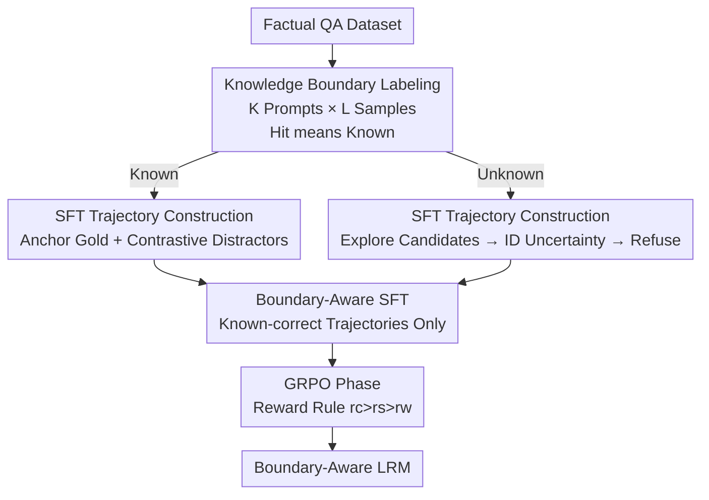

# BARREL: Boundary-Aware Reasoning for Factual and Reliable LRMs

**Conference**: ICLR 2026  
**OpenReview**: [https://openreview.net/forum?id=lUEedsO2RO](https://openreview.net/forum?id=lUEedsO2RO)  
**Code**: TBD  
**Area**: LLM Reasoning / Factual Reliability / Hallucination Mitigation  
**Keywords**: Large Reasoning Models, Knowledge Boundary, Uncertainty Refusal, Overthinking, GRPO

## TL;DR
Addressing the tendency of Large Reasoning Models (LRMs) to "hallucinate rather than admit ignorance" in factual QA, this paper identifies two pathological reasoning patterns triggered by "factual overthinking." It proposes BARREL, a three-stage training framework (Knowledge Boundary Labeling $\rightarrow$ Boundary-Aware SFT $\rightarrow$ GRPO with Reliability Rewards). BARREL improves the reliability of DeepSeek-R1-Distill-Llama-8B from 39.33% to 61.48% while simultaneously increasing accuracy.

## Background & Motivation
**Background**: Large Reasoning Models (LRMs) like OpenAI o1 and DeepSeek-R1 have shown impressive performance in specialized reasoning tasks (math, logic) through Long Chain-of-Thought (Long-CoT). It is naturally expected that this "deliberative" capability would also improve reliability in factual tasks.

**Limitations of Prior Work**: Factual performance has not improved and has even regressed—faithfulness hallucination rates are rising, and utility in factual tasks is declining. Specifically: 1) LRMs rarely admit "I don't know," often fabricating confident answers for unknown knowledge. 2) Responses are inconsistent. The paper decomposes factual reliability into "knowing" (whether the model possesses the knowledge) and "telling" (whether it can correctly articulate it), noting that current LRMs struggle with both.

**Key Challenge**: Initial experiments reveal a counter-intuitive phenomenon—**factual overthinking**: LRMs consume more reasoning tokens when answering incorrectly than when answering correctly. Longer thinking in factual QA often leads to errors rather than accuracy. This is driven by two pathological patterns:

- **Last-minute Guessing**: Occurs for unknown questions. After extensive but inconclusive reasoning, the model suddenly offers a speculative answer at the end—similar to a student guessing randomly before a deadline.
- **Second-thought Spiraling**: Occurs for known questions. The model initially finds the correct answer but continues over-analyzing until it overturns its own correct conclusion.

**Goal**: To enable LRMs to perform "boundary-aware" concise reasoning—resolutely answering known questions while actively admitting "Sorry, I don't know" for unknown ones.

**Key Insight**: Rather than using an external confidence classifier, reasoning discipline (exploring candidates before concluding and refusing if the search fails) should be **trained directly into the thinking process**. The root cause of the refusal failure is the current RL paradigm, which rewards "correctness" but never "refusal," incentivizing models to answer every question regardless of uncertainty.

**Core Idea**: Use "Knowledge Boundary Labeling + customized SFT trajectories for pathological patterns + GRPO with a moderate reward for refusal" to teach LRMs internal self-calibration of factual reliability.

## Method

### Overall Architecture
BARREL (Boundary-Aware Reasoning for Reliable and Factual LRMs) is a three-stage framework: (1) **Knowledge Boundary Labeling** to determine if a question is "known" or "unknown"; (2) **SFT Trajectory Construction** following specific CoT patterns; (3) **GRPO Stage** using a rule-based reliability reward (high for correct, medium for honest refusal, low for incorrect) to reinforce generalization.

### Key Designs

**1. Knowledge Boundary Labeling: Defining Boundaries via Sampling Hit Rates**

To teach the model when to answer and when to refuse, one must first identify its knowledge boundaries. BARREL uses a sampling strategy similar to Gekhman et al.: for each question $x_i$ in $D=\{(x_i,y_i^*)\}_{i=1}^N$, $K$ different few-shot prompts $\{P_j\}_{j=1}^K$ are used with $L$ samples each, resulting in a set $Y_i=\{y_i^{j,k}\}_{j=1,k=1}^{K,L}$. A question is "known" if at least one sample matches the gold answer $y_i^*$:

$$l_i=\begin{cases}\text{known},&\exists\,y\in Y_i,\ E(y,y_i^*)=1\\\text{unknown},&\text{otherwise}\end{cases}$$

This "hit-by-sampling" criterion uses the model's output distribution to probe its internal knowledge.

**2. Boundary-Aware SFT Trajectory Construction: Correcting Pathological Patterns**

Two types of evidence-supported reasoning trajectories $T(x_i)$ are constructed (starting with a `RECALL` of background knowledge):

- For **Known Questions** (correcting Second-thought Spiraling): The trajectory retrieves the gold answer with strong evidence $\langle y^*,e^*\rangle$, followed by weaker distractor candidates $\{(y_j,e_j)\}$, and finally uses `CONFIRM` to provide a confident conclusion. This avoids losing the correct answer among noise.
- For **Unknown Questions** (correcting Last-minute Guessing): The trajectory explores plausible pairs $\{(y_j,e_j)\}$, but if no sufficient evidence is found, it explicitly invokes `Acknowledge Uncertainty` and outputs a cautious refusal.

These trajectories are generated by GPT-4 and used for SFT. Crucially, **SFT is only performed on correct trajectories of known questions** to avoid encouraging hallucinations on unknown knowledge.

**3. GRPO with Moderate Refusal Reward: Internalizing the Accuracy-Refusal Trade-off**

SFT alone often leads to over-refusal. BARREL uses GRPO with a three-tier rule-based reward ($r_c$ for correct, $r_s$ for honest refusal, $r_w$ for wrong):

$$R(o_i,y_i^*)=\begin{cases}r_c,&E(o_i,y_i^*)=1\\r_s,&\text{Valid refusal phrase}\\r_w,&\text{otherwise}\end{cases},\qquad r_c>r_s>r_w$$

Empirically, $r_c=1$, $r_s=-0.5$, and $r_w=-1$. The **intermediate reward $r_s$ is the core innovation**: because the penalty for being wrong is heavier than for refusing, the model is incentivized to admit its knowledge boundary when uncertain. Since GRPO relies on rule-based rewards, it does not require known/unknown labels, allowing for better generalization.

### Loss & Training
- **SFT Objective**: $L(\theta)=-\sum_{i=1}^N\log P_\theta(o_i^*\mid x_i)$, trained only on known-correct trajectories.
- **GRPO Objective**: Standard clipped reward-weighted objective, with advantages calculated via group-relative reward normalization.
- **Reward Values**: $r_c=1,\ r_s=-0.5,\ r_w=-1$.

## Key Experimental Results

### Main Results
Evaluated on TriviaQA, SciQ, and NQ-Open (3000 questions total). Metrics: Accuracy (Acc.), Truthfulness (Truth. - counting honest refusals as "not wrong"), and Reliability (Rel. - a weighted balance).

| Model | Method | Acc. ↑ | Truth. ↑ | Rel. ↑ |
|------|------|--------|----------|--------|
| DeepSeek-R1-Distill-Llama-8B | Distill | 38.43 | 39.33 | 39.33 |
| DeepSeek-R1-Distill-Llama-8B | Vanilla GRPO w/ Probing | 40.30 | 58.67 | 55.29 |
| DeepSeek-R1-Distill-Llama-8B | **BARREL** | **40.70** | **70.40** | **61.58** |
| DeepSeek-R1-Distill-Qwen-7B | **BARREL** | **28.27** | **74.50** | **53.12** |
| Qwen3-8B | **BARREL** | **50.50** | **80.40** | **71.46** |

BARREL significantly boosts reliability across all models. Unlike post-processing methods (Probing) which often lose accuracy due to calibration bias, BARREL uses RL to internalize the accuracy-refusal trade-off within the reasoning chain.

### Ablation Study

| Configuration | Key Observation |
|------|---------|
| Full BARREL (SFT+GRPO) | High Acc. + High Truth. |
| SFT Only | Good Truth. but lower Acc. (over-refusal) |
| GRPO Only (Vanilla) | Almost no refusal (Abstain ≈ 0) |
| Higher known:unknown ratio in SFT | Acc. ↑ but Truth. ↓ (Trade-off exists) |

### Key Findings
- **Moderate Reward is Key**: Rewarding honest refusal between "correct" and "wrong" is essential for learning to refuse; standard GRPO fails to refuse because it lacks this incentive.
- **GRPO is Indispensable**: SFT teaches the refusal pattern, but GRPO corrects over-refusal and reasoning flaws, breaking the SFT performance ceiling.
- **Internal Calibration**: By resolving the "factual overthinking" issue, models learn to conclude reasoning earlier if no evidence is found.

## Highlights & Insights
- **Diagnosis of "Factual Overthinking"**: Quantifying that models use more tokens when failing and attributing it to specific "pathological patterns" allows for targeted methodological design.
- **Reward Structure Critique**: Identifying that the root cause of refusal failure lies in the binary "correct/wrong" reward structure of current RL is a valuable insight for the community.
- **Reasoning Discipline**: Training boundary awareness into the thinking process itself avoids the calibration biases typically associated with external binary classifiers or thresholding.
- **Transferable Trick**: Using sampling hit rates to define boundaries and restricting SFT to known-correct data are robust techniques for any factual alignment task.

## Limitations & Future Work
- **Boundary Label Dependency**: The "hit-rate" criterion is sensitive to sampling parameters ($K, L$), prompt design, and evaluator accuracy.
- **GPT-4 Dependency**: SFT trajectories rely on distillation from a stronger model, which may introduce its own biases.
- **Evaluation Scope**: Currently focuses on short-answer factual QA; applicability to multi-hop reasoning or open-ended generation is untested.
- **Model Scale**: Experiments were limited to 7-8B models.

## Related Work & Insights
- **vs. Knowledge Boundary Methods**: Unlike external probes or post-hoc confidence estimates, BARREL embeds boundary awareness into an interpretable reasoning structure.
- **vs. Standard Factual Alignment**: BARREL specifically targets the pathological reasoning patterns of LRMs and uses a three-tier reward system to enable self-calibration during RL.

## Rating
- Novelty: ⭐⭐⭐⭐⭐ 
- Experimental Thoroughness: ⭐⭐⭐⭐ 
- Writing Quality: ⭐⭐⭐⭐⭐ 
- Value: ⭐⭐⭐⭐⭐ 

<!-- RELATED:START -->

## Related Papers

- [\[ICLR 2026\] Mechanistic Detection and Mitigation of Hallucination in Large Reasoning Models](mechanistic_detection_and_mitigation_of_hallucination_in_large_reasoning_models.md)
- [\[NeurIPS 2025\] Reasoning Models Hallucinate More: Factuality-Aware Reinforcement Learning for Large Reasoning Models](../../NeurIPS2025/hallucination/reasoning_models_hallucinate_more_factuality-aware_reinforcement_learning_for_la.md)
- [\[ICLR 2026\] High Accuracy, Less Talk (HALT): Reliable LLMs through Capability-Aligned Finetuning](high_accuracy_less_talk_halt_reliable_llms_through_capability-aligned_finetuning.md)
- [\[ICLR 2026\] HARP: Hallucination Detection via Reasoning Subspace Projection](harp_hallucination_detection_via_reasoning_subspace_projection.md)
- [\[ICLR 2026\] Leveraging Pretrained Knowledge at Inference Time: LoRA-Gated Contrastive Decoding for Multilingual Factual Language Generation in Adapted LLMs](leveraging_pretrained_knowledge_at_inference_time_lora-gated_contrastive_decodin.md)

<!-- RELATED:END -->
