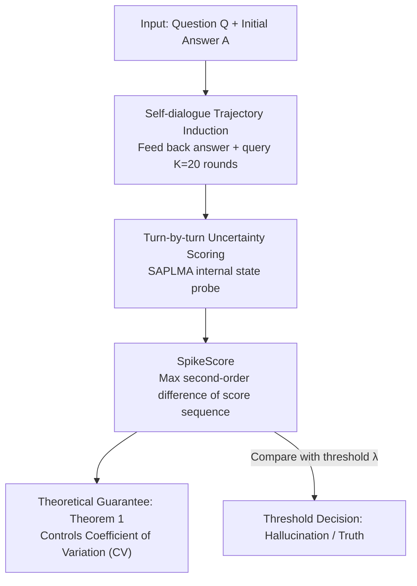

# Beyond In-Domain Detection: SpikeScore for Cross-Domain Hallucination Detection

**Conference**: ICLR2026  
**OpenReview**: [https://openreview.net/forum?id=Y16qXOaylp](https://openreview.net/forum?id=Y16qXOaylp)  
**Code**: To be confirmed  
**Area**: Hallucination Detection / LLM Reliability  
**Keywords**: Hallucination detection, cross-domain generalization, multi-turn self-dialogue, second-order difference, uncertainty

## TL;DR
The authors discovered that multi-turn self-dialogues elicited from hallucinated answers exhibit uncertainty score fluctuations with far more intense "spikes" than those from truthful answers. They quantify this volatility as **SpikeScore** (the maximum second-order difference of the score sequence). By using a single threshold, SpikeScore enables hallucination detection across multiple domains while being trained only on a single domain. Its cross-domain AUROC consistently outperforms specialized methods like PRISM and ICR Probe across four LLMs and six benchmarks.

## Background & Motivation
**Background**: LLM hallucination detection is currently divided into two categories. Training-free methods rely on internal model signals—such as perplexity, semantic entropy, consistency, or attention patterns—to judge reliability. Training-based methods (e.g., SAPLMA, SEP) attach a lightweight classifier to hidden layer activations to predict truthfulness. The latter is generally stronger on **in-domain** test sets and has become mainstream.

**Limitations of Prior Work**: Training-based methods suffer from a critical flaw—**collapse during domain transfer**. Research shows that methods like SAPLMA and SEP experience sharp performance drops when the test domain differs from the training domain, as they learn "domain-specific features" vulnerable to distribution shifts. Thus, the strongest methods are often the least suitable for real-world deployment.

**Key Challenge**: There is a tension between separability and domain invariance. Previous work mostly focused on "Challenge 1"—separating hallucinated from truthful answers within a single domain—while real-world applications require "Challenge 2"—maintaining this separability across different domains. Metrics satisfying both have been missing.

**Goal**: The authors formally define this neglected problem as **Generalizable Hallucination Detection (GHD)**: training a detector using data from a single training domain $P_{Q,T}$ to perform stably across $N$ related test domains $P^1_{Q,T},\dots,P^N_{Q,T}$. When $N=1$ and the test domain equals the training domain, GHD reduces to classical hallucination detection.

**Key Insight**: An interesting phenomenon provided inspiration—LLMs often **contradict themselves** in multi-turn dialogues. Especially when a user changes position or repeatedly questions them, models may flip their stance. The authors hypothesize that this instability is an external manifestation of internal uncertainty, and **the instability triggered by hallucinated answers is significantly higher than that of truthful ones**, as incorrect answers more easily trigger self-correction mechanisms. Crucially, this "shaking" is a **cross-domain universal** behavior independent of specific topics.

**Core Idea**: By re-feeding the initial answer into the context and asking follow-up questions to construct a "self-dialogue trajectory," uncertainty scores can be calculated for each round. Hallucination trajectories show **sharply rising and falling spikes**, whereas truthful trajectories are relatively smooth. Capturing these local mutations using the "maximum second-order difference (curvature)" of the score sequence yields SpikeScore, a domain-invariant hallucination metric.

## Method

### Overall Architecture
Given a question $Q$ and an initial answer $A$, the method does not look at static features of the answer. Instead, it **makes the model converse with itself**: using $A$ as the starting point, a set of general follow-up prompts induces subsequent answers $A_2,\dots,A_K$ (default $K=20$), forming a standardized "self-dialogue trajectory." For each turn, a training-based scorer (default SAPLMA) calculates an uncertainty score, resulting in a sequence $S(Q,A)=[S(A_1),\dots,S(A_K)]$. Then, **SpikeScore = maximum second-order difference** is calculated to capture the most intense "spike." Finally, SpikeScore is compared against a threshold $\lambda$: if it exceeds the threshold, it is judged as a hallucination. This pipeline is **post-hoc** and compatible with upstream workflows like RAG.

### Key Designs

**1. Self-dialogue Trajectory Induction: Turning static answers into observable dynamic instability**

Previous detectors only looked at the "single point" of the answer, missing the model's reaction to questioning. The authors treat $A_1=A$ as the first turn and use a pre-defined library of follow-up prompts to induce subsequent answers. The generation of the $k$-th turn answer is formalized as:
$$A_k \sim P_\theta(\cdot \mid Q, A_1, P_2, A_2, \dots, P_i, A_i, \dots, P_k),\quad k>1,$$
where $P_i$ represents the $i$-th induction prompt. These prompts simulate a user following up on previous rounds. This expands each $(Q,A)$ into a **standardized, statistical** trajectory, turning internal uncertainty into a quantifiable curve. This generalizes across domains because "shaking when questioned" is a universal model behavior.

**2. SpikeScore: Capturing local spikes rather than global variance**

Direct metrics like variance or coefficient of variation (as used in Sun et al. 2025a) reflect overall fluctuations but can **smooth out** the most critical feature of hallucination trajectories—local spikes. The authors argue that **local curvature** is more sensitive and define SpikeScore as the maximum second-order difference:
$$\mathrm{Max}|\Delta^2|(S(Q,A)) = \max_{1<k<K-1}\big|\,S(A_{k+1}) - 2S(A_k) + S(A_{k-1})\big|.$$
The second-order difference is the discrete equivalent of "curvature," peaking where the curve rises and falls sharply. Hallucinated answers oscillate during self-correction, producing large second-order differences, while truthful answers remain smooth.

**3. Theoretical Guarantee: Proving cross-domain separation under controlled CV**

The authors establish two empirical observations: **Expectation Invariance** (mean SpikeScore for hallucinations is more than twice that of truth: $2\,\mathbb{E}_{\text{truth}} < \mathbb{E}_{\text{hal}}$) and **Standard Deviation Disparity**. Theorem 1 provides the bridge: if the **Coefficient of Variation** $\mathrm{CV} \le 0.1 \cdot t$ is controlled for truthful samples, then:
$$P\big(\mathrm{Max}|\Delta^2|(S(Q',H')) > \mathrm{Max}|\Delta^2|(S(Q,A))\big) \ge \frac{1}{1+0.0725\cdot t^2},$$
providing a lower bound for the probability that a hallucinated sample's SpikeScore exceeds a truthful one. Experiments show CV $\le 0.2$ ($t=2$), yielding a separation probability $\ge 0.775$. This bound characterizes **cross-domain** separability rather than just single-domain.

**4. Threshold detection, backbone independence, and RAG extension**

The final detector is minimalist:
$$D_\lambda(Q,A) = \begin{cases}0, & \mathrm{Max}|\Delta^2|(S(Q,A)) < \lambda \ (\text{Truth})\\ 1, & \text{Otherwise} \ (\text{Hallucination})\end{cases}$$
SpikeScore is a **framework decoupled from the scorer**. When attached to various backbones (SAPLMA, SEP, Perplexity, Reasoning score, etc.), it consistently improves detection, proving that "spiky trajectories" are a **universal, transferable** feature.

### Loss & Training
SpikeScore itself requires no new training. Only the backbone scorer is trained. For SAPLMA, an MLP + sigmoid is attached to internal representations $E_\theta(\cdot)$ to produce probability $p_W(\cdot)\in[0,1]$, optimized via cross-entropy:
$$\hat W \in \arg\min_W -\frac1n\sum_{i=1}^n \Big[y_i\log p_W(E_\theta(A_i\mid Q_i)) + (1-y_i)\log\big(1-p_W(E_\theta(A_i\mid Q_i))\big)\Big].$$
Training occurs on **only one** domain; cross-domain capability comes from the geometric post-processing of SpikeScore. The default trajectory length is $K=20$.

## Key Experimental Results

### Main Results
Four LLMs (Llama-3.2-3B / 3.1-8B, Qwen3-8B / 14B) and six benchmarks (TriviaQA, CommonsenseQA, Belebele, CoQA, Math, SVAMP) were used. A "leave-one-domain-out" protocol was applied.

| Model | Perplexity | SAPLMA (Training-based) | PRISM | ICR Probe | **SpikeScore** |
|------|-----------|-------------------|-------|-----------|----------------|
| Llama-3.2-3B | 0.5953 | 0.5693 | 0.6953 | 0.7463 | **0.7474** |
| Llama-3.1-8B | 0.6425 | 0.5764 | 0.7029 | 0.7439 | **0.7860** |
| Qwen3-8B | 0.6111 | 0.5705 | 0.7032 | 0.7381 | **0.7473** |
| Qwen3-14B | 0.6302 | 0.5787 | 0.7072 | 0.7435 | **0.7874** |

Traditional training-based methods collapsed cross-domain (AUROC 0.53–0.58). SpikeScore achieved the highest average AUROC across all models.

### Ablation Study

| Configuration | Key Conclusion |
|------|---------|
| SpikeScore + SAPLMA | Llama-3.1-8B 0.7860 (Best) |
| SpikeScore + SEP | Remains strong (0.7684) |
| SpikeScore + Reasoning score | Training-free backbone also effective (0.7595) |
| 2nd Diff vs. CV | 2nd Diff outperforms; local curvature is more discriminative |
| Dialogue turns K | Performance saturates at 15–20 turns |

### Key Findings
- **Backbone Independence**: SpikeScore works across five different backbones, proving "hallucination spikes" are a universal property.
- **2nd Order > 1st Order**: Local curvature is more discriminative than global variance.
- **Scale Matters**: Model performance improves with size (8B → 14B), as larger models exhibit clearer self-correction patterns.
- **RAG Capability**: SpikeScore significantly outperforms ICR Probe in TriviaQA and RAGTruth scenarios.

## Highlights & Insights
- **From Static Answers to Dialogue Dynamics**: Instead of analyzing static answer features, observing the response trajectory during questioning provides a domain-invariant signal.
- **Mathematical Intuition**: The choice of second-order difference precisely captures the "sharp jump and drop" corresponding to the physical intuition of "oscillating during self-correction."
- **Closing the Loop**: The logic chain from statistical observation to Theorem 1 to threshold detection is highly complete.

## Limitations & Future Work
- **Backbone Dependence**: SpikeScore requires a backbone scorer; it is significantly weaker with training-free backbones like Perplexity.
- **Inference Cost**: Inducing 20 turns of dialogue for every question is computationally expensive compared to single-step detection.
- **Theoretical Assumptions**: Theorem 1 relies on the observation of controlled CV, which may not hold in extremely heterogeneous or adversarial domains.

## Related Work & Insights
- **vs SAPLMA / SEP**: These learn domain-specific static features. SpikeScore transforms these into domain-invariant dynamic curvature signals.
- **vs PRISM / ICR Probe**: While these are strong cross-domain baselines, they focus on single-step features. SpikeScore leverages multi-turn dynamics to capture domain-invariant instability.
- **Insight**: Model self-contradiction, usually seen as a flaw, is utilized here as a signal, suggesting that "weakness behaviors" encode detectable information about internal confidence.

## Rating
- Novelty: ⭐⭐⭐⭐⭐ Shifts hallucination detection from static features to multi-turn dynamics.
- Experimental Thoroughness: ⭐⭐⭐⭐⭐ Extensive testing across 4 models, 6 datasets, and various backbones.
- Writing Quality: ⭐⭐⭐⭐ Clear progression from phenomenon to metric to theory.
- Value: ⭐⭐⭐⭐⭐ Directly addresses the critical issue of cross-domain collapse in deployment.

<!-- RELATED:START -->

## Related Papers

- [\[ICLR 2026\] VeriTrail: Closed-Domain Hallucination Detection with Traceability](veritrail_closed-domain_hallucination_detection_with_traceable_evidence_synthes.md)
- [\[ACL 2025\] Learning Auxiliary Tasks Improves Reference-Free Hallucination Detection in Open-Domain Long-Form Generation](../../ACL2025/hallucination/learning_auxiliary_tasks_improves_reference-free_hallucination_detection_in_open.md)
- [\[ICLR 2026\] Enhancing Hallucination Detection through Noise Injection](enhancing_hallucination_detection_through_noise_injection.md)
- [\[ICLR 2026\] Cat-PO: Cross-modal Adaptive Token-rewards for Preference Optimization in Truthful Multimodal LLMs](cat-po_cross-modal_adaptive_token-rewards_for_preference_optimization_in_truthfu.md)
- [\[ICLR 2026\] Learning to Reason for Hallucination Span Detection](learning_to_reason_for_hallucination_span_detection.md)

<!-- RELATED:END -->
