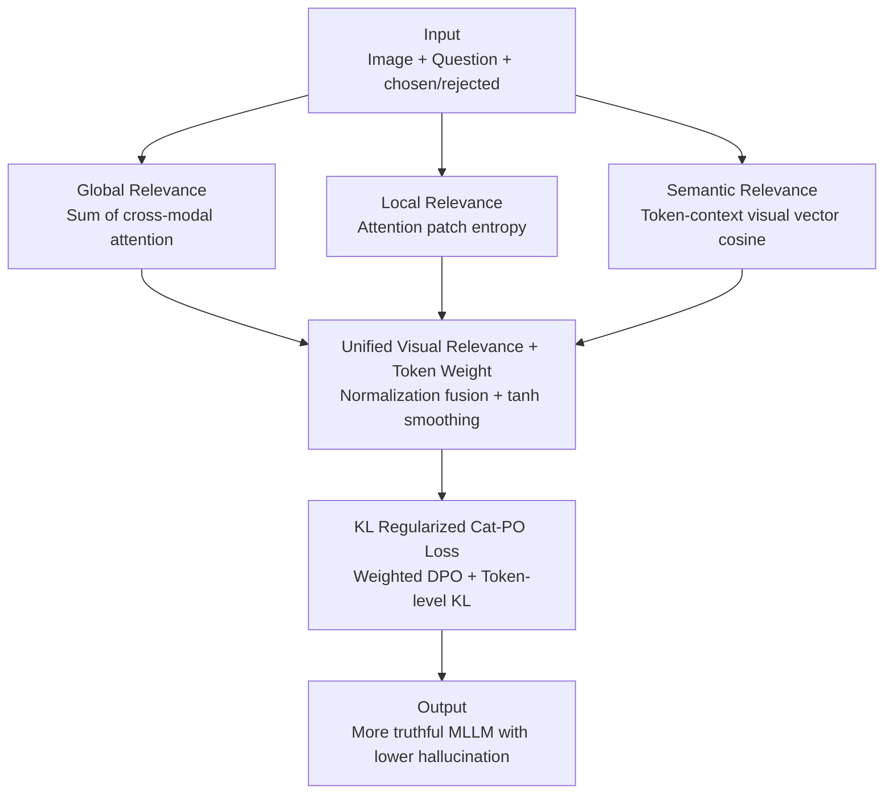

# Cat-PO: Cross-modal Adaptive Token-rewards for Preference Optimization in Truthful Multimodal LLMs

**Conference**: ICLR2026  
**OpenReview**: [https://openreview.net/forum?id=iIbe6qDN0A](https://openreview.net/forum?id=iIbe6qDN0A)  
**Code**: https://github.com/gavinzzx/CatPO  
**Area**: Multimodal VLM / Hallucination Mitigation / Preference Optimization  
**Keywords**: Multimodal Hallucination, DPO, Token-level Reward, Cross-modal Attention, Truthfulness Alignment

## TL;DR
Addressing the hallucination issue in MLLMs, this paper proposes Cat-PO: using only the model's internal cross-modal attention and similarity, it calculates a three-tier visual relevance (global, local, and semantic) for each generated token. These are fused into a smooth token reward to reweight the DPO loss along with a token-level KL regularization for fine-grained hallucination correction, outperforming existing SOTAs by 7%–15% on benchmarks like AMBER-Generation and MM-Hal.

## Background & Motivation

**Background**: Multimodal Large Language Models (MLLMs) excel in image-text understanding and reasoning but suffer from "hallucinations"—generating textual descriptions inconsistent with the input image (e.g., nonexistent objects, incorrect attributes, or relations). To mitigate this, preference learning via Direct Preference Optimization (DPO) has become a primary tool due to its simplicity and stability without requiring a separate reward model.

**Limitations of Prior Work**: The authors observe two common flaws in current multimodal preference optimization during the "preference data decoding stage." First, the degree of correlation between different tokens and visual content varies significantly. As shown in Figure 1(a), visual keywords like "laptop" and "cup" exhibit much higher cross-modal attention and similarity than functional words like "the" or "are." However, existing DPO methods treat all tokens equally, lacking fine-grained correction. Second, many methods rely on external visual detectors, additional noise injection, expensive closed-source LLM APIs, or external tools to construct preference signals, ignoring the MLLM's inherent multimodal capabilities and increasing costs.

**Key Challenge**: Hallucination correction signals should be token-level and derived from image-text correlation strength, yet DPO gradients are "flattened" across all tokens in a response (the "flat gradient distribution" in the upper part of Figure 1(c)). This uniform treatment prevents visual-critical tokens from receiving focused gradients for reinforcement or punishment.

**Key Insight**: A statistical experiment (Figure 1(b)) shows that applying DPO only to the top 50% of tokens with high rewards in the chosen response significantly improves AMBER-F1 and MM-Hal scores compared to original DPO. Weighting all tokens further enhances performance. This demonstrates that token-level visual relevance is a valid alignment signal and can be extracted internally from the MLLM (attention, similarity) without external tools.

**Core Idea**: Use the MLLM's own cross-modal attention and semantic similarity to hierarchically calculate a visual relevance reward for each token. This reward reshapes the DPO gradient distribution (the "targeted gradient distribution" in the lower part of Figure 1(c)), ensuring focused reinforcement or punishment for visual-critical tokens.

## Method

### Overall Architecture

Cat-PO is built upon standard DPO, with a pipeline consisting of four steps: "Extracting signals from internal MLLM → Calculating token rewards → Injecting rewards into DPO loss" (corresponding to Figure 2):

1.  **Input**: Each preference sample is $(I, x, y^+, y^-)$. The image $I$ is projected to feature space via CLIP+ViT, and Q&A tokens are embedded via the LLM tokenizer.
2.  **Internal Feature Extraction**: Inside the multimodal transformer, the cross-modal attention of each token toward the image and the semantic similarity between the token and the image are extracted.
3.  **Token Reward Calculation**: Global, local, and semantic relevance are calculated hierarchically. These are fused into a unified visual relevance score after normalization and mapped to token weights using a tanh function; chosen and rejected responses use different mapping formulas.
4.  **Weighted Cat-PO Loss**: Token weights are integrated into the DPO loss with an additional weight-modulated token-level KL regularization term for joint optimization.

The entire process avoids external detectors, noise injection, or closed-source APIs, as reward signals come entirely from the MLLM itself.

### Key Designs

**1. Global Relevance from Cross-modal Attention: Quantifying token attention to the whole image**

To address the issue of treating all tokens uniformly, the first layer uses existing cross-modal attention. For the $t$-th token $y_t$ in a response acting as the query, and $N_p$ visual token features $\{v_1,\dots,v_{N_p}\}$ acting as keys/values, the attention sequence $\{a_{t,1},\dots,a_{t,N_p}\}$ is obtained. Global relevance is defined as the sum of these attention scores:

$$S_{\text{global}}(y_t) = \sum_{j=1}^{N_p} a_{t,j}$$

Higher $S_{\text{global}}$ indicates the model looks more "holistically" at the image when processing that token, capturing whether it attends to the image at all.

**2. Local Relevance from Patch Entropy: Distinguishing "focus" vs. "diffusion"**

Global relevance does not distinguish whether attention is concentrated on key patches or scattered. The authors use information entropy to characterize this focus: attention is normalized into a probability distribution $P_{t,j} = a_{t,j}/\sum_k a_{t,k}$, and patch entropy is calculated:

$$H(P_t) = -\sum_{j=1}^{N_p} P_{t,j}\log(P_{t,j}+\epsilon)$$

The local relevance is obtained by subtracting normalized entropy from 1:

$$S_{\text{local}}(y_t) = 1 - \frac{H(P_t)}{\log N_p}$$

Lower entropy translates to higher $S_{\text{local}}$, meaning attention is sharply focused on specific patches, indicating a strong bond with a local visual region.

**3. Semantic Relevance from Cross-modal Similarity: Supplementing semantic alignment via pre-trained encoder priors**

Attention indicates focus but not necessarily semantic correctness. An external semantic prior is introduced using a pre-trained cross-modal encoder: visual features are weighted by attention $\alpha_{t,j}$ to obtain a contextual visual vector $v_c(y_t)=\sum_j \alpha_{t,j} v_j$, which is then compared to the token embedding $e(y_t)$ via cosine similarity:

$$S_{\text{semantic}}(y_t) = \cos\big(e(y_t), v_c(y_t)\big) = \frac{e(y_t)\cdot v_c(y_t)}{\|e(y_t)\|\,\|v_c(y_t)\|}$$

This measures alignment between the token and its attended visual region, complementing attention-based metrics ("Where to look" vs. "Is it correct").

**4. Unified Relevance Fusion + Smooth Token Weights + KL Regularized Cat-PO Loss**

Signals are fused, normalized to $[0,1]$, and weighted by $\alpha$ between the "attention branch" and "semantic branch":

$$s_i = \alpha\big(0.5\,S_{\text{global},i} + 0.5\,S_{\text{local},i}\big) + (1-\alpha)\,S_{\text{semantic},i}$$

To ensure gradient stability, weights are smoothed via $T_i=\tanh(s_i)\in(0,1)$ with a base weight $\lambda_{\text{ref}}>0$. Inverse mappings are used for chosen and rejected:

$$w_i = \begin{cases}\lambda_{\text{ref}} + T_i, & y_i\in y^+\\ \lambda_{\text{ref}} + (1-T_i), & y_i\in y^-\end{cases}$$

This rewards tokens in the chosen response that fit the image and punishes misaligned/hallucinated tokens in the rejected response. The weighted DPO loss is:

$$\mathcal{L}_{\text{wDPO}} = -\log \sigma\Big(\beta\big(\pi_\theta^{(w)} - \pi_{\text{ref}}^{(w)}\big)\Big)$$

Where $\pi_\theta^{(w)}=\sum_t\big(w_t^+\log\pi_\theta(y_t^+|h_t^+) - w_t^-\log\pi_\theta(y_t^-|h_t^-)\big)$. A token-level KL penalty is added:

$$\mathcal{L}_{\text{KL}} = \lambda\Big(\sum_t w_t^+\,\text{KL}\big(\pi_\theta(\cdot|h_t^+)\,\|\,\pi_{\text{ref}}(\cdot|h_t^+)\big) + \sum_t w_t^-\,\text{KL}\big(\pi_\theta(\cdot|h_t^-)\,\|\,\pi_{\text{ref}}(\cdot|h_t^-)\big)\Big)$$

The final objective is $\mathcal{L}_{\text{Cat-PO}} = \mathcal{L}_{\text{wDPO}} + \mathcal{L}_{\text{KL}}$.

### Loss & Training
Training uses the RLHF-V dataset (5,733 samples). The model is trained for 6 epochs with an effective batch size of 32. Hyperparameters are $\beta_{\text{DPO}}=0.1$, $\alpha\approx0.5$, and $\lambda_{\text{KL}}=0.03$.

## Key Experimental Results

### Main Results
Using LLaVA-v1.5-7B/-13B and RLHF-V data, Cat-PO is compared against mainstream alignment methods:

| Model / Method | AMBER-Gene F1 ↑ | AMBER-Gene CHAIR ↓ | MM-Hal Score ↑ | MM-Hal Rate ↓ | LLaVA ↑ |
|------|------|------|------|------|------|
| LLaVA-v1.5-7B (Base) | 74.3 | 7.8 | 2.01 | 61.4 | 65.6 |
| + DPO | 82.1 | 5.7 | 2.14 | 58.3 | 69.1 |
| + RLHF-V | 78.5 | 5.5 | 2.02 | 60.4 | 68.0 |
| + V-DPO | 81.6 | 5.6 | 2.16 | 56.0 | - |
| + TPO | 85.0 | - | 2.47 | 51.0 | 70.2 |
| **+ Cat-PO (Ours)** | **85.3** | **4.8** | **2.74** | **42.0** | **70.3** |

On 7B, the MM-Hal Score increased from 2.14 (DPO) to 2.74, and the Hallucination Rate dropped from 58.3% to 42.0%. Similar gains were observed on 13B and Qwen2.5-VL-3B.

### Ablation Study

| Configuration | MM-Hal Score ↑ | MM-Hal Rate ↓ | CHAIR ↓ |
|------|------|------|------|
| DPO-only | 2.14 | 58.3 | 5.7 |
| Attention-only | 2.34 | 55.0 | 5.3 |
| Similarity-only | 2.51 | 47.0 | 5.1 |
| Cat-PO without KL | 2.36 | 53.0 | 5.1 |
| **Cat-PO (Full)** | **2.74** | **42.0** | **4.8** |

### Key Findings
- **Complementarity**: Attention and semantic similarity both provide gains individually, but their combination is most effective. The KL term is essential for stability.
- **Weighted Token Ratio**: Weighting all tokens (100%) yields better results than just the top 30% or 50%, suggesting that even lower-ranked tokens contribute to alignment.
- **Reward Accuracy**: Weighting the top 30% tokens provides significantly more gain than weighting the bottom 30%, verifying the reward captures critical visual tokens.
- **Learnable Fusion Issues**: Replacing fixed coefficients with learnable parameters led to performance degradation (MM-Hal Rate rose from 42% to 50%). Fixed uniform weighting is more robust as it avoids overfitting noise.

## Highlights & Insights
- **Self-contained Signals**: The fact that reward signals originate entirely from the model itself is a major advantage. Extracting token-level alignment from existing attention and similarity is cost-effective and highly portable.
- **Three-tier Correction**: Robustness analysis shows that semantic similarity can correct misaligned attention, while sharp attention can compensate for low similarity. This "multi-view verification" approach is transferable to other alignment tasks.
- **Symmetric Mapping**: The $\lambda_{\text{ref}}+T_i$ and $\lambda_{\text{ref}}+(1-T_i)$ mapping is a clean, reusable trick to achieve simultaneous reinforcement and punishment.

## Limitations & Future Work
- **Dependency on Preference Data**: The method reshapes DPO weights but still relies on pre-annotated chosen/rejected pairs (e.g., RLHF-V).
- **Adversarial Scenarios**: Performance drops slightly on the POPE Adversarial subset, suggesting reward robustness in highly deceptive scenarios can be improved.
- **Fixed Fusion**: Learnable fusion underperformed, indicating the current approach relies on empirical heuristics. Adaptive fusion without noise overfitting remains an open question.
- **External Encoder Bias**: Semantic relevance relies on a pre-trained encoder; its biases might propagate into the rewards.

## Related Work & Insights
- **vs. DPO**: Standard DPO uses a flat gradient; Cat-PO uses a targeted gradient for fine-grained correction without altering the DPO framework.
- **vs. TPO**: Both use token-level info, but Cat-PO utilizes a three-tier fusion and performs better on MM-Hal (Rate 42.0 vs 51.0).
- **vs. RLHF-V / POVID**: These improve the "data side," while Cat-PO improves the "loss/decoding side." They are orthogonal and can be combined.

## Rating
- Novelty: ⭐⭐⭐⭐ 
- Experimental Thoroughness: ⭐⭐⭐⭐ 
- Writing Quality: ⭐⭐⭐⭐ 
- Value: ⭐⭐⭐⭐ 

<!-- RELATED:START -->

## Related Papers

- [\[CVPR 2026\] MoD-DPO: Towards Mitigating Cross-modal Hallucinations in Omni LLMs using Modality Decoupled Preference Optimization](../../CVPR2026/hallucination/mod-dpo_towards_mitigating_cross-modal_hallucinations_in_omni_llms_using_modalit.md)
- [\[NeurIPS 2025\] Mitigating Hallucination Through Theory-Consistent Symmetric Multimodal Preference Optimization](../../NeurIPS2025/hallucination/mitigating_hallucination_through_theory-consistent_symmetric_multimodal_preferen.md)
- [\[ICLR 2026\] P2-DPO: Grounding Hallucination in Perceptual Processing via Calibration Direct Preference Optimization](p2-dpo_grounding_hallucination_in_perceptual_processing_via_calibration_direct_p.md)
- [\[CVPR 2026\] MAD: Modality-Adaptive Decoding for Mitigating Cross-Modal Hallucinations in Multimodal Large Language Models](../../CVPR2026/hallucination/mad_modality-adaptive_decoding_for_mitigating_cross-modal_hallucinations_in_mult.md)
- [\[CVPR 2026\] Cross-Modal Attention Calibration for LVLM Hallucination Mitigation](../../CVPR2026/hallucination/cross-modal_attention_calibration_for_lvlm_hallucination_mitigation.md)

<!-- RELATED:END -->
