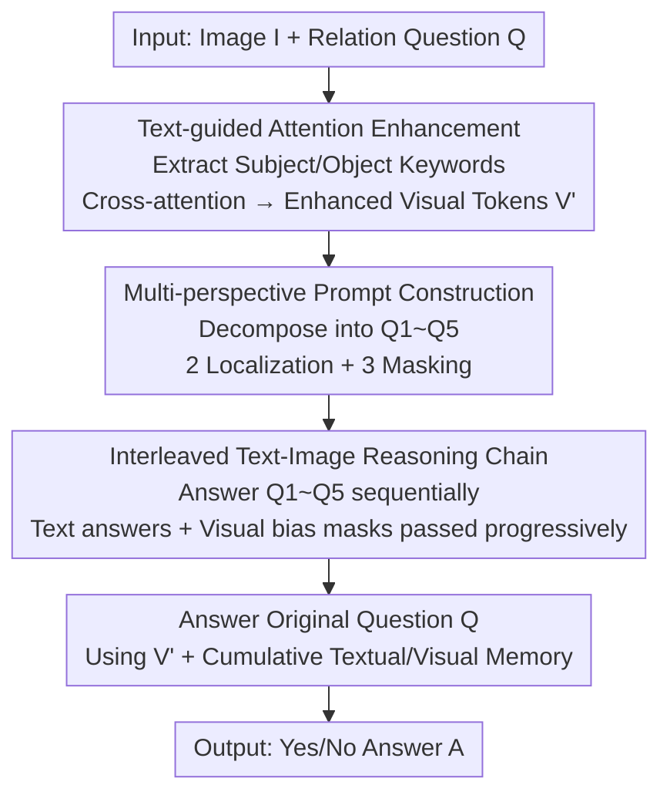

# ChainMPQ: Interleaved Text-Image Reasoning Chains for Mitigating Relation Hallucinations

**Conference**: ICLR2026  
**OpenReview**: [https://openreview.net/forum?id=x5UMMVUfkO](https://openreview.net/forum?id=x5UMMVUfkO)  
**Code**: [Project Page](https://yike-wu.github.io/chainmpq-project)  
**Area**: Multimodal VLM / Hallucination Mitigation  
**Keywords**: Relation Hallucination, LVLM, Interleaved Text-Image Reasoning Chains, Multi-perspective Problems, Attention Enhancement

## TL;DR
ChainMPQ is a training-free reasoning framework that decomposes "Subject-Relation-Object" questions into five complementary sub-questions. These are fed sequentially to Large Vision-Language Models (LVLMs), passing textual answers and visual attention memory to subsequent steps to form an interleaved text-image reasoning chain, consistently reducing relation hallucinations across multiple LVLMs and benchmarks.

## Background & Motivation
**Background**: Large Vision-Language Models (LVLMs) demonstrate strong performance in image captioning and visual question answering but still suffer from hallucinations. Hallucinations are generally categorized into three types: object hallucinations (midentifying entities), attribute hallucinations (midentifying attributes like color/shape), and relation hallucinations (correctly identifying entities but inferring wrong relationships).

**Limitations of Prior Work**: While object and attribute hallucinations have been significantly mitigated by methods like preference optimization, contrastive decoding, and intermediate layer corrections, relation hallucinations account for nearly 40% of all hallucinations yet have received the least dedicated attention. Existing works (high-quality fine-tuning data, constraint-aware prompting, Detect-then-Calibrate using logits, or Triplet Description) all treat relation reasoning as **one-step inference**, expecting the model to simultaneously recognize entities and judge relations.

**Key Challenge**: One-step inference relies heavily on linguistic priors rather than systematic visual analysis. For instance, given "a man stand on a surfboard," the model might output "yes, standing" based on linguistic patterns upon seeing "man" and "surfboard," without verifying the image actually shows "riding." The root cause is compressing "locating entities" and "judging relations"—tasks that should be sequential—into a single step, where visual evidence is overshadowed by linguistic priors.

**Key Insight**: Human relation reasoning is **structurally decomposed**—first locating and identifying relevant objects, then observing their interactions, and finally concluding based on visual evidence. The authors build on this observation and borrow from Interleaved Chain-of-Thought (ICoT), which progressively updates intermediate visual states during reasoning.

**Core Idea**: Replace "one-step inference" with "decomposition + progressive multimodal memory." The relation question is decomposed into multi-perspective sub-questions focused on subject/object/relation. By performing sequential reasoning and using preceding **textual answers** and **visual attention** as memory, the reasoning process is made explicit, progressively eliminating relation hallucinations.

## Method

### Overall Architecture
The task is defined as follows: Given an image $I$ and a relation question $Q$ (e.g., "Is the man standing on the surfboard?"), output an accurate Yes/No answer $A$. Relation hallucination refers to cases where the model detects the subject and object correctly but provides an incorrect relation judgment.

ChainMPQ is a training-free framework consisting of three serial modules: (1) **Text-guided attention enhancement**, which extracts subject/object keywords and uses cross-attention to amplify corresponding image regions for enhanced visual tokens $V'$; (2) **Multi-perspective perception prompt construction**, decomposing the original question into 5 complementary sub-questions; (3) **Interleaved text-image reasoning chain**, where sub-questions are answered sequentially, passing textual answers as context and top-k active visual token masks as visual context to accumulate multimodal evidence for the final answer.

### Key Designs

**1. Text-guided attention enhancement: "Circling" subjects and objects before reasoning**

Precise localization is the prerequisite for relation reasoning. The authors use spaCy to extract subject/object keywords from the question, encoded as text representations $X \in \mathbb{R}^{N \times d_t}$ ($N$ is keyword count, usually 2). The image $V \in \mathbb{R}^{M \times d_v}$ is obtained via a vision encoder. Cross-attention is applied with **visual features as Query and keywords as Key and Value**:

$$V' = \mathrm{softmax}\!\left(\frac{V X^T}{\sqrt{d_t}}\right) X$$

The resulting enhanced visual tokens $V'$ highlight regions where subjects and objects are located. Ablations show its standalone contribution is modest (1.14% drop if removed), but it provides the focused visual foundation for the entire chain.

**2. Multi-perspective perception prompt construction: Decomposing one question into 5 complementary ones**

To address the reliance on linguistic priors, the authors decompose the original question into subject [S], object [O], and relation [R] components, creating 5 sub-questions: two for **entity localization** (Q1: Where is the subject? Q2: Where is the object?) and three using **masking strategies**—masking the object to ask about the subject's interaction (Q3), masking the subject to ask what acts on the object (Q4), and masking the relation to ask about the general interaction (Q5). For "Does the dog chase a disc?", the sub-questions become "Where is the dog? / Where is the disc? / What is the dog chasing? / Who is chasing the disc? / What is the relationship between the dog and the disc?". This module is the most critical: removing it drops performance by 3.68%.

**3. Interleaved text-image reasoning chain: Passing text and visual memory forward**

Unlike text-only prompting, this module passes both **textual information** and **visual information** across reasoning steps. For each sub-question $Q_i$, the model generates answer $A_i$ using enhanced visual tokens $V'$, accumulated context $C_i$, and early visual memory. From the third question onwards, attention for keyword tokens is extracted from the last $n$ decoder layers:

$$\mathrm{Attn}_i = \frac{1}{|T| \cdot n} \sum_{t \in T} \sum_{\ell=L-n}^{L-1} \mathrm{Attn}^{(\ell)}[t, :]$$

An **entropy-based adaptive strategy** selects top-k visual tokens: $k = k_{max} \cdot \hat{H}(\mathrm{Attn}_i)$ (where $\hat{H}$ is normalized entropy, $k_{max}=20$). Higher dispersion leads to more tokens being selected. These tokens form a bias mask $M_i$, injected into subsequent attention calculations weighted by confidence:

$$\alpha_i = \lambda \cdot \mathrm{Conf}_{prev_i}, \quad \mathrm{Attn}_{i+1} = \mathrm{softmax}\!\left(\frac{QK^\top}{\sqrt{d_k}} + \alpha_i \cdot M_i\right) V$$

$\lambda$ is the maximum bias coefficient (set to 5). This allows the model to maintain visual focus and build a progressive understanding of relations. Removing this module drops performance by 3.08%.

## Key Experimental Results

### Main Results
Evaluated on 4 LVLMs (LLaVA-1.5-7B, InstructBLIP-7B, Qwen2.5-VL-7B, InternVL3.5-8B) across two **relation-specific** benchmarks, MMRel and R-Bench. ChainMPQ consistently outperforms Vanilla, Constraint-Aware Prompting, Detect-then-Calibrate, and standard CoT:

| Model | Benchmark | Metric | Vanilla | Best Baseline | Ours |
|------|------|------|---------|---------------|------|
| LLaVA-1.5 | MMRel | Acc | 59.02 | 63.50 (Calibrate) | **65.20** |
| LLaVA-1.5 | R-Bench | Acc | 71.23 | 75.86 (Prompting) | **76.04** |
| LLaVA-1.5 | R-Bench | Prec | 64.27 | 67.86 (Calibrate) | **72.03** |
| Qwen2.5-VL | MMRel | Acc | 66.10 | 71.36 (Calibrate) | **73.52** |
| InternVL3.5 | R-Bench | Acc | 82.33 | 83.97 (Prompting) | **85.05** |

The precision (Prec) gain is particularly significant (+4.17% over the best baseline for LLaVA on R-Bench), indicating a reduction in false positive relation predictions.

### Ablation Study
Ablations on LLaVA-1.5 + MMRel:

| Configuration | Acc | Prec | F1 | Notes |
|------|-----|------|----|------|
| ChainMPQ (Full) | 65.20 | 64.75 | 71.21 | Full Model |
| w/o Enhancement | 64.06 | 63.25 | 69.42 | No attention enhancement, -1.14% |
| w/o Multi-perspective | 61.52 | 60.84 | 67.53 | Only Q5 remains, -3.68% |
| w/o Interleaved | 62.12 | 61.47 | 68.01 | No visual memory, -3.08% |

### Key Findings
- **Multi-perspective problem construction is the largest contributor** (-3.68% if removed); interleaved visual memory is nearly as important (-3.08%).
- **Hyperparameter Sensitivity**: $k_{max}=20$ and $\lambda=5$ yield peak accuracy. $k_{max}$ being too large dilutes focus, while $\lambda$ being too large disrupts natural attention propagation.
- **Efficiency-Accuracy Tradeoff**: The full chain takes 3.3s/sample (Vanilla 0.9s). Two lightweight versions are proposed: Light1 (Q1/Q2/Q5) takes 1.5s/sample and offers the best $\Delta Acc/\Delta Time$.

## Highlights & Insights
- **Explicit decomposition of one-step judgment**: It breaks down relation reasoning into human-like steps (Locate $\rightarrow$ Observe $\rightarrow$ Synthesize). Masking strategies systematically generate complementary sub-questions to counter linguistic bias.
- **Simultaneous transfer of text and visual memory**: Unlike most multimodal CoT methods that only pass text, this method injects top-k visual attention as bias masks, allowing the accumulation of "where to look" across steps.
- **Entropy-based adaptive top-k**: This robustly selects key visual regions and can be transferred to other tasks requiring attention-based localization.
- **Training-free and model-agnostic**: Easily applicable to LLaVA, InstructBLIP, Qwen2.5-VL, InternVL3.5, and other architectures.

## Limitations & Future Work
- **Inference overhead**: The full chain is $\sim 3.7\times$ slower than vanilla inference.
- **Restricted scope**: Currently limited to Yes/No relation questions. Evaluation is concentrated on action and spatial categories (90%+ of MMRel). Effectiveness on open-ended generation or complex multi-relation scenes remains to be verified.
- **Dependency on keyword extraction**: Errors in spaCy or poor initial attention maps by the model may cause cascading failures.

## Related Work & Insights
- **vs. Detect-then-Calibrate (Zheng et al. 2024)**: That method calibrates logits using hidden states but remains one-step and output-side only. ChainMPQ modifies the reasoning process, achieving better Precision/F1.
- **vs. Constraint-Aware Prompting (Wu et al. 2025a)**: It relies on text-only constraints. ChainMPQ adds cross-step visual attention bias, filling the gap where "where to look" cannot be accumulated.
- **vs. ICoT (Gao et al. 2025)**: ChainMPQ adapts ICoT’s "step-wise visual state update" specifically for relation hallucinations via subject-object-relation decomposition.

## Rating
- Novelty: ⭐⭐⭐⭐ Breaking down relation reasoning into interleaved textual/visual steps in a training-free way is an intuitive and effective angle.
- Experimental Thoroughness: ⭐⭐⭐⭐ Tested across 4 models and 2 benchmarks with detailed ablations, though focused on binary VQA.
- Writing Quality: ⭐⭐⭐⭐ Clear logic from motivation to experiment.
- Value: ⭐⭐⭐⭐ High practical value due to being plug-and-play and addressing a high-incidence hallucination type.

<!-- RELATED:START -->

## Related Papers

- [\[NeurIPS 2025\] Hallucination as an Upper Bound: A New Perspective on Text-to-Image Evaluation](../../NeurIPS2025/hallucination/hallucination_as_an_upper_bound_a_new_perspective_on_text-to-image_evaluation.md)
- [\[ICLR 2026\] HalluGuard: Demystifying Data-Driven and Reasoning-Driven Hallucinations in LLMs](halluguard_demystifying_data-driven_and_reasoning-driven_hallucinations_in_llms.md)
- [\[CVPR 2026\] AdaIAT: Adaptively Increasing Attention to Generated Text to Alleviate Hallucinations in LVLM](../../CVPR2026/hallucination/adaiat_adaptively_increasing_attention_to_generated_text_to_alleviate_hallucinat.md)
- [\[ICLR 2026\] GHOST: Hallucination-Inducing Image Generation for Multimodal LLMs](ghost_hallucination-inducing_image_generation_for_multimodal_llms.md)
- [\[CVPR 2026\] HalluGen: Synthesizing Realistic and Controllable Hallucinations for Evaluating Image Restoration](../../CVPR2026/hallucination/hallugen_synthesizing_realistic_and_controllable_hallucinations_for_evaluating_i.md)

<!-- RELATED:END -->
