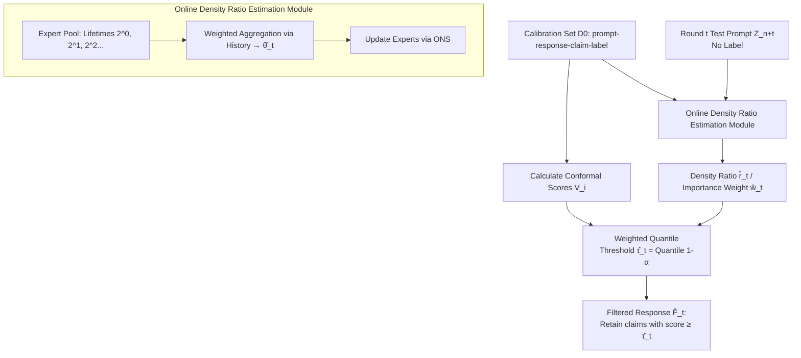

# CoFact: Conformal Factuality Guarantees for Language Models under Covariate Shift

**Conference**: ICLR 2026  
**OpenReview**: [https://openreview.net/forum?id=eiBp7rsc3K](https://openreview.net/forum?id=eiBp7rsc3K)  
**Code**: [https://github.com/huzr1999/CoFact](https://github.com/huzr1999/CoFact)  
**Area**: Hallucination Mitigation / Conformal Prediction / Online Learning  
**Keywords**: Conformal Prediction, Factuality Guarantee, Covariate Shift, Density Ratio Estimation, Online Learning, Hallucination  

## TL;DR
CoFact replaces the fixed "conformal threshold" in LLM factuality control with an adaptive threshold that adjusts to online test distribution drifts. By using online density ratio estimation to dynamically reweight the calibration set, the method ensures that the hallucination rate does not exceed a user-defined $\alpha$, even in realistic scenarios with continuous covariate shift in prompt streams and unavailable test labels.

## Background & Motivation
- **Background**: To provide "provable factuality guarantees" for LLM outputs, conformal prediction has been introduced into hallucination mitigation. A representative method, SCP (Mohri & Hashimoto, 2024), decomposes a response into atomic claims and uses a calibration set quantile to determine a threshold $\tau$. By filtering claims with factuality scores lower than $\tau$, it ensures with high probability that the hallucination rate in the retained claims is $\le \alpha$. CondCP (Cherian et al., 2024) further upgrades marginal guarantees to subgroup guarantees.
- **Limitations of Prior Work**: These guarantees rely on the **exchangeability assumption**, where calibration data and test data share the same distribution. In real-world deployments, this assumption is almost inevitably violated: user topics drift over time (e.g., fluctuating Covid-related terms), and user demographics change, causing the test prompt distribution to deviate from the calibration set. Once this foundation collapses, quantile thresholds are no longer calibrated, rendering the guarantees invalid.
- **Key Challenge**: Existing conformal methods for covariate shift (Tibshirani et al., 2019) require **static density ratio estimation over the entire test set**, which cannot handle online streams where samples arrive sequentially and distributions evolve continuously. Conversely, existing online conformal methods (e.g., ACI) **assume ground-truth labels are received immediately after each prediction**. In hallucination scenarios, feedback on whether a claim is factual is often missing or severely delayed. Neither path is directly applicable.
- **Goal**: To provide factuality guarantees for LLM outputs under the dual difficulty of "prompts from unknown, dynamically evolving distributions" and "unavailable test labels after prediction," specifically by proving that the gap between the average hallucination rate over $T$ rounds and the target $\alpha$ converges to zero.
- **Core Idea**: **Use online density ratio estimation to track the drift between the calibration and test distributions in real-time, dynamically reweighting calibration samples to recompute thresholds.** This bypasses the exchangeability assumption and models density ratio estimation as a **dynamic regret minimization** problem, using an online ensemble to approximate the true density ratio without test labels.

## Method

### Overall Architecture
CoFact combines factuality filtering with distribution tracking. The base layer follows the atomic claim filtering paradigm of SCP (removing low-factuality claims based on a threshold $\tau$), but replaces the fixed threshold with an **adaptive threshold $\hat\tau_t$ recomputed at each round $t$**. This threshold is derived from the quantile of calibration samples reweighted by the currently estimated density ratio $\hat r_t$. The ratio $\hat r_t$ is produced by an online density ratio estimation module that maintains a pool of experts with geometric lifetimes, aggregating active experts each round to track covariate shift without label supervision.

### Key Designs

**1. Oracle Perspective: Correcting Covariate Shift via Density Ratio Reweighting.** In an ideal scenario where the true density ratio $r^*_t(Z) = D_t(Z)/D_0(Z)$ is known, weighted conformal prediction (Tibshirani et al., 2019) no longer treats calibration samples equally. Normalized weights are defined as $w^*_t(Z) = \frac{r^*_t(Z)}{\sum_{i=1}^n r^*_t(Z_i) + r^*_t(Z_{n+t})}$, and the threshold becomes a weighted quantile $\tau_t = \mathrm{Quantile}\big(1-\alpha; \sum_{i=1}^n w^*_t(Z_i)\delta_{V_i} + w^*_t(Z_{n+t})\delta_\infty\big)$. The intuition is that calibration samples more similar to the current test distribution receive higher weights. Under Assumption 1 (invariant conditional distribution $D_t(W|Z)=D_0(W|Z)$ and bounded density ratio $r^*_t \le B$), this ensures the hallucination rate $\le \alpha$ (Corollary 1).

**2. Converting Density Ratio Estimation to Dynamic Regret Minimization.** Since the true density ratio is unknown and changes continuously, a static estimate is insufficient. CoFact utilizes the finding that density ratio estimation can be formulated as minimizing a Bregman divergence, with loss $L^\psi_t(r) = \mathbb{E}_{Z\sim D_0}[\partial\psi(r(Z))r(Z) - \psi(r(Z))] - \mathbb{E}_{Z\sim D_t}[\partial\psi(r(Z))]$. By choosing different divergence functions $\psi$, one can recover LSIF, Logistic Regression, or UKL. Mapping the density ratio function to a log-linear model $\hat r_t(z) = \exp(-\phi(z)^\top \hat\theta_t)$ (where $\phi$ are features extracted by a neural network), the goal is to find a sequence $\{\hat\theta_t\}$ that minimizes the **cumulative loss difference (dynamic regret)** $\sum_{t=1}^T \big(L^\psi_t(\hat r_t) - L^\psi_t(r^*_t)\big)$.

**3. Online Ensemble for Drift Tracking.** To maintain performance across shifting distributions, CoFact employs the online ensemble framework of Zhang et al. (2023) through a three-step cycle: ① **Active Set Update**: Experts are assigned geometric lifetimes ($2^0, 2^1, 2^2, \dots$) and restart upon expiration, ensuring the pool contains both short-term and long-term experts. ② **Model Aggregation**: A global parameter $\hat\theta_t$ is aggregated by weighting experts based on historical performance, allowing the model to focus on different historical segments. ③ **Expert Update**: Active experts update their parameters using the Online Newton Step (ONS). This mechanism tracks density ratios using only prompt-response feature distributions, bypassing the lack of ground-truth labels.

**4. Convergence Guarantees.** With the estimated ratio $\hat r_t$, the weighted quantile $\hat\tau_t$ is computed, and the filtered response $\hat F_t(C_{n+t})$ is generated. Theorem 1 shows that under certain conditions, the gap between the $T$-round average hallucination rate and $\alpha$ is bounded with high probability: $\big|\frac{1}{T}\sum_{t=1}^T \widehat{\mathrm{err}}_t - \alpha\big| \le \tilde O\big(\max\{T^{-2/3}V_T^{2/3}, T^{-1/2}\} + n^{-1/2}\big)$, where $V_T = \sum_{t=2}^T \|D_t(z)-D_{t-1}(z)\|_1$ measures cumulative distribution shift. The bound reveals that as $T$ and the calibration size $n$ increase, the gap approaches zero, though the rate is slowed by the intensity of the drift $V_T$.

## Key Experimental Results

**Setup**: Target factuality $1-\alpha=0.9$. Baselines include SCP (marginal guarantee) and CondCP (subgroup guarantee). Metrics: Factuality ($1-$avg. hallucination rate, target is 0.9) and Claims Retained.

### Main Results (Simulated Covariate Shift, T=2000)

MedLFQA (Medical QA) under four drift patterns (Lin/Squ/Sin/Ber):

| Method | Factuality (Lin) | Claims Retained (Lin) | Factuality (Ber) | Claims Retained (Ber) |
|------|------|------|------|------|
| SCP | 0.811 | 0.912 | 0.828 | 0.910 |
| CondCP | 0.940 | 0.389 | 0.949 | 0.364 |
| **CoFact** | **0.895** | 0.715 | **0.900** | 0.714 |

WikiData (Biographical short text):

| Method | Factuality (Lin) | Claims Retained (Lin) | Factuality (Ber) | Claims Retained (Ber) |
|------|------|------|------|------|
| SCP | 0.884 | 0.780 | 0.875 | 0.782 |
| CondCP | 0.724 | 0.910 | 0.716 | 0.909 |
| **CoFact** | **0.896** | 0.748 | **0.897** | 0.749 |

- SCP fails to maintain target factuality under drift (dropping to ~0.81 on MedLFQA). CondCP is either overly conservative (low retention at 0.39) or fails on WikiData (0.72). CoFact consistently stays close to 0.9 across datasets and drifts.

### Key Findings (WildChat+ Real-world Drift)

- **WildChat+ Benchmark**: Constructed from real WildChat user prompts with LLM responses and factuality annotations. Visualizations confirm that topic proportions drift significantly over time across 40 segments.
- CoFact requires a "warm-up" of ~50 steps but **gradually adapts to the evolving distribution, stabilizing near 0.9 after 150 steps**, while SCP and CondCP fail to hold the target for most time steps.
- **Case study**: For the prompt "What is Visual Studio Code?", CoFact correctly removes the hallucinated claim "open-source" (VS Code is proprietary; only the core Code-OSS is open-source) while retaining correct information.

## Highlights & Insights
- **Addressing Reality**: Most conformal guarantees assume stability, but real LLM services face topic drift. CoFact formalizes the "dynamic covariate shift + no test label" setting.
- **Label-Free Tracking**: By using online density ratio estimation, CoFact tracks distribution changes using only feature distributions, avoiding the need for immediate factuality feedback.
- **Quantified Bounds**: The convergence bound explicitly includes the drift volume $V_T$, quantifying the intuition that stronger drifts are harder to track.
- **Practical Benchmark**: The WildChat+ dataset fills a gap in evaluating LLM factuality under real-world covariate shifts.

## Limitations & Future Work
- **Average vs. Point-wise**: Guarantees are for the $T$-round average factuality. The "cold start" period (~50-150 steps) might show factuality significantly below the target.
- **Assumptions**: The framework assumes no concept shift ($D_t(W|Z)$ remains constant) and that the true density ratio falls within the hypothesis space.
- **Sensitivity**: Performance depends on the quality of feature mapping $\phi$ and ensemble hyperparameters, which the paper does not explore extensively.
- Future work may address point-wise guarantees, concept shift, or more robust density ratio estimators.

## Related Work & Insights
- **Conformal Factuality Control**: CoFact builds on the filtering paradigm of SCP (Mohri & Hashimoto, 2024) and CondCP (Cherian et al., 2024), focusing on evolving thresholds.
- **Shift-aware Conformal**: Extends Tibshirani et al. (2019) from static oracle settings to online, streaming environments.
- **Online Conformal**: Unlike ACI (Gibbs & Candes, 2021) which needs immediate labels, CoFact provides a path for label-deficient scenarios by tracking density ratios.
- **Cross-pollination**: This work serves as an exemplar of "arming conformal prediction with online learning tools," using dynamic regret and expert ensembles to maintain statistical guarantees.

## Rating
- **Novelty**: ⭐⭐⭐⭐ — First to systematically handle the "dynamic shift + no labels" factuality problem.
- **Experimental Thoroughness**: ⭐⭐⭐⭐ — Comprehensive testing across simulated drifts and real-world benchmarks with time-series analysis.
- **Writing Quality**: ⭐⭐⭐⭐ — Clear progression from theory to algorithm; mathematically rigorous.
- **Value**: ⭐⭐⭐⭐ — Highly relevant for high-stakes LLM deployments (medical, legal, finance) where distribution stability cannot be assumed.

<!-- RELATED:START -->

## Related Papers

- [\[ACL 2025\] REFIND at SemEval-2025 Task 3: Retrieval-Augmented Factuality Hallucination Detection in Large Language Models](../../ACL2025/hallucination/refind_at_semeval-2025_task_3_retrieval-augmented_factuality_hallucination_detec.md)
- [\[CVPR 2026\] FINER: MLLMs Hallucinate under Fine-grained Negative Queries](../../CVPR2026/hallucination/finer_mllms_hallucinate_under_fine-grained_negative_queries.md)
- [\[ICLR 2026\] NDAD: Negative-Direction Aware Decoding for Large Language Models via Controllable Hallucination Signal Injection](ndad_negative-direction_aware_decoding_for_large_language_models_via_controllabl.md)
- [\[NeurIPS 2025\] Reasoning Models Hallucinate More: Factuality-Aware Reinforcement Learning for Large Reasoning Models](../../NeurIPS2025/hallucination/reasoning_models_hallucinate_more_factuality-aware_reinforcement_learning_for_la.md)
- [\[ICLR 2026\] TraceDet: Hallucination Detection from the Decoding Trace of Diffusion Large Language Models](tracedet_hallucination_detection_from_the_decoding_trace_of_diffusion_large_lang.md)

<!-- RELATED:END -->
