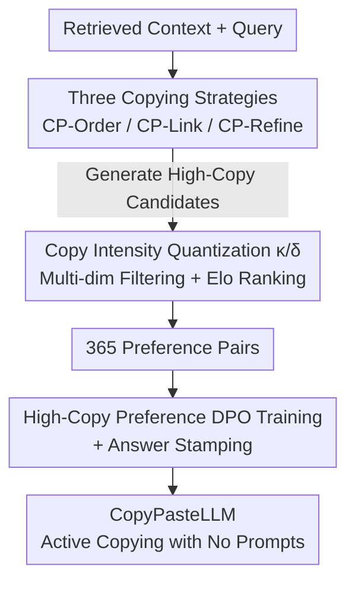

# Copy-Paste to Mitigate Large Language Model Hallucinations

**Conference**: ICLR 2026  
**arXiv**: [2510.00508](https://arxiv.org/abs/2510.00508)  
**Code**: [https://github.com/longyongchao/CopyPasteLLM](https://github.com/longyongchao/CopyPasteLLM)  
**Area**: Hallucination Detection  
**Keywords**: Hallucination Mitigation, RAG, Copy-Paste, DPO, Faithfulness

## TL;DR
The authors propose the Copy-Paste generation paradigm, which trains LLMs to prioritize directly copying segments from the retrieval context rather than free paraphrasing. Combined with DPO training for high copy preference, this approach improves faithfulness from 80.2% to 92.8% on counterfactual RAG benchmarks.

## Background & Motivation

**Background**: Retrieval-Augmented Generation (RAG) reduces hallucinations by providing external context to LLMs. However, LLMs often "paraphrase" rather than quote directly when generating answers, leading to information distortion and hallucinations.

**Limitations of Prior Work**: The paraphrasing process introduces two types of hallucinations: "Twist" (distorting facts within the context) and "Causal" (upstream errors propagating downstream). Citational methods merely tag sources without altering the fundamental generation mechanism.

**Key Challenge**: There is a trade-off between highly fluent paraphrasing and highly faithful copying. While paraphrasing reads smoothly, every instance of paraphrasing represents a potential risk point for hallucinations.

**Goal**: Can LLMs be induced to copy context segments as directly as possible while maintaining readability?

**Key Insight**: From the perspective of attention anchoring, if the previously generated token was copied from the context, the query vector of the next token will be strongly correlated with the context key vectors, naturally creating a tendency to continue copying.

**Core Idea**: Establish a "high copy preference" in LLMs through DPO, making the model prefer an answer style that directly embeds context snippets.

## Method

### Overall Architecture

The workflow consists of two stages: first, using Copy-Paste-Prompting to guide a standard LLM to generate many "high-copy" candidate answers; second, using a multi-dimensional filtering and Elo ranking pipeline to select the best and worst pairs for DPO training to solidify the "copy-first" preference into the model weights. In other words, the first half relies on prompt engineering to create data, while the second half uses preference training to make copying the default habit. The resulting CopyPasteLLM actively embeds original context snippets during inference without requiring special prompts.

### Key Designs

**1. Three Copying Strategies: Bridging Faithfulness and Fluency**

Directly commanding a model to "copy the context" often results in stiff or even ungrammatical responses. Consequently, the authors design three levels of increasingly relaxed copying strategies to cover the spectrum from "strict extraction" to "high-quality paraphrasing." CP-Order is the strictest, allowing only the reordering of relevant original sentences from the context without adding any words, ensuring every token is traceable. CP-Link relaxes this slightly by allowing transitional phrases of up to 15 words to connect copied segments, addressing the jumpiness of pure extraction. CP-Refine runs a writer-reviewer iteration loop (up to 5 rounds) to maximize readability while maintaining a high copy rate. These strategies exist to provide the varied copy-intensity samples needed for the "copy vs. paraphrase" preference signals in DPO.

**2. Quantifying Copy Intensity: Measuring Through Two Metrics**

To train a model for copy preference, copying must first be measurable. This paper defines two metrics: Copy Coverage $\kappa$, which measures the proportion of tokens in the answer derived from the context, and Copy Density $\delta$, which applies a squared weight to the length of continuous copied segments. Distinguishing these two is crucial—experiments show that $\delta$ is a better predictor of faithfulness than $\kappa$. This is because long continuous segments imply the model is transporting complete semantic units, whereas high coverage might result from fragmented "patchwork" copying, which is more likely to introduce distortions at the connection points. These metrics serve as the core scoring dimensions for filtering preference pairs.

**3. High-Copy Preference DPO Training and Answer Stamping**

DPO is finally used to bake the copy preference into the model weights. Pair selection is multi-dimensional: AlignScore and MiniCheck ensure faithfulness, while $\kappa$ and $\delta$ measure copy intensity, combined with query relevance and fluency. Samples are selected after multi-dimensional Elo ranking. Notably, the training utilizes only 365 high-quality preference pairs. This data efficiency suggests that "copying vs. paraphrasing" is primarily a matter of generation style preference rather than capability. One side effect of pure copying is that the model might move entire context blocks but miss the final answer; thus, "Answer Stamping"—explicitly appending the correct answer at the end—is introduced. This step is critical: ablation shows accuracy drops from 92.8% to 45.1% without it, as it restores answer completeness without sacrificing copy faithfulness.

## Key Experimental Results

### Main Results

| Dataset | Model | Method | Accuracy |
|---------|-------|--------|----------|
| FaithEval (Counterfactual) | Llama-3-8B | Context-DPO | 80.2% |
| FaithEval (Counterfactual) | Llama-3-8B | **CopyPasteLLM** | **92.8%** |
| ConFiQA-MC | Llama-3-8B | Attributed | 37.3% |
| ConFiQA-MC | Llama-3-8B | **CopyPasteLLM** | **82.5%** |

### Ablation Study

| Variant | FaithEval | Description |
|---------|-----------|-------------|
| w/o Copy Preference | 71.2% | No high-copy training data |
| w/o Answer Stamping | 45.1% | Answer lost due to excessive copying |
| **CopyPasteLLM** | **92.8%** | Full method |

### Key Findings
- Answer Stamping is vital—without it, accuracy plunges from 92.8% to 45.1%.
- Effective training requires only 365 preference pairs, demonstrating extremely high data efficiency.
- Copy Density predicts faithfulness better than Coverage; long continuous segments are more reliable than short fragments.

## Highlights & Insights
- **Attention Anchoring Theory**: Copying operations have a natural advantage at the attention mechanism level—when the previous token is copied from the context, the key-value vectors naturally guide continued copying, creating "copy inertia."
- **Efficient Minimalist Training**: DPO with just 365 samples can significantly alter generation style, suggesting that the choice between copying and paraphrasing is a preference issue.
- **Necessity of Answer Stamping**: Prompting the model to provide an explicit answer at the end balances copy faithfulness with response completeness.

## Limitations & Future Work
- High copy rates may reduce the naturalness and readability of the responses.
- Validation was limited to English RAG tasks; cross-lingual effectiveness remains unknown.
- The Copy-Paste strategy may not be suitable for problems requiring complex reasoning and synthesis rather than direct retrieval.

## Related Work & Insights
- **vs. Context-DPO**: While both use DPO, Context-DPO does not emphasize copying preferences. This work explicitly optimizes for copying.
- **vs. Attributed LLM**: Attributed LLMs tag citations without changing the generation process; this work intervenes in the generation mechanism itself.

## Rating
- Novelty: ⭐⭐⭐⭐ The "copy over paraphrase" philosophy is novel and counter-intuitive.
- Experimental Thoroughness: ⭐⭐⭐⭐ Validated across multiple datasets and models with clear ablations.
- Writing Quality: ⭐⭐⭐⭐ The analysis of attention anchoring is compelling.
- Value: ⭐⭐⭐⭐⭐ High practical value; can be directly adopted by RAG systems.

<!-- RELATED:START -->

## Related Papers

- [\[ICLR 2026\] Mitigating Hallucination in Vision-Language Model with Depth and Spatial-aware Key-Value Refinement](mitigating_hallucination_in_vision-language_model_with_depth_and_spatial-aware_k.md)
- [\[CVPR 2026\] VES-RFT: Rewarding Visual Evidence Sensitivity to Mitigate Hallucinations in Large Vision-Language Models](../../CVPR2026/hallucination/ves-rft_rewarding_visual_evidence_sensitivity_to_mitigate_hallucinations_in_larg.md)
- [\[ICLR 2026\] Hallucination-aware Intermediate Representation Edit in Large Vision-Language Models](hallucination-aware_intermediate_representation_edit_in_large_vision-language_mo.md)
- [\[ICLR 2026\] Dynamic Multimodal Activation Steering for Hallucination Mitigation in Large Vision-Language Models](dynamic_multimodal_activation_steering_for_hallucination_mitigation_in_large_vis.md)
- [\[ACL 2025\] Retrieval Visual Contrastive Decoding to Mitigate Object Hallucinations in Large Vision-Language Models](../../ACL2025/hallucination/retrieval_visual_contrastive_decoding_to_mitigate_object_hallucinations_in_large.md)

<!-- RELATED:END -->
