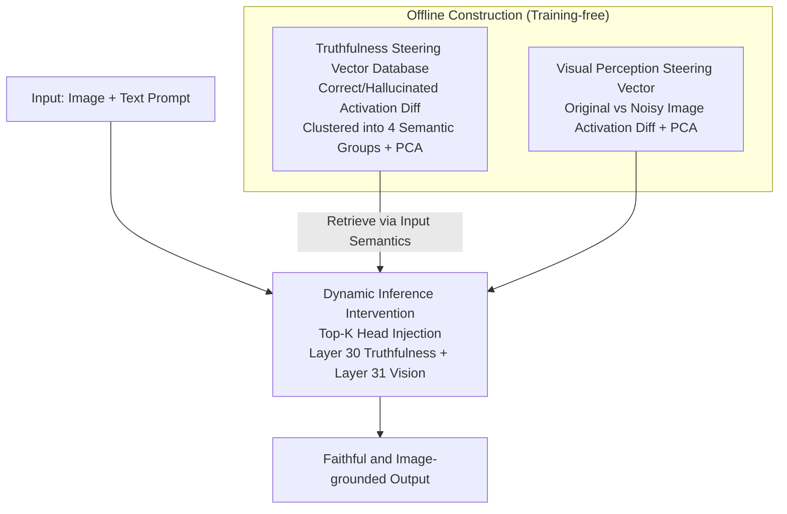

# Dynamic Multimodal Activation Steering for Hallucination Mitigation in Large Vision-Language Models

**Conference**: ICLR 2026  
**arXiv**: [2602.21704](https://arxiv.org/abs/2602.21704)  
**Code**: None  
**Area**: Hallucination Detection  
**Keywords**: Hallucination Mitigation, Activation Engineering, Attention Head Intervention, Training-free Method, Large Vision-Language Models (LVLMs)

## TL;DR
Proposes Dynamic Multimodal Activation Steering (DMAS), which dynamically selects relevant steering vectors from a semantic-based truthfulness database and vision-aware vectors to intervene in critical attention heads during inference. It significantly mitigates LVLM hallucinations without training, improving MME by 94.66 points and reducing the CHAIR hallucination rate by 20.2%.

## Background & Motivation
Large Vision-Language Models (LVLMs) excel in tasks like VQA and image captioning but suffer from severe hallucination problems—fabricating non-existent objects or misdescribing image content. Existing methods are divided into two categories: training methods requiring meticulously labeled data and significant compute (e.g., LRV, RLHF-V), and decoding methods (e.g., VCD, ICD) which are training-free but often damage generation quality.

Recent activation engineering methods (e.g., ICT, VTI) attempt to reduce hallucinations by intervening in internal model representations. However, they have key deficiencies: ICT focuses only on visual intervention and ignores multimodal characteristics; VTI uses fixed steering vectors, ignoring differences across semantic contexts.

**Key Findings**: Analyzing LLaVAv1.5's attention patterns revealed two phenomena: (1) Truthfulness and visual perception predominantly activate different subsets of attention heads (truthfulness concentrated in layer 30, visual perception in layer 31); (2) Truthfulness steering vectors vary significantly across semantic contexts (t-SNE visualization shows distinct semantic clusters). These findings directly inspired the design of DMAS.

## Method

### Overall Architecture
DMAS is a training-free, plug-and-play inference intervention targeting the hallucination issue where LVLMs "fabricate objects and ignore image content." It operates in two phases: offline, it builds a truthfulness steering vector database indexed by semantics and extracts a set of visual perception steering vectors; online, it dynamically retrieves the best-matching truthfulness vectors based on input semantics and injects them along with visual vectors into the few attention heads with the largest activation differences. This pushes internal representations towards both "faithfulness" and "image-grounding."

### Key Designs

**1. Truthfulness Steering Vector Database: Adapting Interventions to Semantic Context**

The authors found that truthfulness steering vectors vary significantly across semantic clusters (t-SNE shows clear separation). Thus, they built a retrievable database. Specifically, samples from AMBER and SEED datasets were clustered into 4 semantic groups (optimal across models). For each sample, correct/hallucinated answer pairs were constructed and fed into the LVLM to obtain activations $A_{pos}$ and $A_{neg}$ from the last token. The cluster steering vector is the mean difference: $D_i = \frac{1}{|C_i|}\sum_{j \in C_i}(A_{pos,j} - A_{neg,j})$, followed by PCA for noise reduction. The database uses mean sentence embeddings as Keys and steering vectors as Values. During inference, the input text is encoded and matched with Keys via semantic similarity to retrieve the most context-appropriate vector, avoiding the failure of "one-size-fits-all" interventions.

**2. Visual Perception Steering Vector: Enhancing Attention to Image Evidence**

Truthfulness alone does not correct hallucinations caused by "ignoring image content." A visual dimension vector is constructed by comparing an original image $V$ and a noisy image $V'$ (generated via forward diffusion). YOLOv11 is used to detect objects and generate description templates. The activation difference between the original input $(V, T+Y_O)$ and perturbed input $(V', T+Y_{O'})$ is $D_v = A_v - A_{v'}$, followed by PCA. Since $V'$ lacks visual information while the text prompt is preserved, $D_v$ encodes the direction of "dependency on image evidence."

**3. Dynamic Inference Intervention: Targeting Critical Heads**

Truthfulness is concentrated in layer 30 and visual perception in layer 31, involving different head subsets. Thus, intervention is not global. During inference, binary masks $M_f$ and $M_v$ are constructed for the truthfulness vector $D_f$ and visual vector $D_v$, respectively, targeting only the Top-K heads with the largest activation differences. The attention update is: $\mathbf{x}^{(l+1)} = \mathbf{x}^{(l)} + \text{Concat}[\text{Attn}^{(l,h)}(\mathbf{x}^{(l)}) + \alpha \cdot M_f^{(l,h)} \cdot D_f^{(l,h)} + \beta \cdot M_v^{(l,h)} \cdot D_v^{(l,h)}] \cdot \mathbf{W}_o^{(l)}$, where $\alpha$ and $\beta$ control intervention strength. Mask sparsity is critical—too few heads provide no effect, while too many damage base capabilities.

### Loss & Training
The method requires no training. A few hyperparameters are determined via grid search: intervention strength $\alpha, \beta \in \{0.5, 1, \dots, 10\}$ and head count $K \in \{32, 64, \dots, 1024\}$. Generation uses temperature 0 and top_p 1. Key embeddings are obtained via sentence-transformer (all-mpnet-base-v2). YOLOv11 detects objects, and a random object of the same category not in the image is chosen as the perturbation control. PCA is applied to both vector types. Experiments were conducted on a single NVIDIA RTX 4090; offline database construction requires extracting activations for ~3000 samples.

## Key Experimental Results

### Main Results

| Model | Method | Existence↑ | Count↑ | Position↑ | Color↑ | Total↑ |
|------|------|-----------|--------|-----------|--------|--------|
| LLaVAv1.5 | Regular | 175.67 | 124.67 | 114.00 | 151.00 | 565.33 |
| LLaVAv1.5 | ICT | 190.00 | 160.43 | 128.67 | 170.00 | 649.10 |
| LLaVAv1.5 | **DMAS** | **195.00** | **158.33** | **133.33** | **173.33** | **659.99** |
| QwenVL | Regular | 155.00 | 127.67 | 131.67 | 173.00 | 587.33 |
| QwenVL | VAF | 165.00 | 155.00 | 133.33 | 175.00 | 628.33 |
| QwenVL | **DMAS** | **170.00** | **145.00** | **133.33** | **185.00** | **633.33** |

**CHAIR Results** (LLaVAv1.5):

| Method | CHAIR_S↓ | CHAIR_I↓ |
|------|----------|----------|
| Regular | 51.0 | 15.2 |
| VTI | 35.8 | 11.1 |
| **DMAS** | **30.8** | **11.4** |

### Ablation Study

| Method | CHAIR_S↓ | CHAIR_I↓ | POPE Acc↑ | POPE F1↑ |
|------|----------|----------|-----------|----------|
| Full DMAS | 30.8 | 11.4 | 81.70 | 82.47 |
| Truthfulness Only | 34.2 | 11.7 | 81.67 | 82.42 |
| Visual Only | 42.4 | 13.2 | 81.40 | 82.01 |
| No Intervention | 51.0 | 15.2 | 75.08 | 76.06 |

### Key Findings
- Dynamic semantic matching for vector selection is significantly superior to fixed steering vectors; on QwenVL's Position subtask, fixed vectors even underperformed the original model.
- A cluster count of 4 was optimal for both models; too few clusters lead to coarse semantic granularity.
- The method showed significant gains on diverse datasets like ScienceQA and ViQuAE (LLaVAv1.5 improved from 52.75% to 62.27% on ScienceQA), proving generalization.
- In POPE experiments, LLaVAv1.5 improved Accuracy by 5.43% and F1 by 7.14% on MSCOCO.
- Negative values for $\alpha$ and $\beta$ decreased F1 (intervening towards hallucinations), while excessively large values damaged base capabilities.
- Intervention in too few heads was insignificant, while too many led to performance degradation.

## Highlights & Insights
- Revealed the phenomenon of truthfulness and visual perception activating different attention head subsets, providing a basis for future research.
- The dynamic semantic matching design is effective and avoids the limitations of "one-size-fits-all" interventions.
- Completely training-free and plug-and-play across different LVLM architectures.
- Comprehensive experimental design: Discriminative tasks (MME, POPE) + Generative tasks (CHAIR) + Generalization (ScienceQA, ViQuAE) form a complete evaluation system.
- Visualizations (attention head maps, t-SNE, hyperparameter sensitivity) strongly support the motivation and effectiveness.

## Limitations & Future Work
- Database construction depends on the specific selection of AMBER and SEED datasets; larger, more diverse sources might improve performance.
- The cluster count is currently fixed at 4; adaptively determining the optimal count is worth exploring.
- Hyperparameters $\alpha, \beta, K$ require grid search; automated parameter tuning is needed.
- Validated only on 7B models; the effect on larger scales (13B, 70B) remains to be verified.
- Building the database incurs preprocessing costs (extracting activations for 3000 samples).
- Assumes attention head specialization patterns are consistent across LVLM architectures, which requires further broad validation.

## Related Work & Insights
- **Comparison with ICT**: ICT enhances attention by noising objects in images, while DMAS intervenes in both truthfulness and visual perception dimensions and supports dynamic semantic matching.
- **Comparison with VTI**: VTI uses fixed steering vectors; DMAS demonstrates the necessity of dynamic selection.
- **Insight**: The activation engineering paradigm deserves exploration in more multimodal tasks, such as visual reasoning and multimodal dialogue.

## Rating
- Novelty: ⭐⭐⭐⭐ The idea of dynamic semantic matching for steering vectors is novel, though activation engineering has predecessors.
- Experimental Thoroughness: ⭐⭐⭐⭐⭐ Covers MME/POPE/CHAIR, two models, complete ablations, and generalization verification.
- Writing Quality: ⭐⭐⭐⭐ Clear writing, good visualizations, and natural motivation.
- Value: ⭐⭐⭐⭐ High utility as a training-free method, though clustering and hyperparameter search add deployment complexity.

<!-- RELATED:START -->

## Related Papers

- [\[ICLR 2026\] Imitating the Truth: Attention-aware Truth-Guided Enhancement for Hallucination Mitigation in Large Vision-Language Models](imitating_the_truth_attention-aware_truth-guided_enhancement_for_hallucination_m.md)
- [\[ICLR 2026\] Hallucination Reduction with CASAL: Contrastive Activation Steering for Amortized Learning](hallucination_reduction_with_casal_contrastive_activation_steering_for_amortized.md)
- [\[ICLR 2026\] Look Carefully: Adaptive Visual Reinforcements in Multimodal Large Language Models for Hallucination Mitigation](look_carefully_adaptive_visual_reinforcements_in_multimodal_large_language_model.md)
- [\[ACL 2025\] Activation Steering Decoding: Mitigating Hallucination in Large Vision-Language Models through Bidirectional Hidden State Intervention](../../ACL2025/hallucination/activation_steering_decoding_mitigating_hallucination_in_large_vision-language_m.md)
- [\[ICML 2026\] Adaptive Residual-Update Steering for Low-Overhead Hallucination Mitigation in Large Vision Language Models](../../ICML2026/hallucination/adaptive_residual-update_steering_for_low-overhead_hallucination_mitigation_in_l.md)

<!-- RELATED:END -->
