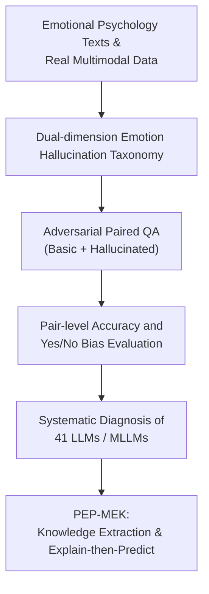

# EmotionHallucer: Evaluating Emotion Hallucinations in Multimodal Large Language Models

**Conference**: ICLR2026  
**OpenReview**: [https://openreview.net/forum?id=ahWmeQG3K2](https://openreview.net/forum?id=ahWmeQG3K2)  
**Code**: https://github.com/xxtars/EmotionHallucer  
**Area**: Multimodal Large Language Model Hallucination Evaluation / Emotion Understanding  
**Keywords**: Emotion Hallucination, Multimodal Large Language Models (MLLMs), Evaluation Benchmark, Emotional Psychology, Adversarial QA  

## TL;DR
EmotionHallucer is a hallucination evaluation benchmark for MLLM emotion understanding. It decomposes emotion hallucinations into two primary dimensions: "Emotional Psychology Knowledge" and "Real Multimodal Emotion Perception." Using paired basic/hallucinated binary QA, it detects whether models can both make fundamental emotional judgments and reject plausible but incorrect emotional descriptions. Furthermore, the proposed PEP-MEK inference framework improves model performance on the multimodal emotion perception subset by an average of 9.90%.

## Background & Motivation
**Background**: Multimodal Large Language Models (MLLMs) can now process images, videos, audio, and text. Emotion understanding has evolved from traditional textual sentiment analysis and facial expression recognition toward cross-modal capabilities—"seeing, hearing, reading, and interpreting emotions." Simultaneously, significant research has focused on MLLM hallucination evaluation regarding objects, facts, or general visual-language QA.

**Limitations of Prior Work**: Emotion hallucinations have not been independently evaluated. Typical benchmarks ask if an object exists or if an answer contradicts facts, but emotional errors are often more subtle: a model might correctly see a person frowning but infer "excitement," or it might understand that "anxiety" and "fear" are similar but provide a plausible but incorrect psychological definition. Such errors are neither purely visual recognition failures nor standard factual errors; they are distortions arising from the fusion of perceptual cues, psychological knowledge, and social context.

**Key Challenge**: Human emotion understanding relies on the long-term coupling of physiological responses, cognitive appraisal, social learning, and cultural rules. MLLMs primarily learn external behavioral cues from data correlations. A model might learn that "a smiling face usually indicates happiness" without truly distinguishing between emotion categories, intensities, causes, cultural norms, and non-verbal cues. Thus, simply assessing whether a model provides an emotion label makes it difficult to determine if it truly understands or is merely repeating common patterns.

**Goal**: The authors aim to answer three questions: First, how to define and classify emotion hallucinations in MLLMs; Second, how current LLMs/MLLMs perform regarding these hallucinations and which models, modalities, or tasks are most vulnerable; Third, whether emotional psychology knowledge and explicit reasoning processes can mitigate hallucinations in multimodal emotion perception.

**Key Insight**: The paper segments emotion hallucinations into two complementary perspectives: Emotional Psychology Knowledge (testing theoretical knowledge, definitions, and empirical findings) and Real Multimodal Emotion Perception (testing the ability to capture correct cues from text, images, audio, and video while rejecting forged emotional descriptions). This approach covers both "factuality" and "faithfulness."

**Core Idea**: Construct basic/hallucinated paired binary QA using psychological knowledge and real multimodal samples. A model is considered to have resisted emotion hallucination only if it correctly answers both the original and the tampered statement.

## Method
### Overall Architecture
EmotionHallucer is designed as a diagnostic tool rather than a new training paradigm. Inputs are sourced from authoritative emotional psychology texts and multimodal emotion understanding datasets. Each sample is processed into a basic question and a hallucinated question. Models perform YES/NO judgments on paired questions, evaluated via pair-level accuracy and Yes/No bias metrics. Based on findings, the PEP-MEK framework is introduced as a plug-and-play mitigation strategy that involves extracting modality and emotion knowledge, followed by prediction, explanation, and re-prediction.

### Key Designs
**1. Dual-dimension Emotion Hallucination Taxonomy: Decomposition of Knowledge and Perception**

The paper argues that emotion hallucinations cannot strictly follow the definition of object hallucinations. Emotion understanding involves both psychological validity and whether input cues (expressions, tone, semantics) support the interpretation. Thus, EmotionHallucer is divided into: **Emotion Psychology Knowledge Hallucination** (closer to factuality hallucination) and **Multimodality Perception Hallucination** (closer to faithfulness hallucination).

The knowledge dimension includes Theory (e.g., continuous vs. discrete models), Definition (e.g., anxiety vs. cognitive appraisal), and Finding (e.g., cross-cultural or developmental reversals). The perception dimension includes Category, Intensity, Reasoning Result (correct cues but wrong inference), and Reasoning Cue (missing, misreading, or fabricating cues). This taxonomy identifies failure modes—if a model ignores a serious expression while focusing on a crowd's laughter, its issue lies in cue binding rather than a lack of general knowledge.

**2. Adversarial Paired QA: Constraining Capability and Robustness**

Instead of open-ended captioning, the benchmark uses binary question pairs. The **basic question** maintains correct descriptions to confirm basic capability, while the **hallucinated question** introduces local tampering (e.g., swapping individualism with collectivism or misrepresenting a facial expression). A pair is only correct if both are answered correctly. This avoids inflated scores from models that are biased toward "YES" (answering basic correctly but failing hallucinated) or "NO" (the reverse). The researchers report Yes Percentage Difference ($d_y$) and False Positive Ratio ($r_{fp}$) to distinguish actual judgment from linguistic priors.

**3. Cross-modal Data Construction: Covering Text, Image, Audio, and Video Cues**

Knowledge samples are derived from Shiota & Kalat’s psychology textbooks. Perception samples come from datasets like SOUL (text), Twitter15/17 (images), RAVDESS (audio), and MER 2023/Social-IQ 2.0 (video). Each modality targets specific cues: implicit attitudes in text, multi-person binding in images, prosody/intensity in audio, and complex social reasoning in long-form video. The final benchmark contains 2,742 questions.

**4. PEP-MEK: Mitigation via Knowledge Extraction and Explain-then-Predict**

Noticing that models are stronger in psychological knowledge than perception, the authors propose PEP-MEK (**P**redict-**E**xplain-**P**redict with **M**odality and **E**motion **K**nowledge). During inference, the model is prompted to: 1. Extract modality and emotion knowledge (listing expressions, poses, tone, etc.); 2. Make an initial YES/NO prediction; 3. Explain the initial answer and verify facts/logic; 4. Provide a final YES/NO. By forcing the model to lay out evidence (cues) before judging, it addresses the tendency to jump from "ambient mood" to incorrect individual conclusions.

### Loss & Training
No new models were trained. EmotionHallucer is an evaluation benchmark. PEP-MEK is an inference-time prompting framework. Evaluations were performed locally for models < 235B parameters (A100 GPUs) or via API for larger closed-source models.

## Key Experimental Results

### Main Results
41 LLMs/MLLMs were evaluated. The benchmark was split into a full version and a NoAudio subset.

| Setting | Model | Basic ↑ | Hallucinated ↑ | Overall ↑ | Yes/No bias Observation |
|:---|:---|:---|:---|:---|:---|
| Full | Qwen2.5-Omni-7B | 52.81 | 63.46 | 18.65 | $d_y=-0.05$, $r_{fp}=0.44$; mild bias, low accuracy |
| Full | Emotion-LLaMA-7B | 72.88 | 33.45 | 15.43 | $d_y=0.20$, $r_{fp}=0.71$; strong YES bias |
| Full | Gemini-2.5-Flash | 69.41 | 68.15 | 45.06 | $d_y=0.01$, $r_{fp}=0.51$; best overall performance |
| NoAudio | Qwen2.5-VL-72B | 78.08 | 62.15 | 43.02 | Best open-source model |
| NoAudio | Gemini-2.5-Pro | 81.31 | 67.01 | 51.58 | Best overall NoAudio |

**Key Finding**: Current models remain unreliable. In the full modality setting, most open-source models perform below the 25% random baseline (pair-level). Closed-source models like Gemini perform better but still peak around 45-51%. 

### Ablation Study
Ablations on PEP-MEK focused on the perception subset (EmotionHallucer-P).

| Configuration | Qwen2.5-Omni Overall ↑ | Emotion-LLaMA Overall ↑ | Gemini-2.5-Flash Overall ↑ |
|:---|:---:|:---:|:---:|
| Original input | 10.49 | 9.65 | 33.44 |
| + MEK | 15.58 | 19.12 | 35.84 |
| + MEK + Explain (PEP-MEK) | 20.15 | 26.03 | 37.84 |
| + PEP-MK (Generic knowledge only) | 13.21 | 16.80 | 30.55 |

The gain from PEP-MEK (compared to generic PEP-MK) highlights that domain-specific emotional knowledge (categories, intensity, causal cues) is critical for mitigating perception hallucinations.

## Highlights & Insights
- **Conceptual Clarity**: The paper defines emotion hallucinations through a seven-category taxonomy, enabling diagnostic analysis rather than just reporting error rates.
- **Robustness of Paired QA**: The binary pair-level accuracy is a pragmatic protocol that effectively penalizes linguistic biases (e.g., "YES" bias).
- **Specialized Models vs. Hallucinations**: Emotion-LLaMA shows high basic capability but poor hallucination resistance, suggesting that emotion-specific fine-tuning might inadvertently increase the model's tendency to agree with any emotional description.
- **Structural Bottlenecks**: Performance declines as complexity increases: Knowledge > Text > Image > Audio > Video. Video and audio are particularly challenging as they require temporal and prosodic integration.

## Limitations & Future Work
- **Subjectivity**: While cross-review was used, emotion understanding is inherently subjective; eliminating all annotator variance remains difficult.
- **Language and Culture**: The benchmark is currently English-centric. Display rules and emotional vocabulary vary significantly across cultures.
- **Binary Format**: Real-world hallucinations occur in open-ended generations. Future work could explore structured open-ended annotations to pinpoint hallucinations in reasoning paths.
- **Inference Cost**: PEP-MEK increases latency and token count, which may be a trade-off for safety-critical applications.

## Related Work & Insights
Compared to general benchmarks (like POPE or AMBER) that check for object consistency, EmotionHallucer examines the fidelity of emotional reasoning. It shifts the focus from "what is there" to "what it means emotionally." The success of PEP-MEK suggests that for high-level semantic tasks, extracting an "evidence slot" before concluding is more effective than generic Chain-of-Thought (CoT).

## Rating
- **Novelty**: ⭐⭐⭐⭐☆ First dedicated benchmark for MLLM emotion hallucination; strong taxonomy.
- **Experimental Thoroughness**: ⭐⭐⭐⭐☆ Broad range of models and modalities; includes inference-time mitigation.
- **Writing Quality**: ⭐⭐⭐⭐☆ Clear structure and rigorous definitions.
- **Value**: ⭐⭐⭐⭐⭐ Essential for social intelligence and reliable human-AI interaction.

<!-- RELATED:START -->

## Related Papers

- [\[ICLR 2026\] Dynamic Multimodal Activation Steering for Hallucination Mitigation in Large Vision-Language Models](dynamic_multimodal_activation_steering_for_hallucination_mitigation_in_large_vis.md)
- [\[CVPR 2026\] Evaluating and Easing Hallucinations for GUI Grounding](../../CVPR2026/hallucination/exposing_and_evaluating_hallucinations_for_gui_grounding.md)
- [\[ICLR 2026\] Look Carefully: Adaptive Visual Reinforcements in Multimodal Large Language Models for Hallucination Mitigation](look_carefully_adaptive_visual_reinforcements_in_multimodal_large_language_model.md)
- [\[ACL 2025\] Beyond Facts: Evaluating Intent Hallucination in Large Language Models](../../ACL2025/hallucination/intent_hallucination_eval.md)
- [\[AAAI 2026\] Verb Mirage: Unveiling and Assessing Verb Concept Hallucinations in Multimodal Large Language Models](../../AAAI2026/hallucination/verb_mirage_unveiling_and_assessing_verb_concept_hallucinations_in_multimodal_la.md)

<!-- RELATED:END -->
