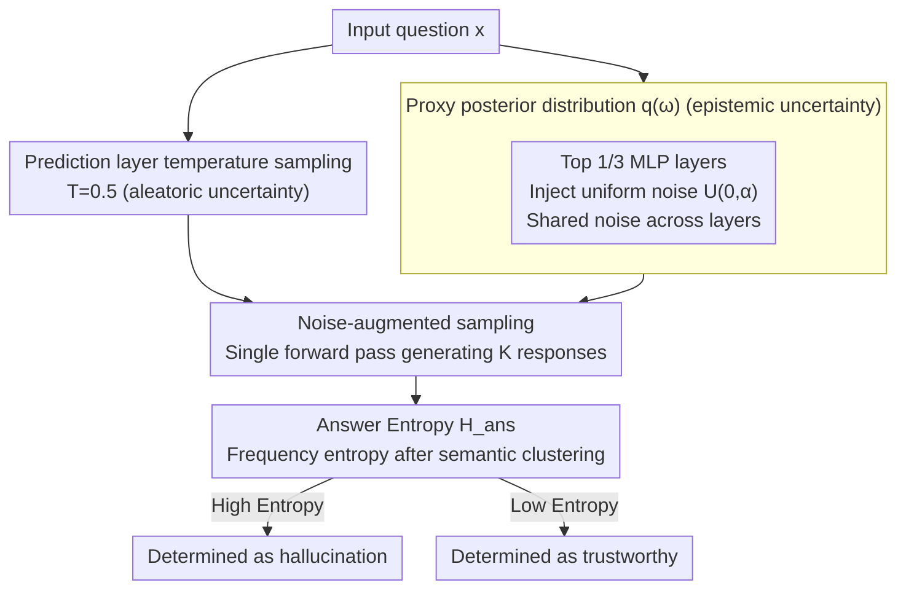

# Enhancing Hallucination Detection through Noise Injection

**Conference**: ICLR 2026  
**arXiv**: [2502.03799](https://arxiv.org/abs/2502.03799)  
**Code**: Not disclosed  
**Area**: Hallucination Detection  
**Keywords**: Hallucination Detection, Noise Injection, Epistemic Uncertainty, Bayesian Approximation, Intermediate Representations

## TL;DR
By injecting uniform noise into the MLP activations of intermediate LLM layers to approximate the Bayesian posterior, this method captures epistemic uncertainty. It complements aleatoric uncertainty captured via sampling temperature, improving the hallucination detection AUROC on GSM8K from 71.56 to 76.14.

## Background & Motivation

**Background**: Mainstream hallucination detection methods estimate LLM uncertainty through Semantic Entropy or multi-sample consistency. However, these methods primarily capture aleatoric uncertainty (uncertainty inherent in the data).

**Limitations of Prior Work**: Epistemic uncertainty (the model's uncertainty regarding its own knowledge) is neglected in current approaches. Standard sampling only alters the randomness of the token distribution without changing the model itself, failing to capture signals of "the model being unsure of what it knows."

**Key Challenge**: Full Bayesian inference requires sampling from the posterior distribution of model weights, which is computationally infeasible for large models (and approximation methods like MC-Dropout are insufficiently effective).

**Goal**: How to efficiently capture the epistemic uncertainty of LLMs without retraining?

**Key Insight**: Small-magnitude noise is injected into intermediate representations to serve as a proxy distribution for the weight posterior.

**Core Idea**: Adding uniform noise to MLP activations is equivalent to applying small perturbations to weights. The variance in output after multiple samplings reflects epistemic uncertainty.

## Method

### Overall Architecture

This paper addresses the limitation where existing hallucination detection relies solely on temperature sampling at the prediction layer to estimate uncertainty. Since temperature sampling only modifies the randomness of the token distribution and not the model itself, it captures "data-intrinsic" aleatoric uncertainty while missing the "model knowledge" epistemic uncertainty. A complete Bayesian approach would sample the weight posterior, but this is computationally prohibitive for LLMs.

The proposed workflow runs two parallel paths: for a given query, one path maintains temperature sampling at $T=0.5$ in the prediction layer to account for aleatoric uncertainty. The other path injects $U(0,\alpha)$ uniform noise into the MLP activations of the top $1/3$ layers of the network, using a **proxy posterior distribution** $q(\omega)$ to approximate the true weight posterior and introduce epistemic uncertainty. These two paths are combined in a single forward pass (**noise-augmented sampling**) to generate $K$ candidate responses. Responses are then semantically clustered, using **answer entropy** as the final uncertainty score—higher entropy indicates a higher probability of hallucination.

### Key Designs

**1. Proxy Posterior Distribution: Replacing complex weight posteriors with bounded noise**

True Bayesian inference requires sampling from the model weight posterior $p(\omega\mid D)$, which is infeasible for LLMs. This work defines a narrow proxy distribution $q(\omega)$: weights for non-target layers are fixed at pre-trained values (reduced to Delta distributions), while only weights of target layers receive a bounded perturbation around their pre-trained values. This is equivalent to small-scale weight sampling. The paper demonstrates that "perturbing target layer weights" is approximately equivalent to perturbing the bias term of that MLP layer, which can be implemented by adding non-negative uniform noise to MLP activations. A critical detail is that all selected layers **share the same noise sample** to prevent independent perturbations from canceling out due to residual connections. The noise magnitude $\alpha$ determines the "width" of the proxy posterior; values between $0.01$ and $0.11$ are found to be optimal.

**2. Noise Injection Location: Perturbing top 1/3 MLP layers instead of Attention**

The location of noise injection significantly impacts performance. Comparisons between Attention and MLP layers show that MLP injection is superior (AUROC 76.14 vs 71.89). Improvements are maximized when targetting only the top $1/3$ of layers near the output (e.g., layers 20–32 for Llama-2-7B). This is explained by the fact that MLP layers encode more factual knowledge; thus, perturbing them effectively probes the model's certainty regarding specific knowledge. Perturbing Attention layers primarily affects token correlations, providing limited help for detecting epistemic uncertainty.

**3. Noise-augmented Sampling: Dual-path superposition with answer entropy scoring**

The two paths (aleatoric temperature sampling + epistemic noise injection) are combined in one forward pass. For each question, $K$ responses are sampled (where $K=10$), clustered by semantics, and the answer entropy is calculated:

$$H_{\text{ans}} = -\sum_j p(a_j)\,\log p(a_j)$$

where $p(a_j)$ is the frequency of the $j$-th answer. If the model is genuinely "uncertain" about a question after noise injection, the responses will diverge across multiple samplings, leading to higher entropy. Conversely, concentrated answers result in low entropy. Noise-augmented sampling is orthogonal to specific metrics; it improves predictive entropy, semantic entropy, lexical similarity, and EigenScore.

## Key Experimental Results

### Main Results

| Dataset | Model | Baseline AUROC | +Noise AUROC | Gain |
|--------|------|-----------|------------|------|
| GSM8K | Llama-2-7B | 71.56 | **76.14** | +4.58 |
| GSM8K | Llama-2-13B | 77.20 | **79.25** | +2.05 |
| TriviaQA | Mistral-7B | 75.86 | **77.76** | +1.90 |
| CSQA | Gemma-2B | 58.97 | **61.71** | +2.74 |

### Ablation Study

| Setting | AUROC (GSM8K) |
|------|--------------|
| Aleatoric only (T=0.5, no noise) | 71.56 |
| Epistemic only (T=0, with noise) | 74.35 |
| **Combination** | **76.14** |
| Noise in Attention layer | 71.89 |

### Key Findings
- Epistemic uncertainty and aleatoric uncertainty are complementary; the combination outperforms either alone.
- MLP layers are more suitable for noise injection than Attention layers (76.14 vs 71.89).
- All uncertainty metrics (Predictive Entropy, Semantic Entropy, Lexical Similarity, EigenScore) show gains from noise injection.
- Larger models (13B vs 7B) exhibit stronger baselines, but the absolute gain from noise injection decreases.

## Highlights & Insights
- **Simplicity and Generality**: Noise injection requires no retraining or extra parameters and can be plugged into any LLM.
- **Practical Bayesianism**: Simplifies theoretically elegant but practically difficult Bayesian inference into a minimal "add noise" operation while maintaining theoretical motivation.
- **MLP vs. Attention Discovery**: Provides experimental evidence that MLP layers are more sensitive to knowledge encoding, supporting the "MLP = knowledge storage" hypothesis.

## Limitations & Future Work
- The optimal noise magnitude $\alpha$ is a dataset-dependent hyperparameter requiring tuning on a validation set.
- Requires multiple forward passes ($K$ samples), increasing inference costs linearly.
- Smaller improvements on CSQA (+0.97), potentially related to the task type.
- Theoretical guarantees regarding the distance between noise injection and the true Bayesian posterior are not yet established.

## Related Work & Insights
- **vs. Semantic Entropy**: Semantic entropy only captures aleatoric uncertainty; adding noise allows for simultaneous capture of epistemic uncertainty.
- **vs. MC-Dropout**: Dropout is another Bayesian approximation, but it is rarely used and less effective in modern large-scale models.

## Rating
- Novelty: ⭐⭐⭐⭐ The idea of using noise injection for hallucination detection is novel, though technical contribution is relatively simple.
- Experimental Thoroughness: ⭐⭐⭐⭐ Covered multiple models, datasets, and uncertainty metrics.
- Writing Quality: ⭐⭐⭐⭐ Clear exposition of the Bayesian framework.
- Value: ⭐⭐⭐⭐ A plug-and-play enhancement method for hallucination detection.

<!-- RELATED:START -->

## Related Papers

- [\[ACL 2026\] Enhancing Hallucination Detection via Future Context](../../ACL2026/hallucination/enhancing_hallucination_detection_via_future_context.md)
- [\[ICLR 2026\] NDAD: Negative-Direction Aware Decoding for Large Language Models via Controllable Hallucination Signal Injection](ndad_negative-direction_aware_decoding_for_large_language_models_via_controllabl.md)
- [\[ICLR 2026\] High Accuracy, Less Talk (HALT): Reliable LLMs through Capability-Aligned Finetuning](high_accuracy_less_talk_halt_reliable_llms_through_capability-aligned_finetuning.md)
- [\[ICLR 2026\] Learning to Reason for Hallucination Span Detection](learning_to_reason_for_hallucination_span_detection.md)
- [\[ICLR 2026\] Neural Message-Passing on Attention Graphs for Hallucination Detection](neural_message-passing_on_attention_graphs_for_hallucination_detection.md)

<!-- RELATED:END -->
