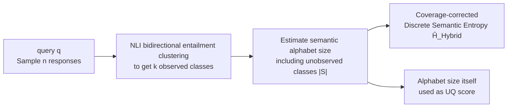

# Estimating Semantic Alphabet Size for LLM Uncertainty Quantification

**Conference**: ICLR 2026  
**OpenReview**: [https://openreview.net/forum?id=uYK6GPVg1O](https://openreview.net/forum?id=uYK6GPVg1O)  
**Code**: TBD  
**Area**: LLM Uncertainty Quantification / Hallucination Detection  
**Keywords**: Semantic Entropy, Uncertainty Quantification, Hallucination Detection, Black-box methods, unseen species, Good-Turing, coverage correction  

## TL;DR
This paper identifies that the classic "Discrete Semantic Entropy" (DSE) systematically underestimates true semantic entropy in low-sample regimes. Drawing from the "unseen species" problem in population ecology, the authors propose a hybrid semantic alphabet size estimator and apply coverage correction to DSE. This allows black-box uncertainty estimation to match or exceed complex SOTA methods like KLE and SNNE while maintaining superior interpretability.

## Background & Motivation
**Background**: Large Language Models (LLMs) require the "abstain when uncertain" capability in risk-sensitive scenarios, necessitating reliable intrinsic Uncertainty Quantification (UQ). In commercial API settings where internal activations and token log-probabilities are unavailable, "black-box" routes estimate uncertainty by sampling multiple LLM outputs. Semantic Entropy (SE), proposed by Kuhn et al. (2023), is a representative approach that clusters outputs into semantic equivalence classes and calculates entropy over these classes. Farquhar et al. (2024) introduced DSE, a black-box-friendly version that replaces probabilities with empirical frequencies of semantic classes.

**Limitations of Prior Work**: The fundamental constraint of black-box UQ is the high cost of sampling—each additional response requires a full inference pass. Accurate estimation from extremely few samples (typically $n=10$) is critical for large-scale deployment. However, recent strong SE variants, such as KLE (using kernel methods for graph node embedding) and SNNE (introducing similarity functions and scale parameters), achieve performance at the cost of interpretability and added hyperparameters.

**Key Challenge**: DSE is essentially a "plugin estimator" for entropy, which has a theoretically known negative bias. In small-sample regimes, the number of observed semantic classes $k$ is often much smaller than the true semantic alphabet size $|S|$ (the "under-sampled" region). Consequently, the empirical distribution appears less "surprising" than the true distribution, causing **DSE to systematically underestimate real semantic entropy** (evidenced by the DSE/SE* ratio being consistently below 1 in Figure 2).

**Goal**: Correct this underestimation to achieve accurate few-sample estimation without sacrificing interpretability or adding hyperparameters.

**Core Idea**: **Map the semantic clustering problem to the "unseen species" problem in ecology.** Given $n$ observations, the goal is to estimate how many species remain unobserved. By treating semantic classes as "species," one can apply established statistical tools like Good-Turing coverage and Chao-Shen entropy correction to compensate for unobserved semantic classes.

## Method

### Overall Architecture
The method consists of three steps (as shown in Figure 1): first, sample $n$ responses from the LLM for a query $q$; second, use an NLI model to cluster responses into semantic equivalence classes based on bidirectional entailment; finally, **instead of using the observed class count $k$ as the alphabet size**, estimate the true semantic alphabet size $\hat{|S|}$ (including unobserved classes) and apply coverage correction to DSE. This process relies strictly on response text (black-box) and does not require internal model probabilities.

### Key Designs

**1. Estimating semantic alphabet size from coverage: Bringing Good-Turing to SE.** Plugin DSE implicitly assumes the alphabet size is the observed count $k$ (referred to as NumSets by Lin et al.), which is inevitably too small in under-sampled regions. The paper borrows the concept of sample coverage $C = k / |S|$ (the proportion of total classes represented by the sample). Good-Turing estimates coverage using "singletons" (classes appearing exactly once, $f_1$) as $\hat{C}_{GT} = 1 - \frac{f_1}{n}$. The intuition is that many singletons suggest many unobserved classes. This yields an alphabet size estimator $\hat{|S|}_{GT} = \frac{kn}{n - f_1}$. More singletons lead to a larger estimated alphabet, compensating for missed rare semantic classes.

**2. Hybrid alphabet size estimator: Using spectral methods to fill Good-Turing's gaps.** $\hat{|S|}_{GT}$ fails in two cases: it reduces to NumSets when $f_1 = 0$ (no singletons), and it is undefined when all samples are unique ($f_1 = n$) because the denominator becomes zero. Conversely, the continuous spectral estimator by Lin et al. (2024), $U_{EigV} = \sum_{i=1}^{n} \max(0, 1 - \lambda_i)$ (where $\lambda_i$ are eigenvalues of the normalized Laplacian of the similarity graph), is smooth but can be smaller than $k$, violating the hard constraint that $k$ is the lower bound of $|S|$. This work proposes a hybrid estimator:

$$\hat{|S|}_{Hybrid} = \begin{cases} U_{EigV}, & f_1 = n \\ \max\left(\hat{|S|}_{GT}, U_{EigV}\right), & \text{otherwise} \end{cases}$$

Under normal conditions, it takes the larger of the two estimates (ensuring it is $\ge k$ while incorporating spectral signals), reverting to the spectral estimator only in the "all unique" extreme.

**3. Hybrid coverage-corrected entropy: Re-integrating alphabet estimation into Chao-Shen entropy.** Chao & Shen (2003) provided a coverage-corrected discrete entropy $\hat{H}_{CS}$, which scales empirical frequencies $\hat{p}_i$ by the estimated coverage $\hat{C}_{GT}$ and applies a bias correction. This paper replaces the coverage term with the hybrid alphabet estimate to obtain Hybrid DSE:

$$\hat{H}_{Hybrid} = -\sum_{i=1}^{k} \frac{\frac{k\hat{p}_i}{\hat{|S|}_{Hybrid}} \log\left(\frac{k\hat{p}_i}{\hat{|S|}_{Hybrid}}\right)}{1 - \left(1 - \frac{k\hat{p}_i}{\hat{|S|}_{Hybrid}}\right)^n}$$

The numerator $\frac{k\hat{p}_i}{\hat{|S|}_{Hybrid}}$ effectively "dilutes" empirical frequencies using a larger alphabet, allocating probability mass to unobserved classes. The denominator $1 - (1 - \cdot)^n$ is the Horvitz-Thompson correction for the probability that a class is sampled at least once.

**4. A counter-intuitive byproduct: Alphabet size itself is a strong score.** Given the strong correlation between semantic class count and uncertainty, the paper proposes using $\hat{|S|}_{Hybrid}$ and $U_{EigV}$ directly as UQ scores for hallucination detection. Simple "counting" of potential semantic classes serves as a confidence measure, echoing the observation by Kuhn et al. (2023) that the number of observed semantic sets is a reasonable uncertainty metric.

## Key Experimental Results

**Setup**: 5 instruction-tuned models (Gemma-2-9B, Gemma-3-12B, Llama-3.1-8B, Mistral-v0.3-7B, Phi-3.5-3.8B), 4 QA datasets (HotpotQA, SQuAD 2.0, BioASQ, and a custom multi-answer set POTATO). Uncertainty calculated at $\tau = 1.0$, correctness judged on a "best guess" at $\tau = 0.1$. Typical sample size $n = 10$. White-box SE at $n = 100$ ($SE^*$) serves as the ground truth proxy.

### Main Results: SE Estimation Accuracy (MSE, lower is better, selected results)

| Dataset | Estimator | Gemma-2-9B | Llama-3.1-8B | Mistral-7B | Phi-3.5 |
|---|---|---|---|---|---|
| HotpotQA | $\hat{H}_{Plugin}$ (DSE) | 0.46 | 0.68 | 0.59 | 0.61 |
| HotpotQA | $\hat{H}_{CS-GT}$ | 0.39 | 0.56 | 0.46 | 0.47 |
| HotpotQA | **$\hat{H}_{Hybrid}$** | **0.30** | **0.45** | **0.39** | **0.39** |
| BioASQ | $\hat{H}_{Plugin}$ (DSE) | 1.64 | 1.68 | 2.04 | 1.82 |
| BioASQ | $\hat{H}_{CS-GT}$ | 0.96 | 1.06 | 1.31 | 0.99 |
| BioASQ | **$\hat{H}_{Hybrid}$** | **0.78** | **0.80** | **0.73** | **0.83** |

Hybrid DSE achieved the lowest MSE across almost all combinations of 5 models and 4 datasets, cutting the error of plugin DSE by more than half on BioASQ.

### Hallucination Detection (AUROC $\rightarrow$ Bradley-Terry Latent Strength Ranking)

| Phenomenon | Result |
|---|---|
| Hybrid DSE vs. other SE estimators | $\hat{H}_{Hybrid}$ ranks highest among explicit SE estimators, **surpassing white-box SE**. |
| Alphabet size estimators vs. complex UQ | $\hat{|S|}_{Hybrid}$ (rank CI [1,4]) and $U_{EigV}$ (rank CI [1,3]) are top-tier. |
| Comparison with KLE | KLE (rank CI [1,3]) and the hybrid estimators are tied at the top, outperforming white-box SE and others. |

### Key Findings
- **DSE indeed systematically underestimates**: The DSE/$SE^*$ ratio remains consistently below 1 across different sample sizes, empirically validating the negative bias theory of plugin estimators.
- **Coverage correction stabilizes bias**: Hybrid DSE is closer to $SE^*$ than plugin DSE across most sample sizes.
- **Simpler is better**: Alphabet size estimators, which essentially "count" semantic classes, can outperform complex black-box methods like SNNE while maintaining high interpretability.

## Highlights & Insights
- **Elegant Cross-disciplinary Transfer**: Mapping ecological statistical tools (Good-Turing, Chao-Shen) to semantic entropy provides a solid, interpretable theoretical foundation rather than relying on neural network stacking.
- **Pragmatic Hybrid Design**: Identifying the failure boundaries of $\hat{|S|}_{GT}$ and $U_{EigV}$ and using a $\max$ function allows the method to respect the $k$ lower bound while utilizing spectral information.
- **Sophisticated Evaluation Methodology**: Rather than reporting simple AUROC points, the use of DeLong CIs, Bradley-Terry latent strengths, and rank CIs addresses the often-ignored uncertainty within AUROC metrics.
- **Valuable Counter-intuitive Conclusion**: The fact that alphabet size estimation alone can serve as a superior UQ score suggests the community need not always pursue increased model complexity.

## Limitations & Future Work
- **Dependency on Ground Truth Proxy**: Using white-box SE at $n = 100$ as the "true" semantic entropy is an approximation.
- **Clustering Quality Bottleneck**: The method relies on NLI-based bidirectional entailment; errors in semantic equivalence detection directly pollute the alphabet size estimate.
- **Overshoot in Specific Distributions**: The "overshoot" observed in the POTATO dataset suggests that correction may be unstable in distributions with extremely high answer diversity.
- **Scenario Constraints**: Experiments were limited to sentence-level QA; validity in long-form generation or multi-turn dialogue remains unverified.

## Related Work & Insights
- **Semantic Entropy Lineage**: Kuhn et al. (2023) SE $\rightarrow$ Farquhar et al. (2024) DSE $\rightarrow$ Nikitin et al. (2024) KLE / Nguyen et al. (2025) SNNE. This work moves towards "simpler and more interpretable" by correcting statistical bias.
- **Unseen Species / Entropy Estimation**: Grounded in Fisher (1943), Good (1953) Good-Turing, and Chao & Shen (2003) coverage-corrected entropy.
- **Insight**: When metrics in a field are systematically distorted under "low-sample" conditions, seeking debiasing tools from established statistical fields (ecology, information theory) is often more effective than increasing model depth.

## Rating
- Novelty: ⭐⭐⭐⭐ — Refreshing perspective of transferring unseen species estimation to semantic entropy with a clever hybrid design.
- Experimental Thoroughness: ⭐⭐⭐⭐ — Comprehensive testing across 5 models and 4 datasets with rigorous ranking methodology.
- Writing Quality: ⭐⭐⭐⭐ — Clear logical flow from motivation to theory and experiment.
- Value: ⭐⭐⭐⭐ — Addresses the practical need for low-sample black-box UQ with a simple, interpretable, and high-performing solution.

<!-- RELATED:START -->

## Related Papers

- [\[ICLR 2026\] Semantic Uncertainty Quantification of Hallucinations in LLMs: A Quantum Tensor Network Based Method](semantic_uncertainty_quantification_of_hallucinations_in_llms_a_quantum_tensor_n.md)
- [\[CVPR 2026\] Thinking in Uncertainty: Mitigating Hallucinations in MLRMs with Latent Entropy-Aware Decoding](../../CVPR2026/hallucination/thinking_in_uncertainty_mitigating_hallucinations_in_mlrms_with_latent_entropy-a.md)
- [\[ICLR 2026\] HARP: Hallucination Detection via Reasoning Subspace Projection](harp_hallucination_detection_via_reasoning_subspace_projection.md)
- [\[ICLR 2026\] HalluGuard: Demystifying Data-Driven and Reasoning-Driven Hallucinations in LLMs](halluguard_demystifying_data-driven_and_reasoning-driven_hallucinations_in_llms.md)
- [\[ICLR 2026\] Enhancing Hallucination Detection through Noise Injection](enhancing_hallucination_detection_through_noise_injection.md)

<!-- RELATED:END -->
