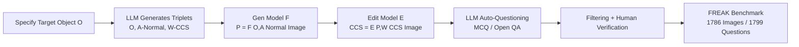

# FREAK: A Fine-grained Hallucination Evaluation Benchmark for Advanced MLLMs

**Conference**: ICLR 2026  
**OpenReview**: [https://openreview.net/forum?id=YeagC09j2K](https://openreview.net/forum?id=YeagC09j2K)  
**Code**: Open-sourced (GitHub specified in paper, link TBA)  
**Area**: Multimodal Hallucination Evaluation / MLLM Benchmark  
**Keywords**: Fine-grained Hallucination, Counter-commonsense Images, CCS, MLLM Evaluation, CoT Degradation  

## TL;DR
FREAK utilizes an automated "generate-then-edit" pipeline to create 1,786 photorealistic counter-commonsense (CCS) images and 1,799 questions. It specifically targets the fine-grained visual perception hallucinations of SOTA MLLMs—even the strongest models achieve only 45% accuracy, significantly lower than the human baseline of 86.71%, while confirming that CoT reasoning tends to degrade performance on such tasks.

## Background & Motivation
**Background**: Multimodal Large Language Models (MLLMs) have made rapid progress in image understanding, yet hallucination remains unresolved. Models frequently generate content that is "logically consistent and commonsensical but contradicts visual evidence." The most challenging sub-category is **fine-grained hallucination**, where models ignore or fabricate local details, habitually overriding visual facts with commonsense knowledge.

**Limitations of Prior Work**: Early hallucination benchmarks like POPE and AMBER have become saturated due to simplistic tasks and coarse evaluation protocols (mostly binary true/false judgments), offering little discriminative power for modern SOTA models. Worse, images in these benchmarks often originate from open-source datasets, leading to **data leakage and memory bias**, where models "remember" rather than "understand." Subsequent works like HallusionBench and PhD shifted toward AI-generated **counter-commonsense (CCS)** images to test "true looking" vs. "memory," but still suffer from limited diversity, poor image quality, and overly simplified task designs.

**Key Challenge**: To measure true hallucination levels, CCS images must simultaneously satisfy three conditions: photorealism, local counter-commonsense details, and content diversity. However, existing methods fail: manual modification is not scalable, and direct prompting of text-to-image models results in repetitive objects and a **natural tendency to generate commonsense-compliant images** due to the lack of CCS training data.

**Goal**: Construct a high-quality benchmark for testing fine-grained hallucinations in SOTA models, accompanied by objective (non-binary) evaluation methods.

**Core Idea**: **"Generate-then-edit" for CCS image production.** This involves first generating a normal, commonsense-compliant image and then using a powerful editing model to apply local counter-commonsense modifications. This ensures photorealism while precisely injecting CCS details. Based on this, 6 types of fine-grained tasks are evaluated using Multiple Choice Question (MCQ) and Free-form Question Answering (FQA) formats.

## Method

### Overall Architecture
The data construction for FREAK is a three-step automated pipeline followed by human verification. It begins with LLMs generating diverse CCS descriptions, followed by a "generation model for normal images + editing model for CCS details" process to create photorealistic CCS images. Finally, LLMs automatically generate questions, which are filtered and manually refined. The dataset is divided into 6 sub-tasks (Detection, Counting, Attribute, Analysis, Position, and OCR), evaluated via Accuracy and Hallucination Rate (HalluRate).

### Key Designs
**1. CCS Description Generation: Overcoming Diversity Collapse via "Object Anchoring."** Allowing LLMs to freely generate CCS descriptions leads to repetition and low-quality content. FREAK specifies a target object $O$ (e.g., "fox," "sofa") and asks the LLM to generate descriptions based on specific attributes, resulting in a triplet $(O, A, W)$: $O$ is the target, $A$ is the correct (commonsense) attribute, and $W$ is the counter-commonsense attribute (e.g., "a fox with square ears," "a sofa facing away from the TV"). Anchoring with objects ensures diversity and provides clear semantic control for generation.

**2. Generate-then-Edit: Bypassing the "Commonsense Bias" of Generative Models.** This is the core innovation. Since generative models lack CCS training data, they tend to produce commonsense images even when given CCS prompts. FREAK splits the process: first, it uses $O$ and $A$ to prompt a generative model $F$ to produce a realistic normal image $P = F(O, A)$; then, an editing model $E$ performs local modifications based on $W$ to produce the CCS image $CCS = E(P, W)$. This "surgery" on a realistic base ensures the image is **photorealistic overall but violates commonsense at the target detail** (e.g., swapped red/green traffic light positions). Implementation uses Seedream 3.0 for generation and SeedEdit 3.0 for editing.

**3. Four-choice MCQ: Quantifying Hallucination with "Commonsense Distractors."** To separate "true understanding" from "lucky guessing," FREAK pairs each image with a four-choice question: A is the **Correct option** aligned with $W$; B is the **Commonsense Distractor** (the hallucination option) corresponding to $A$; C is an **AI Distractor** synthesized from $W$ and $A$; D is a fixed "None of the above" option. If a model chooses B, it exposes its hallucination. **Cyclic permutation** is applied to eliminate position bias. $\text{HalluRate}$ is defined as the proportion of commonsense answers in FQA or the selection of commonsense distractors in MCQ.

**4. Dual-format Evaluation + LLM-as-judge: Balancing Openness and Objectivity.** The benchmark includes 1,000 MCQs and 799 FQAs. In FQA, correct answers correspond to $W$, and hallucination answers correspond to $A$. LLM-as-judge categorizes responses into Correct, Commonsense Error, or Other Error. For MCQs, scoring is direct. A blind test with 100 undergraduate students established a human baseline (86.71%) and verified the dataset's validity.

## Key Experimental Results

### Main Results (Overall Performance of SOTA Models on FREAK, Selected)

| Model | Type | Accuracy↑ | HalluRate↓ |
|------|------|---------|---------|
| Human Baseline | — | **86.71** | 6.95 |
| Gemini-2.5-Pro | Reasoning | **45.49** | 40.26 |
| o3 | Reasoning | 43.00 | 43.67 |
| GPT-4.1 | Non-Reasoning | 42.01 | 44.54 |
| MiniCPM-4V | Non-Reasoning | 41.44 | 41.08 |
| GLM-4.5V | Reasoning | 41.19 | 46.17 |
| Qwen2.5-VL-72B | Non-Reasoning | 39.39 | 46.82 |
| InternVL3-78B | Non-Reasoning | 39.32 | 48.76 |
| Claude-4.0-Sonnet | Reasoning | 29.85 | 55.64 |
| DeepEyes | Reasoning | 28.39 | 53.40 |

Even the strongest Gemini-2.5-Pro achieves only 45.49%, with most models clustering between 30%–43%, approximately 40 percentage points below the human baseline. Most models' hallucination rates are close to or exceed their accuracy.

### Ablation Study (Normal vs. CCS Images)

| Model | Size | Normal Acc | CCS Acc |
|------|------|-------------|--------------|
| InternVL3 | 14B | 91.26 | 34.69 (↓56.67) |
| InternVL3 | 38B | 93.63 | 43.97 (↓49.66) |
| Qwen2.5-VL | 7B | 86.04 | 34.28 (↓51.76) |
| Qwen2.5-VL | 32B | 90.31 | 36.25 (↓54.06) |

When the image is changed from normal to CCS for the same question, accuracy drops by ~50 percentage points, proving that correct answers on normal images result from "commonsense filling" rather than actual visual grounding.

### CoT Degradation (Direct vs. Reasoning, Selected)

| Model | Direct Acc | CoT Acc | Direct HalluRate | CoT HalluRate |
|------|-----------|-----------|-----------|-----------|
| GPT-4.1 | 42.01 | 40.66 (↓1.45) | 45.43 | 46.30 (↑) |
| InternVL3-78B | 39.32 | 33.91 (↓5.41) | 48.76 | 52.83 (↑) |
| Qwen2.5-VL-72B | 39.39 | 33.39 (↓6.00) | 46.82 | 50.95 (↑) |
| Phi-4-multimodal | 33.32 | 25.09 (↓8.23) | 42.13 | 46.83 (↑) |

### Key Findings
- **CoT degrades performance on fine-grained hallucinations**: For most models, enabling Chain-of-Thought (CoT) leads to lower accuracy and higher hallucination rates. RL-tuned reasoning models show no significant advantage over base versions; the small non-reasoning model MiniCPM-4V even outperforms some open-source reasoning models.
- **Reasoning paths drift toward bias**: Tracking reasoning dynamics via FREAK shows that during CoT, **preference for distractors increases while confidence in the correct answer declines**, often resulting in the model reversing an initially correct judgment.
- **Task Difficulty Variation**: Counting performance is the lowest, while Attribute and OCR are relatively better. Models perform well on low-level visual tasks (shape/color) but struggle with high-level tasks (Analysis/Position/Detection) where hallucinations are more severe because high-level reasoning relies more heavily on linguistic priors.
- **Scaling Laws hold with exceptions**: While performance generally scales with model size, some regressions occur, and smaller models can compete with larger ones, suggesting that hallucination mitigation depends more on architecture and training pipelines than parameter count alone.

## Highlights & Insights
- **Data generation effectively solves pain points**: The "generate-then-edit" paradigm bypasses the limitations of generative models while achieving both photorealism and precise CCS details, representing a key engineering breakthrough for fine-grained CCS benchmarks.
- **Objective evaluation design**: The use of commonsense distractors and cyclic permutation, combined with the HalluRate metric, provides much more information than traditional binary judgments.
- **Valuable negative findings on CoT**: On tasks requiring precise visual detail, CoT amplifies linguistic priors and dilutes visual signals. This challenges the "reasoning as a panacea" narrative, with visual evidence from probability trajectory clustering explaining the "drift" in thought.

## Limitations & Future Work
- **Dependence on closed-source models**: The pipeline is tied to Seedream 3.0 / SeedEdit 3.0, limiting reproducibility and control, while editing quality defines the data's upper bound.
- **Scale and coverage**: 1,786 images across 6 task types is a sample of the fine-grained hallucination landscape. Some tasks overlap, and counting is focused on small numbers, leaving long-tail and complex scenarios under-explored.
- **Diagnostics without prescriptions**: FREAK quantifies the problem but does not provide training or decoding solutions to reduce fine-grained hallucinations. The fundamental mechanisms of CoT degradation require further investigation.
- **LLM-as-judge bias**: FQA relies on LLM evaluation; biases in the judge model may propagate into the final scores.

## Related Work & Insights
FREAK continues the line of work (HallusionBench, PhD, WHOOPS, VLind-Bench) using CCS images to detect hallucinations but offers a systematic upgrade in realism, diversity, and objectivity. Unlike benchmarks evaluating long-text output (MIRAGE, LongHalQA), FREAK focuses on fine-grained CCS visual challenges. Key takeaways: first, the **"generation-editing" decoupled paradigm** is generalizable to other "real base + controlled perturbation" scenarios; second, **explicit metrics like HalluRate** should become standard in multimodal evaluation; third, the degradation of CoT on visual tasks suggests that hallucination reduction should focus on visual encoding and training protocols rather than simply lengthening reasoning chains.

## Rating
- **Novelty**: ⭐⭐⭐⭐ The "generate-then-edit" paradigm addresses the core bottleneck of CCS benchmarks; the distractor-based MCQ design is innovative.
- **Experimental Thoroughness**: ⭐⭐⭐⭐ Covers 20+ models with scaling laws, normal vs. CCS comparisons, CoT degradation, and reasoning trajectory analysis.
- **Writing Quality**: ⭐⭐⭐⭐ Logical flow from motivation to discovery with clear figures and tables; key conclusions are highlighted.
- **Value**: ⭐⭐⭐⭐ Provides a non-saturated, discriminative benchmark for SOTA models and empirically challenges the efficacy of CoT in visual detail tasks.

<!-- RELATED:START -->

## Related Papers

- [\[CVPR 2026\] Fine-Grained Multi-Image Object Hallucination Benchmark](../../CVPR2026/hallucination/fine-grained_multi_image_object_hallucination_benchmark.md)
- [\[CVPR 2026\] FINER: MLLMs Hallucinate under Fine-grained Negative Queries](../../CVPR2026/hallucination/finer_mllms_hallucinate_under_fine-grained_negative_queries.md)
- [\[CVPR 2026\] Zina: Multimodal Fine-grained Hallucination Detection and Editing](../../CVPR2026/hallucination/zina_multimodal_fine-grained_hallucination_detection_and_editing.md)
- [\[ACL 2025\] FIHA: Autonomous Fine-grained Hallucination Evaluation in Vision-Language Models with Davidson Scene Graphs](../../ACL2025/hallucination/fiha_autonomous_hallucination_evaluation_in_vision-language_models_with_davidson.md)
- [\[ICLR 2026\] PostAlign: Multimodal Grounding as a Corrective Lens for MLLMs](postalign_multimodal_grounding_as_a_corrective_lens_for_mllms.md)

<!-- RELATED:END -->
