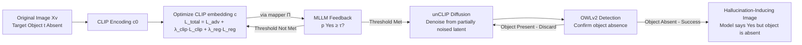

# GHOST: Hallucination-Inducing Image Generation for Multimodal LLMs

**Conference**: ICLR 2026  
**OpenReview**: [https://openreview.net/forum?id=f4TACE7HhU](https://openreview.net/forum?id=f4TACE7HhU)  
**Code**: [https://github.com/sudoparsa/GHOST](https://github.com/sudoparsa/GHOST)  
**Area**: Multimodal Large Language Models / Object Hallucination / Adversarial Robustness  
**Keywords**: object hallucination, MLLM, stress-test, CLIP embedding optimization, diffusion, transferability  

## TL;DR
GHOST moves away from evaluating object hallucinations in Multimodal LLMs (MLLMs) using fixed static benchmarks. Instead, it **actively generates** a set of images that appear natural and object-free to humans but trick models into believing a target object is present. This approach increases the hallucination success rate from approximately 1% in existing methods to over 28% and reveals that these images are highly transferable across different models.

## Background & Motivation
**Background**: MLLMs demonstrate impressive performance in image captioning, VQA, and multimodal reasoning. However, they suffer from object hallucination—claiming that objects exist when they are absent. In safety-sensitive scenarios, this is a critical flaw, necessitating systematic stress-testing of visual robustness.

**Limitations of Prior Work**: Existing hallucination evaluations rely almost entirely on **static benchmarks, fixed visual scenes, and manually curated image sets** (e.g., POPE, CHAIR). These methods are confined to pre-defined scenarios, failing to expose **model-specific** blind spots or determine whether errors are isolated cases or structural failure modes.

**Key Challenge**: To discover model-specific and unanticipated hallucination vulnerabilities, evaluation tools must be able to **actively generate images based on feedback from the target model**. However, integrating MLLMs, diffusion models, target images, and object detectors into a single optimization loop (as seen in the closest work, DASH) makes the pipeline slow and expensive, often forcing the use of distilled single-step diffusion models.

**Goal**: Develop a fully automated tool requiring no human supervision or prior knowledge. Given an image without a target object and the target object itself, the tool should generate a natural image that is **visually similar to the original, remains object-free, but induces model hallucination**.

**Key Insight**: **"Optimize in CLIP embedding space to decouple optimization from generation."** Instead of optimizing at the pixel or diffusion latent level, GHOST optimizes the CLIP embedding of the image to induce a "Yes" response from the model without actually encoding the object. An unCLIP diffusion model then decodes this embedding into a natural image. A lightweight mapper aligns the MLLM's visual space with the diffusion model's visual space, avoiding backpropagation through the entire pipeline.

## Method

### Overall Architecture
GHOST (Generating Hallucinations via Optimizing Stealth Tokens) decomposes hallucination generation into three steps: first, a mapper $\Pi$ is trained to map the CLIP embedding space to the target MLLM's visual token space, allowing **gradient descent solely on the CLIP embedding**; second, three objectives are jointly optimized on the CLIP embedding (closeness to original, absence of object semantics, and induction of "Yes" responses); finally, an unCLIP diffusion model decodes the optimized embedding into a natural image, followed by filtering via the open-vocabulary detector OWLv2 to ensure the target object is truly absent.

### Key Designs

**1. Mapper $\Pi$ bridging visual spaces: Decoupling optimization from generation.** The visual encoders used by MLLMs (e.g., Qwen's ViT) often differ from those in diffusion models. Backpropagating through the entire pipeline (MLLM → Image → Diffusion) is computationally prohibitive. GHOST instead trains a simple MLP as a mapper $\Pi: \mathbb{R}^{d_{CLIP}} \to \mathbb{R}^{N \times d_M}$ to align CLIP embeddings with MLLM visual tokens using MSE: $\mathcal{L}_{align} = \|\Pi(V_{CLIP}(X_v)) - V_M(X_v)\|_2^2$. Once trained, optimization occurs only on the CLIP embedding, which is $\sim 5\times$ faster than DASH (approx. 10s per image on a single A100) and compatible with various models.

**2. Triple joint optimization: Balancing hallucination induction and object absence.** The attack requires the embedding $c$ to satisfy three competing goals: $\mathcal{L}_{total} = \mathcal{L}_{adv} + \lambda_{clip}\mathcal{L}_{clip} + \lambda_{reg}\mathcal{L}_{reg}$. The induction term $\mathcal{L}_{adv} = -\log p(y^\star \mid X_q, \Pi(c))$ maximizes the probability of the "Yes" token. The absence term $\mathcal{L}_{clip} = \mathbb{E}_{T_q \sim T_{clip}}[\cos(c, V_{CLIP}(T_q))]$ penalizes similarity between $c$ and text templates like "a photo of a $t$". The regularization term $\mathcal{L}_{reg} = \|c - c_0\|_2^2$ preserves high-level semantics. This forces the generated image to include **subtle contextual misleading cues** rather than the actual object.

**3. Threshold-triggered guided diffusion: Translating model belief into natural images.** Optimization checks if $p(y^\star \mid X_q, \Pi(c)) \geq \tau_{yes}$ at each step. If met, guided diffusion begins **not from pure noise**, but from the original VAE latent with $t$ steps of forward noise. This noise level $t$ balances preserving original structure with accommodating misleading cues. OWLv2 serves as a conservative filter; a sample is only considered successful if the model hallucinates and the detector confirms the object's absence.

**4. Adapting to reasoning MLLMs: Optimizing the thinking phase.** For models like GLM-4.1V-Thinking that output `<think>...</think>` before the answer, GHOST uses the probability of "Yes" at the first decoding step after `<think>` as the optimization signal. This successfully biases the model's **reasoning trajectory** to justify the non-existent object.

## Key Experimental Results

### Main Results (COCO, 10 Target Classes, Comparison with DASH)

| Method | Model | Input Samples | Hallucinations | Success Rate |
|------|------|-----------|--------|--------|
| GHOST | Qwen2.5-VL | 9423 | 2816 | **29.9%** |
| GHOST | LLaVA-v1.6 | 8786 | 2468 | **28.1%** |
| GHOST | GLM-4.1V | 8889 | 2880 | **32.4%** |
| DASH-LLM | Qwen2.5-VL | 118,000 | 57 | 0.1% |
| DASH-OPT | Qwen2.5-VL | 118,000 | 42 | 0.1% |

GHOST identifies orders of magnitude more hallucination samples than DASH using a much smaller image pool.

### Image Quality (FID, lower is better)

| Method | Qwen2.5-VL | LLaVA-v1.6 | GLM4.1V |
|------|-----------|-----------|---------|
| **Distribution Realism** (vs COCO val) | | | |
| SD v2.1 | 46.19 | 48.42 | 44.79 |
| SD unCLIP | 46.51 | 50.20 | 44.76 |
| GHOST | 47.03 | 50.78 | 51.70 |
| **Semantic Fidelity** (vs Original) | | | |
| SD v2.1 | 41.71 | 42.64 | 39.85 |
| SD unCLIP | 31.67 | 35.47 | 32.07 |
| GHOST | **25.00** | **26.39** | 34.94 |

Realism is comparable to baselines, while semantic fidelity is significantly higher.

### Transferability (Row = Source Model, Column = Target Success Rate %)

| Source\Target | Qwen2.5-VL | LLaVA-v1.6 | GLM4.1V | GPT-4o | Aya | LLaMA3.2 | Gemini |
|---------|-----------|-----------|---------|--------|-----|----------|--------|
| Qwen2.5-VL | – | 62.2 | 72.0 | **66.5** | 71.1 | 65.8 | 58.6 |
| LLaVA-v1.6 | 52.6 | – | 50.5 | 50.5 | 54.4 | 49.7 | 42.8 |
| GLM4.1V | 63.2 | 57.1 | – | 63.8 | 67.6 | 69.1 | 53.8 |

Images optimized for Qwen2.5-VL induce hallucinations in 66.5% of cases on GPT-4o, indicating shared failure modes.

### Key Findings
- **Larger $\tau$ leads to stronger hallucinations**: High thresholds make optimization harder but produce more effective hallucination triggers.
- **Higher $\lambda_{clip}$ suppresses object appearance**: Stronger CLIP penalty prevents the diffusion model from rendering the actual object.
- **Human evaluation confirms realism**: Over 3000 votes from 40 reviewers show that human observers agree objects are absent (89% for LLaVA, 86.3% for Qwen) with naturalness comparable to baselines.
- **Fine-tuning mitigates without hurting capability**: POPE/CHAIR metrics improved significantly after fine-tuning on GHOST data, while VQAv2 and Captioning scores remained stable.

## Highlights & Insights
- **Shift from "Static Evaluation" to "Active Stress-Testing"**: A paradigm shift from passive datasets to adversarial diagnostics that actively search for model-specific blind spots.
- **Decoupled design is key to performance**: The mapper $\Pi$ allows optimization to bypass the diffusion pipeline, providing high speed and compatibility across different MLLM/Diffusion combinations.
- **Integrated Diagnosis and Correction**: The same generated images serve as both vulnerability indicators and fine-tuning data to fix hallucinations without losing general performance.
- **Transferability reveals systemic vulnerabilities**: High cross-model transferability suggests these are not individual bugs but shared spurious correlations or shortcut biases in MLLMs.

## Limitations & Future Work
- **Dependency on CLIP/unCLIP and OWLv2**: The pipeline is tied to the CLIP embedding space and the specific recall of the open-vocabulary detector; OWLv2 misses can compromise the "object absence" guarantee.
- **Reduced accuracy on reasoning models**: Optimizing the thinking phase leads to inconsistent visual drifts and higher FID in GLM models.
- **Toy-scale mitigation**: Mitigation was only verified on a small scale (Qwen2.5-VL + LoRA); scalability and broader hallucination types remain to be tested.
- **Limited target classes**: Currently focused on existence (Yes/No) hallucinations for 10 COCO classes.

## Related Work & Insights
- **vs DASH**: DASH optimizes in diffusion latent space and requires a full pipeline loop; GHOST's decoupled CLIP-space optimization is faster and more versatile.
- **vs Prompt-based Generation**: Unlike methods that use static prompts for text-to-image models, GHOST incorporates MLLM feedback to find targeted blind spots.
- **vs Pixel-level Attacks**: GHOST inserts visible but plausible **semantic-level misleading cues** rather than imperceptible pixel perturbations.
- **Inspiration from Diffusion Representations**: Leverages the fact that diffusion models learn true data distributions, using them to probe vulnerabilities in discriminatively-trained MLLM vision encoders.

## Rating
- **Novelty**: ⭐⭐⭐⭐⭐ Innovative shift to active generation; clever use of mapper for decoupling.
- **Experimental Thoroughness**: ⭐⭐⭐⭐ Comprehensive coverage across multiple open and closed-source models; mitigation experiments are somewhat limited in scope.
- **Writing Quality**: ⭐⭐⭐⭐ Clear formulation of objectives and pipeline.
- **Value**: ⭐⭐⭐⭐⭐ Direct engineering and safety utility as both a diagnostic tool and a source of correction data.

<!-- RELATED:START -->

## Related Papers

- [\[ACL 2025\] Automated Explanation Generation and Hallucination Detection for Heritage Image Retrieval](../../ACL2025/hallucination/automated_explanation_generation_and_hallucination_detection_for_heritage_image_.md)
- [\[ICLR 2026\] Leveraging Pretrained Knowledge at Inference Time: LoRA-Gated Contrastive Decoding for Multilingual Factual Language Generation in Adapted LLMs](leveraging_pretrained_knowledge_at_inference_time_lora-gated_contrastive_decodin.md)
- [\[ICLR 2026\] Cat-PO: Cross-modal Adaptive Token-rewards for Preference Optimization in Truthful Multimodal LLMs](cat-po_cross-modal_adaptive_token-rewards_for_preference_optimization_in_truthfu.md)
- [\[ICLR 2026\] HalluGuard: Demystifying Data-Driven and Reasoning-Driven Hallucinations in LLMs](halluguard_demystifying_data-driven_and_reasoning-driven_hallucinations_in_llms.md)
- [\[ICLR 2026\] Dynamic Multimodal Activation Steering for Hallucination Mitigation in Large Vision-Language Models](dynamic_multimodal_activation_steering_for_hallucination_mitigation_in_large_vis.md)

<!-- RELATED:END -->
