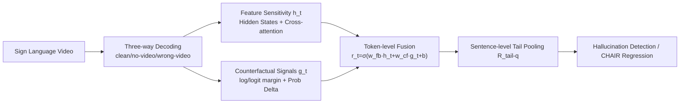

# Grounding or Guessing? Visual Signals for Detecting Hallucinations in Sign Language Translation

**Conference**: ICLR 2026  
**OpenReview**: [https://openreview.net/forum?id=bLFW2T3UHq](https://openreview.net/forum?id=bLFW2T3UHq)  
**Code**: To be confirmed  
**Area**: Multimodal Hallucination Detection / Sign Language Translation  
**Keywords**: Sign Language Translation, Hallucination Detection, Visual Grounding, Counterfactual Perturbation, Reliability Score  

## TL;DR
This paper investigates the problem of hallucination in Sign Language Translation (SLT) for the first time, proposing a token-level "reliability" score. By using feature sensitivity and counterfactual perturbations, it quantifies whether the decoder is "grounding on the video" or "guessing based on language priors," thereby predicting hallucination risk without reference translations and revealing why gloss-free models are more prone to hallucinations.

## Background & Motivation
**Background**: Sign Language Translation (SLT) is essentially video $\rightarrow$ text, but it differs fundamentally from general video understanding—sign language is a complete natural language with its own vocabulary and grammar; the visual modality is the **source language itself**, not auxiliary information. Early methods relied on glosses (manually annotated video-to-sign labels) for strong alignment supervision, but gloss annotation is expensive and difficult to scale. Recent trends favor gloss-free architectures using LLMs as backbones.

**Limitations of Prior Work**: Gloss-free models map continuous sign actions directly to natural language, lacking the intermediate alignment supervision provided by glosses. When visual representations are weak (blurry gestures or poor video quality), the language model dominates decoding, producing **fluent translations detached from the signer's true intent**, i.e., hallucinations. This is homologous to the phenomenon in Large Vision-Language Models (LVLMs) where "language priors overpower visual evidence."

**Key Challenge**: Existing text-side signals for hallucination detection (confidence, entropy, perplexity) only capture linguistic uncertainty but **cannot determine whether the output is truly supported by visual input**. In SLT, vision is the source language; thus, hallucinations are equivalent to translation errors, making "quantifying the degree of visual grounding" the critical factor.

**Goal**: To assign a reliability score to each generated token, quantifying its dependence on video evidence versus language priors, and to aggregate these signals into a sentence-level risk score for reference-free hallucination ranking and detection.

**Core Idea**: **"Grounding vs. Guessing" as a lens**—by comparing normal decoding with counterfactual decoding (video masked or replaced with incorrect video), the method measures whether the video truly helps prediction from the perspectives of "internal state changes" and "output probability advantages." These two types of evidence are linearly fused into token-level reliability, which is then pooled into a sentence-level score.

## Method

### Overall Architecture
The method runs the decoder three times in parallel at each decoding step: using the real video (clean), no video (cross-attention disabled), and incorrect video (mismatched). Two types of signals are extracted: **feature sensitivity** (drift in hidden states/cross-attention when removing the video, reflecting internal dependence) and **counterfactual signals** (probability advantage of the real video over incorrect/no video, reflecting external evidence). These two signals are linearly fused and passed through a sigmoid to obtain the token-level reliability $r_t$. Finally, tail pooling is used to obtain a sentence-level reliability score, which is fed into downstream classifiers/regressors to predict hallucinations.

### Key Designs

**1. Feature Sensitivity Signals: Measuring internal reliance on vision.** The core intuition is that if the internal state of the decoder remains unchanged after removing the video, the token was not "looking" at the video. This is characterized by **hidden state directional change**: the angle between the video-present state $h_t^{vid}$ and the masked input $h_t^{0}$ is normalized as $s_t^{hid}=\pi^{-1}\arccos\frac{\langle h_t^{vid}, h_t^{0}\rangle}{\|h_t^{vid}\|\|h_t^{0}\|}$. A larger angle implies a stronger shift and higher dependence on the video. Additionally, **cross-attention quality** $s_t^{attn}$ is characterized by aggregating the mean attention scores from the decoder to video encoding positions across all layers and heads, subtracting the quality under masked input and scaling by quantile to $[0, 1]$.

**2. Counterfactual Signals: Measuring if the video is truly useful.** Feature signals only indicate that states "changed," but not whether the video **positively helped the selected token**. To address this, three-way decoding is performed. For the token $y_t$ chosen by the clean input, a counterfactual distribution $p_{cf}(y_t|c_t)=\max\big(p_0(y_t|c_t),\, p_{mis}(y_t|c_t,x')\big)$ is defined. Taking the **stronger opponent** between no-video and mismatched-video, rather than the average, avoids false positives: if either opponent can explain $y_t$ almost as well, the token is judged as not grounded. Five complementary metrics are calculated: log probability margin $s_t^{log}=\log p_{vid}(y_t)-\log p_{cf}(y_t)$, scale-stable logit margin $s_t^{logit}$, normalized probability gain $s_t^{prob}=\sigma(s_t^{log})$, and absolute probability advantages relative to no-video/mismatched-video ($\Delta_t^{clean}$, $\Delta_t^{mis}$).

**3. Token and Sentence-level Fusion.** Feature signals $h_t=(s_t^{hid}, s_t^{attn})$ and counterfactual signals $g_t$ (7 dimensions in total) are linearly fused: $r_t=\sigma(w_{fb}^\top h_t + w_{cf}^\top g_t + b)$. Since hallucination supervision is only available at the sentence level, **tail pooling** aggregates $\{r_t\}$ into a fixed-length feature: $R_{tail\text{-}q}=\frac{1}{\lceil qT\rceil}\sum_{t\in\text{lowest }q\%} r_t$, primarily using tail-10 (mean of the lowest 10% tokens). This is because hallucinations are concentrated in the **low tail** of the reliability distribution.

**4. Text Baselines and META Fusion.** Monotonic isotonic regression (ISO) maps the reliability deficit to the hallucination rate $\text{CHAIR}\approx\text{ISO}(1-R^*)$. A META variant is also provided, concatenating grounding signals with text-side uncertainty (confidence, entropy, perplexity) to verify if visual grounding provides **complementary information** beyond textual signals.

## Key Experimental Results

### Main Results
Evaluated on PHOENIX-2014T (DGS$\rightarrow$DE) and CSL-Daily (CSL$\rightarrow$ZH) datasets using gloss-free (SpaMo) and gloss-based (TwoStream-SLT) models. Detection uses CHAIR>0 as the hallucination label (metrics: AUC / AP / ACC@0.5); regression reports Pearson / Spearman / ISO.

| Method | CSL-GB (AUC/AP/ACC) | CSL-GF | PHOENIX-GB | PHOENIX-GF |
|------|------|------|------|------|
| Grounding (Ours) | 0.803/0.991/0.963 | 0.951/0.998/0.970 | 0.827/0.954/0.899 | 0.918/0.986/0.938 |
| **META (Ours)** | **0.865/0.994/0.753** | **0.963/0.999/0.883** | **0.899/0.978/0.864** | **0.940/0.992/0.872** |
| Confidence | 0.647/0.976/0.508 | 0.953/0.998/0.868 | 0.618/0.887/0.645 | 0.926/0.989/0.860 |
| Perplexity | 0.609/0.980/0.610 | 0.952/0.998/0.842 | 0.595/0.892/0.561 | 0.888/0.979/0.713 |
| Token entropy | 0.729/0.985/0.665 | 0.958/0.998/0.866 | 0.639/0.900/0.581 | 0.871/0.975/0.731 |

Compared to entropy/perplexity, the method achieves up to +0.20 AUC and +0.30 ACC, with AP near 0.99. Overall detection accuracy is approximately 97%, with regression Spearman $\rho=0.72$.

### Ablation Study
The paper includes ablations on feature vs. counterfactual signals and pooling operators (mean vs. tail-10%). Stress tests were conducted under visual degradation (Gaussian noise, temporal downsampling, random frame dropping) and language degradation (incorrect starting prompts).

| Regression (Pearson/Spearman/ISO) | CSL-GF | PHOENIX-GF |
|------|------|------|
| Grounding (Ours) | -0.682/-0.680/0.722 | -0.623/-0.590/0.650 |
| **META (Ours)** | **-0.736/-0.705/0.755** | **-0.650/-0.613/0.675** |
| Confidence | -0.685/-0.657/0.714 | -0.612/-0.578/0.637 |
| Token entropy | -0.670/-0.698/0.748 | -0.468/-0.544/0.625 |

### Key Findings
- **Reliability is strongly negatively correlated with hallucination**: Higher grounding usage leads to lower CHAIR across datasets and architectures. The correlation is stronger in gloss-free models.
- **Grounding signals outperform text baselines independently**, and the integrated META variant is optimal, proving visual grounding provides complementary information.
- **Gloss-free models hallucinate more than gloss-based models** due to a systematic failure to utilize visual information, defaulting to language priors.
- Reliability decreases under visual degradation and successfully distinguishes between "grounded" and "guessed" tokens, supporting reference-free risk estimation.

## Highlights & Insights
- **Novelty**: Identifies and systematically studies hallucinations in SLT as its own category—where vision is the source language, hallucinations are equate to translation errors.
- **Clever Diagnosis**: Reframes "hallucination" as "insufficient visual grounding" and quantifies it through interpretable token-level scores via counterfactual three-way decoding.
- **Robust Design**: The use of `max` over `mean` in counterfactuals is vital, theoretically preventing false positives where any single counterfactual could explain a token.
- **Tail Pooling**: Addresses the essence of the problem by focusing on the low-reliability tail where hallucinations reside, proving more effective than sentence means.

## Limitations & Future Work
- Hallucination labels depend on CHAIR (based on entity overlap), which is an approximate measure and may miss semantic hallucinations involving non-entity classes.
- The method requires three decoder passes for every token, resulting in high inference overhead that is difficult for low-latency scenarios.
- Validation is limited to two datasets and two architectures; transferability to larger scale gloss-free LLM backbones remains to be investigated.
- Current work is a "detection/diagnosis" tool; feeding reliability signals back into training or decoding to **actively reduce** hallucinations is a natural next step.

## Related Work & Insights
- Extends LVLM hallucination research (CHAIR, SelfCheckGPT consistency sampling, attention alignment, perturbation analysis) and text-side uncertainty measures, while noting their "agnosticism" toward visual input.
- The counterfactual approach relates to Chlon et al. (2025), with the distinction of using the single strongest counterfactual rather than an average of multiple.
- Insight: In any multimodal task where vision functions as the "source" or "strong evidence," counterfactual perturbations + internal sensitivity can build reference-free grounding metrics as early warning signals for hallucinations.

## Rating
- Novelty: ⭐⭐⭐⭐⭐ First study on SLT hallucinations; original "grounding vs. guessing" lens and max-counterfactual design.
- Experimental Thoroughness: ⭐⭐⭐⭐ Solid coverage across datasets, architectures, detection/regression/stress tests; however, model/data scale is limited.
- Writing Quality: ⭐⭐⭐⭐ Clear motivation, rigorous signal definitions, and intuitive illustrations.
- Value: ⭐⭐⭐⭐ Provides a reusable reference-free diagnostic tool for SLT and broader multimodal hallucination detection.

<!-- RELATED:START -->

## Related Papers

- [\[ICLR 2026\] LUMINA: Detecting Hallucinations in RAG System with Context-Knowledge Signals](lumina_detecting_hallucinations_in_rag_system_with_context-knowledge_signals.md)
- [\[ACL 2026\] FinGround: Detecting and Grounding Financial Hallucinations via Atomic Claim Verification](../../ACL2026/hallucination/finground_detecting_and_grounding_financial_hallucinations_via_atomic_claim_veri.md)
- [\[ICLR 2026\] PostAlign: Multimodal Grounding as a Corrective Lens for MLLMs](postalign_multimodal_grounding_as_a_corrective_lens_for_mllms.md)
- [\[ICLR 2026\] Visual Multi-Agent System: Mitigating Hallucination Snowballing via Visual Flow](visual_multi-agent_system_mitigating_hallucination_snowballing_via_visual_flow.md)
- [\[ICLR 2026\] Look Carefully: Adaptive Visual Reinforcements in Multimodal Large Language Models for Hallucination Mitigation](look_carefully_adaptive_visual_reinforcements_in_multimodal_large_language_model.md)

<!-- RELATED:END -->
