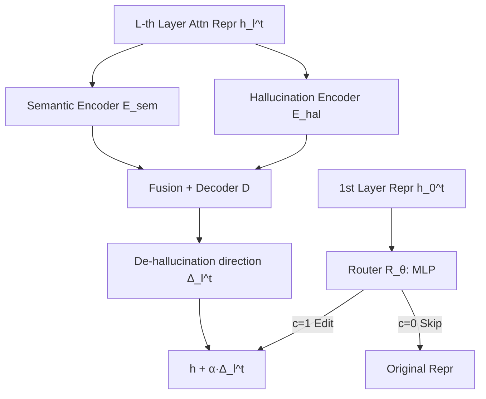

# Hallucination-aware Intermediate Representation Edit in Large Vision-Language Models

**Conference**: ICLR 2026  
**OpenReview**: [https://openreview.net/forum?id=v8C2Cd0lAh](https://openreview.net/forum?id=v8C2Cd0lAh)  
**Code**: [https://github.com/ASGO-MM/HIRE](https://github.com/ASGO-MM/HIRE)  
**Area**: Multimodal Hallucination Mitigation / LVLM  
**Keywords**: LVLM Hallucination, Representation Editing, Contrastive Learning, DPO, Controllable Generation  

## TL;DR
HIRE does not perform retraining or double forward passes. Instead, it executes "in-place editing" of intermediate representations in LVLMs. Using a dual encoder, it disentangles hallucination components from semantics and shifts them along a "de-hallucination direction." A lightweight Router is employed to intervene only on high-risk tokens. HIRE achieves SOTA results across three benchmarks with inference overhead close to the original model, while also supporting controllable generation to amplify hallucinations via a single hyperparameter.

## Background & Motivation
**Background**: LVLMs show strong performance in multimodal reasoning and scene understanding but suffer from widespread "hallucinations," where outputs contradict image facts. Mainstream mitigation approaches fall into two categories: retraining methods (constructing hallucination-specific datasets and fine-tuning with new paradigms) and Contrastive Decoding (CD, which corrects logits by subtracting a "weakened, hallucination-prone" variant distribution from the original distribution during inference).

**Limitations of Prior Work**: Retraining incurs high data construction and computational costs and requires changing model weights. Although CD does not modify weights, it requires two forward passes per inference, doubling latency. Furthermore, CD adjusts probabilities for all tokens indiscriminately—even common words like "in/on/from" which rarely cause hallucinations—wasting computation and potentially harming coherence. Moreover, most methods lack the ability to control the degree of hallucination, which can be beneficial in scenarios like creative writing.

**Key Challenge**: There is a trade-off between the high cost of retraining and the double-forward overhead of CD, combined with a lack of fine-grained scheduling over which tokens to manage and to what extent.

**Goal**: Dynamically detect and eliminate hallucinations without retraining weights or introducing double forward passes, while supporting continuous control of hallucination intensity.

**Key Insight**: Recent studies find that in the internal representations of LVLMs, truthful features and hallucination features are separable in the latent space. **HIRE shifts hallucination mitigation from "output-end decoding" to "intermediate representation editing."** Since truthful and hallucination features are separable, the "de-hallucination direction" can be identified directly in the representation space to shift high-risk token representations, eliminating hallucinations at the source.

## Method

### Overall Architecture
HIRE (Hallucination-aware Intermediate Representation Edit) targets the attention layer representations of each Transformer layer for editing. Two components work in tandem: the **Editor** determines "which direction to edit" by using a dual encoder to decompose representations into semantic and hallucination subspaces, calculating a token-level de-hallucination direction $\Delta_l^t$; the **Router** determines "whether to edit" using a lightweight MLP binary decision based only on the first-layer representation to decide if the Editor should be activated for all subsequent layers. Both components are trained without labeled data using contrastive learning and DPO, respectively.

### Key Designs

**1. Editor: Disentangling "Hallucination" from "Semantics" for Editing** — Direct manipulation of representations can destroy semantic integrity because hallucination text and normal text representations are entangled. HIRE adopts a disentangled autoencoder approach, where a semantic encoder $E_{sem}$ and a hallucination encoder $E_{hal}$ extract semantic components $h_{l,sem}^t$ and hallucination components $h_{l,hal}^t$ from the same representation $h_l^t$. It first calculates a token-independent "de-hallucination direction" $\delta_l$ by averaging token-level differences between "truthful vs. hallucinated" representations in the hallucination subspace. This is then injected into an attention fusion (semantics as query, hallucination components as key/value) and passed through decoder $D$ to obtain a token-specific editing direction:
$$\Delta_l^t = D(h_{l,sem}^t + f_{attn}(h_{l,sem}^t, h_{l,hal}^t + \delta_l)) - D(h_{l,sem}^t + f_{attn}(h_{l,sem}^t, h_{l,hal}^t - \delta_l))$$
This symmetric construction of "plus $\delta_l$ decoding" minus "minus $\delta_l$ decoding" maps the overall de-hallucination trend to a specific shift for the current token in the original representation space.

**2. Router: Selective Intervention for High-risk Tokens** — Editing all tokens is computationally wasteful and may damage clean representations. HIRE observes that deeper LVLM layers are redundant while shallower layers retain more information. Thus, the Router $R_\theta$ reads only the first-layer representation $h_0^t$ to output a binary signal $c$: if $c=1$, the Editor is activated for all subsequent layers; if $c=0$, no editing occurs for the sequence. The final editing formula is:
$$h_{l,aug}^t = \begin{cases} h_l^t + \alpha \cdot \Delta_l^t & c=1 \\ h_l^t & c=0 \end{cases}$$
The intensity $\alpha \in [-1,1]$ is a key design feature: $\alpha > 0$ pushes features toward low-hallucination directions, while $\alpha < 0$ amplifies hallucinations, enabling "controllable hallucination generation" via a single hyperparameter.

**3. Training without Labels: Contrastive Learning for Editor + Reference-free DPO for Router** — Data scarcity is the primary obstacle. HIRE automatically generates truthful representations $H_l^+$ and hallucinated representations $H_l^-$ by pairing the same text with "clean images vs. noisy images" (visual uncertainty amplifies hallucinations). The Editor is trained using InfoNCE contrastive learning to ensure the semantic encoder maintains high similarity for the same token across samples, while the hallucination encoder clusters by "truthful/hallucinated groups" regardless of token semantics. This is combined with reconstruction and editing losses:
$$L_{tl,recon}^+ = \mathrm{MSE}(h_{tl}^+, D(h_{tl,sem}^+ + f_{attn}(h_{tl,sem}^+, h_{tl,hal}^+)))$$
The Router is trained using CHAIRI scores to rank $N$ candidate captions per image. The best and worst are used as preference pairs $(h^+,c^+)$ and $(h^-,c^-)$ for a reference-model-free DPO (suitable for training from scratch):
$$L_r = -\mathbb{E}_{(h,c)}\left[\log\sigma\left(\beta(\log\pi_\theta(h^+,c^+) - \log\pi_\theta(h^-,c^-))\right)\right]$$
where $\beta=0.1$. This allows the Editor to learn "how to edit" and the Router to learn "when to edit" independently and end-to-end.

## Key Experimental Results

### Main Results
CHAIR Benchmark (LLaVA-1.5, max new tokens=512, lower is better):

| Method | CHAIRS↓ | CHAIRI↓ | TFLOPs↓ |
|------|---------|---------|---------|
| baseline | 51.3 | 16.8 | 10.23 |
| VCD | 46.8 | 13.2 | 20.46 |
| Octopus | 39.2 | 11.1 | 21.39 |
| VTI | 35.8 | 11.1 | - |
| **HIRE** | **30.2** | **9.7** | **11.81** |

Sentence-level and instance-level hallucinations decrease by approximately 40% and 50% respectively compared to the baseline. While TFLOPs for CD-based methods generally double (~20+), HIRE increases only slightly (11.81 vs. 10.23).

POPE Benchmark (LLaVA-1.5, ALL setting): HIRE reaches Acc. 87.27 / F1 87.23, surpassing the runner-up Octopus (85.79/83.44), with TFLOPs (10.62) far lower than CD-based methods (16+). On the AMBER benchmark, HIRE achieves the highest overall score, improving by 7.54 and 6.38 on LLaVA-1.5 and InstructBLIP, respectively, compared to baselines.

### Ablation Study
Short description scenario (max new tokens=64, LLaVA-1.5) comparing controllable/DPO-based methods:

| Method | CHAIRS↓ | CHAIRI↓ |
|------|---------|---------|
| baseline | 20.4 | 6.2 |
| M3ID+DPO | 13.5 | 5.7 |
| Nullu | 17.0 | 5.9 |
| **HIRE** | 15.2 | **5.4** |

Instance-level hallucination (CHAIRI) still reaches the lowest value, indicating that token-level editing directions are more precise than pure decoding-side DPO.

### Key Findings
- **Efficiency and Effectiveness Coexist**: Through selective editing via the Router, HIRE keeps the overhead of "intermediate representation editing" close to the baseline, completely avoiding the double-forward bottleneck of CD.
- **Controllability as a Unique Capability**: Negative $\alpha$ values stably amplify hallucinations to generate more imaginative descriptions (CHAIRI is continuously adjustable from 0.2 to 0.8), a bidirectional capability most baselines lack.
- **Cross-model Generalization**: HIRE consistently leads on both LLaVA-1.5 and InstructBLIP architectures, verifying the universality of the representation separability hypothesis.

## Highlights & Insights
- **Paradigm Shift**: Moving the "battlefield" of hallucination mitigation from output-end logits to intermediate representations avoids weight modification (unlike retraining) and double-forward passes (unlike CD), offering a "third way."
- **Disentanglement + Directional Editing**: The dual encoder decouples hallucinations from semantics first. Using symmetric differences to construct token-level editing directions cleverly bypasses the difficulty of "direct editing destroying semantics."
- **Controllable Hallucination via One Hyperparameter**: The sign of $\alpha$ determines whether to suppress or amplify hallucinations, turning the practical need for "retaining imagination in creative writing" into a continuous dial.

## Limitations & Future Work
- The Router's binary strategy (using the first layer to decide for the whole sentence) is relatively coarse and may lack precision for mixed cases where some tokens are hallucinations and others are truthful (the appendix explores hierarchical decision alternatives).
- The editing direction $\delta_l$ relies on "noisy images" to induce hallucinations; the choice of induction method affects the quality of the learned direction. Generalization to non-object hallucinations (e.g., attributes, relations) requires more systematic verification.
- Evaluation is concentrated on CHAIR/POPE/AMBER with LLaVA-1.5/InstructBLIP; performance on larger and stronger base models (e.g., Qwen-VL series) has not yet been covered.

## Related Work & Insights
HIRE stands at the intersection of two research lines: first, the coding of truthfulness cues in LLM/LVLM internal representations and the separability of truthful/false features in latent space (Azaria & Mitchell 2023; Li et al. 2024; Duan et al. 2025), which provides the premise for "editable representations"; second, the concept of representation engineering or activation steering. HIRE upgrades static steering vectors into token-level directions dynamically generated by a dual encoder. Compared to methods like VTI and Nullu that operate in representation or null spaces, HIRE differs through explicit disentanglement, selective Router editing, and controllable intensity. Insight for future work: the "when to edit/which layers to edit/how strongly to edit" at the representation level can serve as an independent learnable strategy. This decoupled design of "Editor for direction + Router for timing" could be transferred to broader controllable generation tasks such as factual correction and style control.

## Rating
- Novelty: ⭐⭐⭐⭐ Moves hallucination mitigation to intermediate representation editing, utilizing dual encoder disentanglement and DPO Router selective editing for a clear, novel paradigm.
- Experimental Thoroughness: ⭐⭐⭐⭐ Covers three benchmarks, two LVLM architectures, long/short descriptions, and controllable generation comparisons, with TFLOPs evidence. One star deducted as stronger base models are not covered.
- Writing Quality: ⭐⭐⭐⭐ The logic from motivation to challenges to method and experiments is smooth. Figure 2 is clear, and formulas/symbols are consistent.
- Value: ⭐⭐⭐⭐ Achieves SOTA with almost no additional inference overhead and supports controllable hallucinations, providing direct value for hallucination management in practical LVLM deployments.

<!-- RELATED:START -->

## Related Papers

- [\[ICLR 2026\] Imitating the Truth: Attention-aware Truth-Guided Enhancement for Hallucination Mitigation in Large Vision-Language Models](imitating_the_truth_attention-aware_truth-guided_enhancement_for_hallucination_m.md)
- [\[ICLR 2026\] NDAD: Negative-Direction Aware Decoding for Large Language Models via Controllable Hallucination Signal Injection](ndad_negative-direction_aware_decoding_for_large_language_models_via_controllabl.md)
- [\[ICLR 2026\] Dynamic Multimodal Activation Steering for Hallucination Mitigation in Large Vision-Language Models](dynamic_multimodal_activation_steering_for_hallucination_mitigation_in_large_vis.md)
- [\[ICLR 2026\] Mitigating Hallucination in Vision-Language Model with Depth and Spatial-aware Key-Value Refinement](mitigating_hallucination_in_vision-language_model_with_depth_and_spatial-aware_k.md)
- [\[CVPR 2026\] Residual Decoding: Mitigating Hallucinations in Large Vision-Language Models via History-Aware Residual Guidance](../../CVPR2026/hallucination/residual_decoding_mitigating_hallucinations_in_large_vision-language_models_via_.md)

<!-- RELATED:END -->
