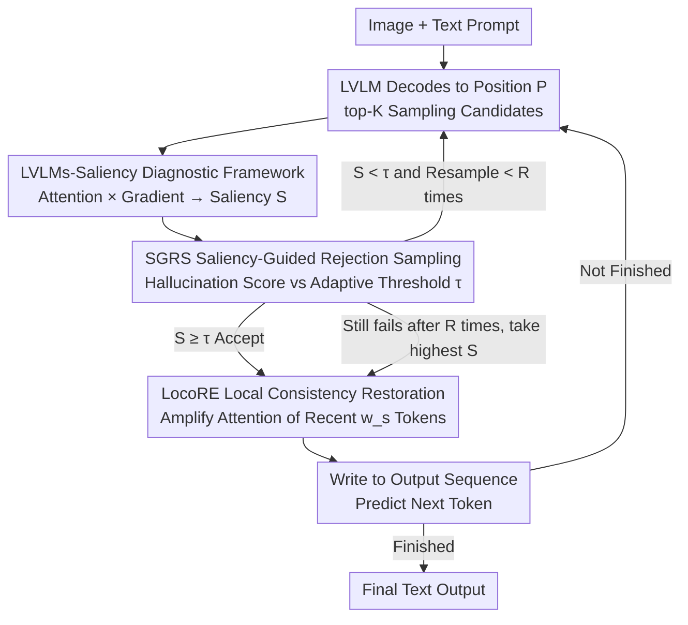

# Hallucination Begins Where Saliency Drops

**Conference**: ICLR 2026  
**arXiv**: [2601.20279](https://arxiv.org/abs/2601.20279)  
**Code**: [https://github.com/zhangbaijin/LVLMs-Saliency](https://github.com/zhangbaijin/LVLMs-Saliency)  
**Area**: Hallucination Detection  
**Keywords**: Hallucination mitigation, Large Vision-Language Models, Saliency analysis, Attention mechanism, Inference-time intervention

## TL;DR

Ours proposes the LVLMs-Saliency gradient-aware diagnostic framework to quantify the visual anchoring strength of each output token. It uncovers a critical pattern: "hallucination occurs when the saliency of previous output tokens regarding the next token prediction decreases." Based on this, a dual-mechanism inference-time framework, SGRS (Saliency-Guided Rejection Sampling) + LocoRE (Local Consistency Restoration), is designed to significantly reduce hallucination rates across multiple LVLMs.

## Background & Motivation

Large Vision-Language Models (LVLMs) such as LLaVA, Qwen2-VL, and InternVL have achieved remarkable progress in cross-modal tasks, but **hallucination** remains a core challenge—models may generate objects or attributes that do not exist in the image.

Existing mitigation strategies are divided into two categories: training-required methods (e.g., fine-tuning with additional data) and training-free methods (e.g., OPERA, VCD, DOPRA, etc.). The latter mainly focus on the attention sink phenomenon—where certain tokens continuously attract high attention weights during subsequent generation, potentially leading to hallucinations. However, these methods have key deficiencies: **attention maps only reflect decisions in the forward pass and cannot capture the influence chain of input tokens on the final output**. Experiments demonstrate that relying solely on attention maps makes it nearly impossible to distinguish between the generation patterns of correct tokens and hallucinated tokens (Figure 1).

The core insight of this paper is: by defining **Saliency** as the element-wise product of attention weights $\mathbf{A}$ and their gradients $\nabla \mathbf{A}$, a decisive pattern can be clearly observed—hallucination occurs when the saliency of previous output tokens drops. This implies that the model "forgets" recent context, and the collapse of contextual memory leads to semantically incoherent outputs.

## Method

### Overall Architecture

The method first employs the LVLMs-Saliency diagnostic framework to quantify the visual anchoring strength of each output token. Then, it transforms the rule "hallucination starts with a drop in saliency" into active intervention through two inference-time modules: SGRS acts as a gatekeeper, filtering out candidates with excessively low saliency before they are committed to the sequence; LocoRE acts as a stabilizer, enhancing the attention to the recent context after a token is accepted. Both modules are embedded into the token-by-token decoding loop without requiring any training.

### Key Designs

**1. LVLMs-Saliency Diagnostic Framework: Making Attentions "Reveal" Hallucination Signals**

Since attention weights alone fail to distinguish correct tokens from hallucinations—as attention only reflects forward decisions and loses the chain of "which input tokens actually influenced which output"—this paper computes the saliency matrix of the $l$-th layer and $h$-th head as $\mathbf{S}^{(l,h)} = \text{tril}(|\mathbf{A}^{(l,h)} \odot \nabla \mathbf{A}^{(l,h)}|)$. By summing over all heads and applying $\ell_2$ normalization, the layer-wise saliency is obtained as $\bar{\mathbf{S}}^{(l)} = \frac{\sum_h \mathbf{S}^{(l,h)}}{\|\sum_h \mathbf{S}^{(l,h)}\|_2}$. The gradient weighting step is critical: it explicitly characterizes "how important this attention connection is to the final prediction." Once weighted, the pattern immediately emerges—the saliency of correct tokens shows strong dependence on recent tokens and decays smoothly with distance, whereas the saliency of hallucinated tokens collapses entirely, indicating the model has "forgotten" the just-generated context. This phenomenon is stably reproduced across 500 samples and three architectures (LLaVA-1.5, Qwen2-VL, InternVL), allowing saliency to serve as a direct probe for hallucination risk.

**2. SGRS (Saliency-Guided Rejection Sampling): Intercepting High-Risk Candidates Before Admission**

With the risk signal provided by the diagnostic framework, SGRS applies it for active filtering during decoding. At decoding position $P$, top-$K$ candidates are sampled. For each candidate $c_i$, a hallucination score is aggregated across target layers $\mathcal{L}_{\text{target}}$ and positions $\mathcal{J}$ as $\mathcal{S}(c_i) = \frac{1}{|\mathcal{L}_{\text{target}}| \cdot |\mathcal{J}|} \sum_{l \in \mathcal{L}_{\text{target}}} \sum_{j \in \mathcal{J}} \bar{\mathbf{S}}_{P,j}^{(l)}$. A candidate is accepted only if $\mathcal{S}(c_i) \geq \tau^{(P)}$. The threshold is not fixed but adaptive to generation history—calculated as the average saliency of the $W$ most recent accepted tokens multiplied by a sensitivity coefficient $\alpha \in (0,1)$, i.e., $\tau^{(P)} = \alpha \cdot \frac{1}{|\mathcal{H}|}\sum_{j \in \mathcal{H}} \mathcal{S}(x_j)$. This allows the threshold to float with the overall anchoring level of the context. If all candidates are rejected, resampling occurs up to $R$ times; if still unsuccessful, the candidate with the highest saliency is selected to ensure the decoding process does not stall.

**3. LocoRE (Local Consistency Restoration): Counteracting Saliency Decay at the Source**

While SGRS filters out bad tokens, accepted "good" tokens may still be gradually "forgotten" as generation progresses, causing saliency to slide. LocoRE addresses this by directly modifying the attention structure: when predicting position $P+1$, the attention weights of the $w_s$ most recent tokens are multiplied by an amplification factor $\gamma_j^{(P)} = 1 + \beta \cdot \mathbb{I}((P - j) \leq w_s)$, where $\beta \geq 0$ controls the enhancement strength. This raises the attention of recent tokens within the window while keeping others unchanged, essentially "propping up" the collapsing saliency by manually maintaining the influence of recent context. Since it only modifies attention weights without requiring gradient computation or model parameter updates, LocoRE is plug-and-play and adds less than 2% latency, making it the primary source of gain in actual deployments.

Notably, the entire method is a pure inference-time intervention requiring no training or fine-tuning. The additional overhead mainly comes from one backward pass in SGRS (approx. 30–40% latency increase), while LocoRE is almost cost-free.

## Key Experimental Results

### Main Results

Comparison on POPE, CHAIR, and MME using LLaVA-1.5-7B as the baseline:

| Method | POPE F1 | POPE Acc | CHAIR S↓ | CHAIR I↓ | MME Total |
|------|---------|----------|----------|----------|-----------|
| Beam Search (Baseline) | 85.4 | 84.0 | 51.0 | 15.2 | 565.34 |
| OPERA (CVPR 2024) | 84.2 | 85.2 | 47.0 | 14.6 | 549.00 |
| EAH (EMNLP 2025) | 85.7 | 86.0 | 36.4 | 9.9 | 603.99 |
| CausalLLM (ICLR 2025) | 86.0 | 86.5 | - | - | 656.00 |
| MemVR (ICML 2025) | 87.1 | 87.4 | 46.6 | 13.0 | 648.30 |
| LocoRE (Ours) | 86.9 | 87.3 | 38.4 | 11.2 | 656.66 |
| **SGRS + LocoRE (Ours)** | **87.0** | **87.5** | **35.6** | **8.2** | **668.33** |

Comprehensive results across models (Gain of SGRS + LocoRE relative to baseline):

| Model | LLaVAW | MM-Vet | VizWiz | CHAIR S↓ | POPE Acc |
|------|--------|--------|--------|----------|----------|
| LLaVA-1.5-7B | +4.2 | +5.5 | +6.4 | +12.4 | +3.5 |
| LLaVA-1.5-13B | +4.3 | +5.9 | +3.5 | +7.4 | +0.4 |
| Qwen2-VL-7B | +4.1 | +4.5 | +3.0 | +5.7 | +1.4 |
| InternVL-7B | +3.9 | +5.0 | +4.5 | +12.2 | +1.5 |

### Ablation Study

Ablation of hyperparameters $\alpha$ (SGRS) and $\beta$ (LocoRE) on LLaVA-1.5-7B:

| $\alpha$ | $\beta$ | CHAIR S↓ | POPE F1 | Description |
|----------|---------|----------|---------|------|
| 0.0 | 0.0 | 48.0 | 85.4 | Baseline |
| 0.0 | 0.15 | 38.4 | 86.9 | LocoRE Only |
| 0.6 | 0.0 | 36.5 | 86.9 | SGRS Only |
| 0.6 | 0.15 | **35.6** | **87.0** | Full Method |
| 0.6 | 1.0 | 50.2 | 60.3 | Degradation due to over-enhancement |

### Key Findings

- **Core pattern validated across models**: Across LLaVA-1.5, Qwen2-VL, and InternVL, the saliency of hallucinated tokens is consistently lower than that of correct tokens. The hallucination rate reaches 68%-76% in the lowest saliency intervals and drops to 18%-28% in the highest intervals.
- **Causal validation experiment**: Manually decreasing the saliency of correct tokens (attenuation factor from 1.0 to 0.2) caused the CHAIR hallucination rate to rise from 35.6 to 56.0, directly proving the causal relationship.
- **LocoRE offers the highest cost-performance**: Significant improvements are achieved with < 2% latency increase, making it the best choice for practical deployment.
- **$\alpha = 0.6$ is the optimal compromise for SGRS**: It suppresses 28.3%+ of hallucinations while maintaining inference speed and output quality; $\alpha = 0.9$ further reduces hallucinations but increases latency by 33%.

## Highlights & Insights

- **Paradigm shift from "Attention → Saliency"**: Attention maps alone cannot distinguish correct from hallucinated tokens, but gradient-weighted saliency can—this is a significant advancement in understanding LVLM hallucinations.
- **Discovery of a simple yet powerful rule**: "Hallucination begins where saliency drops"—when the model forgets the recent output context, it generates incoherent content. This rule is also intuitively very reasonable.
- **Exquisite dual-mechanism closed-loop design**: The collaborative design of SGRS (gatekeeping) + LocoRE (stabilizing) is elegant and well-partitioned.
- **High practicality of LocoRE**: No training, no extra models, no gradient computation, plug-and-play, and nearly zero latency—ideal for industrial applications.
- **Compelling visualization analysis**: The saliency comparison between correct and hallucinated tokens is intuitive and clear.

## Limitations & Future Work

- **Latency overhead of SGRS**: Requiring an extra backward pass per token (30-40% overhead) makes it unsuitable for real-time applications. The paper acknowledges LocoRE alone as the more practical choice.
- **Failure Case**: For "high-confidence hallucinations" (where the model is very certain about outputting incorrect content), saliency may still be high, making it undetectable by SGRS. This aligns with OpenAI's finding that "models can be confidently wrong."
- **Context-independent generation**: SGRS might be less effective when the model's generated content itself deviates from the current context (e.g., hallucinating a completely new topic).
- **Focus on text output saliency**: It entirely ignores the role of visual saliency—though the paper's analysis of 500 samples suggests that prompt saliency is not the primary cause of hallucination.
- **Hyperparameters require tuning for different models**: LLaVA-1.5 uses $\beta = 0.15$ while Qwen2-VL uses $\beta = 0.20$, necessitating manual searches.

## Related Work & Insights

- **OPERA, DOPRA**: Mitigate hallucination by penalizing logits of attention sink tokens, but ours argues that attention alone is insufficient and requires gradient information.
- **EAH**: Enhances visual information by replacing shallow attention heads; effective, but may lose output diversity (lower Recall). LocoRE maintains higher Recall.
- **TAME, Farsight**: Analyze local self-attention patterns of anchor tokens but ignore contextual dependencies of text outputs.
- **Insight**: Gradient-multiplied attention as a saliency measure has long been used in NLP (e.g., attribution explanation), but ours is the first to systematically apply it to LVLM hallucination diagnosis, demonstrating the potential of "old methods in new scenarios."
- **Generalizability**: The saliency analysis framework can be extended to quality control in any autoregressive generation model.

## Rating

- Novelty: ⭐⭐⭐⭐
- Experimental Thoroughness: ⭐⭐⭐⭐⭐
- Writing Quality: ⭐⭐⭐⭐
- Value: ⭐⭐⭐⭐⭐

<!-- RELATED:START -->

## Related Papers

- [\[CVPR 2026\] Tell Model Where to Look: Mitigating Hallucinations in MLLMs by Vision-Guided Attention](../../CVPR2026/hallucination/tell_model_where_to_look_mitigating_hallucinations_in_mllms_by_vision-guided_att.md)
- [\[ACL 2025\] HALoGEN: Fantastic LLM Hallucinations and Where to Find Them](../../ACL2025/hallucination/halogen_hallucinations.md)
- [\[ICLR 2026\] Dynamic Multimodal Activation Steering for Hallucination Mitigation in Large Vision-Language Models](dynamic_multimodal_activation_steering_for_hallucination_mitigation_in_large_vis.md)
- [\[ICLR 2026\] Imitating the Truth: Attention-aware Truth-Guided Enhancement for Hallucination Mitigation in Large Vision-Language Models](imitating_the_truth_attention-aware_truth-guided_enhancement_for_hallucination_m.md)
- [\[ICLR 2026\] PostAlign: Multimodal Grounding as a Corrective Lens for MLLMs](postalign_multimodal_grounding_as_a_corrective_lens_for_mllms.md)

<!-- RELATED:END -->
