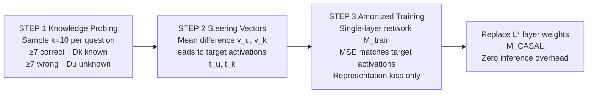

# Hallucination Reduction with CASAL: Contrastive Activation Steering for Amortized Learning

**Conference**: ICLR 2026  
**OpenReview**: [https://openreview.net/forum?id=YM3RcI3q0E](https://openreview.net/forum?id=YM3RcI3q0E)  
**Code**: [https://github.com/facebookresearch/CASAL](https://github.com/facebookresearch/CASAL)  
**Area**: Hallucination Mitigation / Interpretability / Representation Engineering  
**Keywords**: Hallucination, Activation Steering, Amortized Optimization, Knowledge Boundary, Representation Loss, MoE  

## TL;DR
CASAL "amortizes" inference-time activation steering into model weights—by training only a sub-module of a single layer using only representation loss (without cross-entropy), the LLM learns to "answer what it knows and abstain from what it doesn't." This reduces hallucination rates by 30%–40% on multiple short-form QA benchmarks while requiring ~30× less compute and ~20× less data than LoRA-style baselines.

## Background & Motivation
**Background**: Interpretability research has found that LLM residual stream activations encode "self-awareness"—activations for known vs. unknown questions are linearly separable. Steering activations along these directions can reduce overconfidence and encourage the model to admit uncertainty.

**Limitations of Prior Work**: Such steering methods are almost exclusively **inference-time interventions**, requiring a local optimization to be solved online for every query (shifting activations during each forward pass). This introduces continuous deployment overhead and necessitates real-time monitoring. Furthermore, online steering like CAA can negatively impact the accuracy of questions the model could originally answer correctly. Conversely, mainstream alignment methods (SFT/DPO/GRPO) use cross-entropy to train the model to be a "good test-taker," rewarding guessing over admitting ignorance, which amplifies hallucinations.

**Key Challenge**: The internal state **already** reflects "known vs. unknown," yet the model still outputs confident incorrect answers. The root cause is that the training/evaluation paradigm only takes signals from external corpora (cross-entropy) rather than allowing the model to directly utilize its own internal representations.

**Goal**: Design a hallucination mitigation training method that is free of inference-time intervention, lightweight, data/compute-efficient, and generalizes across distributions, architectures, and modalities.

**Core Idea**: **[Amortization + Pure Representation Loss]** Replace "repeated online steering" with "one-time offline training of a small sub-network to approximate the steering solution" (amortized optimization). Use representation loss as the sole training objective (instead of an auxiliary term to cross-entropy, as in RepE/ReFAT) to bake knowledge boundaries directly into the weights.

## Method

### Overall Architecture
CASAL is an "amortized version of activation steering." Instead of repeatedly solving steering problems for each query at inference time, it trains a parameterized sub-network offline once to approximate the solution, spreading the steering benefits across all future queries. The pipeline consists of three steps: probing the model's knowledge boundary, constructing contrastive steering vectors to obtain target activations, and training a single layer to match these target activations.

### Key Designs

**1. Knowledge Boundary Probing: Using consistency to split questions into "known" and "unknown" sets.** CASAL labels questions offline as the supervision source for subsequent steering. For each input $x$, $k=10$ responses are sampled to calculate the correctness count $s(x)=\sum_i \mathbb{1}[y^{(i)}(x)\ \text{correct}]$. Questions with $s(x)\geq\tau$ ($\tau=7$) are placed in the known set $D_k$, and those with $k-s(x)\geq\tau$ are placed in the unknown set $D_u$. Strict thresholds (7/10) ensure that only questions with high consistency are used, filtering out ambiguous samples near the decision boundary. This step is robust to threshold changes and does not introduce unique overhead, as baselines like SFT/DPO require the same labels.

**2. Contrastive Steering Vectors: Mean differences characterize whether the "question itself" is known.** At target layer $L^*$, residual activations $a^{L^*}(x)$ are taken at the position of the question's last token. Using the question's end ensures the vector reflects the model's knowledge of the task rather than the correctness of a specific answer. Means $\bar a^{L^*}_k$ and $\bar a^{L^*}_u$ are computed for both sets, and their difference yields two opposite steering vectors:

$$v^{L^*}_u=\bar a^{L^*}_u-\bar a^{L^*}_k,\qquad v^{L^*}_k=\bar a^{L^*}_k-\bar a^{L^*}_u$$

The steering vectors are added back to the activations with intensity $\alpha$ to produce target activations: $t^{L^*}_u(x)=a^{L^*}(x)+\alpha v^{L^*}_u$ ("abstain if unknown") and $t^{L^*}_k(x)=a^{L^*}(x)+\alpha v^{L^*}_k$ ("answer if known"). These target activations are cached as regression targets.

**3. Single-layer Amortized Training: Distilling "online steering solutions" into weights using only representation loss.** A single-layer network $M_{train}$ is initialized with weights from the original model's $L^*$ layer, $W^{L^*}_{original}$. MSE is used to make current activations approach target activations:

$$\mathcal{L}=\underbrace{\mathbb{E}_{x\in D_u}\lVert t^{L^*}_u(x)-a^{L^*}(x)\rVert^2}_{\mathcal{L}_u}+\underbrace{\mathbb{E}_{x\in D_k}\lVert t^{L^*}_k(x)-a^{L^*}(x)\rVert^2}_{\mathcal{L}_k}$$

After training, $W^{L^*}_{CASAL}$ is directly swapped back into the original model. Crucially, the loss is **local to layer $L^*$**. Both forward and backward passes occur only within the single-layer network. Unlike cross-entropy, which requires a full model forward pass to calculate output probabilities even when updating one layer, CASAL only involves the target layer.

**4. Constant Cost across Generation Lengths: Loss calculated at a single token position.** CASAL calculates loss only at the question's final token, making the cost independent of answer length. In contrast, SFT averages cross-entropy over all answer tokens, and DPO calculates log probabilities for all chosen/rejected tokens. This makes CASAL significantly more efficient as answer length increases.

## Key Experimental Results

### Main Results (Efficiency and side-effects)

| Method | TriviaQA Abstention↓ | EntityQA Abstention↓ | PopQA Accuracy↑ | Data Required | Compute (FLOPs/token) |
|---|---|---|---|---|---|
| Baseline | 7.93% | 8.94% | 91.08% | — | — |
| SFT | 10.01% | 11.08% | 82.89% | 12,800 | Base |
| DPO | 14.37% | 17.66% | 90.25% | 12,800 | Base |
| GRPO | 17.77% | 16.67% | 85.78% | 12,800 | Base |
| **CASAL** | **7.29%** | **6.84%** | 85.11% | **640** | **~1/30 LoRA** |

CASAL matches or exceeds the performance of baselines using only 640 samples (20× data efficiency), achieving the lowest abstention rate without hurting known-item accuracy. General capabilities (MMLU 68.04 / GSM8K 77.02 / MT-Bench 7.57) remain comparable to baselines.

### OOD Generalization and Cross-Architecture/Modality

| Setting | Data | Hallucination Rate (Unknown)↓ | Known Accuracy↑ |
|---|---|---|---|
| Cross-subset (TriviaQA Wiki→Web) | Test Web | 50.7% → 32.4% | 90.08% |
| Cross-dataset (TriviaQA→EntityQA) | Test EntityQA | 50.7% → 11.7% | 95.77% |
| VLM (Qwen2.5-VL-7B, WorldCuisines) | — | 72.4% → 33.3% (−38.7%) | 90.36% |
| VLM (Landmark-VQA) | — | 75.8% → 31.3% | 99% |
| MoE (OLMoE) | — | −42.9% | Unchanged |

### Key Findings
- **Correlation between Representation Separation and Behavior**: During training, the Silhouette score for known/unknown cluster separation increases, correlating strongly with the decline in hallucination rate ($R^2=0.945$).
- **Superiority over Online Steering (CAA)**: CASAL matches CAA's hallucination reduction on unknown questions but does not degrade accuracy on known questions, whereas CAA often exhibits side effects on correct answers.
- **MoE Compatibility**: In MoE models, known/unknown states are co-represented within the same set of experts; CASAL's local representation loss converges across experts, making it the first steering-based training method effective for both dense and MoE architectures.

## Highlights & Insights
- **Bridge between Amortized Optimization & Interpretability**: Reframing "solving a steering problem for every sample at inference" as "training a function offline to approximate the solution" is an elegant application of VAE/amortized inference ideas to representation engineering.
- **Training LLMs with Pure Representation Loss**: One of the first methods to train LLMs exclusively with representation-level targets, making internal representation signals the primary objective rather than an auxiliary term.
- **Dual Efficiency of Local Loss**: Local loss at a single layer saves compute across depth; loss at a single token saves compute across length. The combination leads to 30× compute and 20× data advantages.
- **Broad Applicability**: Effective across text-only/VLM and dense/MoE architectures, showing high potential for production deployment.

## Limitations & Future Work
- Dependency on label quality during the knowledge probing stage, which requires 10 samples per question. Defining known/unknown for open-ended or long-form generations is non-trivial.
- Training only a single layer and supervising only the final question token may have limited coverage for multi-step reasoning or scenarios where uncertainty emerges during the generation process.
- The linear assumption of "mean difference" for steering vectors may be less effective in domains where knowledge boundaries are non-linearly separable.
- Abstention rates on PopQA (19.89%) are relatively high, indicating that balancing different data distributions still requires hyperparameter tuning.

## Related Work & Insights
- **Inference-time Steering** (CAA, Rimsky 2024; Turner 2024; Ferrando 2025): CASAL bakes these gains into weights, eliminating per-instance intervention.
- **Representation-level Fine-tuning** (RepE, ReFAT): Usually treat representation loss as an auxiliary to cross-entropy; CASAL uses it as the sole objective.
- **Amortized Optimization** (VAE/Kingma 2013, Rezende 2014): Provides the theoretical framework for replacing repeated optimization with parameterized functions.
- Insight: Any lightweight optimization performed repeatedly at inference time can potentially be distilled into weights using an amortized approach.

## Rating
- **Novelty**: ⭐⭐⭐⭐⭐ — The combination of amortized activation steering and pure representation loss is novel and generalizes across MoE and multimodal architectures.
- **Experimental Thoroughness**: ⭐⭐⭐⭐ — Covers short-form QA, general capabilities, OOD, VLM, and MoE; comparisons with alignment baselines are robust. However, it lacks validation for long-form/open-ended scenarios.
- **Writing Quality**: ⭐⭐⭐⭐ — Algorithms, diagrams, and motivations are clear; efficiency analysis across depth and length is well-reasoned.
- **Value**: ⭐⭐⭐⭐⭐ — Exceptional data/compute efficiency and broad architecture support make it highly valuable for practical deployment.

<!-- RELATED:START -->

## Related Papers

- [\[ICLR 2026\] Dynamic Multimodal Activation Steering for Hallucination Mitigation in Large Vision-Language Models](dynamic_multimodal_activation_steering_for_hallucination_mitigation_in_large_vis.md)
- [\[ICLR 2026\] Learning to Reason for Hallucination Span Detection](learning_to_reason_for_hallucination_span_detection.md)
- [\[ACL 2025\] Activation Steering Decoding: Mitigating Hallucination in Large Vision-Language Models through Bidirectional Hidden State Intervention](../../ACL2025/hallucination/activation_steering_decoding_mitigating_hallucination_in_large_vision-language_m.md)
- [\[ICML 2026\] Learning from Fine-Grained Visual Discrepancies: Mitigating Multimodal Hallucinations via In-Context Visual Contrastive Optimization](../../ICML2026/hallucination/learning_from_fine-grained_visual_discrepancies_mitigating_multimodal_hallucinat.md)
- [\[ICLR 2026\] Leveraging Pretrained Knowledge at Inference Time: LoRA-Gated Contrastive Decoding for Multilingual Factual Language Generation in Adapted LLMs](leveraging_pretrained_knowledge_at_inference_time_lora-gated_contrastive_decodin.md)

<!-- RELATED:END -->
