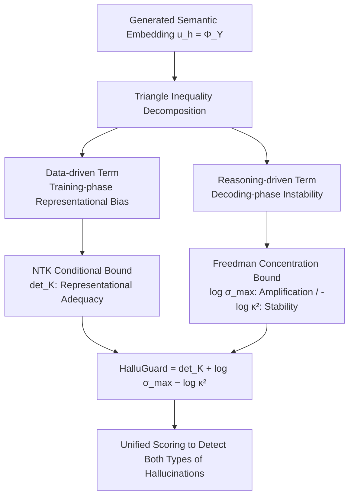

# HalluGuard: Demystifying Data-Driven and Reasoning-Driven Hallucinations in LLMs

**Conference**: ICLR 2026  
**OpenReview**: [https://openreview.net/forum?id=ZURs3YZclt](https://openreview.net/forum?id=ZURs3YZclt)  
**Code**: Open-sourced (HalluGuard, link provided in the paper)  
**Area**: LLM Hallucination Detection / Trustworthy LLM  
**Keywords**: Hallucination Detection, Neural Tangent Kernel, Hallucination Risk Bound, Data-Driven Hallucination, Reasoning-Driven Hallucination  

## TL;DR
This paper proposes a unified theoretical framework called the "Hallucination Risk Bound," which decomposes the hallucination risk of LLMs into a **data-driven term** (representational bias during training) and a **reasoning-driven term** (instability during decoding) using the triangle inequality. Based on this, the authors design HalluGuard, an NTK-based spectral proxy score that requires no external references or hallucination annotations, achieving consistent SOTA performance across 10 benchmarks, 11 baselines, and 9 backbones.

## Background & Motivation
**Background**: The deployment of LLMs in high-risk scenarios such as healthcare, law, and scientific research is hindered by hallucination issues. The academic community generally categorizes hallucinations into two sources: **data-driven hallucinations** (errors, biases, or incomplete knowledge encoded during pre-training/fine-tuning) and **reasoning-driven hallucinations** (logical breaks or multi-step reasoning collapse during inference). Detection methods are also split along these lines: data-driven approaches rely on retrieving documents/references or consistency sampling like SelfCheckGPT; reasoning-driven approaches rely on perplexity, length-normalized entropy, semantic entropy, energy scores, or probing internal representations (covariance spectra in Inside, residual streams in ICR Probe, multi-step diagnosis in RACE).

**Limitations of Prior Work**: Most existing methods focus only on a **single** hallucination type and rely on task-specific heuristics (external retrieval, specific thresholds), resulting in poor generalization. More critically, they fail to characterize the **evolution** of hallucinations—in real-world generation, an initial factual misjudgment can be amplified into a completely distorted conclusion through multi-step reasoning (e.g., the disease diagnosis example in the paper: initial misclassification → distorted diagnosis → delayed treatment).

**Key Challenge**: In practice, hallucinations are **almost never purely of a single type**. The authors' statistics show that for Natural (instruction following), 88.9% of errors are logical missteps (reasoning-driven) and only 11.1% are factual errors; conversely, on MATH-500, 98.1% are reasoning errors and only 1.9% are factual flaws. A detector facing such varied mixture ratios will inevitably fail if it relies on a single signal.

**Goal**: To answer two questions: (1) How to characterize how hallucinations emerge and evolve using a unified theory? (2) How to detect them efficiently without relying on external references or task heuristics?

**Core Idea (Unified Decomposition + NTK Spectral Proxy)**: First, use a triangle inequality to **strictly decompose** the total risk into a data-driven term and a reasoning-driven term. The former is characterized by NTK geometry (condition number of the feature map) for training-phase approximation gaps, while the latter is characterized by concentration inequalities of Martingale processes for exponential amplification during decoding along the sequence length. This theoretical bound is then **translated into a real-time computable** NTK spectral proxy score, where three spectral quantities correspond to representational adequacy, rollout amplification, and spectral instability.

## Method

### Overall Architecture
The method consists of two layers: the **theoretical layer** decomposes the hallucination risk $\|u^* - u_h\|$ (the difference between the ground-truth semantic embedding and the generated semantic embedding) into a data-driven term $\|u^*-\mathbb{E}[u_h]\|$ and a reasoning-driven term $\|u_h-\mathbb{E}[u_h]\|$ using the triangle inequality. It then provides NTK conditional bounds and Freedman concentration bounds for each, synthesizing the "Hallucination Risk Bound" theorem. The **implementation layer** replaces each term in the theorem with computable, stable, and faithful NTK spectral proxies, as the step-by-step Jacobian of billion-parameter LLMs is not directly computable. These are summed to form the final HalluGuard score.

### Key Designs
**1. Hallucination Risk Decomposition: Setting the boundary for two sources with one triangle inequality.** This is the theoretical anchor of the paper and its most simple yet effective step. The authors encode the sequence into a continuous semantic space $\mathcal{U}_h$, denoting the ground-truth representation as $u^*=\Phi(y^*)$ and the generated representation as $u_h=\Phi(Y)$. The total risk is decomposed via the triangle inequality: $\|u^*-u_h\| \le \underbrace{\|u^*-\mathbb{E}[u_h]\|}_{\text{Data-driven}} + \underbrace{\|u_h-\mathbb{E}[u_h]\|}_{\text{Reasoning-driven}}$. The first term measures how far the "average generation" deviates from the truth—representing systemic bias in the model's learned representation. The second measures how far a single random rollout deviates from its own expectation—representing instability introduced by decoding sampling. This inequality places previously disparate detection methods into the same coordinate system and provides a formal framework for the narrative of "data bias amplified by reasoning."

**2. Data-driven term characterized by NTK geometry.** Using Céa’s Lemma (with curvature penalty), the authors bound the data-driven term as $\|u^*-\mathbb{E}[u_h]\| \le \frac{\Lambda}{\gamma}\inf_{u\in U_h}\|u^*-u\|$, where $\gamma=\lambda_{\min}(K_\Phi)$ is the minimum eigenvalue of the NTK Gram matrix on perturbed embeddings, and $\Lambda$ is the norm bound of the operator mapping. The ratio $\Lambda/\gamma$ is precisely the **condition number** of the feature map: the better-conditioned the NTK spectrum, the tighter the approximation to truth generation. This ratio is further controlled by pre-training/fine-tuning mismatch: $\frac{\Lambda}{\gamma} \le 1 + k_{pt}\frac{\log\mathcal{O}(P,L)+k\cdot\epsilon_{\text{mismatch}}}{\text{Signal}_k}$, where $\epsilon_{\text{mismatch}}$ is the Wasserstein distance between prompt and query distributions, and $\text{Signal}_k$ is the task alignment energy in the top-k feature subspace. Intuitive conclusion: the greater the mismatch or the weaker the task signal, the more severe the data-driven hallucination.

**3. Reasoning-driven term characterized by Martingale concentration for exponential amplification along the sequence.** The authors model autoregressive generation as a Martingale process and use Freedman's inequality to bound the deviation from expectation: $\|u_h-\mathbb{E}[u_h]\| \le K\cdot\exp(-\tfrac{K\epsilon^2}{C})\cdot\alpha(e^{\beta T}-1)$, where $K$ is the average number of rollouts, $\beta$ summarizes the growth rate of the step-wise local Jacobian, and $T$ is the sequence length. The key insight is the $e^{\beta T}$ term—**reasoning-driven hallucinations grow exponentially with sequence length**, which explains why long-chain reasoning is particularly prone to collapse. Combining this with the data-driven bound yields the "Hallucination Risk Bound" theorem (Theorem 3.2), providing a unified upper bound for total risk under the assumption $\|\prod_{t=1}^T J_t\|_2 \le e^{\beta T}$.

**4. HalluGuard Spectral Proxy: Compressing the incomputable theorem into a real-time sum of three terms.** Since step-wise Jacobians are infeasible for billion-scale models, the authors seek faithful proxies. For the data-driven term, NTK approximation theory suggests $\inf_{u\in U_h}\|u^*-u\| \le C_d\det(K)^{-c_d}\|u^*\|$, so $\det(K)$ captures representational adequacy. For rollout amplification, from $\|\prod_t J_t\|_2 \le \sigma_{\max}^T$ (where $\sigma_{\max}=\sup_t\|J_t\|_2$), $\log\sigma_{\max}$ serves as a stable proxy for step-wise amplification. For spectral instability, perturbation analysis gives $\mathrm{Var}[u_h]\le c_v\,\kappa(K)^2\|\delta\|^2$, thus $-\log\kappa^2$ penalizes ill-conditioned spectra. The sum is $\text{HalluGuard}(u_h) = \det(K) + \log\sigma_{\max} - \log\kappa^2$. A set of lightweight projection layers serves as a self-supervised spectral calibration module trained offline with AdamW to align the NTK spectra of heterogeneous backbones into a comparable geometric space—**requiring no hallucination labels, no task supervision, with the backbone frozen throughout, and zero additional inference overhead**. Correlation validation in Table 1 supports this division: $\det(K)$ has a correlation coefficient of 0.84 on the data-heavy SQuAD, while $\log\sigma_{\max}-\log\kappa^2$ has a correlation of 0.88 on the reasoning-heavy MATH-500.

## Key Experimental Results
Setup: 10 benchmarks (Data-centric QA: RAGTruth/NQ-Open/HotpotQA/SQuAD; Reasoning-centric: GSM8K/MATH-500/BBH; Instruction-centric: TruthfulQA/HaluEval/Natural), 11 baselines, 9 backbones (Llama2/3 series, OPT-6.7B, Mistral-7B, QwQ-32B, GPT-2). Metrics are AUROC / AUPRC, evaluated against ROUGE references and LLM-as-judge.

### Main Results (Representative Benchmarks, QwQ-32B, AUROC_r / AUPRC_r)

| Method | RAGTruth | Math-500 | TruthfulQA |
|---|---|---|---|
| **HalluGuard** | **84.59 / 81.15** | **81.76 / 79.76** | **74.26 / 72.76** |
| Inside | 77.72 / 73.47 | 80.80 / 71.49 | 70.89 / 64.44 |
| Perplexity | 73.91 / 72.92 | 60.28 / 57.75 | 55.29 / 52.46 |
| SelfCheckGPT | 65.79 / 62.45 | 64.56 / 62.49 | 55.86 / 54.95 |
| RACE | 71.13 / 69.96 | 59.50 / 55.83 | 55.75 / 52.62 |

On Math-500, the improvement over the second-best is up to 8.3%; on RAGTruth, up to 7.7%; and on TruthfulQA, up to 6.2%. The gains on reasoning-centric benchmarks are particularly significant.

### Ablation Study (Across Backbone Scales, AUROC_r, SQuAD)

| Backbone | HalluGuard | Second Best |
|---|---|---|
| Llama2-7B (Small) | **81.05** | 73.63 (Inside) |
| Llama3-8B | **79.56** | 76.13 (Inside) |
| Llama2-13B (Mid) | **81.45** | 74.68 (Inside) |
| Llama2-70B (Large) | **83.80** | 81.24 (Inside) |

Ablation of individual spectral quantities against corresponding task families (Fig 2): The data-driven term closely follows the AUROC decline curve of the ground-truth on SQuAD, while the reasoning-driven term mirrors the monotonic decline as reasoning drift increases on MATH-500, proving the theoretical decomposition aligns with the empirical roles.

### Key Findings
- **Small backbones benefit most**: On Llama2-7B HaluEval, AUPRC_r reached 72.89%, over 10% higher than the runner-up; small models are more prone to hallucinations, and HalluGuard provides the most significant and scale-stable gains.
- **Guidance for test-time inference**: Integrating the detector into beam search allows Qwen2.5-Math-7B to reach 81.00% accuracy on MATH-500 (~10% higher than IO Prompt) and Llama3.1-8B to reach 70.96% on Natural (15.72% higher)—the detector serves not just as a post-hoc judge but as an online guide toward reliable solutions.
- **Capturing fine-grained hallucinations**: In PAWS case studies (high surface overlap but opposite semantics), HalluGuard consistently outperformed baselines across scales, showing effectiveness against subtle hallucinations that "look similar but are semantically wrong."

## Highlights & Insights
- **One-to-one mapping between theory and proxy**: From triangle inequality decomposition → NTK conditional bound + Freedman concentration bound → three computable spectral quantities. Every step has a formal correspondence, avoiding the common "trick-first, story-later" approach.
- **Unification of fractured schools**: For the first time, data-driven and reasoning-driven detection are placed within a single risk bound, explaining how both evolve and amplify each other during multi-step generation.
- **Zero annotation and zero runtime overhead**: Spectral calibration is performed offline, backbones are frozen, and only spectral quantities are computed during inference; this is engineering-friendly and a substantial advantage for high-risk closed-domain scenarios without external retrieval.
- **Insight of $e^{\beta T}$**: Quantifying "why long chains fail" as reasoning-driven terms growing exponentially with sequence length provides a clear starting point for research on chain-of-thought reliability.

## Limitations & Future Work
- **Gap with NTK assumptions**: The theory is built on the infinite-width limit and constant NTK assumptions. In real-world finite-width LLM training, the NTK shifts, and the approximation tightness between spectral proxies and true risk bounds lacks quantitative guarantees.
- **Spectral computation cost**: Although claimed as zero inference overhead, $\det(K)$ and $\kappa(K)$ require constructing the NTK Gram matrix and performs eigen-decomposition. Scalability to ultra-long contexts or massive batches is not fully discussed.
- **Dependence on semantic encoder $\Phi$**: The entire framework relies on an encoder to map sequences to semantic space; its quality and bias directly affect the reliability of $u^*$ and $u_h$. The paper does not deeply analyze sensitivity to encoder choice.
- **Theoretical characterization of evolution**: The "emergence and evolution" narrative is primarily supported by qualitative theoretical descriptions and cases, lacking fine-grained empirical evidence tracking the ebb and flow of the two hallucination types across real multi-step trajectories.

## Related Work & Insights
This work lies at the intersection of three lines: (1) Uncertainty-based detection (Perplexity, LN-Entropy, Semantic Entropy, Energy, P(true))—HalluGuard explains these as special cases touching only the data-driven term; (2) Consistency-based detection (SelfCheckGPT, Lexical Similarity, FActScore, RACE)—corresponding to the cross-sample consistency perspective of the reasoning-driven term; (3) Internal state probing (Inside's covariance spectrum, MIND)—sharing the representational geometry route, but HalluGuard provides theoretical bounds via NTK spectra rather than purely empirical signals. The insight: **Instead of building a detector for every type of hallucination, find risk quantities that unify and decompose them, then identify computable proxies for each component.** This "decomposition-then-proxy" paradigm is valuable for other trustworthiness issues (calibration, OOD detection).

## Rating
- **Novelty**: ⭐⭐⭐⭐⭐ Strictly decomposing hallucination risk into data/reasoning terms via triangle inequality, pairing them with NTK/Freedman bounds, and distilling them into real-time spectral proxies is a complete and original theoretical-to-empirical chain.
- **Experimental Thoroughness**: ⭐⭐⭐⭐ 10 Benchmarks × 11 Baselines × 9 Backbones provide comprehensive coverage, including cross-scale, ablation, test-time guidance, and fine-grained cases; lacks some empirical data on NTK computation overhead and encoder sensitivity.
- **Writing Quality**: ⭐⭐⭐⭐ The theoretical narrative is clear, and motivation statistics are persuasive; however, the density of theorems and assumptions creates a high bar for non-theoretical readers.
- **Value**: ⭐⭐⭐⭐⭐ Reference-free, annotation-free, zero runtime overhead, and capable of guiding online inference—this has direct practical value for deploying trustworthy LLMs in high-risk closed-domain scenarios.

<!-- RELATED:START -->

## Related Papers

- [\[ACL 2026\] Why LLMs Hallucinate on Structured Knowledge: A Mechanistic Analysis of the Reasoning Process](../../ACL2026/hallucination/why_llms_hallucinate_on_structured_knowledge_a_mechanistic_analysis_of_reasoning.md)
- [\[ICLR 2026\] Semantic Uncertainty Quantification of Hallucinations in LLMs: A Quantum Tensor Network Based Method](semantic_uncertainty_quantification_of_hallucinations_in_llms_a_quantum_tensor_n.md)
- [\[ICLR 2026\] HARP: Hallucination Detection via Reasoning Subspace Projection](harp_hallucination_detection_via_reasoning_subspace_projection.md)
- [\[ICLR 2026\] ChainMPQ: Interleaved Text-Image Reasoning Chains for Mitigating Relation Hallucinations](chainmpq_interleaved_text-image_reasoning_chains_for_mitigating_relation_halluci.md)
- [\[ICLR 2026\] BARREL: Boundary-Aware Reasoning for Factual and Reliable LRMs](barrel_boundary-aware_reasoning_for_factual_and_reliable_lrms.md)

<!-- RELATED:END -->
