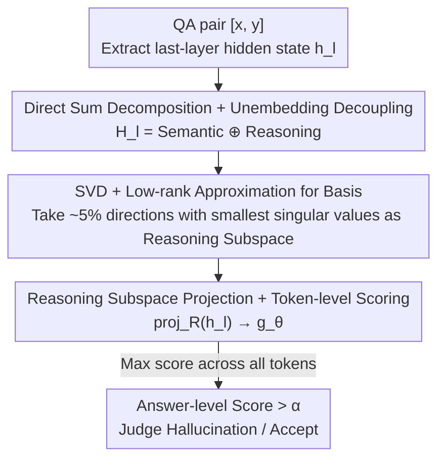

# HARP: Hallucination Detection via Reasoning Subspace Projection

**Conference**: ICLR 2026  
**OpenReview**: [https://openreview.net/forum?id=ShEDWasmDG](https://openreview.net/forum?id=ShEDWasmDG)  
**Area**: LLM Hallucination Detection / Mechanistic Interpretability  
**Keywords**: Hallucination detection, Reasoning subspace, SVD, Hidden state decomposition, Unembedding layer  

## TL;DR
HARP decomposes the LLM hidden state space into "Semantic Subspace ⊕ Reasoning Subspace." By performing SVD on the Unembedding layer to identify basis vectors for the reasoning subspace and projecting hidden states onto this subspace (occupying only ~5% of dimensions) as a hallucination detection feature, it pushes AUROC to 92.8% on TriviaQA (7.5 percentage points higher than the previous best).

## Background & Motivation

**Background**: Mainstream routes for LLM hallucination detection fall into two categories. One is probing, which trains classifiers directly on hidden states to judge truthfulness; for instance, HaloScope uses SVD on unlabeled embeddings to find key directions. The other is based on output consistency, such as EigenScore using covariance eigenvalues to measure semantic consistency across multiple samples, or Semantic Entropy using clustering and semantic entropy.

**Limitations of Prior Work**: Probing-based methods rely on pre-defined supervised labels and exhibit poor generalization when feature dimensionality is high or class priors are incomplete; furthermore, high-dimensional hidden states are saturated with noise unrelated to hallucinations. Consistency-based methods require multiple samplings, incurring high overhead, and only observe surface-level language, failing to utilize internal model reasoning. These methods suffer significant performance drops in reasoning-intensive tasks like long-context reading comprehension (e.g., various baselines drop to 30%~50% AUROC on TyDiQA).

**Key Challenge**: Judging whether an answer is a hallucination essentially depends on whether the model "thinks correctly," not just whether it "speaks fluently." However, hidden states mix semantic representation info with internal reasoning info. Existing methods fail to decouple the two, resulting in detection features that are both high-dimensional and dominated by semantic noise, failing to capture the reasoning signals that truly determine truthfulness.

**Goal**: Extract the "internal reasoning" component from hidden states to construct a low-dimensional, clean, and interpretable feature specifically for hallucination detection.

**Key Insight**: The authors start from a cognitive analogy—humans follow a "reasoning → expression" process when answering complex questions, reasoning internally before articulating part of the result into language. Analogously in LLMs, last-layer hidden states concurrently encode "semantic prediction info" (determining the next token) and "reasoning trajectory info" (supporting multi-step reasoning without directly affecting output). A key observation is that the Unembedding layer only projects semantic components into the generated tokens, filtering out reasoning components—suggesting the Unembedding layer naturally distinguishes between these two types of information.

**Core Idea**: Use the Unembedding layer as a "decoupler" by performing SVD on its weight matrix to decompose the hidden state space into a semantic subspace and an orthogonal reasoning subspace, then project hidden states onto the reasoning subspace for hallucination detection.

## Method

### Overall Architecture
HARP addresses the problem of "how to extract pure reasoning signals from mixed hidden states for hallucination detection." The overall process is: given a QA pair, extract the LLM's last-layer hidden state $h_l$, and first perform SVD on the Unembedding layer parameters $W_{unemb}$ to obtain a set of orthogonal bases. Based on the magnitude of singular values, the basis vectors are divided into the "semantic subspace" (corresponding to large singular values, dominating token prediction) and the "reasoning subspace" (corresponding to near-zero singular values, directions filtered out by $W_{unemb}$). The hidden state of each token is projected onto the reasoning subspace basis vectors, resulting in a compact feature of only ~5% of the original dimension. A lightweight detector $g_\theta$ is trained on this feature to assign hallucination scores to each token. The maximum token-level score is taken as the sentence-level hallucination score; an answer is judged as a hallucination if it exceeds a threshold.

The theoretical pivot lies in the direct sum decomposition of the hidden state space:

$$\mathcal{H}_l = \mathcal{S}_{Semantic} \oplus \mathcal{S}_{Reasoning}$$

Where $h_{l,Semantic}$ dominates logit prediction, and $h_{l,Reasoning}$ encodes the model's reasoning process with negligible impact on output.

### Key Designs

**1. Hidden State Direct Sum Decomposition with Unembedding as Decoupler**

This step targets the pain point where hidden states mix semantic and reasoning info. The authors' insight is that the last-layer hidden state $h_l$ carries both types of information: to accurately predict the next token, $h_l$ must retain sufficient semantic features, which are primarily captured by $W_{unemb}$ and dominate token prediction; meanwhile, to support multi-step reasoning, $h_l$ also encodes intermediate reasoning info that does not directly affect output, which is largely ignored by $W_{unemb}$. Thus, the hidden state space is decomposed into the direct sum of two orthogonal subspaces $\mathcal{H}_l = \mathcal{S}_{Semantic} \oplus \mathcal{S}_{Reasoning}$.

The Unembedding layer serves as a decoupler because it only projects semantic components into the output while filtering out reasoning components during token generation. Therefore, the interactions of the two subspaces with $W_{unemb}$ can be characterized as $W_{unemb} \cdot \mathcal{S}_{Semantic} \approx W_{unemb} \cdot \mathcal{H}_l$ and $W_{unemb} \cdot \mathcal{S}_{Reasoning} \approx 0$—meaning the semantic subspace aligns with the primary action directions of $W_{unemb}$, while the orthogonal reasoning subspace contributes negligibly to prediction scores. This definition transforms the vague intuition of "which part is reasoning info" into a calculable algebraic condition.

**2. SVD for Basis Vectors and Subspace Definition via Low-rank Approximation**

How to actually find this set of basis vectors given the algebraic definition? The authors perform SVD on $W_{unemb}$: $W_{unemb} = U\Sigma V^\top = \sum_{i=1}^d u_i\sigma_i v_i^\top$. For any hidden state $h = \sum_i a_i v_i$, its interaction with $W_{unemb}$ is $W_{unemb}\cdot h = \sum_i (\sigma_i a_i)u_i$. Since $u_i$ are mutually orthogonal, $W_{unemb}\cdot h = 0$ if and only if all $a_i$ corresponding to non-zero singular values are zero, meaning $h$ is filtered by the Unembedding layer and falls into the reasoning subspace. Accordingly, directions with zero singular values $V_R = \{v_i \mid \sigma_i = 0\}$ are defined as reasoning subspace bases, and the rest $V_S = \{v_i \mid \sigma_i > 0\}$ as semantic subspace bases.

However, the ideal $\sigma = 0$ rarely holds in real models, so a rank-$k$ approximation is used instead. By the Eckart–Young–Mirsky theorem, $W_k = \sum_{i=1}^k u_i\sigma_i v_i^\top$ is the optimal $k$-rank approximation of $W_{unemb}$ under the Frobenius norm. As long as the info retention condition $\|W_{unemb} - W_k\|_F = \sqrt{\sum_{i=k+1}^d \sigma_i^2} \ll \sqrt{\sum_{i=1}^k \sigma_i^2}$ is met, truncating small singular values barely loses predictive capability. The authors observe that the last ~5% of singular values in $W_{unemb}$ are significantly smaller than the others (Qwen-2.5-7B has a hidden dim of 3584, LLaMA-3.1-8B is 4096). Thus, $k = d \times 95\%$ is chosen, and directions $V_R = [v_{k+1},\dots,v_d]$ corresponding to the smallest 5% singular values are treated as reasoning subspace bases. The ingenuity of this step lies in realizing the "reasoning subspace" from a mathematical ideal into a concrete construction calculable on any off-the-shelf LLM without breaking the original model's predictions.

**3. Reasoning Subspace Projection and Token-level Hallucination Scoring**

Finally, the basis vectors are used to construct detection features. Hidden states are projected onto the reasoning subspace: $\text{proj}_R(h_l) = V_R^\top \cdot h_l$, resulting in a feature with only ~5% of the original dimensionality. This feature is highly focused on reasoning info, filtering out most semantic noise, which is the source of HARP's robustness and accuracy. The authors also found that shallow hidden states have stronger projections in the semantic subspace, while deeper states are stronger in the reasoning subspace, consistent with the subspace definitions; thus, using deep (last-layer) hidden states for detection is most appropriate.

For a QA pair $[x, y]$ containing $n$ tokens, the hidden states are projected token by token to calculate hallucination scores, taking the maximum as the sentence-level score:

$$g_\theta(y\mid x) = \max_{1\le i\le n} g_\theta\!\left(\text{proj}_R\!\left(h_l^{(i)}\right)\right)$$

The detector $g_\theta$ is trained using binary cross-entropy $L = -flag\cdot\log(g_\theta) - (1-flag)\cdot\log(1-g_\theta)$, with a threshold $\alpha$ providing binary judgment $\hat{G}(y\mid x) = \mathbb{I}[g_\theta(y\mid x) > \alpha]$. During training, beam search generates multiple candidate answers for each question to create diverse supervised samples; during testing, only a single pass of projection is needed for the sampled answer, making it a single-pass method that is much more efficient than consistency-based multi-sampling. The example in the paper is intuitive: for the question "Where is the capital of the US?", the token "Shanghai" in an incorrect answer receives a hallucination score of 0.73, while all tokens in the correct answer "Washington" are below 0.01.

### Loss & Training
The detector $g_\theta$ is optimized via binary cross-entropy (Eq. 17), where $flag\in\{0,1\}$ labels whether a QA pair is a hallucination. Supervised samples are constructed using beam search to generate multiple candidates. The threshold is set at $\alpha = 0.5$, as experiments show accuracy and F1 remain high for $\alpha\in[0.2,0.8]$, indicating a clear separation between scores of normal and hallucinated answers.

## Key Experimental Results

### Main Results
Evaluation was conducted on 4 generative QA tasks (NQ Open, TruthfulQA, TriviaQA, TyDiQA-GP English) using Qwen-2.5-7B-Instruct and LLaMA-3.1-8B backbones, measured by AUROC (%).

| Model | Dataset | HARP | Prev. SOTA | Gain |
|------|--------|------|------|------|
| Qwen-2.5-7B | TriviaQA | 92.8 | 85.3 (HaloScope) | +7.5 |
| Qwen-2.5-7B | TruthfulQA | 88.1 | 64.4 (Perplexity) | +23.7 |
| Qwen-2.5-7B | TyDiQA | 88.4 | 74.8 (EigenScore) | +13.6 |
| Qwen-2.5-7B | NQ Open | 84.0 | 78.9 (EigenScore) | +5.1 |
| LLaMA-3.1-8B | TriviaQA | 92.9 | 76.3 (Perplexity) | +16.6 |
| LLaMA-3.1-8B | NQ Open | 89.4 | 62.7 (HaloScope) | +26.7 |

HARP consistently outperforms all baselines across all datasets and models while remaining a single-pass detection method. Perplexity and HaloScope are competitive on simple data like TriviaQA (where answers are 1-2 tokens), but crash on long-context TyDiQA (Perplexity drops to 30.5 on Qwen), whereas HARP maintains 88.4 / 86.6, proving its ability to handle reasoning-intensive and context-rich inputs.

### Ablation Study
| Configuration | NQ Open (Qwen) | TruthfulQA (Qwen) | Description |
|------|------|------|------|
| HARP | 84.0 | 88.1 | Full model |
| HARP (w/o) | 62.9 | 70.7 | Without projection; keeping original high-dim features |
| HARP (random) | 67.6 | 68.6 | Randomly selected basis vectors for projection |

Removing the projection or using random projections lead to significant performance drops, proving that "projecting onto the reasoning subspace" is essential—it's not just about dimensionality reduction, but reducing to the *correct* subspace.

### Key Findings
- **Reasoning subspace projection is core to performance**: Under same dimensions, random basis selection (67.6) and no projection (62.9) are far inferior to reasoning subspace projection (84.0), showing quality comes from selecting the right directions.
- **256-dimensional reasoning subspace is optimal**: Scanning 32~1024, 256 dimensions (~5% of hidden dim) works best; larger dimensions gradually invalidate info retention conditions, harming next-token prediction and increasing overfitting risk.
- **Validity of direct sum decomposition is verified**: Calculating logits using only semantic components ($W_k\cdot h_l$) retains the top rankings for greedy token generation, proving token prediction is primarily determined by the semantic subspace and reasoning components are indeed "silent."
- **Strong cross-distribution generalization**: HARP generalizes well when trained on source datasets and tested on target ones; training on TriviaQA to test on NQ Open yields accuracy nearly equal to training directly on NQ Open.

## Highlights & Insights
- **Cognitive analogy translated to algebraic construction**: The intuition of "human reasoning before expression" is translated into the calculable condition of "Unembedding layer filtering reasoning components," then explicitly finding the reasoning subspace via SVD—the motivation and methodology align perfectly without post-hoc labeling.
- **Unsupervised subspace partitioning via existing parameters**: The reasoning subspace is determined entirely by SVD on $W_{unemb}$, requiring no additional training or labels to define. Eckart–Young ensures truncation barely loses predictive power. This "leveraging built-in matrices" approach can transfer to other representation decoupling tasks.
- **Dimension reduction is not the goal, selecting the right subspace is**: The random projection ablation showed that reducing to 5% dimension is nearly useless if the directions are wrong, providing a valuable lesson: feature quality stems from the reasoning direction rather than dimensionality.

## Limitations & Future Work
- **Reliance on "Semantic/Reasoning orthogonal direct sum" hypothesis**: Strictly splitting hidden states into two orthogonal subspaces is a strong assumption; in real models, they might be entangled, and the 5% truncation ratio is an empirical observation (based on singular value distribution elbows), which might be unstable across models or layers.
- **Reasoning subspace definition tied to Unembedding layer**: The method essentially assumes "filtered by Unembedding = reasoning info," but filtered directions might include redundancy or noise rather than pure reasoning. Authors use Reasoning Patch experiments (Appendix E) to support this, but it isn't fully detailed in the main text.
- **Supervised detector still required**: While subspace partitioning is unsupervised, $g_\theta$ still needs labeled hallucination/non-hallucination samples for training, and beam search for sample construction adds overhead; evaluations only cover 7B/8B models and QA tasks, with performance on larger models or open-ended generation remaining to be verified.

## Related Work & Insights
- **vs HaloScope**: Both use SVD for subspace directions. HaloScope uses unlabeled embeddings for data-driven directions then associates them with hallucinations; HARP uses SVD on the Unembedding matrix to define the reasoning subspace via algebraic properties. HARP directions have clear "filtered by model" semantics, offering better interpretability and a significant lead in long-context tasks (HARP 88.4 vs HaloScope 69.0).
- **vs EigenScore / Semantic Entropy**: These consistency methods measure semantic consistency at the output level via multiple samplings, which is costly and ignores internal reasoning info; HARP is a single-pass method taking signals directly from the reasoning subspace of hidden states, offering higher efficiency and accuracy.
- **vs General Probing**: Traditional probing trains classifiers on high-dim hidden states, suffering from the curse of dimensionality and incomplete label priors; HARP first compresses features to the 5% reasoning subspace before probing, decoupling "denoising" from "classification" for more stable generalization.

## Rating
- Novelty: ⭐⭐⭐⭐⭐ Explicit construction of a reasoning subspace via Unembedding SVD for hallucination detection is very novel.
- Experimental Thoroughness: ⭐⭐⭐⭐ 4 datasets and 2 models + projection ablations + dimension/threshold/cross-distribution analysis, though model scales and task types are somewhat limited.
- Writing Quality: ⭐⭐⭐⭐ Clear theoretical derivation, cognitive analogy throughout, and easy-to-read formulas/diagrams.
- Value: ⭐⭐⭐⭐⭐ Single-pass, low-dimensional, interpretable, and significantly outperforming baselines—highly attractive for practical deployment.

<!-- RELATED:START -->

## Related Papers

- [\[ICLR 2026\] Mechanistic Detection and Mitigation of Hallucination in Large Reasoning Models](mechanistic_detection_and_mitigation_of_hallucination_in_large_reasoning_models.md)
- [\[ICML 2026\] Harnessing Reasoning Trajectories for Hallucination Detection via Answer-agreement Representation Shaping](../../ICML2026/hallucination/harnessing_reasoning_trajectories_for_hallucination_detection_via_answer-agreeme.md)
- [\[ICLR 2026\] HalluGuard: Demystifying Data-Driven and Reasoning-Driven Hallucinations in LLMs](halluguard_demystifying_data-driven_and_reasoning-driven_hallucinations_in_llms.md)
- [\[ICLR 2026\] BARREL: Boundary-Aware Reasoning for Factual and Reliable LRMs](barrel_boundary-aware_reasoning_for_factual_and_reliable_lrms.md)
- [\[ICLR 2026\] Enhancing Hallucination Detection through Noise Injection](enhancing_hallucination_detection_through_noise_injection.md)

<!-- RELATED:END -->
