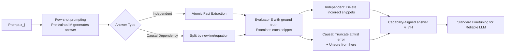

# High Accuracy, Less Talk (HALT): Reliable LLMs through Capability-Aligned Finetuning

**Conference**: ICLR 2026  
**OpenReview**: [https://openreview.net/forum?id=LYqBnNVaXD](https://openreview.net/forum?id=LYqBnNVaXD)  
**Code**: TBD  
**Area**: LLM Reliability / Hallucination Suppression  
**Keywords**: Hallucination, Selective Answering, Capability Alignment, Post-training, Calibration, Partial Abstention

## TL;DR
HALT decomposes answers generated by the pre-trained model into "fact snippets" during the finetuning stage and uses a ground-truth-based evaluator to verify each snippet. It retains only the parts the model can correctly generate, replacing the rest with "Unsure from here," thereby training a reliable LLM that "only says what it knows." With an adjustable threshold to balance completeness and accuracy, a single Llama3-70B improved its average accuracy across four domains from 51% to 87%.

## Background & Motivation
**Background**: Current LLMs tend to "answer every question" regardless of the prompt's difficulty or the required domain knowledge. While acceptable for creative tasks like poetry, this behavior poses risks in fields with high factual accuracy requirements, such as medicine or law, where models may fabricate answers (hallucinate) when their knowledge or capability is insufficient.

**Limitations of Prior Work**: Most existing work on hallucination mitigation falls into two suboptimal extremes. One category includes test-time methods (semantic entropy detection, sampling post-processing, decoding modification), which require extra inference overhead and usually only cover knowledge retrieval rather than complex reasoning. The other is "all-or-nothing" abstention training (e.g., IDK), which is too coarse-grained and cannot express "I know the first few steps but am unsure about the rest." Furthermore, a neglected fact is that **standard finetuning on samples the model does not know actually exacerbates hallucinations** (as observed by Gekhman, Kang, et al.), because using ground-truth answers that exceed the pre-trained model's true capability boundary essentially teaches the model to "pretend to know."

**Key Challenge**: Restricting a model to output only high-confidence content inevitably reduces the total number of correct statements (withholding information that might be correct), creating a natural conflict between **Completeness (Recall) and Accuracy (Precision)**. Different deployment scenarios require different tradeoff points, but existing methods fail to provide an adjustable "knob" for this.

**Goal**: Post-train a model whose output is aligned with its own uncertainty—answering when confident and (partially) abstaining when not—while allowing practitioners to adjust the completeness/accuracy tradeoff for specific scenarios with zero test-time overhead.

**Key Insight**: **Capability-aligned finetuning**—instead of finetuning with ground-truth answers, the model is finetuned using answers that it generated itself after removing incorrect snippets. The theoretical basis is from recent work suggesting that LLM finetuning does not acquire new capabilities but only learns to invoke existing knowledge and reasoning from pre-training (Lin, Zhou, et al.). Restricting the training target within the model's capability boundary avoids teaching it to pretend while preserving what it truly knows. HALT does not distill from a stronger model but matches the model's output to its own capability.

## Method

### Overall Architecture
Given a pre-trained model $M$ and a finetuning dataset $D=\{(x_j, y_j)\}$, HALT constructs a "capability-aligned" target answer $y_j^H$ for each prompt to form a new dataset $D_H$ for standard finetuning. The pipeline consists of four steps: ① Use few-shot prompting to let $M$ generate a preliminary answer; ② Decompose the answer into independently verifiable fact snippets; ③ Use a ground-truth-based evaluator $E$ to judge each snippet; ④ Post-processing—delete incorrect snippets or truncate with "Unsure from here" to obtain $y_j^H$. A key distinction is the **dependency structure** of the answer: independent snippets (e.g., biographical facts) are judged and deleted individually; causal dependency snippets (e.g., math reasoning, code) are truncated from the first error with "Unsure from here," as subsequent steps are likely invalid.

### Key Designs

**1. Replacing ground-truth with the model's own few-shot answers as training targets to bake capability boundaries into data**: HALT does not finetune directly on $y_j$. Instead, it randomly samples 4 prompt-response pairs from $D\setminus\{(x_j,y_j)\}$ as in-context examples to let $M$ generate a preliminary answer $y_j^{pt}=M(\text{concat}(C_j, x_j))$. The nuance here is that by using the model's own generation rather than an external gold standard, the answer naturally falls within its capability. Removing errors then yields a subset of what the model "truly knows and gets right." Table 2 validates that the cost of this replacement is low—finetuning on few-shot best-of-5 answers results in accuracy only 1.7%–3.7% lower than finetuning on ground-truth (except for Mistral-7B due to weaker ICL), confirming the "finetuning invokes capabilities" hypothesis.

**2. Divide-and-conquer snippet splitting and correctness judgment via dependency structure**: HALT assumes answers consist of either independent or causally dependent snippets, determined by the domain (Math/Code = Dependent, Wiki = Independent). For **independent snippets**, an extraction LLM (Song et al.) splits them into atomic statements; the evaluator $E$ checks each statement against a condition $J$ (e.g., Wikipedia) as $E:(f, J)\to\{0,1\}$. All correct snippets are retained. For **causally dependent snippets**, split by natural boundaries like "=" or newlines, the evaluator **locates only the first error** based on a ground-truth step-by-step solution; all subsequent snippets are replaced by "Unsure from here." Using Llama3-405B as an evaluator, Table 1 shows average misjudgments are as low as 0.27 (Wiki) to 1.14 (Code) per answer.

**3. Parameterizing "Capability Estimation" via percentile sampling for the Recall/Precision knob**: Instead of a single greedy path, HALT samples $N$ preliminary answers $\{y_j^{pt,n}\}$ and sorts them by average snippet accuracy. The $n^*=\lceil\alpha N\rceil$ percentile is selected for processing. A smaller $\alpha$ is more conservative—choosing the "worst" answer means only content that is correct even in poor samples is considered a capability, leading to higher precision but lower recall. Training sets with $\alpha\in\{40\%,60\%,80\%\}$ allow a single pipeline to produce a spectrum of models from "reserved" to "talkative."

**4. F1 as a unified measure and the Add-On soft-label variant**: Borrowing from binary classification, HALT defines $\text{Recall}=\frac{n_{correct}}{n_{desired}}$ and $\text{Precision}=\frac{n_{correct}}{n_{given}}$, using F1 as the overall quality metric. $n_{desired}$ is measured via two perspectives: $n_{all}$ (all facts required) and $n_{capable}$ (facts within model capability). Additionally, an **Add-On HALT** variant is proposed: instead of deleting errors, it marks the first error and subsequent parts as "Uncertain," allowing users to see the full answer while being warned about potential inaccuracies.

## Key Experimental Results

### Main Results
Performance across four models (Llama3-8B/70B, Gemma2-9B, Mistral-7B) and four domains (Wikibios, MATH, MedExQA, APPS) compared to standard finetuning (Unchanged), FactTune, IDK, and RandomTrim.

| Configuration | Standard Acc. | HALT (High Accuracy Mode) | Recall Retained |
|------|--------------|-----------------|-----------|
| Reliable Llama3-70B (Mixed, α=40%) | 51% | **87%** (+36%) | 25% |
| Llama3-70B Avg. across domains | — | +17% (Adjustable ±17%) | Adjustable |
| F1 Score (relative to baselines) | baseline | **Avg. +4%** | — |

- Adjusting $\alpha$ allows Llama3-70B accuracy to swing by ±17%, proving the effectiveness of the tradeoff knob.
- HALT achieves the highest F1 scores (harmonic mean of recall and precision) across most settings.

### Key Component Validation

| Validation Item | Result |
|--------|------|
| Evaluator Misjudgments (snippets per answer) | Wiki 0.27 / MATH 0.63 / Med 0.41 / Code 1.14 |
| Few-Shot vs Ground-Truth accuracy gap | Only 1.7%–3.7% (Mistral outlier 5%–6%) |
| AlpacaEval Instructions (GPT-5 judge) | Overall 50.8% win rate; Wikibios 66.0% win rate |

### Key Findings
- **Selective abstention does not hurt general capability**: HALT (α=0.6) is nearly on par with the Llama3-70B base, and even leads with a 66% win rate on Wikibios where factual accuracy is paramount. Slight decreases (41.8%–45.4%) in Math/Code are due to judges penalizing abstention when prioritizing completeness.
- **Finetuning does not acquire new capabilities**: The small gap when substituting gold standards with few-shot answers empirically supports HALT's core assumption.
- **F1 Optimal form**: Analysis indicates the highest F1 comes from "abstaining promptly after correct snippets" rather than attempting to finish the answer.

## Highlights & Insights
- **Turning "capability boundary" from a hypothesis into an actionable target**—rather than using probes or test-time detection, HALT encodes the "known/unknown" boundary directly into the training data. This results in zero test-time overhead, distinguishing it from most hallucination mitigation works.
- **Fine-grained partial abstention** is closer to real-world reliability needs than "all-or-nothing" IDK: "The first three steps are correct, but the fourth is uncertain" is faithfully represented, naturally covering reasoning tasks.
- **The $\alpha$ knob** allows the same method to adapt to different deployment scenarios, from medical applications (requiring extreme precision) to general Q&A (prioritizing recall).
- Using the model's own few-shot answers avoids the trap where gold standards exceeding model capability actually increase hallucinations, backed by solid empirical evidence in Table 2.

## Limitations & Future Work
- **Oversimplified dependency structures**: The assumption of either "entirely independent" or "entirely causal" handles complex structures poorly. The paper leaves more complex dependency graphs for future work.
- **Reliance on ground truth for data construction**: The evaluator $E$ must be conditioned on ground truth (Wikipedia, gold solutions), making it difficult to apply to domains lacking gold standards.
- **Significant recall cost**: At the highest accuracy setting (87% accuracy), recall drops to 25%, meaning a large amount of potentially correct information is discarded.
- **Additional training overhead**: Each model requires regenerating and post-processing data (sampling N paths, snippet evaluation), which is a non-trivial one-time pipeline cost.
- **Impact of weak ICL**: In-context learning performance directly limits HALT's quality; Mistral-7B showed a larger gap when replacing gold standards with few-shot responses.

## Related Work & Insights
- **Hallucination Detection** (Probes - Su, Internal States - Chen, Semantic Entropy - Farquhar) and **Mitigation** (Weight Editing - Zhang, Decoding - DoLa, Preference Training - FactTune): HALT differs by solving at the training side with zero test-time cost and reasoning coverage.
- **Abstention Training** (IDK, Brahman): Mostly binary; HALT provides snippet-level partial abstention and tradeoff knobs.
- **"Finetuning does not teach new capabilities"** (Lin, Zhou) and **"Finetuning on unknown samples increases hallucinations"** (Kang, Tian): These are the two pillars of HALT's premise. Insight: Reliability might be better solved via data construction rather than decoding or post-processing.

## Rating
- **Novelty**: ⭐⭐⭐⭐ Encoding capability boundaries into finetuning data and combining snippet-level abstention with an adjustable knob is a clear and uncommon perspective.
- **Experimental Thoroughness**: ⭐⭐⭐⭐ Robust coverage with 4 models and 4 domains, 4 baselines, and validation of evaluator error and general capability.
- **Writing Quality**: ⭐⭐⭐⭐ Clear logical chain from motivation to method to tradeoffs. Intuitive visualizations (Figures 1, 2, 4) and formal notation.
- **Value**: ⭐⭐⭐⭐ Strong practical demand for "less talk, more accuracy" in high-stakes scenarios. Zero test-time overhead and engineering-friendly knobs make it highly applicable.

<!-- RELATED:START -->

## Related Papers

- [\[AAAI 2026\] Does Less Hallucination Mean Less Creativity? An Empirical Investigation in LLMs](../../AAAI2026/hallucination/does_less_hallucination_mean_less_creativity_an_empirical_investigation_in_llms.md)
- [\[ICLR 2026\] BARREL: Boundary-Aware Reasoning for Factual and Reliable LRMs](barrel_boundary-aware_reasoning_for_factual_and_reliable_lrms.md)
- [\[ICLR 2026\] Enhancing Hallucination Detection through Noise Injection](enhancing_hallucination_detection_through_noise_injection.md)
- [\[CVPR 2025\] 3D-GRAND: A Million-Scale Dataset for 3D-LLMs with Better Grounding and Less Hallucination](../../CVPR2025/hallucination/3d-grand_a_million-scale_dataset_for_3d-llms_with_better_grounding_and_less_hall.md)
- [\[ACL 2025\] ICR Probe: Tracking Hidden State Dynamics for Reliable Hallucination Detection in LLMs](../../ACL2025/hallucination/icr_probe_tracking_hidden_state_dynamics_for_reliable_hallucination_detection_in.md)

<!-- RELATED:END -->
