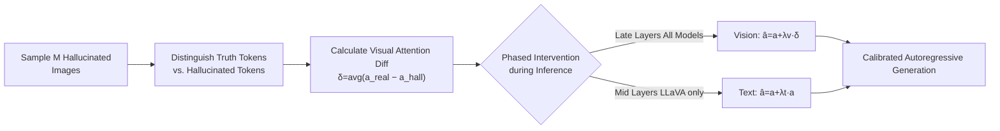

# Imitating the Truth: Attention-aware Truth-Guided Enhancement for Hallucination Mitigation in Large Vision-Language Models

**Conference**: ICLR 2026  
**OpenReview**: [https://openreview.net/forum?id=fzZAh18s9G](https://openreview.net/forum?id=fzZAh18s9G)  
**Code**: TBD  
**Area**: Multimodal Large Language Models / Hallucination Mitigation  
**Keywords**: LVLM, Hallucination Mitigation, Attention Intervention, Training-free, Decoding-time Enhancement  

## TL;DR
This paper discovers that LVLMs exhibit **phased and model-specific** attention differences when generating "truth tokens" versus "hallucinated tokens." It proposes AGE, a training-free framework that "calibrates" visual and textual attention during inference to mimic the attention patterns of truth tokens, thereby mitigating hallucinations without retraining or compromising fluency.

## Background & Motivation
- **Background**: Large Vision-Language Models (LVLMs, e.g., LLaVA, MiniGPT-4, mPLUG-Owl2) perform strongly in image description, VQA, and instruction following, but suffer from **hallucinations**—generating content inconsistent with or contradictory to image evidence. This limits their deployment in high-stakes scenarios like autonomous driving and medical diagnosis.
- **Limitations of Prior Work**: Existing mitigation strategies fall into two categories: external auxiliary modules (e.g., Woodpecker, LURE, which require extra data/models) and decoding-time interventions (e.g., OPERA, VCD). While the latter are model-agnostic and easy to deploy, they **generally operate in a coarse-grained manner**, applying uniform attention enhancement across layers and modalities, failing to capture the subtle dynamics of multimodal reasoning.
- **Key Challenge**: The cause of hallucinations is often oversimplified as "insufficient visual attention" or "textual prior interference." However, **globally enhancing visual attention in a one-size-fits-all manner is insufficient and may even be counterproductive**—the real issue is the failure to replicate the phased and model-specific attention dynamics of truth tokens.
- **Goal**: To perform fine-grained attention intervention at the stages of "maximum divergence" during inference without training or architectural changes, guiding the model to mimic the attention behavior of truth tokens.
- **Key Insight**: **[Truth Token Imitation]** By decomposing a hallucinated response into "truth tokens" (objects present in the image) and "hallucinated tokens" (fabricated objects) and comparing their layer-wise attention, the authors find that truth tokens follow discernible attention patterns. **Hallucination is essentially the model's failure to replicate the phased, sensitive attention dynamics of truth tokens**; thus, guiding the model to imitate these patterns can mitigate hallucinations.

## Method

### Overall Architecture
AGE (Attention-aware Truth-Guided Enhancement) is a training-free, decoding-time framework. It first uses a small set ($M=10$) of COCO images known to trigger hallucinations to sample responses, distinguishes between truth and hallucinated tokens, and calculates the **visual attention difference** in the final layer to obtain a fixed "target direction vector" $\delta$. During inference, $\delta$ is injected into the visual attention of late-stage layers (applicable to all models), and for models like LLaVA that transition to textual dependence in middle layers, an additional text attention self-multiplication enhancement is applied. The process modifies attention scores during the forward pass without changing training or architecture.

### Key Designs

**1. Phased Attention Difference Analysis: Locating "Where to Intervene"**  
The authors divide the $L$-layer LVLM decoder into early (0–16), middle (16–26), and late (26–31) stages and define a layer-wise attention difference metric. For each sample $i$, they calculate the average attention of truth and hallucinated tokens at layer $l$ for vision ($\bar{s}^{(l,i)}_{(\text{real,vision})}$ and $\bar{s}^{(l,i)}_{(\text{hall,vision})}$) and aggregate them across $N=100$ images as $\text{Diff}^l_{\text{image}} = \frac{1}{N}\sum_i (\bar{s}^{(l,i)}_{(\text{real,vision})} - \bar{s}^{(l,i)}_{(\text{hall,vision})})$. A $\text{Diff}^l_{\text{image}}>0$ indicates that truth tokens focus more on vision at layer $l$. Analysis reveals a **key commonality**: all models consistently show a significant positive difference in the late stage (layers 26–31), where truth responses attend more to vision, providing a universal entry point for intervention. Middle-layer attention, however, is highly **model-specific** (LLaVA depends more on text in mid-layers, while MiniGPT-4/mPLUG-Owl2 remain vision-dominant), necessitating model-customized interventions.

**2. Mimicking Image Attention: Directional Visual Calibration**  
Addressing the late-stage "visual neglect" common to all models, the authors do not use coarse, direction-agnostic self-multiplication. Instead, they construct a **direction vector** $\delta \in \mathbb{R}^n$ ($n$ is the number of visual tokens) to precisely point the shift from "hallucination mode to truth mode." Specifically, they take the average image attention vectors $a^i_{(\text{real,vision})}$ and $a^i_{(\text{hall,vision})}$ from the final layer $L$ and compute a weighted average over $M$ samples: $\delta = \frac{1}{M}\sum_{i=1}^{M} w_i \cdot (a^i_{(\text{real,vision})} - a^i_{(\text{hall,vision})})$. During inference, this is injected into late-layer visual attention: $\hat{a}^l_{\text{vision}} = a^l_{\text{vision}} + \lambda_v \times \delta$ (experimentally $\lambda_v=100$). Since $\delta$ is a universal direction aggregated across samples, it captures general calibration trends in the attention space rather than overfitting to the $M$ samples.

**3. Mimicking Text Attention: Model-specific Self-multiplication**  
For models like LLaVA-1.5 that rely more on textual context during the middle stage, the authors reinforce textual attention. Since text attention vector dimensions change dynamically during generation (making a fixed direction vector impossible), **self-multiplication enhancement** is used as a proxy: $\hat{a}^l_{\text{text}} = a^l_{\text{text}} + \lambda_t \times a^l_{\text{text}}$ (setting $\lambda_t=3$). While it does not specify a correction direction, it amplifies the model's focus on its own generated context, replicating the mid-stage text-dependent behavior of truth tokens. Visual-dominant models like MiniGPT-4 and mPLUG-Owl2 receive no textual intervention, reflecting the "phased, adaptive-by-model" philosophy.

**4. Calibrated Autoregressive Generation: Weaving Intervention into Decoding**  
These interventions are seamlessly integrated into the standard autoregressive process. For each decoding step $k$ and layer $l$, the model **conditionally** applies intervention based on the stage: late-layer visual attention shift with $\delta$ for all LVLMs, additional mid-layer text self-multiplication for LLaVA, and no changes for other layers. The next hidden state is then computed using calibrated attention $\hat{a}^{(l,k)}_{\text{vision}}, \hat{a}^{(l,k)}_{\text{text}}$ as $h^{(l+1)}_k = h^{(l)}_k + \text{AttentionSubLayer}(\hat{a}^{(l,k)}_{\text{vision}}, V^{(l)}_{\text{vision}}, \hat{a}^{(l,k)}_{\text{text}}, V^{(l,k)}_{\text{text}})$. This process suppresses hallucinations while maintaining alignment with visual evidence, providing an interpretable path for trustworthy generation.

## Key Experimental Results

### Main Results
COCO Image Captioning (CHAIR, max new token=64, lower is better; BLEU higher is better), Average of three models:

| Method | CS↓ | CI↓ | BLEU↑ |
|------|-----|-----|-------|
| Greedy | 24.95 | 9.14 | 15.21 |
| OPERA | 24.42 | 8.65 | 15.56 |
| VCD | 26.95 | 10.07 | 14.46 |
| LURE | 22.87 | 8.12 | 15.55 |
| VISTA | 20.10 | 6.45 | - |
| **AGE (Ours)** | **17.15** | **6.35** | **16.16** |

POPE Benchmark (MiniGPT-4, average of three settings):

| Method | Acc↑ | F1↑ |
|------|------|-----|
| Greedy | 56.77 | 69.32 |
| OPERA | 53.77 | 68.12 |
| VCD | 57.11 | 64.35 |
| **AGE (Ours)** | **73.86** | **69.37** |

### Ablation Study
LLaVA-1.5 / COCO (max new token=128). SMA=Visual self-multiplication; AGE_T=Text attention intervention; AGE_I=Directional visual intervention:

| SMA | AGE_T | AGE_I | CS↓ | CI↓ | BLEU↑ |
|-----|-------|-------|-----|-----|-------|
| | | | 53.4 | 14.2 | 10.5 |
| ✓ | | | 43.1 | 13.1 | 10.1 |
| | ✓ | | 50.4 | 14.9 | 10.4 |
| | | ✓ | 35.4 | 10.9 | 10.4 |
| | ✓ | ✓ | **31.8** | **10.0** | 10.5 |

### Key Findings
- AGE reduces CHAIRS by 2.85% compared to the latest SOTA (VISTA), while BLEU increases by 0.95%, showing that mitigating hallucinations **does not occur at the expense of fluency or completeness**.
- On POPE, AGE improves Accuracy by 17.09% over the baseline and 20.09% over OPERA, validating that "aligning with truth attention behavior" is more effective than "punishing textual attention."
- Ablation shows that directional visual intervention AGE_I (18.0% improvement on CHAIRS) significantly outperforms direction-agnostic SMA (10.3%), proving that **precise vector guidance is more effective than coarse scaling**.
- Achieving SOTA using only **10 images** to calculate $\delta$ indicates that gains stem from replicating attention dynamics rather than external data augmentation.

## Highlights & Insights
- **Diagnosis First**: By refining "hallucination" to token-level and layer-wise attention analysis, the paper proposes a new actionable explanation: "hallucination = failure to replicate phased attention dynamics of truth tokens," which is more precise than simply "insufficient visual attention."
- **Direction Vector vs. Scaling**: Using the truth-hallucination attention difference to construct a fixed direction vector $\delta$ is more targeted than direction-agnostic global scaling, a core technical advancement over OPERA/VCD.
- **Training-free & Model-adaptive**: Late-stage visual intervention is universal, while mid-stage textual intervention is model-customized, reflecting the philosophy of "intervening where the divergence is greatest." It requires only 10 images and no architectural changes, making it highly cost-effective for deployment.

## Limitations & Future Work
- Since $\delta$ is calculated at the **last layer** and injected into late stages, the method relies on the empirical observation of "positive late-stage visual difference." Its validity for new architectures (e.g., non-Transformer decoders) with different dynamics is unknown.
- Textual intervention can only use self-multiplication as a proxy (due to dynamic dimensions) and lacks the directional correction used for vision, which is theoretically less elegant. Phase division and hyperparameters like $\lambda_v=100, \lambda_t=3$ are empirically set and may require recalibration across models.
- Evaluation focuses on object existence hallucinations (CHAIR/POPE/MME subsets), with limited coverage of more complex hallucinations like relations, attributes, or counting.

## Related Work & Insights
- **Decoding-time Intervention**: Compared to OPERA (penalizing overconfidence), VCD (contrasting original and distorted visual inputs), and DoLA, AGE belongs to the model-agnostic route but uses directional vectors for fine-grained, phased calibration, distinguishing it from their coarse-grained global adjustments.
- **External Modules**: Woodpecker and LURE rely on extra data or auxiliary models for correction. AGE surpasses them without retraining using only 10 images, highlighting the cost-effectiveness of "internal attention calibration."
- **Insight**: Decomposing generated content into "verifiably true" and "hallucinated" categories to contrast internal representation/attention differences is a universal interpretable diagnostic paradigm that could be extended to LLM text hallucinations and Agent decision trustworthiness.

## Rating
- **Novelty**: ⭐⭐⭐⭐ Token-level phased attention analysis + direction vector calibration offers a fresh and interpretable perspective, though it remains an extension of decoding-time attention intervention.
- **Experimental Thoroughness**: ⭐⭐⭐⭐ Covers three models across three benchmarks (CHAIR/POPE/MME) plus ablation and scale analysis. Solid evidence overall, though hallucination type coverage is slightly narrow.
- **Writing Quality**: ⭐⭐⭐⭐ Logic from motivation to analysis to method is clear. Figures 1/2/3 illustrate the "difference → intervention" transition intuitively.
- **Value**: ⭐⭐⭐⭐ Training-free, requires only 10 images, plug-and-play, and maintains fluency. High practical value for engineering deployment.

<!-- RELATED:START -->

## Related Papers

- [\[ICLR 2026\] Dynamic Multimodal Activation Steering for Hallucination Mitigation in Large Vision-Language Models](dynamic_multimodal_activation_steering_for_hallucination_mitigation_in_large_vis.md)
- [\[ICLR 2026\] Hallucination-aware Intermediate Representation Edit in Large Vision-Language Models](hallucination-aware_intermediate_representation_edit_in_large_vision-language_mo.md)
- [\[CVPR 2026\] Residual Decoding: Mitigating Hallucinations in Large Vision-Language Models via History-Aware Residual Guidance](../../CVPR2026/hallucination/residual_decoding_mitigating_hallucinations_in_large_vision-language_models_via_.md)
- [\[CVPR 2026\] PAS: Prelim Attention Score for Detecting Object Hallucinations in Large Vision-Language Models](../../CVPR2026/hallucination/pas_prelim_attention_score_for_detecting_object_hallucinations_in_large_vision-l.md)
- [\[ICLR 2026\] Mitigating Hallucination in Vision-Language Model with Depth and Spatial-aware Key-Value Refinement](mitigating_hallucination_in_vision-language_model_with_depth_and_spatial-aware_k.md)

<!-- RELATED:END -->
