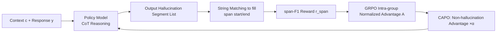

# Learning to Reason for Hallucination Span Detection

**Conference**: ICLR 2026  
**OpenReview**: [https://openreview.net/forum?id=ECAK3P92eg](https://openreview.net/forum?id=ECAK3P92eg)  
**Code**: To be confirmed  
**Area**: Hallucination Detection / Reinforcement Learning  
**Keywords**: Hallucination span detection, Reinforcement Learning, GRPO, Reasoning, span-F1, RAGTruth  

## TL;DR
This paper proposes RL4HS: using reinforcement learning (GRPO based on span-F1 rewards) to train 7B/14B models to perform "reason-then-locate" for precise hallucination span detection. It introduces Class-Aware Policy Optimization (CAPO) to correct systematic reward biases towards the "no-hallucination" class, outperforming SFT and proprietary large reasoning models (GPT-5, o3) on RAGTruth.

## Background & Motivation
- **Background**: Most hallucination detection research models the problem as **binary classification**—judging whether an output "contains hallucinations." However, real-world applications (summarization, long-form QA) require identifying **specific spans** of hallucinations to assess content reliability, leading to the more fine-grained "hallucination span detection" task.
- **Limitations of Prior Work**: Span detection is essentially a **multi-step decision process**—extracting all factual claims from the output and verifying each against the input context. Existing CoT work has only validated the utility of reasoning in binary classification; no one has explored **training a reasoning model specifically for span detection**. General-domain large reasoning models (trained on math/code) perform poorly when directly transferred.
- **Key Challenge**: CoT reasoning shows **almost no gain at a single sample (K=1)** for span detection. However, the authors found that when taking the **best of multiple samples (Span-F1@K)**, CoT creates a significant gap as K increases—indicating that reasoning "has the potential to generate at least one correct answer," but this capability is not prioritized in the top-1 output.
- **Goal**: To answer two questions: (i) Is the learned reasoning process useful for span detection, and how should it be learned? (ii) Must reasoning be learned specifically for this task, or are general reasoning models sufficient?
- **Core Idea**: **Use RL to solidify the "potential to get it right in multiple samples" into the "ability to get it right on the first try."** Run GRPO using verifiable span-F1 as a reward; address the **class asymmetry** of span-F1 rewards by proposing CAPO, which multiplies the advantage of "no-hallucination" samples by a reduction factor to prevent the model from taking shortcuts (**predicting no-hallucinations for everything → high precision, low recall reward hacking**).

## Method

### Overall Architecture
RL4HS models span detection as a **generative** task: given context $c$ and generated response $y$, the model first outputs a CoT reasoning trace (verifying consistency of each fact with the context), then directly generates a list of hallucinated text segments, and finally fills back the start/end positions in $y$ via string matching. Training uses GRPO, with rewards directly based on the span-F1 between predicted and ground-truth spans; CAPO is applied to correct class reward imbalance.

### Key Designs

**1. Generative Modeling + Span-F1@K Motivation: Using "Sampling Potential" as the RL Entry Point.** Existing methods use either discriminative token-level binary classification or generative segment output; the authors chose generative modeling as it naturally fits CoT reasoning. A key observation from a pilot experiment showed that for Span-F1@K curves, CoT has negligible gains at $K=1$, but the CoT curve rises significantly more than the non-CoT curve as $K$ increases. This suggests correct reasoning paths exist in the sampling distribution but are not ranked first. This curve serves as the direct rationale for using RL instead of SFT: RL can promote "occasionally sampled good answers" to stable top-1 outputs. Evaluation uses dataset-level span-F1, where $\text{Precision}=|P\cap G|/|P|$ and $\text{Recall}=|P\cap G|/|G|$, with $P$ and $G$ being the union of character position sets of predicted and ground-truth spans.

**2. Verifiable Span-F1 Reward-Driven GRPO: Replacing Value Networks with Relative Intra-group Ranking.** The training framework uses GRPO instead of PPO, eliminating the explicit value network and using relative intra-group scores as a baseline. The advantage is defined as the standardized value of intra-group rewards: $A(\tau)=\big(R_\tau-\text{mean}\{R_i\}\big)/\text{std}\{R_i\}$. The reward function is tied to the target metric: when both ground truth and prediction are empty (correctly identifying no hallucination), $r_{span}=1$; otherwise, it is $\text{span-F1}(\hat S, S)$. This design allows both "hallucinated" and "non-hallucinated" classes to be handled by the same reward, which is fully verifiable without an additional reward model.

**3. Diagnosing Reward Asymmetry: Identifying the Root Cause of GRPO Systematic Bias.** Instead of applying GRPO directly, the authors performed an advantage distribution diagnosis (Figure 2/3). They found that **non-hallucination predictions systematically receive higher advantage values than hallucination predictions**, regardless of accuracy. The root cause is the intrinsic asymmetry of $r_{span}$—the non-hallucination class can easily get a high score by outputting an empty list, whereas the hallucination class requires **precise localization**, where small errors cause a sharp drop in F1 reward. Consequently, GRPO tends to over-encourage conservative "no-hallucination" behavior, resulting in **high precision but suppressed recall**—a form of reward hacking. Notably, simply reducing the reward for "correctly predicted empty" is **ineffective** because the GRPO normalization step cancels out such scaling.

**4. Class-Aware Policy Optimization (CAPO): Rebalancing Classes at the Advantage Level.** Since tampering with reward values is negated by normalization, CAPO intervenes at the **advantage value** level. For samples belonging to the non-hallucination class, their standardized advantage is multiplied by a scaling factor $\alpha$: $\hat A(\tau)^{(nh)}=\big(\alpha\cdot R_\tau-\text{mean}\{R_i\}\big)/\text{std}\{R_i\}$. Setting $\alpha=0.5$ (selected via validation set) reduces the dominance of the non-hallucination class in policy updates, mitigating the imbalance caused by its sparse rewards. Training dynamics (Figure 4) confirm that while standard GRPO recall declines during training, CAPO maintains recall while keeping high precision, leading to superior overall span-F1.

## Key Experimental Results

### Main Results (RAGTruth, span-level F1, average of three tasks)

| Model | Sum. F1 | QA F1 | D2T F1 | Avg. F1 | Avg. P | Avg. R |
|-------|---------|-------|--------|---------|--------|--------|
| GPT-4o-mini w/ CoT | 38.4 | 27.3 | 33.7 | 33.1 | 37.1 | 30.2 |
| GPT-5 w/ CoT | 36.5 | 44.4 | 45.7 | 42.2 | 30.0 | 71.2 |
| o3 w/ CoT | 48.5 | 49.9 | 55.2 | 51.2 | 43.2 | 63.0 |
| Qwen3-14B (Reasoning) | 35.8 | 30.6 | 34.8 | 33.7 | 36.2 | 32.0 |
| SFT-7B | 44.1 | 51.3 | 54.8 | 50.1 | 54.1 | 47.0 |
| SFT-14B | 52.7 | 53.9 | 59.6 | 55.4 | 57.4 | 53.8 |
| Multi-View Attention-7B† | 41.5 | 50.6 | 55.2 | 49.1 | 47.2 | 55.5 |
| **RL4HS-7B** | 50.9 | 56.4 | 60.4 | **55.9** | 62.9 | 51.2 |
| **RL4HS-14B** | **57.6** | 54.8 | 62.6 | **58.3** | 61.3 | 56.1 |

- RL4HS-7B average F1 (55.9) **surpasses SFT-7B (50.1)** and even exceeds SFT-14B (55.4). RL4HS-14B reaches 58.3, **outperforming larger proprietary reasoning models** such as GPT-5 (42.2) and o3 (51.2).

### Ablation Study (CAPO vs GRPO, Qwen2.5-7B)

| Variant | Avg. F1 | Avg. P | Avg. R |
|---------|---------|--------|--------|
| RL4HS-GRPO-7B | 54.2 | 64.9 | 47.3 |
| **RL4HS-7B (CAPO)** | **55.9** | 62.9 | **51.2** |

- GRPO achieves higher precision (64.9) but suppressed recall (47.3). CAPO trades a slight decrease in precision for a +3.9 gain in recall (47.3→51.2), improving overall F1 and confirming that reward hacking is mitigated.

### Key Findings
- **Reasoning potential is activated by RL**: CoT is ineffective at K=1 but Span-F1@K rises significantly with K → RL promotes good answers from the distribution to the top rank.
- **In-domain reasoning is necessary**: RL4HS-OOD-7B (trained using leave-one-out) still outperforms QwQ-32B, Qwen3, and GPT series, showing that **task-specific reasoning learning** for span detection is more effective than general reasoning models and possesses cross-task generalization.
- **Reward scaling must be done at the advantage level**: GRPO normalization cancels out simple reward value scaling; intervention must occur at the advantage level (CAPO).

## Highlights & Insights
- **Diagnosis-driven design**: The vulnerability of "systematic bias toward the non-hallucination class" was quantified via advantage distribution plots before proposing CAPO, creating a solid logical loop rather than trial-and-error.
- **Small models beating large models**: A 7B specialized model defeating GPT-5/o3 provides strong evidence that task-specific RL is more cost-effective than general reasoning models.
- **Verifiable Reward**: Directly using span-F1 as a reward avoids the need for a separate reward model, making the engineering process clean and reproducible.
- **CAPO's generalizability**: Any detection or extraction task using GRPO where "conservative/empty answers are naturally easier to score" might encounter similar reward hacking. CAPO's advantage-level reweighting is a transferable insight.

## Limitations & Future Work
- Validated only on the **RAGTruth** benchmark with three CNLG tasks; cross-dataset and cross-lingual generalization remain unknown.
- The scaling factor $\alpha=0.5$ was manually tuned via the validation set; whether adaptive adjustment is needed for different task/class distributions was not explored.
- Generative modeling requires "string matching to fill positions," which may fail if the hallucination segment wording does not perfectly match the original text.
- Only addresses binary (hallucination vs. non-hallucination) asymmetry; fine-grained reward designs for multi-type hallucinations (e.g., entity error vs. relation error) were not explored.

## Related Work & Insights
- **Binary Hallucination Detection** (Yang, Tang, Ji, etc.): This work moves from "whether it contains hallucinations" to "which spans are hallucinations."
- **Generative vs. Discriminative Span Detection** (Wu et al. 2023 RAGTruth; Ogasa & Arase 2025 Multi-View Attention): This work follows the generative approach to accommodate CoT.
- **GRPO / Verifiable Reward RL** (Shao et al. DeepSeekMath): This work transfers GRPO from math/code domains to hallucination detection and exposes/corrects its reward bias in asymmetric tasks—a cautionary tale for all detection/extraction tasks using GRPO.
- **Insight**: When an RL reward provides a "lazy shortcut to high scores," instead of modifying the reward value (which normalization cancels), it is more effective to perform class rebalancing at the advantage or gradient level.

## Rating
- Novelty: ⭐⭐⭐⭐ First to train a reasoning model for span detection using RL + span-level rewards; CAPO's diagnosis and correction of GRPO reward asymmetry have independent value.
- Experimental Thoroughness: ⭐⭐⭐⭐ Covers proprietary/open-source/SFT/general reasoning baselines, includes 5 research questions (Q1–Q5), training dynamics, and leave-one-out generalization; however, limited to the RAGTruth benchmark.
- Writing Quality: ⭐⭐⭐⭐ Problem-driven structure is clear; advantage distribution plots effectively illustrate the motivation.
- Value: ⭐⭐⭐⭐ The 7B model outperforming GPT-5/o3 is compelling; the CAPO approach is transferable to other asymmetric RL tasks.

<!-- RELATED:START -->

## Related Papers

- [\[ICLR 2026\] Hallucination Reduction with CASAL: Contrastive Activation Steering for Amortized Learning](hallucination_reduction_with_casal_contrastive_activation_steering_for_amortized.md)
- [\[ICLR 2026\] Mechanistic Detection and Mitigation of Hallucination in Large Reasoning Models](mechanistic_detection_and_mitigation_of_hallucination_in_large_reasoning_models.md)
- [\[ICLR 2026\] HARP: Hallucination Detection via Reasoning Subspace Projection](harp_hallucination_detection_via_reasoning_subspace_projection.md)
- [\[ICLR 2026\] Enhancing Hallucination Detection through Noise Injection](enhancing_hallucination_detection_through_noise_injection.md)
- [\[ACL 2025\] Learning Auxiliary Tasks Improves Reference-Free Hallucination Detection in Open-Domain Long-Form Generation](../../ACL2025/hallucination/learning_auxiliary_tasks_improves_reference-free_hallucination_detection_in_open.md)

<!-- RELATED:END -->
