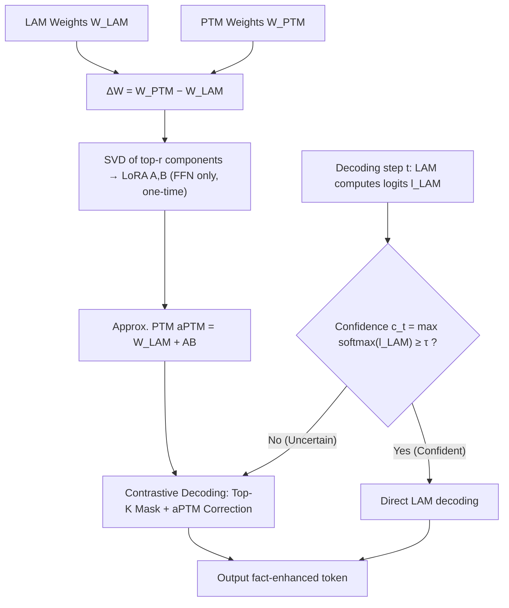

# Leveraging Pretrained Knowledge at Inference Time: LoRA-Gated Contrastive Decoding for Multilingual Factual Language Generation in Adapted LLMs

**Conference**: ICLR 2026  
**OpenReview**: [https://openreview.net/forum?id=vzlDdOzXAh](https://openreview.net/forum?id=vzlDdOzXAh)  
**Code**: TBD  
**Area**: Hallucination Mitigation / Multilingual Factuality / Inference-time Decoding  
**Keywords**: Catastrophic Forgetting, Contrastive Decoding, LoRA, FFN Knowledge Memory, Training-free, Multilingual LLM  

## TL;DR
LGCD utilizes SVD to decompose the FFN weight difference between the "original pretrained model vs. language-adapted model" into a set of LoRA matrices. During decoding, it dynamically triggers contrastive decoding based on token confidence to "re-inject" factual knowledge lost during the adaptation process—without requiring training or access to the original pre-training data.

## Background & Motivation
- **Background**: Adapting general LLMs to a specific language (e.g., Chinese, Arabic, Swahili) through Continued Pre-training (CPT) or Instruction Tuning is a mainstream approach, resulting in numerous Language-Adapted Models (LAMs) in the community.
- **Limitations of Prior Work**: Adaptation causes **catastrophic forgetting**. To align with the style and fluency of the target language, models often overwrite general world knowledge acquired during the initial pre-training phase, leading to increased factual errors and hallucinations. The ideal solution is retraining with mixed data, but pre-training data for models like LLaMA/Qwen is **not public or accessible**, and the cost is prohibitively high.
- **Key Challenge**: There is an inherent trade-off between "domain fluency" and "general factual knowledge" in LAMs—maintaining idiomatic expression in the target language while retaining the original model's factual foundation is difficult to balance.
- **Goal**: Improve factual accuracy by "borrowing" residual factual knowledge from the original Pretrained Model (PTM) for the LAM at inference time, **without additional training or access to original pre-training data**.
- **Key Insight**: **[FFNs serve as key-value memories for factual knowledge]** Prior work has found that FFN layers in Transformers act as key-value memories for storing factual knowledge. The authors hypothesize that the knowledge implicit in PTM FFN weights can be explicitly extracted and injected into the LAM as needed—triggered only for tokens where the LAM is "uncertain" (low confidence) to avoid disrupting fluency.

## Method

### Overall Architecture
LGCD (LoRA-Gated Contrastive Decoding) is a training-free inference-time decoding framework consisting of three steps: ① Perform a one-time SVD on the FFN weight difference between PTM and LAM to extract a LoRA approximation, resulting in an "approximate Pretrained Model" (aPTM); ② During decoding, measure LAM confidence per token; if confident, use LAM directly; if uncertain, switch to contrastive decoding; ③ Contrastive decoding applies aPTM factual logits to correct LAM only on Top-K candidates, injecting knowledge with minimal disruption to fluency.

### Key Designs

**1. LoRA Extraction of FFN Weight Difference: Compressing "forgotten knowledge" into a one-time lightweight bypass.** Instead of modifying the LAM, LGCD calculates the parameter difference $\Delta W_\ell = W^{PTM}_\ell - W^{LAM}_\ell$ for each FFN layer and performs Singular Value Decomposition (SVD): $\Delta W_\ell = U_\ell \Sigma_\ell V_\ell^\top$. By keeping only the top-$r$ singular components, it constructs LoRA matrices $A_\ell = U_\ell[:,:r]\sqrt{\Sigma_\ell[:r]}$ and $B_\ell = \sqrt{\Sigma_\ell[:r]}V_\ell^\top[:r,:]$. Thus, the PTM FFN weights are approximated as $W^{aPTM}_\ell = W^{LAM}_\ell + A_\ell B_\ell$. This step is **computed only once**, requiring no LAM modification or simultaneous full-model deployment, effectively distilling the extra knowledge of the PTM into low-rank matrices. This is applied only to FFN layers (Appendix A.3 confirms this is most effective).

**2. Dynamic Confidence Gating: Querying "facts" only when uncertain.** For each decoding step, LAM calculates logits $l^{LAM}_t$, and token-level confidence is determined as $c_t = \max(\mathrm{softmax}(l^{LAM}_t))$. Given a threshold $\tau$, if $c_t \ge \tau$, the LAM decodes directly (preserving fluency). If $c_t < \tau$, contrastive decoding is triggered. This gating mechanism uses token-level uncertainty to decide when to trust the adapted model and when to seek help from the original, resolving the trade-off between fluency and factuality. Threshold $\tau$ is set based on language data availability (Appendix A.8).

**3. Contrastive Decoding under Top-K Mask: Targeted correction instead of brute-force overriding.** When triggered, aPTM logits are calculated via the LoRA bypass: $l^{aPTM}_t = l^{LAM}_t + \mathrm{LoRA}(\Delta W_\ell, h^{LAM}_t)$. To prevent selecting "garbage tokens" where both models have low probability, corrections are confined to the LAM Top-K candidates $T_K = \mathrm{TopK}(l^{LAM}_t, K)$. Contrastive logits are calculated as $l^{contrast}_t[i] = l^{LAM}_t[i] + \beta\,(l^{aPTM}_t[i] - \alpha\, l^{LAM}_t[i])$ for $i \in T_K$. Here, $\beta$ controls overall contrastive strength, and $\alpha \in [0,1]$ controls the suppression of LAM logits, amplifying aPTM signals while penalizing LAM's potential overconfidence.

## Key Experimental Results

Setup: 9 languages (zh, de, pt, ar, fa, ja, ko, id, sw), 12 public LAMs (mostly LLaMA-3 based); Tasks include multiple-choice QA (Global MMLU, Multilingual TruthfulQA) and long-form generation (Medical QA, Multi-FAct). Baselines include Nucleus Sampling, DoLa (inter-layer contrastive decoding), TIES, and SLERP (model merging).

### Main Results

| Benchmark | Setting | PTM | LAM(NS) | DoLa | TIES | SLERP | **LGCD** |
|---|---|---|---|---|---|---|---|
| Global MMLU | 0-shot avg | 0.448 | 0.441 | 0.439 | 0.449 | 0.445 | **0.477** |
| Global MMLU | 5-shot avg | 0.477 | 0.481 | 0.481 | 0.488 | 0.487 | **0.498** |
| TruthfulQA | 0-shot avg | 0.323 | 0.334 | 0.315 | 0.331 | 0.330 | **0.376** |
| TruthfulQA | 5-shot avg | 0.366 | 0.367 | 0.349 | 0.370 | 0.368 | **0.435** |
| Multi-FAct | avg(9 models) | — | 0.272 | — | — | — | **0.312 (+0.040)** |

- Global MMLU 0-shot: LGCD improved 10 out of 12 models relative to LAM. The largest gains occurred where LAM trailed PTM (e.g., Korean +4.5~10.3pp, German +6.0pp), confirming the "retrieval" of lost knowledge.
- TruthfulQA: Gains were more significant (Portuguese +10.8pp, Arabic +9.2pp); average score increased from 0.367 to 0.435 in 5-shot.

### Ablation Study

| Analysis Dimension | Observation |
|---|---|
| Contrastive usage vs. Threshold τ | High-resource languages (zh/de/pt/ar/fa) benefit from high thresholds (τ≈0.7–0.8), where PTM is more reliable. Low-resource languages benefit from lower thresholds due to LAM overconfidence. |
| Entity Behavior (NER) | LGCD produces more entities than LAM, but Jaccard overlap is only ≈1–16%, indicating it **supplements** missed factual entities rather than just repeating. |
| Trigger Sparsity | Gating triggers only on a small number of "decisive factual tokens." Sparse intervention is sufficient to guide the generation to the correct answer. |

### Throughput (A100, hfl/llama-3-chinese-8b-instruct, mean of 100 questions)

| Strategy | Throughput (tok/s) |
|---|---|
| Greedy | 19.21 |
| Nucleus sampling | 17.47 |
| DoLa | 16.81 |
| Contrastive search | 11.87 |
| LGCD-0.2 | 14.37 |
| LGCD-0.4 / 0.6 | 10.32 |
| LGCD-0.8 | 10.22 |

### Key Findings
- LGCD consistently outperforms decoding and merging baselines across multiple-choice QA, long-form Medical QA (preferred in 63.1% vs PTM and 53.5% vs LAM by GPT-4o/human review), and Multi-FAct.
- Gains stem from "sparse, targeted" injection of factual entities rather than global rewriting.
- Higher threshold τ leads to more frequent triggers and lower throughput (LGCD-0.8 is roughly half of Greedy), representing the primary cost.

## Highlights & Insights
- **"Knowledge is in the Weight Difference"**: Treating the PTM-LAM parameter difference + SVD as a "data-free knowledge extractor" bypasses the constraint of inaccessible pre-training data.
- **Gating + Top-K Dual Constraints**: Confidence determines "when to correct," while Top-K determines "what to correct," mitigating the risk of selecting low-quality tokens common in contrastive decoding.
- **Completely Training-free and Plug-and-play**: One-time SVD plus an inference-time bypass makes it applicable to any PTM-LAM pair with low deployment overhead.

## Limitations & Future Work
- **Throughput Drop**: Throughput is nearly halved at high thresholds, requiring a trade-off for long-text deployment.
- **Dependency on PTM Quality**: If the PTM itself is unreliable in low-resource languages, gains are limited as the threshold must be lowered.
- **Access to Weights**: Requires both PTM and LAM weights, which is not applicable to models released only as adapted versions without the base model.
- **Hyperparameter Sensitivity**: Parameters like τ, $\alpha$, $\beta$, $K$, and rank $r$ require tuning, and automated selection remains an open question.

## Related Work & Insights
- **Contrastive Decoding Lineage**: Unlike DoLa (inter-layer) or Contrastive Search, LGCD is "cross-model (PTM vs LAM)," using an **explicitly extracted** factual knowledge bypass.
- **FFN as Knowledge Memory**: This work is a concrete application of the "FFN as memory" theory to "catastrophic forgetting repair."
- **Model Merging vs. Decoding Injection**: Unlike TIES/SLERP which merge weights, LGCD injects knowledge on-demand during decoding, allowing for finer, token-level control.

## Rating
- Novelty: ⭐⭐⭐⭐ Combining "Weight Difference SVD → LoRA" with "Gated Contrastive Decoding" for forgetting repair is novel and addresses a practical pain point.
- Experimental Thoroughness: ⭐⭐⭐⭐ Covers 9 languages, 12 models, 4 task types, and includes human/LLM evaluation and behavior analysis.
- Writing Quality: ⭐⭐⭐⭐ Clear logic from motivation to method; well-explained components and supporting visuals.
- Value: ⭐⭐⭐⭐ Directly addresses factuality issues in adapted models with low deployment barriers, though throughput costs are a consideration.

<!-- RELATED:START -->

## Related Papers

- [\[ACL 2026\] Detecting Hallucinations in SpeechLLMs at Inference Time Using Attention Maps](../../ACL2026/hallucination/detecting_hallucinations_in_speechllms_at_inference_time_using_attention_maps.md)
- [\[ACL 2026\] Understanding New-Knowledge-Induced Factual Hallucinations in LLMs: Analysis and Interpretation](../../ACL2026/hallucination/understanding_new-knowledge-induced_factual_hallucinations_in_llms_analysis_and_.md)
- [\[ICLR 2026\] GHOST: Hallucination-Inducing Image Generation for Multimodal LLMs](ghost_hallucination-inducing_image_generation_for_multimodal_llms.md)
- [\[ICLR 2026\] NDAD: Negative-Direction Aware Decoding for Large Language Models via Controllable Hallucination Signal Injection](ndad_negative-direction_aware_decoding_for_large_language_models_via_controllabl.md)
- [\[CVPR 2025\] Octopus: Alleviating Hallucination via Dynamic Contrastive Decoding](../../CVPR2025/hallucination/octopus_alleviating_hallucination_via_dynamic_contrastive_decoding.md)

<!-- RELATED:END -->
## Related Papers

- [\[ACL 2026\] Understanding New-Knowledge-Induced Factual Hallucinations in LLMs: Analysis and Interpretation](../../ACL2026/hallucination/understanding_new-knowledge-induced_factual_hallucinations_in_llms_analysis_and_.md)
- [\[ACL 2026\] Detecting Hallucinations in SpeechLLMs at Inference Time Using Attention Maps](../../ACL2026/hallucination/detecting_hallucinations_in_speechllms_at_inference_time_using_attention_maps.md)
- [\[ICLR 2026\] GHOST: Hallucination-Inducing Image Generation for Multimodal LLMs](ghost_hallucination-inducing_image_generation_for_multimodal_llms.md)
- [\[CVPR 2025\] Octopus: Alleviating Hallucination via Dynamic Contrastive Decoding](../../CVPR2025/hallucination/octopus_alleviating_hallucination_via_dynamic_contrastive_decoding.md)
- [\[ICLR 2026\] BARREL: Boundary-Aware Reasoning for Factual and Reliable LRMs](barrel_boundary-aware_reasoning_for_factual_and_reliable_lrms.md)

<!-- RELATED:END -->
