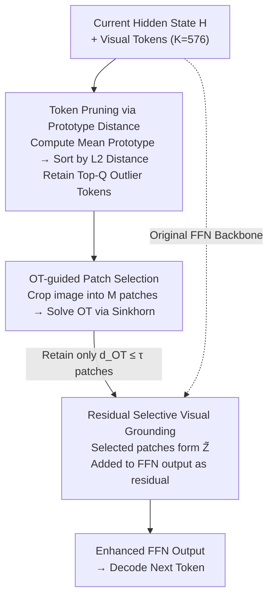

# Look Carefully: Adaptive Visual Reinforcements in Multimodal Large Language Models for Hallucination Mitigation

**Conference**: ICLR 2026  
**arXiv**: [2602.24041](https://arxiv.org/abs/2602.24041)  
**Code**: Not yet released  
**Area**: Hallucination Detection  
**Keywords**: MLLM Hallucination Mitigation, Visual Reinforcement, Optimal Transport, Token Pruning, Training-free Inference

## TL;DR
The AIR (Adaptive vIsual Reinforcement) framework is proposed to reduce MLLM hallucinations during inference without training by utilizing prototype distance-based token pruning and Optimal Transport-guided selective patch reinforcement (LLaVA-1.5-7B CHAIR_S: 22→18.4, POPE Accuracy +5.3%), while maintaining general multimodal performance.

## Background & Motivation

**Background**: MLLMs (e.g., LLaVA, Qwen-VL) have achieved significant progress in vision-language reasoning but remain prone to "hallucinations"—generating text inconsistent with image content, such as describing non-existent objects. Mitigation methods are categorized into training-time (requiring extra labels), post-processing (requiring external models), and inference-time (e.g., contrastive decoding).

**Limitations of Prior Work**: Recent visual reinforcement methods (e.g., MemVR) attempt to strengthen visual signals by re-injecting tokens into FFN layers during decoding. However, a critical issue exists: **injecting all visual tokens indiscriminately** causes redundant signals from background regions to interfere with the model's focus on key areas, potentially introducing new hallucinations.

**Key Challenge**: Visual token counts are large (e.g., 576 in LLaVA), with many being background redundancies. Full injection introduces noise, while no injection leads to visual signal decay. A balance must be struck between "reinforcing visual signals" and "avoiding background interference."

**Goal**: Design a selective visual reinforcement mechanism that injects only the most relevant visual patches into the decoding process, reinforcing key visual cues while avoiding redundant interference.

**Key Insight**: It is observed that similarity between hidden states and different visual tokens varies significantly—higher for target regions and lower for background regions—forming the basis for an adaptive selection strategy.

**Core Idea**: Prune redundant visual tokens using prototype distance and quantify the alignment between patches and hidden states using Optimal Transport, injecting only high-alignment patches.

## Method

### Overall Architecture
AIR is integrated into the FFN stage of each Transformer layer. During the decoding of the current token, it identifies "truly relevant" visual information and adds it back to the FFN output as a residual. It first prunes hundreds of visual tokens into a small informative subset via prototype distance, then measures the alignment between the current hidden state and image patches using Optimal Transport. Only high-alignment patches are injected. The process is training-free and can be applied to any MLLM like LLaVA, Qwen-VL, or GLM-4V.

### Key Designs

**1. Token Pruning via Prototype Distance: Filtering Background Redundancy**

A LLaVA image contains 576 tokens, most encoding highly similar backgrounds like sky or ground. Full computation is slow and noisy. AIR averages all visual tokens to get a "prototype" $h_p$, representing the mean semantic center. Tokens are sorted by their L2 distance $\|h_i - h_p\|_2$, retaining only the Top-$Q$ ($Q \ll K$). Background tokens, being similar to the prototype, are discarded, while "outlier" tokens representing foreground objects are preserved. This reduces the computational load of Optimal Transport from $K$ to $Q$.

**2. OT-guided Patch Selection: Reinforcing Only Aligned Regions**

After pruning, the model must decide which image regions to reinforce. AIR crops the original image into $M$ patches and models the pruned hidden states and patch embeddings as discrete distributions. The Sinkhorn algorithm efficiently solves the Optimal Transport (OT) distance $d_{\text{OT}}(m)$. OT captures the holistic geometric matching between distributions, being more sensitive to "true alignment" than point-wise cosine similarity. Formal proof in the paper shows OT's discriminative sensitivity is strictly higher than cosine distance, explaining why OT selection outperforms Cosine in ablations (CHAIR_S 18.4 vs 19.8). Patches with $d_{\text{OT}}(m) \le \tau$ are selected to form $\tilde{Z}$. Irrelevant background patches are naturally filtered.

**3. Residual Selective Visual Grounding: Maintaining Original Behavior**

Once patches are selected, visual signals are added to the FFN output as a residual term rather than replacing the original calculation:

$$\text{FFN}(H\mid \tilde{Z}) = \phi(HW_1)W_2^\top + \phi(H'\tilde{Z}^\top)\tilde{Z}$$

The first term is the original FFN; the second is the visual grounding term. $H'$ represents pruned hidden states, and $\tilde{Z}$ represents OT-selected patch embeddings. The residual form ensures that if no high-alignment patch exists, the reinforcement term approaches zero, keeping model behavior unchanged. Reinforcement occurs only when strong visual evidence exists. The method requires no training, only tuning $Q$, $\tau$, and $M$.

## Key Experimental Results

### Main Results - CHAIR Hallucination Evaluation (MSCOCO, max 64 tokens)

| Method | LLaVA-1.5-7B CHAIR_S↓ | CHAIR_I↓ | Qwen-VL CHAIR_S↓ | CHAIR_I↓ | GLM-4V CHAIR_S↓ | CHAIR_I↓ |
|------|----------------------|----------|-------------------|----------|-----------------|----------|
| Vanilla | 22.0 | 6.7 | 20.0 | 6.2 | 13.0 | 5.6 |
| VCD | 24.6 | 7.3 | 19.2 | 5.7 | 14.8 | 6.5 |
| MemVR | 21.6 | 6.4 | 20.0 | 6.1 | 13.0 | 5.6 |
| VAF | 20.4 | 6.5 | 20.6 | 6.6 | 11.6 | 5.3 |
| **AIR (Ours)** | **18.4** | **5.7** | **18.6** | **5.9** | **11.6** | **5.3** |

### POPE Benchmark (LLaVA-1.5-7B)

| Dataset | Setting | Vanilla Acc | MemVR Acc | AIR Acc | AIR F1 |
|--------|------|-------------|-----------|---------|--------|
| MSCOCO | Random | 83.7 | 87.6 | **89.0** | **88.2** |
| MSCOCO | Popular | 78.2 | 86.0 | **87.1** | **86.4** |
| MSCOCO | Adversarial | 75.0 | 83.5 | **83.9** | **83.6** |
| A-OKVQA | Random | 83.4 | 89.0 | **89.0** | **88.5** |

### Ablation Study

| Component | CHAIR_S↓ | POPE Acc↑ |
|------|----------|-----------|
| Vanilla | 22.0 | 83.7 |
| +Token Reduction only | 20.1 | 86.8 |
| +Patch Reinforcement only | 19.5 | 87.2 |
| +Full AIR | **18.4** | **89.0** |
| Replace OT with Cosine | 19.8 | 87.5 |

### Key Findings
- AIR achieves the best or tied-best hallucination mitigation across three different MLLM architectures.
- OT selection outperforms cosine similarity selection (CHAIR_S: 18.4 vs 19.8), validating the theoretical analysis.
- Performance remains robust under POPE adversarial settings, indicating resilience to adversarial prompts.
- General capabilities (LLaVA-Bench, MME, MMBench) are not significantly degraded, proving the method does not sacrifice generalizability for low hallucinations.

## Highlights & Insights
- **Theory + Practice**: Formal proof of OT's superiority (higher sensitivity than cosine) is provided and experimentally validated.
- **Training-free & Plug-and-play**: No labeling or fine-tuning required; applicable to any MLLM like LLaVA, Qwen-VL, or GLM-4V.
- **"Less is More"**: Pruning and selective reinforcement outperform full injection, suggesting visual reinforcement quality matters more than quantity.
- **Visualization**: Attention heatmaps clearly show AIR focusing attention on semantically critical regions.

## Limitations & Future Work
- Requires cropping images into patches and encoding them separately, introducing additional inference cost, especially for high-resolution images.
- Hyperparameters $\tau$ and $Q$ require tuning; different models or data may need different configurations.
- Currently validated only on captioning and VQA; effectiveness in multi-turn dialogue or long-text generation remains unknown.
- Prototype distance sorting assumes "outlier = informative," which may not hold in specific scenarios like uniform texture images.

## Related Work & Insights
- Direct improvement over MemVR: AIR proves selective injection is significantly better than full injection.
- Complementary to VCD (Visual Contrastive Decoding): VCD reduces hallucinations via noisy contrast, while AIR reinforces key visual signals.
- The use of OT in VLMs provides a new direction for future work in attention allocation and token merging.

## Rating
- Novelty: ⭐⭐⭐⭐ OT-guided selective reinforcement is a novel approach with strong theoretical backing.
- Experimental Thoroughness: ⭐⭐⭐⭐ Comprehensive testing across three models, multiple hallucination benchmarks, and general capability checks.
- Writing Quality: ⭐⭐⭐⭐ Deep problem analysis with clear motivational diagrams.
- Value: ⭐⭐⭐⭐ Highly practical training-free solution for MLLM hallucination mitigation.

<!-- RELATED:START -->

## Related Papers

- [\[ICLR 2026\] Dynamic Multimodal Activation Steering for Hallucination Mitigation in Large Vision-Language Models](dynamic_multimodal_activation_steering_for_hallucination_mitigation_in_large_vis.md)
- [\[ICML 2025\] Look Twice Before You Answer: Memory-Space Visual Retracing for Hallucination Mitigation in Multimodal Large Language Models](../../ICML2025/hallucination/look_twice_before_you_answer_memory-space_visual_retracing_for_hallucination_mit.md)
- [\[ICLR 2026\] Mechanistic Detection and Mitigation of Hallucination in Large Reasoning Models](mechanistic_detection_and_mitigation_of_hallucination_in_large_reasoning_models.md)
- [\[ICLR 2026\] Imitating the Truth: Attention-aware Truth-Guided Enhancement for Hallucination Mitigation in Large Vision-Language Models](imitating_the_truth_attention-aware_truth-guided_enhancement_for_hallucination_m.md)
- [\[ICML 2026\] Adaptive Residual-Update Steering for Low-Overhead Hallucination Mitigation in Large Vision Language Models](../../ICML2026/hallucination/adaptive_residual-update_steering_for_low-overhead_hallucination_mitigation_in_l.md)

<!-- RELATED:END -->
