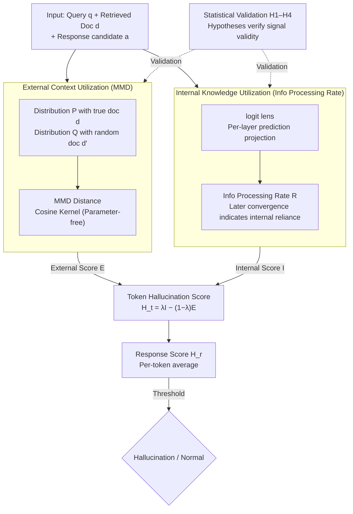

# LUMINA: Detecting Hallucinations in RAG System with Context-Knowledge Signals

**Conference**: ICLR 2026  
**arXiv**: [2509.21875](https://arxiv.org/abs/2509.21875)  
**Code**: [Available](https://github.com/deeplearning-wisc/LUMINA)  
**Area**: Hallucination Detection  
**Keywords**: RAG hallucination detection, external context utilization, internal knowledge utilization, Maximum Mean Discrepancy (MMD), information processing rate

## TL;DR

Ours proposes the Lumina framework, which detects hallucinations in RAG systems via "context-knowledge signals": MMD is used to measure the extent of **external context utilization**, while cross-layer token prediction evolution measures **internal knowledge utilization**. The method generalizes without hyperparameter tuning.

## Background & Motivation

RAG systems aim to reduce LLM hallucinations using retrieved external documents, yet they still generate hallucinations even when provided with correct and sufficient context.

**Key Challenge**: An imbalance between the model's internal knowledge and external context. Hallucinations occur when the model relies excessively on internal parametric knowledge while ignoring the retrieved external context.

**Limitations of Prior Work** (e.g., ReDeEP, SEReDeEP):
- **Heavy reliance on hyperparameters**: Specific attention heads and transformer layers must be selected to calculate scores, requiring extensive tuning that varies across datasets and models.
- **Lack of validation**: While a correlation between scores and hallucinations is shown, there is no verification that the scores truly reflect the "utilization degree" of external context or internal knowledge.

## Method

### Overall Architecture

Lumina addresses the problem where RAG systems hallucinate despite being "fed" correct and sufficient documents. The **Core Idea** is that this stems from an imbalance between **external context** and **internal parametric knowledge**—over-relying on internal memory while ignoring retrieved information. The mechanism involves measuring two signals for each generated token: **external context utilization** ($\mathcal{E}$) and **internal knowledge utilization** ($\mathcal{I}$). A hallucination is identified when the latter significantly outweighs the former. Crucially, both signals **bypass internal model structures** (no selection of attention heads or transformer layers), eliminating per-dataset/model tuning. Furthermore, a statistical validation framework proves these signals measure their intended properties.

**Mechanism**: Given query $q$, retrieved document $d$, and response candidate $a$, two parallel signal paths are computed. The external path replaces $d$ with a random document and measures the output distribution change via MMD. The internal path uses logit lens to trace the convergence speed of predictions across layers via the Information Processing Rate. These combine into a token-level hallucination score; the response-level score is the mean of token scores, which is thresholded to determine if it is a hallucination.

**Core Idea** (Conjecture 1): When $\mathcal{I}_{p_\theta}(a|q,d) \gg \mathcal{E}_{p_\theta}(a|q,d)$ (internal knowledge utilization far exceeds external context utilization), the response is more likely a hallucination.

The token-level hallucination score is defined as:

$$\mathcal{H}_t(a_t|q,d,a_{<t}) = \lambda \cdot \mathcal{I}_{p_\theta}(a_t|q,d,a_{<t}) - (1-\lambda) \cdot \mathcal{E}_{p_\theta}(a_t|q,d,a_{<t})$$

The response-level score is the mean of token scores: $\mathcal{H}_r(a|q,d) = \frac{1}{T}\sum_{t=1}^{T} \mathcal{H}_t$.

### Key Designs

**1. External Context Utilization: Using MMD to observe distribution shifts**

Prior methods relied on manually selecting attention heads or layers. Lumina bypasses internal structures: if a model utilizes external context, replacing the relevant doc $d$ with a random doc $d'$ should significantly alter the next token distribution. If the output remains unchanged, the model is likely relying on internal knowledge. External utilization is quantified as the distance between two token probability distributions: $P(E_v)=p_\theta(v|q,d,a_{<t})$ (real doc) and $Q(E_v)=p_\theta(v|q,d',a_{<t})$ (random doc), measured by Maximum Mean Discrepancy (MMD):

$$\mathcal{E}_{p_\theta}(a_t|q,d,a_{<t}) = \text{MMD}_k^2(P, Q)$$

Expanded in the token embedding space as the sum of three kernel functions:

$$\mathcal{E} = \sum_{u,v} P(E_u)P(E_v)k(E_u,E_v) + \sum_{u,v} Q(E_u)Q(E_v)k(E_u,E_v) - 2\sum_{u,v} P(E_u)Q(E_v)k(E_u,E_v)$$

Utilizing a cosine kernel $k_{\cos}(E_u, E_v) = \frac{1}{2}(1 + \frac{E_u^T E_v}{\|E_u\|_2 \|E_v\|_2})$ ensures the metric is parameter-free and model-agnostic.

**2. Internal Knowledge Utilization: Using Information Processing Rate to track convergence**

To quantify reliance on internal knowledge, Lumina uses logit lens to project hidden states $h_{t,l}$ from each layer into the token probability space. **Mechanism**: If intermediate layers lock onto the final prediction early, the answer primarily comes from the context. If the prediction only converges in the final layers, it indicates the model is "injecting information" from its parameters. This is quantified by the Information Processing Rate:

$$\mathcal{R}_{p_\theta}(x_{<t}) = \frac{\sum_{l=1}^{L-1}(1 - \min\{\frac{[f(h_{t,l})]_{x_{t,1}}}{p_\theta(x_{t,1}|x_{<t})}, 1\}) \cdot l}{\sum_{l'=1}^{L-1} \frac{l'}{H(f(h_{t,l'}))}}$$

Where $f(\cdot) = \text{Softmax}(\text{LogitLens}(\cdot))$ and $H(\cdot)$ is the entropy function. The numerator measures the "non-convergence" of each layer towards the final prediction, weighted by layer depth $l$ to emphasize late-stage processing. The denominator uses entropy for adaptive normalization. A larger $\mathcal{R}$ reflects later convergence and higher internal reliance.

**3. Statistical Validation Framework**

Lumina treats the validity of these scores as falsifiable hypothesis tests, constructing four verifiable implications: H1, generation with retrieved docs should have higher external utilization than without; H2, summarization should have higher external utilization than QA; H3, absence of docs should require more internal knowledge; H4, data-to-text should require more internal knowledge than summarization. Across four LLMs, all hypotheses passed with $p < 0.001$, confirming the signals measure the intended properties.

### Loss & Training

Lumina is an **unsupervised method** and requires no training. Key parameters:
- $\lambda = 0.5$ (Balance between external and internal scores)
- Cosine kernel (No kernel parameter tuning required)

## Key Experimental Results

### Main Results

Datasets: RAGTruth (QA, Summarization, Data-to-Text), HalluRAG (Free-form QA). Models: Llama2-7B/13B, Llama3-8B, Mistral-7B.

| Category | Method | RAGTruth AUROC (Llama2-13B) | HalluRAG AUROC (Llama2-13B) |
|---------|------|:-:|:-:|
| Uncertainty | Perplexity | 0.454 | 0.255 |
| Uncertainty | LN-Entropy | 0.768 | 0.783 |
| Consistency | EigenScore | 0.633 | 0.786 |
| Verbalized | P(True) | 0.754 | 0.691 |
| Utilization | ReDeEP | 0.806 | 0.765 |
| **Utilization** | **Lumina** | **0.857** | **0.917** |

| LLM | RAGTruth AUROC | HalluRAG AUROC |
|-----|:-:|:-:|
| Llama2-7B | 0.765 | 0.915 |
| Llama2-13B | 0.857 | 0.917 |
| Mistral-7B | 0.769 | 0.990 |

Lumina exceeds 0.9 AUROC across all models on HalluRAG, with a maximum gain of +13% over ReDeEP.

### Ablation Study

- **Kernel Selection**: Cosine kernel performance is comparable to the best RBF kernel while being parameter-free.
- **Score Combination**: The combination of external and internal signals outperforms individual signals by >10% on Llama2-13B.
- **Robustness to Context Noise**: Removing or adding 0-30% of sentences shows consistent performance across most LLMs.
- **Cross-model Detection**: Using Llama2-7B to detect hallucinations in Llama3-8B achieves AUROC comparable to or higher than Llama3-8B self-detection.

### Key Findings

- Hallucinations strongly correlate with "low external context score + high internal knowledge score" (verified via 2D KDE visualization).
- Self-detection is not mandatory—cross-model detection is equally effective or better.
- Error analysis shows most false positives/negatives stem from label quality issues in datasets and low-quality retrieved documents.

## Highlights & Insights

1. **Layer-agnostic Design**: Does not require selecting specific attention heads or layers, solving the primary portability bottleneck of prior methods.
2. **Statistical Validation Framework**: The first to apply rigorous hypothesis testing to "internal/external utilization scores."
3. **Unsupervised Superiority**: Competitive with or superior to the supervised SAPLMA binary classifier.
4. **Cross-model Generalization**: Enables small models to detect hallucinations in large models, significantly reducing deployment costs.

## Limitations & Future Work

- Llama2-13B performance drops by >0.1 under context noise; further analysis is required.
- Current assumptions assume retrieved docs are relevant and sufficient; low-quality retrieval scenarios are not fully evaluated.
- Logit lens projections in information processing rates may require adjustment for newer architectures like MoE.
- Validation on reasoning-intensive tasks (e.g., mathematical reasoning) is still needed.

## Related Work & Insights

- Applying MMD as a distribution distance metric is elegant and extensible to other signal detection scenarios.
- The Information Processing Rate provides a new perspective on LLM internal states, potentially inspiring new training objectives.
- Cross-model results suggest that "knowledge utilization patterns" in LLMs may share cross-model commonalities.
- Provides immediate practical value for ensuring RAG system reliability.

## Rating

- Novelty: ⭐⭐⭐⭐⭐ — Innovative MMD + Info Processing Rate design with theoretical grounding.
- Technical Depth: ⭐⭐⭐⭐⭐ — Statistical validation framework enhances credibility.
- Experimental Thoroughness: ⭐⭐⭐⭐⭐ — Multi-model, multi-dataset, extensive ablation, and robustness analysis.
- Value: ⭐⭐⭐⭐⭐ — Unsupervised, training-free, and generalizes across models.

<!-- RELATED:START -->

## Related Papers

- [\[ICLR 2026\] Grounding or Guessing? Visual Signals for Detecting Hallucinations in Sign Language Translation](grounding_or_guessing_visual_signals_for_detecting_hallucinations_in_sign_langua.md)
- [\[ACL 2026\] TPA: Next Token Probability Attribution for Detecting Hallucinations in RAG](../../ACL2026/hallucination/tpa_next_token_probability_attribution_for_detecting_hallucinations_in_rag.md)
- [\[ICLR 2026\] Visual Multi-Agent System: Mitigating Hallucination Snowballing via Visual Flow](visual_multi-agent_system_mitigating_hallucination_snowballing_via_visual_flow.md)
- [\[ACL 2025\] DRAG: Distilling RAG for SLMs from LLMs to Transfer Knowledge and Mitigate Hallucination](../../ACL2025/hallucination/drag_distilling_rag_slm.md)
- [\[ACL 2026\] Detecting Hallucinations in SpeechLLMs at Inference Time Using Attention Maps](../../ACL2026/hallucination/detecting_hallucinations_in_speechllms_at_inference_time_using_attention_maps.md)

<!-- RELATED:END -->
