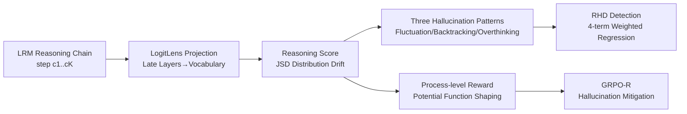

# Mechanistic Detection and Mitigation of Hallucination in Large Reasoning Models

**Conference**: ICLR 2026  
**OpenReview**: [https://openreview.net/forum?id=XU2STJa1Fi](https://openreview.net/forum?id=XU2STJa1Fi)  
**Code**: [https://github.com/Jeryi-Sun/Reasoning_Hallucination](https://github.com/Jeryi-Sun/Reasoning_Hallucination)  
**Area**: Hallucination Detection / Large Reasoning Models / Mechanistic Interpretability  
**Keywords**: Reasoning Hallucination, Large Reasoning Models, Mechanistic Interpretability, LogitLens, GRPO, Reward Shaping  

## TL;DR
This paper proposes a mechanistic interpretability-based **Reasoning Score** (using LogitLens to measure the distribution drift of late-layer logits to characterize "reasoning depth"). Based on this, it reveals three internal patterns of reasoning hallucinations, constructs the RHD detection framework, and adapts GRPO into GRPO-R using potential-based reward shaping to mitigate hallucinations.

## Background & Motivation
- **Background**: Large Reasoning Models (LRMs) such as DeepSeek-R1 and OpenAI o-series, trained via "outcome-based RL", can generate multi-step reasoning chains. However, a more subtle error has emerged—**Reasoning Hallucination**: the reasoning chain is logically self-consistent and persuasive, but the conclusion is incorrect.
- **Limitations of Prior Work**: Traditional hallucination detection primarily performs "correctness judgment" for simple CoT tasks or identifies surface-level textual errors, **failing to explain the causes of hallucinations at a mechanistic level**. Directly analyzing model-generated text can be misled by "plausible-looking" appearances, and Latent CoT hides reasoning within hidden states, making text-side detection unreliable.
- **Key Challenge**: To determine whether a model is performing "true deep reasoning" or "shallow pattern matching," one must probe the model's interior, yet an internal signal to quantify "reasoning depth" is lacking.
- **Goal**: Starting from mechanistic interpretability, provide a quantifiable internal measure of reasoning depth to **unify the "analysis → detection → mitigation" pipeline**.
- **Key Insight**: **Mechanistic interpretability suggests that "early layers transmit information, while late layers perform complex reasoning"** — thus, projecting hidden states of late layers into the vocabulary space and observing their distribution drift relative to the final layer can distinguish shallow matching (stable distribution) from deep reasoning (significant distribution change). This is the Reasoning Score.

## Method

### Overall Architecture
The method consists of three stages: first, defining the **Reasoning Score** to measure the "thinking depth" of each reasoning step; second, using it to analyze three hallucination patterns (violent early fluctuations, erroneous backtracking, and spurious verification from overthinking) on ReTruthQA to regress the **RHD detection score**; finally, treating the Reasoning Score as a process-level reward and injecting it into GRPO via potential-based reward shaping to obtain **GRPO-R** for hallucination mitigation.

### Key Designs

**1. Reasoning Score: Quantifying Reasoning Depth with LogitLens.** This is the foundation of the paper. For each token in a reasoning chain $C=[c_1,\dots,c_K]$, LogitLens is used to project the hidden state of a selected late layer $j$ to the vocabulary: $q_j(t)=\mathrm{softmax}(\mathrm{LayerNorm}(h^{(j)}_{m,k})W_U)$. The Jensen–Shannon divergence between this and the final layer anchor distribution $q_N$ is then calculated and averaged over tokens and layers to obtain the step-level score $R^k_{score}=\frac{1}{|c_k|}\sum_{t}\frac{1}{|J|}\sum_{j\in J}\mathrm{JSD}(q_N,q_j)$. The intuition is that a high score indicates the late layers have substantially transformed the output distribution (integrating context for deep reasoning), while a low score indicates distribution stability (shallow pattern matching/heuristics). The authors verify on GSM-NoOp that steps misled by irrelevant No-Op phrases indeed receive significantly lower Reasoning Scores (2.671 vs 3.267), proving the score truly captures reasoning depth.

**2. Three Hallucination Patterns and Corresponding Internal Metrics.** Using the Reasoning Score as a proxy variable on ReTruthQA, the authors identify three patterns and design quantifiable metrics for each. **Pattern #1 (Early Depth Fluctuation)** uses the coefficient of variation (CV) to measure fluctuations in an early step window: $\mathrm{CV}(C)=\sigma(R^{early}_{score})/\mu(R^{early}_{score})$. Hallucination chains show significantly higher CV (0.239 vs 0.150). **Pattern #2 (Erroneous Backtracking)** uses Attention Score to measure the proportion of attention late steps pay to "anomalous early steps" (shallow steps in the lower quartile or overthinking steps exceeding threshold $\tau$). Hallucination chains show higher attention to these bad steps (0.382 vs 0.307). **Pattern #3 (Spurious Verification in Overthinking)** finds that while overthinking steps have high Reasoning Scores, they also have higher perplexity (1.872 vs 1.499), showing a positive correlation between Reasoning Score and PPL—termed "spurious verification," a byproduct of outcome-based rewards.

**3. RHD: Regressing Patterns into a Detection Score.** The four signals above are linearly combined into a Reasoning Hallucination Score: $H_C=\alpha_1\cdot\mathrm{Avg}(R_{score})+\alpha_2\cdot\mathrm{CV}(C)+\alpha_3\cdot\mathrm{AttnScore}(C)+\alpha_4\cdot\mathrm{PCC}(R_{score},\mathrm{PPL}(C))$, corresponding to overall reasoning depth, Pattern #1, #2, and #3 respectively. Coefficients $\alpha$ are fitted via regression. The advantage is that the detection signals originate entirely from the model's internal reasoning mechanism rather than surface text or external PRMs.

**4. GRPO-R: Potential Function Shaping to Turn Reasoning Depth into Process Reward.** For mitigation, reasoning is modeled as a finite-step MDP where the original reward $R_{final}$ is only given at the end $t=T$. The authors apply potential function shaping $\bar r_t=r_t+\gamma\Phi(s_{t+1})-\Phi(s_t)$ to inject process signals, setting the potential function to a clipped Reasoning Score: $\tilde R_{score}(s_t)=\alpha R_{score}(s_t)$ if $R_{score}\le\tau$ else 0, and $\Phi(s_t)=-\tilde R_{score}(s_t)$. Clipping targets "encouraging deep reasoning without encouraging overthinking." Potential shaping ensures the optimal policy remains unchanged (only credit is redistributed). Theorem 1 shows the generalization gap under the augmented reward is controlled by the Rademacher complexity $R_n(\Pi)$; the Reasoning Score acts as a regularizer to reduce $R_n(\Pi)$, thereby tightening the generalization bound. This is integrated into GRPO as GRPO-R.

## Key Experimental Results

### Main Results: RHD Detection (ReTruthQA, AUC)

| Category/Method | MATH | Science | MultiHopQA |
|---|---|---|---|
| SelfCheckGPT | 0.7727 | 0.6819 | 0.6886 |
| GPT-4o (LCM) | 0.7513 | 0.7045 | 0.7123 |
| EigenScore (Self-Aware) | 0.7539 | 0.6488 | 0.6696 |
| **RHD (Ours, R1-7B)** | **0.7978** | **0.7194** | **0.7361** |

RHD achieves the best AUC across all three domains on R1-7B, with most metrics being statistically significant (†). Multi-candidate ranking (MC1/MC2/MC3) also leads (e.g., MATH MC1 0.6591). It remains optimal on Science/MultiHopQA for R1-14B.

### Ablation Study (Mitigation): GRPO-R (Accuracy)

| Model/Method | MATH500 | AIME2024 | GPQA-diamond | GPQA-main |
|---|---|---|---|---|
| DeepSeek-R1-1.5B Base | 0.772 | 0.333 | 0.354 | 0.333 |
| +GRPO | 0.770 | 0.333 | 0.359 | 0.335 |
| **+GRPO-R** | **0.788** | **0.367** | **0.414** | **0.371** |
| Qwen2.5-1.5B +GRPO | 0.480 | 0.033 | 0.247 | 0.214 |
| **Qwen2.5-1.5B +GRPO-R** | **0.490** | **0.133** | **0.247** | **0.243** |

GRPO-R outperforms standard GRPO on most tasks, with particularly significant gains on OOD tasks like GPQA, indicating that reasoning shaping improves generalization.

### Key Findings
- Reasoning Score correlates significantly with "being misled by No-Op," validating its measurement of reasoning depth.
- Hallucination chains are significantly higher in CV and Attention Score than truthful chains, and these patterns are consistent across Math/Science/MultiHopQA.
- Overthinking steps exhibit an anomalous positive correlation (spurious verification) between high reasoning scores and high perplexity, a side effect of outcome-based RL.

## Highlights & Insights
- **Moving Hallucination Detection from Surface Text to Internal Mechanisms**: Using late-layer distribution drift via LogitLens as a proxy for reasoning depth is a clean and interpretable approach.
- **Analysis-Detection-Mitigation Loop**: The same Reasoning Score drives both detection (RHD) and training (GRPO-R), providing methodological unity.
- **Theoretical Support for Potential Shaping**: Ensures policy optimality remains unchanged and uses Rademacher complexity to explain tightened generalization bounds, providing theoretical backing for empirical improvements.
- **Granular Pattern Characterization**: Pattern #1 (early fluctuation), Pattern #2 (error backtracking), and Pattern #3 (spurious verification) are provided with quantifiable metrics rather than vague descriptions.

## Limitations & Future Work
- The Reasoning Score relies on the hierarchical hypothesis of "early layers for info, late layers for reasoning" and LogitLens; its universality across non-standard architectures needs verification.
- Mitigation experiments were conducted only at the 1.5B scale with 2,000 OpenR1-Math samples; gains and stability on larger models are yet to be examined.
- The method involves several hyperparameters such as step segmentation, threshold $\tau$, early window $r$, and late-step ratio $\eta$. While sensitivity is analyzed in the appendix, practical deployment requires tuning.
- Hallucination labels in ReTruthQA partly rely on GPT-4o, which might introduce bias into the gold standard.

## Related Work & Insights
- **Hallucination Detection Spectrum**: From uncertainty estimation ($P(\text{True})$, LN-Entropy), internal signal probes, and process critic models to PRMs. This paper argues that PRMs generalize poorly and uncertainty methods are length-sensitive, opting instead for internal reasoning mechanisms.
- **Mechanistic Interpretability**: Based on findings like early/late layer specialization, FFNs storing knowledge, and LogitLens decoding hierarchical predictions, this work modularizes these insights into usable detection/training signals.
- **Inspiration**: Upgrading "interpretability probes" from analysis tools to differentiable/regressible supervisory signals is a promising path for connecting interpretability with alignment; potential shaping allows process rewards to inject priors without altering optimal policies, a technique worth reusing in other RLHF scenarios.

## Rating
- Novelty: ⭐⭐⭐⭐ Uses LogitLens late-layer distribution drift to define reasoning depth and connects analysis, detection, and mitigation.
- Experimental Thoroughness: ⭐⭐⭐⭐ Compares 6 baseline categories on the detection side across three domains and two models, including OOD GPQA on the mitigation side; however, the mitigation scale is small.
- Writing Quality: ⭐⭐⭐⭐ Clear pattern naming, well-supported formulas and figures, and coherent logic from mechanism to method.
- Value: ⭐⭐⭐⭐ Reasoning hallucination is a core safety issue for LRMs; provides an interpretable and trainable unified solution with high practical utility.

<!-- RELATED:START -->

## Related Papers

- [\[ICLR 2026\] Dynamic Multimodal Activation Steering for Hallucination Mitigation in Large Vision-Language Models](dynamic_multimodal_activation_steering_for_hallucination_mitigation_in_large_vis.md)
- [\[ICLR 2026\] TraceDet: Hallucination Detection from the Decoding Trace of Diffusion Large Language Models](tracedet_hallucination_detection_from_the_decoding_trace_of_diffusion_large_lang.md)
- [\[ICLR 2026\] Look Carefully: Adaptive Visual Reinforcements in Multimodal Large Language Models for Hallucination Mitigation](look_carefully_adaptive_visual_reinforcements_in_multimodal_large_language_model.md)
- [\[NeurIPS 2025\] Reasoning Models Hallucinate More: Factuality-Aware Reinforcement Learning for Large Reasoning Models](../../NeurIPS2025/hallucination/reasoning_models_hallucinate_more_factuality-aware_reinforcement_learning_for_la.md)
- [\[ICLR 2026\] Imitating the Truth: Attention-aware Truth-Guided Enhancement for Hallucination Mitigation in Large Vision-Language Models](imitating_the_truth_attention-aware_truth-guided_enhancement_for_hallucination_m.md)

<!-- RELATED:END -->
