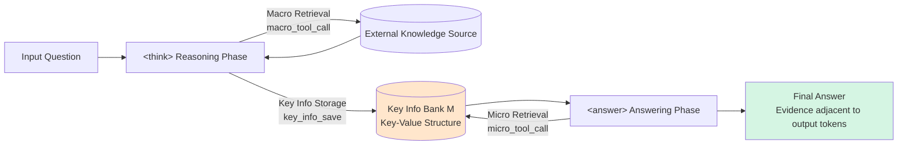

# Micro-Macro Retrieval: Reducing Long-Form Hallucination in Large Language Models

**Conference**: ICLR 2026  
**OpenReview**: [https://openreview.net/forum?id=ABdgMoJhlO](https://openreview.net/forum?id=ABdgMoJhlO)  
**Code**: [https://github.com/WoodScene/M2R](https://github.com/WoodScene/M2R)  
**Area**: Hallucination Mitigation / Retrieval-Augmented Generation  
**Keywords**: Long-form hallucination, retrieval augmentation, retrieve-while-generate, key information bank, GRPO, curriculum learning  

## TL;DR
M2R proposes a "Macro + Micro Retrieval" dual-layer framework: during the reasoning phase, coarse-grained evidence is retrieved from external sources and answer-aligned key information is stored in a key-value bank; during the answering phase, micro-retrieval is used to **extract these key facts and place them directly next to the answer tokens**. Trained via GRPO and curriculum learning, it fundamentally mitigates hallucinations in long-form generation.

## Background & Motivation
**Background**: Retrieval-Augmented Language Models (RALM) augment the parametric memory of LLMs with external knowledge and have become a mainstream paradigm for mitigating hallucinations. Methods such as ReAct, Self-RAG, and ReSearch alternate between retrieval and generation, demonstrating significant effectiveness in multi-hop question answering.

**Limitations of Prior Work**: The authors characterize the core challenge in long-form generation as **Lost in Lengthy Contexts**, which manifests in two ways: (1) Retrieval results are often lengthy, and redundant information makes it difficult for the model to capture key evidence; (2) long reasoning chains cause the model to forget early intermediate results, leading to errors in the final answer.

**Key Challenge**: Recent research has identified a critical pattern—**the closer the key evidence is to the final answer, the higher the factual accuracy** (consistent with the "lost-in-the-middle" phenomenon). However, existing RALMs only inject external knowledge into the reasoning process through multi-round retrieval; **there is no mechanism to guarantee that key information remains near the answer**. Once evidence is diluted or forgotten within a long context, hallucinations are amplified.

**Goal**: To fill this "key information-output proximity" gap by designing a retrieval-generation framework that actively maintains evidence adjacent to the answer, especially for long-context scenarios.

**Core Idea**: **Dual-layer retrieval + retrieve-while-generate**—the macro layer retrieves external evidence as usual but simultaneously stores answer-aligned key facts into a structured key-value bank; the micro layer retrieves these facts from the bank as needed during answer generation, inserting them before the corresponding output tokens so that key information and the answer are "tightly coupled."

## Method

### Overall Architecture
M2R divides a single rollout into a strict **Macro $\rightarrow$ Micro** two-stage process: the `<think>` reasoning phase performs macro-retrieval and writes key information to a key-value bank $M$; the `<answer>` phase performs micro-retrieval from $M$ to retrieve evidence and generates the answer with evidence positioned closely. The entire process is trained using GRPO reinforcement learning, synchronized with curriculum learning in two steps to ensure stable convergence.

### Key Designs

**1. Dual-layer Retrieval and Key Information Bank: Moving Evidence from "External" to "Next to the Answer"**
The core innovation of M2R lies in distinguishing between two types of retrieval. Macro-retrieval follows the traditional paradigm, using `<macro_tool_call>` to invoke external retrievers over multiple rounds during the `<think>` phase to collect coarse-grained evidence. Crucially, whenever the reasoning produces evidence aligned with the answer, the model uses `<key_info_save>` to write it into a structured bank $M$ as key-value pairs (both detection and storage are performed autonomously by the model during the thinking phase). During the `<answer>` phase, the model no longer relies on external documents but uses `<micro_tool_call>` to query $M$ for key values, forcing the final answer to be grounded directly on these values (each value must be wrapped in `\boxed{}`). Consequently, the key-value bank acts as a "buffer against forgetting" (addressing Limitation 1) and bridges macro and micro retrieval, ensuring key information remains close to the answer (addressing Limitation 2). Formally, the strategy is decomposed into a staged composition: $\pi_\theta(\cdot \mid x; R_{macro}, R_{micro}) = \pi_\theta^{answer}(\cdot \mid x, M; R_{micro}) \circ \pi_\theta^{think}(\cdot \mid x; R_{macro})$, where $M = \text{SaveKey}(\pi_\theta^{think}(\cdot \mid x; R_{macro}))$.

**2. GRPO with Retrieval Masking: Calculating Gradients Only for Model-Generated Tokens**
M2R utilizes GRPO instead of PPO to avoid training a separate value critic, estimating the baseline from a group of rollouts where advantage is normalized as $A_i = (r_i - \text{mean}(\{r_j\})) / \text{std}(\{r_j\})$. However, rollouts contain retrieval results injected by the environment (external tools), which are not generated by the policy. To avoid incorrectly assigning credit to these tokens, the authors introduce a **retrieval result mask**: a binary mask $m_t \in \{0,1\}$ (1 for policy-generated tokens, 0 for retrieval results) is used to rewrite the sequence log-probability as a masked sum: $\log \pi_\theta(y \mid \cdot) \triangleq \sum_t m_t \log \pi_\theta(y_t \mid y_{<t}, \cdot) / \max(1, \sum_t m_t)$, updating gradients only on text reasoning and model-issued retrieval queries. Notably, GRPO in M2R **does not optimize the retrieval module itself**; instead, it teaches the model "when to call macro/micro retrieval, how to orchestrate tool calls, what key information to write to the bank, and how to integrate retrieved evidence into the answer." Thus, M2R remains agnostic to the underlying retrieval system.

**3. Rule-based Rewards: Binding "Storage Accuracy + Answer Correctness + Consistency" via F1**
Due to the lack of supervised reasoning data, a purely rule-based reward is designed, consisting of format rewards and answer rewards. Format rewards check for the correct usage of tags (`<macro_tool_call>`/`<key_info_save>` in the reasoning phase, `<micro_tool_call>` in the answering phase, and `\boxed{}` for answer values). The answer reward consists of three sub-items calculated using F1: final answer correctness $s_{final}$ (consistency between `\boxed{}` values and ground truth), key information correctness $s_{key}$ (whether key info in $M$ aligns with ground truth), and a consistency score $s_{cons}$ (alignment between stored key info and final output), synthesized as $r_{ans} = s_{final} + \alpha\, s_{key} + \beta\, s_{cons}$. Rollout rewards use hierarchical assignment: $r_{ans}$ for correct answers with non-zero F1, 0.1 for zero F1 but correct format, and 0 for incorrect format—rewarding correct answers while providing a baseline incentive for format compliance.

**4. Curriculum Learning for Two-stage Training: Learning to Store Evidence First, Then Ground Answers**
Simultaneously optimizing macro-retrieval, key info storage, and micro-retrieval can lead to unstable rollouts and convergence failure. The authors split training into two stages via curriculum learning: the first stage only trains macro-retrieval and key info storage, enabling the model to identify relevant evidence and store it structurally. The second stage introduces micro-retrieval and fine-grained answer grounding, allowing the model to learn to invoke key information from the bank to generate final answers based on its established storage capabilities. This progression from simple to complex reduces learning complexity at each step, enhances stability, and mirrors the human reasoning process of "broadly collecting and organizing information before refining it into a precise answer."

## Key Experimental Results
**Setup**: Base models are Qwen2.5-3B-Instruct and Qwen2.5-7B-Instruct, trained only on the MuSiQue training set and evaluated on four multi-hop QA benchmarks (HotpotQA, 2WikiMultiHopQA, MuSiQue, Bamboogle), with Exact Match (EM) and LLM-as-a-Judge (LJ, gpt-4o-mini) as metrics.

### Main Results (7B Base, select metrics %)

| Method | HotpotQA EM | HotpotQA LJ | 2Wiki EM | MuSiQue EM | Bamboogle EM |
|---|---|---|---|---|---|
| Naive RAG | 31.90 | 49.59 | 25.78 | 6.21 | 20.80 |
| COFT | 41.08 | 61.71 | 41.86 | 17.12 | 35.71 |
| SURE | 39.56 | 60.16 | 45.65 | 20.87 | 39.58 |
| ReSearch (Strong Baseline) | 43.52 | 63.62 | 47.59 | 22.30 | 42.40 |
| **M2R-7B** | **44.11** | **65.98** | **48.89** | **24.12** | **44.56** |

On the 3B base, M2R also comprehensively outperforms ReSearch on 2Wiki/MuSiQue/Bamboogle (e.g., MuSiQue EM 20.87 vs 19.40).

### Ablation Study (3B Base, MuSiQue)

| Variant | EM (%) | LJ (%) |
|---|---|---|
| **Full M2R** | **24.12** | **35.44** |
| - One-shot Grounding (Injecting all key info at once) | 23.38 | 34.72 |

### Key Findings
- **Micro-retrieval is the source of effectiveness**: M2R consistently outperforms ReSearch, which only retrieves during the `<think>` phase, proving that re-retriving key information during the answering phase significantly improves factual grounding.
- **Most significant gains in long contexts**: Under high-redundancy stress tests (concatenating multiple questions into HotpotQA-2Q/3Q), the hallucination rates of Naive RAG and ReSearch rise rapidly, while M2R maintains stable accuracy—retrieve-while-generate continuously "re-anchors" evidence to the output.
- **On-demand grounding > One-shot grounding**: Ablations show that injecting all key info at once is diluted by redundant reasoning tokens, whereas M2R’s step-by-step on-demand retrieval and precise insertion ensure steadier factual consistency.
- **Manageable overhead**: Micro-retrieval only introduces an additional 1–2 calls (approx. 20–30% increase), with the majority of overhead coming from the `<think>` phase common to all multi-round RAG frameworks.

## Highlights & Insights
- **Precise Problem Localization**: Explicitly addresses the overlooked bottleneck of "key evidence-output proximity" and designs a targeted mechanism rather than generic retrieval optimization.
- **Dual Role of the Key Information Bank**: Acts as both a buffer to prevent forgetting and a bridge connecting macro and micro retrieval; a simple key-value structure simultaneously addresses both identified limitations.
- **Robust Training Engineering**: Retrieval masking avoids incorrect credit assignment to environment-injected tokens, the triple F1 reward binds accuracy and consistency, and curriculum learning stabilizes joint optimization—each component solves a specific training pain point.
- **Retrieve-while-generate Paradigm**: Transforms retrieval from "pre-generation processing" to "gradual re-anchoring during generation," directly aligning with the mechanics of the "lost-in-the-middle" phenomenon.

## Limitations & Future Work
- **Dependency on Verifiable Answers in Multi-hop QA**: Rule-based rewards and F1 scores rely on short answers with clear ground truth; migrating to open-ended long-form writing (without standard answers) requires re-evaluating reward design.
- **Autonomous Key Information Extraction**: What and how much is stored in `<key_info_save>` depends entirely on the model's judgment during the `<think>` phase; missing or incorrect information will directly impact subsequent micro-retrieval.
- **20–30% Additional Call Overhead**: Although argued to be manageable, it remains a burden for latency-sensitive real-time scenarios.
- **Fixed Retriever**: The framework is agnostic to the underlying retriever, which is a strength but also a limitation; bottlenecks in retrieval quality itself are not addressed.
- **Future Work**: Extending the dual-layer retrieval paradigm to long-form generation tasks like long-document summarization and report generation, and exploring soft-label or model-based rewards to bypass dependency on F1 ground truth.

## Related Work & Insights
- **Alternating Multi-round Retrieval-Generation**: ReAct, Self-RAG, Iter-RetGen, and IRCoT interleave retrieval and generation but operate only on external documents, unable to reuse intermediate reasoning generated by the model. M2R’s innovation is retrieving from a **model-constructed internal key information bank**.
- **Coarse-to-fine / Abstractive Retrieval**: COFT highlights critical reference context and SURE generates summaries of retrieved passages before selecting answers—both mitigate "getting lost" in long inputs but do not force evidence to be adjacent to output tokens.
- **RL for Retrieval-Reasoning**: ReSearch uses RL to train multi-round search reasoning and serves as the strongest baseline; M2R adds micro-retrieval and proximity constraints.
- **Insight**: "Lost-in-the-middle" is not just an evaluation phenomenon; it can be converted into an optimizable training objective. The explicit constraint of "moving evidence next to the answer" may mitigate hallucinations more directly than merely enhancing retrieval quality.

## Rating
- **Novelty**: ⭐⭐⭐⭐ — The "Macro/Micro dual-layer retrieval + key info bank + retrieve-while-generate" approach is an original response to the "evidence proximity" bottleneck, translating a known phenomenon into a trainable mechanism.
- **Experimental Thoroughness**: ⭐⭐⭐⭐ — Evaluated across four benchmarks and two base models, including long-context stress tests, ablations, reward dynamics, and reasoning overhead analysis; verification on truly open-ended long-form tasks is slightly missing.
- **Writing Quality**: ⭐⭐⭐⭐ — Clearly decomposes the problem into two limitations, formalizes the method using staged composition, and provides intuitive visualizations.
- **Value**: ⭐⭐⭐⭐ — Provides a reproducible (open-sourced) and overhead-controllable solution for long-form hallucinations, offering direct utility for RAG practitioners.

<!-- RELATED:START -->

## Related Papers

- [\[ICML 2026\] Building Reliable Long-Form Generation via Hallucination Rejection Sampling](../../ICML2026/hallucination/building_reliable_long-form_generation_via_hallucination_rejection_sampling.md)
- [\[ACL 2025\] REFIND at SemEval-2025 Task 3: Retrieval-Augmented Factuality Hallucination Detection in Large Language Models](../../ACL2025/hallucination/refind_at_semeval-2025_task_3_retrieval-augmented_factuality_hallucination_detec.md)
- [\[ACL 2025\] Fine-grained Hallucination Detection and Mitigation in Long-form Question Answering](../../ACL2025/hallucination/localizing_and_mitigating_errors_in_long-form_question_answering.md)
- [\[ICLR 2026\] TraceDet: Hallucination Detection from the Decoding Trace of Diffusion Large Language Models](tracedet_hallucination_detection_from_the_decoding_trace_of_diffusion_large_lang.md)
- [\[ICLR 2026\] Mechanistic Detection and Mitigation of Hallucination in Large Reasoning Models](mechanistic_detection_and_mitigation_of_hallucination_in_large_reasoning_models.md)

<!-- RELATED:END -->
